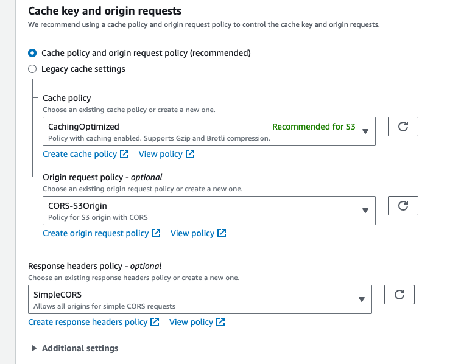

# IVS Auto-Record to Amazon S3 | Low-Latency Streaming

This section provides information about the auto-record-to-S3 feature of Amazon IVS low-latency streaming. We
discuss data storage for recorded Amazon IVS streams. We explain the storage contents and
metadata file schema. We also discuss playback of your recorded content.

| For details on ...                      | See ...                                                                                                                                                   |
| --------------------------------------- | --------------------------------------------------------------------------------------------------------------------------------------------------------- |
| Setting up and stopping video recording | [Create a Channel with Optional Recording](getting-started-create-channel.md "getting-started-create-channel.md") in _Getting Started with Amazon<br>IVS_ |
| The API                                 | [IVS API Reference](../LowLatencyAPIReference/Welcome.md "../LowLatencyAPIReference/Welcome.md")                                                          |
| Costs                                   | [Amazon IVS Costs](costs.md "costs.md")                                                                                                                   |

## S3 Prefix

The S3 prefix is a unique directory structure for each live stream that is recorded.
All media and metadata files for the live stream are written within this directory. For
channels with recording enabled, the S3 prefix is generated when a live session starts
and will be provided in the CloudWatch event at the start and end of a recording.

The S3 prefix has the following format:

```
/ivs/v1/<aws_account_id>/<channel_id>/<year>/<month>/<day>/<hours>/<minutes>/<recording_id>
```

Where:

- `aws_account_id` is the ID of your AWS account (generated when you
  created an AWS account), from which the channel is created.
- `channel_id` is the resource ID part of the channel ARN (the last
  part of the Amazon Resource Name). See ARN in the [Glossary](ivs-glossary.md "ivs-glossary.md").
- `<year>/<month>/<day>/<hours>/<minutes>` is a UTC
  timestamp when recording starts.
- `recording_id` is a unique ID generated for each recording
  session.

For example:

```
ivs/v1/123456789012/AsXego4U6tnj/2020/6/23/20/12/j8Z9O91ndcVs
```

## Recording Contents

When recording starts, video segments and metadata files are written to the S3 bucket
that is configured for the channel. These contents are available for post-processing or
playback as on-demand video.

Note that after a live stream starts and the Recording Start EventBridge event is
emitted, it takes a little time before the manifest files and video segments are
written. We recommend that you play back or process recorded streams only after the
Recording End event is sent. (See [Using Amazon EventBridge with IVS](eventbridge.md "eventbridge.md").)

The following is a sample directory structure and contents of a recording of a live
Amazon IVS session:

```
ivs/v1/123456789012/AsXego4U6tnj/2020/6/23/20/12/j8Z9O91ndcVs/
   events
      recording-started.json
      recording-ended.json
   media
      hls
      thumbnails
```

The `events` folder contains the metadata files corresponding to the
recording event. JSON metadata files are generated when recording starts, ends
successfully, or ends with failures:

- `events/recording-started.json`
- `events/recording-ended.json`
- `events/recording-failed.json`

A given `events` folder will contain `recording-started.json`
and either `recording-ended.json` or
`recording-failed.json`.

These contain metadata related to the recorded session and its output formats. JSON
details are given below.

The `media` folder contains all supported media contents, in two
subfolders:

- `hls` contains all media and manifest files generated during the
  live session and is playable with the Amazon IVS player. There are two types of
  HLS manifests in this folder, the standard master manifest
  `master.m3u8` and the byte-range enabled manifest
  `byte-range-multivariant.m3u8`. Therefore, each rendition folder
  has both `playlist.m3u8` and a `byte-range-variant.m3u8`
  files. (See [Byte-Range
  Playlists](#r2s3-byte-range-playlists "#r2s3-byte-range-playlists") below.)
- `thumbnails` contains thumbnail images generated during the live
  session. Thumbnails are generated and written to the bucket every minute. (To
  change this behavior, override the `thumbnailConfiguration` property
  on a recording configuration.)

**Important:** The contents within the `media`
folder are dynamically generated and determined by the characteristics of the first
received video segments; the folder contents may not represent the ultimate
characteristics (e.g., rendition quality). _Do not make any
assumptions about the static path._ To discover the HLS renditions
available and its path, use the JSON metadata files described below.

## Byte-Range Playlists

The auto-record-to-S3 feature supports [byte-range playlist](https://datatracker.ietf.org/doc/html/draft-pantos-http-live-streaming-23#section-4.3.2.2 "https://datatracker.ietf.org/doc/html/draft-pantos-http-live-streaming-23#section-4.3.2.2") generation, in addition to standard HLS playlists.
Byte-range playlists conform to version 4 of the HLS specification. This allows for more
fine-grained content clipping: in a byte-range playlist, each segment in a rendition
index file references a subrange of bytes of a video chunk, providing more granularity
than the standard 10-second media file size. With a byte-range playlist, the segment
duration is the same as the keyframe interval configured for the stream.

## Thumbnails

The `thumbnailConfiguration` property on a recording configuration allows
you to enable or disable the recording of thumbnails for a live session and modify the
interval at which thumbnails are generated for the live session. Thumbnail intervals may
range from 1 second to 60 seconds; by default, thumbnail recording is enabled, at an
interval of 60 seconds. For details, see the [Amazon IVS Low-Latency Streaming API Reference](../LowLatencyAPIReference/Welcome.md "../LowLatencyAPIReference/Welcome.md").

Thumbnail configuration also may include the `storage` field
(`SEQUENTIAL` and/or `LATEST`) and a resolution
(`LOWEST_RESOLUTION`, `SD`, `HD`, or
`FULL_HD`). Below are the resolutions for each option:

160 <= `LOWEST_RESOLUTION` <= 360

360 < `SD` <= 480

480 < `HD` <= 720

720 < `FULL_HD` <= 1080

If `resolution` is unset for a stream that is using multitrack video input, thumbnails of all renditions are recorded. For information on multitrack, see [Multitrack Video](multitrack-video.md "multitrack-video.md").

## Merge Fragmented Streams

The `recordingReconnectWindowSeconds` property on a recording configuration
allows you to specify a window of time (in seconds) during which, if your stream is
interrupted and a new stream is started, Amazon IVS tries to record to the same S3
prefix as the previous stream. In other words, if a broadcast disconnects and then
reconnects within the specified interval, the multiple streams are considered a single
broadcast and merged together.

**IVS Recording State Change events in Amazon
EventBridge:** Recording End events and _recording-ended_ JSON metadata files are delayed by at least
`recordingReconnectWindowSeconds`, as Amazon IVS waits to ensure a new
stream is not started.

For instructions on setting up the merge-streams functionality, see [Step 4: Create a Channel with Optional
Recording](getting-started-create-channel.md "getting-started-create-channel.md") in _Getting
Started with Amazon IVS_.

### Eligibility

For multiple streams to record to the same S3 prefix, certain conditions must be
met for all the streams:

- Video width and height must be the same.
- Frame rate must be the same.
- The bitrate difference of subsequent streams must be less than or equal to
  50% of the bitrate of the original stream.
- Video and audio codecs must be the same.

**Notes:**

- At most 20 streams are merged, after which a new S3 prefix is
  created.
- After 48 hours, a new S3 prefix is created. For example, if the first
  broadcast lasts for 48 hours and another broadcast is started within the
  `recordingReconnectWindowSeconds` interval, the next
  broadcast _is not_ merged into the first S3
  prefix.
- Rapid reconnects can result in a new broadcast starting before the previous broadcast is finished writing to S3, in which case the new broadcast _is not_ merged into the previous S3 prefix. (Usually, writing to S3 completes within 10 seconds of a broadcast ending.) Rapid reconnects can occur in several scenarios, including: 1) quick mobile app background/foreground transitions, 2) when stream takeover isn't possible while using the auto-reconnect feature of IVS mobile broadcast SDKs, and 3) when calling [StopStream](../LowLatencyAPIReference/API_StopStream.md "../LowLatencyAPIReference/API_StopStream.md") triggers an automatic reconnect from the streaming-client software.

### Known Issue

If `recordingReconnectWindowSeconds` is enabled and the Web Broadcast
SDK is used, recording to the same S3 prefix may not work, as the Web Broadcast SDK
dynamically changes bitrates and qualities.

## JSON Metadata Files

When a recording state-change event occurs, a corresponding Amazon CloudWatch metric
is generated and a metadata file is written within the S3 prefix. (See [Monitoring Amazon IVS Low-Latency Streaming](stream-health.md "stream-health.md").)

This metadata is in JSON format. It comprises the following information.

| Field                       | Type    | Required    | Description                                                                                                                                                                                                                                                                                                                                                                                                                      |
| --------------------------- | ------- | ----------- | -------------------------------------------------------------------------------------------------------------------------------------------------------------------------------------------------------------------------------------------------------------------------------------------------------------------------------------------------------------------------------------------------------------------------------- |
| `channel_arn`               | string  | Yes         | ARN of the channel broadcasting the live stream.                                                                                                                                                                                                                                                                                                                                                                                 |
| `media`                     | object  | Yes         | Object that contains the enumerated objects of media content<br>available for this recording. Valid values: `"hls"`,<br>`"thumbnails"`.                                                                                                                                                                                                                                                                                          |
| • `hls`                     | object  | Yes         | Enumerated field that describes the Apple HLS format<br>output.                                                                                                                                                                                                                                                                                                                                                                  |
| • + `duration_ms`           | integer | Conditional | Duration of the recorded HLS content in milliseconds. This is<br>available only when `recording_status` is<br>`"RECORDING_ENDED"` or<br>`"RECORDING_ENDED_WITH_FAILURE"`. If a failure<br>occurred before any recording was done, this is 0.                                                                                                                                                                                     |
| • + `path`                  | string  | Yes         | Relative path from the S3 prefix where HLS content is<br>stored.                                                                                                                                                                                                                                                                                                                                                                 |
| • + `playlist`              | string  | Yes         | Name of the HLS master playlist file.                                                                                                                                                                                                                                                                                                                                                                                            |
| • + `byte_range_playlist`   | string  | Yes         | Name of the HLS byte-range multivariant<br>playlist.                                                                                                                                                                                                                                                                                                                                                                             |
| • + `renditions`            | object  | Yes         | Array of renditions (HLS variant) of metadata objects. There<br>always is at least one rendition.                                                                                                                                                                                                                                                                                                                                |
| • + - `path`                | string  | Yes         | Relative path from the S3 prefix where HLS content is stored<br>for this rendition.                                                                                                                                                                                                                                                                                                                                              |
| • + - `playlist`            | string  | Yes         | Name of the media playlist file for this<br>rendition.                                                                                                                                                                                                                                                                                                                                                                           |
| • + - `byte_range_playlist` | string  | Yes         | Name of the byte-range playlist for this<br>rendition.                                                                                                                                                                                                                                                                                                                                                                           |
| • + - `resolution_height`   | int     | Conditional | Pixel resolution height of the encoded video. This is available<br>only when the rendition contains a video track.                                                                                                                                                                                                                                                                                                               |
| • + - `resolution_width`    | int     | Conditional | Pixel resolution width of the encoded video. This is available<br>only when the rendition contains a video track.                                                                                                                                                                                                                                                                                                                |
| • `thumbnails`              | object  | Conditional | Enumerated field that describes thumbnails output. This is<br>available only when the thumbnail configuration’s<br>`recordingMode` is<br>`INTERVAL`.                                                                                                                                                                                                                                                                             |
| • + `path`                  | string  | Conditional | Relative path from the S3 prefix where thumbnail content is<br>stored. This is available only when the thumbnail configuration’s<br>`recordingMode` is<br>`INTERVAL`.                                                                                                                                                                                                                                                            |
| • + `resolution_height`     | int     | Yes         | The height of the thumbnail. Default: resolution of the source<br>rendition. This value is affected by user input in the related<br>recording configuration; specifically, the<br>`thumbnailConfiguration.resolution`<br>value.                                                                                                                                                                                                  |
| • + `resolution_width`      | int     | Yes         | The width of the thumbnail. Default: resolution of the source<br>rendition. This value is affected by user input in the related<br>recording configuration; specifically, the<br>`thumbnailConfiguration.resolution`<br>value.                                                                                                                                                                                                   |
| • `latest thumbnail`        | object  | Yes         | Enumerated field that describes latest thumbnail output. This<br>is available only when the thumbnail configuration’s<br>`storage` includes<br>`LATEST`.                                                                                                                                                                                                                                                                         |
| • + `resolution_height`     | int     | Yes         | The height of the thumbnail. Default will be the resolution of<br>the source rendition. This value is affected by user input in the<br>related recording configuration; specifically, the<br>`thumbnailConfiguration.resolution`<br>value.                                                                                                                                                                                       |
| • + `resolution_width`      | int     | Yes         | The width of the thumbnail. Default will be the resolution of<br>the source rendition. This value is affected by user input in the<br>related recording configuration; specifically, the<br>`thumbnailConfiguration.resolution`<br>value.                                                                                                                                                                                        |
| `recording_ended_at`        | string  | Conditional | RFC 3339 UTC timestamp when the recording ended. This is<br>available only when `recording_status` is<br>`"RECORDING_ENDED"` or<br>`"RECORDING_ENDED_WITH_FAILURE"`.<br>`recording_started_at` and<br>`recording_ended_at` are timestamps when these events<br>are generated and may not exactly match the HLS video-segment<br>timestamps. To accurately determine the duration of a recording, use<br>the `duration_ms` field. |
| `recording_started_at`      | string  | Yes         | RFC 3339 UTC timestamp when the recording started.<br>See the note above for `recording_ended_at`.                                                                                                                                                                                                                                                                                                                               |
| `recording_status`          | string  | Yes         | Status of the recording. Valid values:<br>`"RECORDING_STARTED"`,<br>`"RECORDING_ENDED"`,<br>`"RECORDING_ENDED_WITH_FAILURE"`.                                                                                                                                                                                                                                                                                                    |
| `recording_status_message`  | string  | Conditional | Descriptive information on the status. This is available only<br>when `recording_status` is `"RECORDING_ENDED"`<br>or `"RECORDING_ENDED_WITH_FAILURE"`.                                                                                                                                                                                                                                                                          |
| `version`                   | string  | Yes         | The version of the metadata schema.                                                                                                                                                                                                                                                                                                                                                                                              |

### Example:

recording_started.json

```
{
   "version": "v1",
   "channel_arn": "arn:aws:ivs:us-west-2:123456789012:channel/AsXego4U6tnj",
   "recording_started_at": "2020-06-12T12:53:26Z",
   "recording_status : "RECORDING_STARTED",
   "media": {
      "hls": {
         "path": "media/hls",
         "playlist": "master.m3u8",
         "byte_range_playlist": "byte-range-multivariant.m3u8",
         "renditions": [
            {
               "path": "480p30",
               "playlist": "playlist.m3u8",
               "byte_range_playlist": "byte-range-variant.m3u8",
               "resolution_height": 480,
               "resolution_width": 852
            },
            {
               "path": "360p30",
               "playlist": "playlist.m3u8",
               "byte_range_playlist": "byte-range-variant.m3u8",
               "resolution_height": 360,
               "resolution_width": 640
            },
            {
               "path": "160p30",
               "playlist": "playlist.m3u8",
               "byte_range_playlist": "byte-range-variant.m3u8",
               "resolution_height": 160,
               "resolution_width": 284
            },
            {
               "path": "720p60",
               "playlist": "playlist.m3u8",
               "byte_range_playlist": "byte-range-variant.m3u8",
               "resolution_height": 720,
               "resolution_width": 1280
            }
         ]
      },
      "thumbnails": {
         "path": "media/thumbnails",
         "resolution_height": 480,
         "resolution_width": 852
      },
      "latest_thumbnail": {
         "path": "media/latest_thumbnail/thumb.jpg",
         "resolution_height": 480,
         "resolution_width": 852
      }
   }
}
```

### Example:

recording_ended.json

```
{
   "version": "v1",
   "channel_arn": "arn:aws:ivs:us-west-2:123456789012:channel/AsXego4U6tnj",
   "recording_ended_at": "2020-06-14T12:53:20Z",
   "recording_started_at": "2020-06-12T12:53:26Z",
   "recording_status": "RECORDING_ENDED",
   "media": {
      "hls": {
         "duration_ms": 172794489,
         "path": "media/hls",
         "playlist": "master.m3u8",
         "byte_range_playlist": "byte-range-multivariant.m3u8",
         "renditions": [
            {
               "path": "480p30",
               "playlist": "playlist.m3u8",
               "byte_range_playlist": "byte-range-variant.m3u8",
               "resolution_height": 480,
               "resolution_width": 852
            },
            {
               "path": "360p30",
               "playlist": "playlist.m3u8",
               "byte_range_playlist": "byte-range-variant.m3u8",
               "resolution_height": 360,
               "resolution_width": 640
            },
            {
               "path": "160p30",
               "playlist": "playlist.m3u8",
               "byte_range_playlist": "byte-range-variant.m3u8",
               "resolution_height": 160,
               "resolution_width": 284
            },
            {
               "path": "720p60",
               "playlist": "playlist.m3u8",
               "byte_range_playlist": "byte-range-variant.m3u8",
               "resolution_height": 720,
               "resolution_width": 1280
            }
         ]
      },
      "thumbnails": {
         "path": "media/thumbnails",
         "resolution_height": 480,
         "resolution_width": 852
      },
      "latest_thumbnail": {
         "path": "media/latest_thumbnail/thumb.jpg",
         "resolution_height": 480,
         "resolution_width": 852
      }
   }
}
```

### Example:

recording_failed.json

```
{
   "version": "v1",
   "channel_arn": "arn:aws:ivs:us-west-2:123456789012:channel/AsXego4U6tnj",
   "recording_ended_at": "2020-06-14T12:53:20Z",
   "recording_started_at": "2020-06-12T12:53:26Z",
   "recording_status": "RECORDING_ENDED_WITH_FAILURE",
   "recording_status_message": "InternalServerException",
   "media": {
      "hls": {
         "duration_ms": 172794489,
         "path": "media/hls",
         "playlist": "master.m3u8",
         "renditions": [
            {
               "path": "480p30",
               "playlist": "playlist.m3u8",
               "resolution_height": 480,
               "resolution_width": 852
            },
            {
               "path": "720p60",
               "playlist": "playlist.m3u8",
               "resolution_height": 720,
               "resolution_width": 1280
            }
         ]
      },
      "thumbnails": {
         "path": "media/thumbnails",
         "resolution_height": 480,
         "resolution_width": 852
      },
      "latest_thumbnail": {
         "path": "media/latest_thumbnail/thumb.jpg",
         "resolution_height": 480,
         "resolution_width": 852
      }
   }
}
```

## Discovering the Renditions of a

Recording

When you stream content to an Amazon IVS channel, auto-record-to-s3 uses the source
video to generate multiple renditions. Using [Adaptive Bitrate
Streaming](player.md "player.md") (ABR), the Amazon IVS Player automatically switches the renditions
(bitrates) as needed to optimize playback for varying network conditions.

Each rendition generated during live streaming is recorded in a unique path within the
S3 recording prefix. The resolution detail, path, and playlist file names are stored in
a [JSON metadata file](#r2s3-json-metadata "#r2s3-json-metadata") during the start and stop
of the recording. If the recording configuration’s `renditionSelection` value
is `ALL`, all renditions are selected for recording. If
`renditionSelection` is `CUSTOM`, the user must select one or
more of the following options: `LOWEST_RESOLUTION`, `SD`,
`HD`, and FULL_HD. Below are the resolutions for each option:

160 <= `LOWEST_RESOLUTION` <= 360

360 < `SD` <= 480

480 < `HD` <= 720

720 < `FULL_HD` <= 1080

**Important:**
_Do not_ make any assumptions about the static
rendition path or the list of generated renditions, as these are subject to change.
_Do not_ assume that a specific rendition will
always be available for an Amazon IVS recording. To determine the available renditions,
resolutions, and paths, refer to the metadata files.

The `event/recording_started.json` or
`event/recording_ended.json` file within the recording prefix contains
the paths and names of media files within the recording prefix. All `path`
elements are relative to the previous path in the hierarchy. Elements under `media

> hls` describe HLS assets, with master playlist name and path defined at this
> level.

Here is a Python code snippet that shows how to generate a master playlist path using
the S3 recording prefix and metadata file:

```
def get_master_playlist(metadata_json, s3_recording_prefix):
   return s3_recording_prefix + '/' + metadata_json['media']['hls']['path'] + '/' + metadata_json['media']['hls']['playlist']
```

Elements under `media > hls > renditions` describe the list of renditions
recorded. The `resolution_height` and `resolution_width`
properties can be used to identify the video resolution. The `path` and
`playlist` elements can be used to derive the rendition playlist path.
Use these fields to determine which rendition to use for any post processing.

To discover the highest available rendition playlist for a recording, you can
subscribe to "IVS Recording State Change" EventBridge events. (See [Using Amazon EventBridge with IVS](eventbridge.md "eventbridge.md").) Below is a sample Python
script that illustrates using a lambda function subscribed to those events.

```
import json
import boto3
s3 = boto3.resource('s3')

def get_highest_rendition_playlist(bucket_name, prefix_name):
   object_path = "{}/events/recording-started.json".format(prefix_name)
   object = s3.Object(bucket_name, object_path)
   body = str(object.get()['Body'].read().decode('utf-8'))
   metadata = json.loads(body)
   media_path = metadata["media"]["hls"]["path"]
   renditions = metadata["media"]["hls"]["renditions"]

   highest_rendition = None
   highest_rendition_size = 0

   for rendition in renditions:
       current_rendition_size = rendition["resolution_height"]
       if (current_rendition_size > highest_rendition_size):
           highest_rendition_size = current_rendition_size
           highest_rendition = rendition

   highest_rendition_playlist = media_path + '/' + highest_rendition['path'] + '/' + highest_rendition['playlist']
   return highest_rendition_playlist


def lambda_handler(event, context):
   prefix_name = event["detail"]["recording_s3_key_prefix"]
   bucket_name = event["detail"]["recording_s3_bucket_name"]
   rendition_playlist = get_highest_rendition_playlist(bucket_name, prefix_name)
   print("Highest rendition playlist: {}/{}".format(prefix_name, rendition_playlist))

   return {
       'statusCode': 200,
       'body': rendition_playlist
   }
```

## Playback of Recorded Content from Private

Buckets

Objects recorded with the Auto-Record to Amazon S3 feature are private by default;
hence, these objects are inaccessible for playback using the direct S3 URL. If you try
to open the HLS master manifest (m3u8 file) for playback using the Amazon IVS player or
another player, you will get an error (e.g., "You do not have permission to access the
requested resource"). Instead, you can play back these files with the Amazon CloudFront
CDN (Content Delivery Network).

### Amazon CloudFront Distribution

CloudFront distributions can be configured to serve content from private buckets.
Typically this is preferable to having openly accessible buckets where reads bypass
the controls offered by CloudFront. Your distribution can be set up to service from
a private bucket by creating an origin access control (OAC), which is a special
CloudFront user that has read permissions on the private origin bucket. You can
create the OAC after you create your distribution, through the CloudFront console or
API. See [Creating a new origin access control](../../../AmazonCloudFront/latest/DeveloperGuide/private-content-restricting-access-to-s3.md#create-oac-overview-s3 "../../../AmazonCloudFront/latest/DeveloperGuide/private-content-restricting-access-to-s3.md#create-oac-overview-s3").

### Playback from Amazon CloudFront

Once you have set up your distribution using an OAC to gain access to your private
bucket, your video files should be available for consumption through the CloudFront
URL. Your CloudFront URL is the **Distribution domain
name** on the **Details** tab in the AWS
CloudFront console. It should be something like this:

a1b23cdef4ghij.cloudfront.net.

To stream your recorded video through your distribution, find the object key for
your `master.m3u8` file. It should be something like this:

```
ivs/v1/012345678912/a0bCDeFGH1IjK/2021/4/20/12/03/aBcdEFghIjkL/media/hls/master.m3u8
```

Append the object key to the end of your CloudFront URL. Your final URL will be
something like this:

```
https://a1b23cdef4ghij.cloudfront.net/ivs/v1/012345678912/a0bCDeFGH1IjK/2021/4/20/12/03/aBcdEFghIjkL/media/hls/master.m3u8
```

To play back from a web browser, make sure to configure CORS in both CloudFront
and S3 bucket. For CloudFront configuration, follow the instructions in [Creating origin request policies](../../../AmazonCloudFront/latest/DeveloperGuide/controlling-origin-requests.md#origin-request-create-origin-request-policy "../../../AmazonCloudFront/latest/DeveloperGuide/controlling-origin-requests.md#origin-request-create-origin-request-policy") to attach a **CORS-S3 Origin** request policy and **SimpleCORS** response header policy to the CloudFront distribution.
See the example configuration console page below:



For S3 CORS configuration, see [CORS configuration](../../../AmazonS3/latest/userguide/ManageCorsUsing.md "../../../AmazonS3/latest/userguide/ManageCorsUsing.md") to create appropriate rules for your S3
bucket.

Now you can play back your recorded video as if you were playing directly from a
bucket.

For more information, see [Restricting access to an Amazon S3 origin](../../../AmazonCloudFront/latest/DeveloperGuide/private-content-restricting-access-to-s3.md "../../../AmazonCloudFront/latest/DeveloperGuide/private-content-restricting-access-to-s3.md").
