# Troubleshooting IVS Low-Latency Streaming

This document describes best practices and troubleshooting tips for Amazon Interactive
Video Service (IVS). Unexpected or unintended behaviors may occur when using IVS. These
behaviors can occur at various points in the streaming process, from broadcasting to
playback of content:

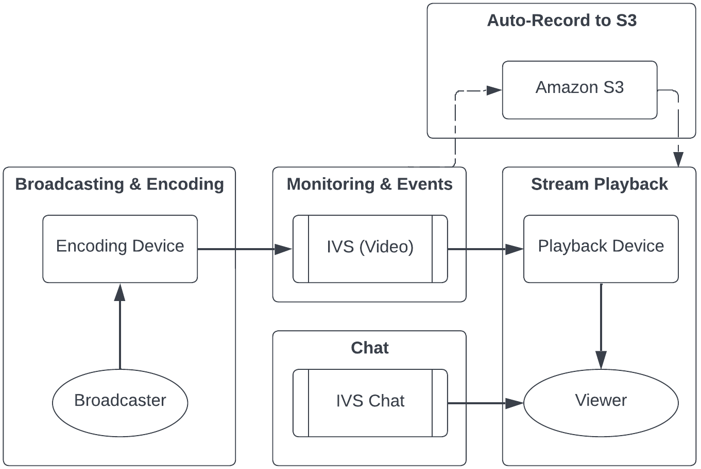
For information on support and other Amazon IVS resources, see [Resources and Support](resources-and-support.md "resources-and-support.md").

## Broadcasting and Encoding

Questions in this section are about broadcasting, encoding, and first-mile conditions
of streaming to IVS. These behaviors occur before the content reaches IVS
servers.

Topics:

- [What is stream
  starvation?](#broadcast-encode-stream-starvation "#broadcast-encode-stream-starvation")
- [Why did the stream suddenly
  stop?](#broadcast-encode-stream-stop "#broadcast-encode-stream-stop")
- [What happens when I switch
  networks while streaming?](#broadcast-encode-switch-networks "#broadcast-encode-switch-networks")
- [How can I have multi-region
  redundancy with IVS?](#broadcast-encode-multi-region "#broadcast-encode-multi-region")
- [How do I troubleshoot
  an IVS Web Broadcast SDK session?](#broadcast-troubleshoot-web-broadcast-session "#broadcast-troubleshoot-web-broadcast-session")
- [How do I use
  Google Chrome’s WebRTC-internals metrics to evaluate an IVS Web Broadcast SDK
  session?](#broadcast-evaluate-with-webrtc-internals-metrics "#broadcast-evaluate-with-webrtc-internals-metrics")

### What is stream

starvation?

"Stream starvation" is a delay or halt in content packet delivery when you are
sending content to IVS; that is, when content is being ingested by IVS. If IVS does
not get the expected amount of bits on ingest that the encoding device advertised it
would send over a certain timeframe, this is considered a starvation event. Often,
starvation events are caused by the broadcaster’s encoder, local network conditions,
and/or in transit over the public internet, between the encoding device and
IVS.

From a viewer's perspective, starvation events may appear as video that lags,
buffers, or freezes. Stream-starvations events can be brief (less than 5 seconds) or
long (several minutes), depending on the nature of the starvation event.

To allow monitoring for starvation events, IVS sends starvation events as Amazon
EventBridge events; see [Examples: Stream Health Change](eventbridge.md#eventbridge-examples-stream-health-change "eventbridge.md#eventbridge-examples-stream-health-change") in _Using Amazon
EventBridge with Amazon IVS_. These are sent when a stream enters or
exits a state of starvation. Depending on the use case, you can take an appropriate
action, like notifying the broadcaster and viewers of intermittent stream
conditions.

For additional starvation monitoring tools, see [Monitoring Amazon IVS Low-Latency Streaming](stream-health.md "stream-health.md"), the IVS [ListStreams](../LowLatencyAPIReference/API_ListStreams.md "../LowLatencyAPIReference/API_ListStreams.md")
API operation (filtering by health), and the IVS [GetStream](../LowLatencyAPIReference/API_GetStream.md "../LowLatencyAPIReference/API_GetStream.md")
operation (to analyze an individual stream). Also see [How do I monitor
stream-starvation events?](#monitor-metrics-events-stream-starvation "#monitor-metrics-events-stream-starvation")

### Why did the stream suddenly

stop?

The following are the most common reasons why a stream can abruptly stop (i.e.,
the stream session ends):

- **Missing ingest data** — When the ingest of
  a stream session completely stops (no data ingested into IVS) for 30
  seconds, the IVS ingest server terminates the IVS stream session. The
  30-second period allows the broadcaster to reconnect to the ingest server.
  However, in some cases (such as switching networks), reconnection to the
  existing stream session may not be possible, as the TLS handshake of RTMPS
  has been broken. Common root causes for this include network issues (like
  congestion between the broadcast device and IVS), complete loss of internet
  on the broadcast device, or the broadcast device not producing content
  segments (FLV tags).

Often, stream disconnection aligns with a stream-starvation event; the
starvation event is triggered when there is a halt in incoming data. If a
starvation-start event is sent and then a stream-end event is sent (without
a starvation-end event), this often indicates that the stream was ended due
to no data being sent to IVS.

- **IVS StopStream operation** — During an IVS
  stream session, if the [StopStream](../LowLatencyAPIReference/API_StopStream.md "../LowLatencyAPIReference/API_StopStream.md") API call is made, the IVS stream session will end.
  The StopStream operation disconnects the incoming RTMPS stream from the IVS
  ingest server. Depending on the encoding software/hardware being used, a new
  stream session may be attempted.
- **Encoder error** — Some software/hardware
  encoders will disconnect the stream session when an error occurs during the
  encoding process. From the IVS perspective, these disconnections appear as
  intentional disconnects by the broadcaster. However, in the encoding logs,
  it may be determined that the stream was disconnected due to an
  unintentional error.

### What happens when I switch

networks while streaming?

When a broadcaster switches networks (for example, from WiFi to cellular), an
ongoing RTMPS connection is disconnected. While the broadcaster’s internet
connection probably is re-established after 3-4 seconds, the new connection has a
new IP address due to the network switch, which generates a new RTMPS connection.
During this switch, the previous RTMPS connection is not disconnected cleanly: the
encoder does not send IVS a disconnect message. As a result, IVS waits 30 seconds
for the previous RTMPS connection to reconnect, which blocks the new RTMPS stream on
the new network from connecting to IVS.

To enable faster switching between networks, we recommend that you use the
[stream takeover](streaming-config.md#streaming-config-stream-takeover "streaming-config.md#streaming-config-stream-takeover") feature.
In this scenario, when the broadcast device connects to the new network, the broadcast
device can “take over” the existing stream by streaming up with `?priority=N` appended to the
stream key, where N is any positive integer up to 2,147,483,647. The stream takeover will succeed
if the priority provided for the new stream is greater than the priority set for the
ongoing stream. (Note that the original stream-up does not require the priority parameter
to be set, but all takeover attempts do.)

### How can I have multi-region

redundancy with IVS?

Redundancy within IVS can be achieved in several ways; see [IVS Resilience](security-resilience.md "security-resilience.md") in _IVS Security_ .

IVS is separated into different networking planes; Control and Data.

- The _control plane_ is regional (based on
  AWS regions) and stores information about IVS resources (channels, stream
  keys, playback key pairs, and recording configurations).
- The _data plane_ is not restricted to an
  AWS region and is the network that carries data from ingest to egress. Even
  if a channel is created in the us-west-2 region (for example), the video
  that is streamed to that channel may not go through us-west-2.

Also see [Global Solution,
Regional Control](what-is.md#what-is-aws "what-is.md#what-is-aws"). Consider these two scenarios:

- If only one control-plane region (e.g., us-east-1) is being used — If a
  particular AWS control region experiences a degradation or outage, the IVS
  control plane may experience latency or errors when creating, reading,
  updating, or deleting any of the following: channels, stream keys, playback
  key pairs, or recording configurations. Trying to start a new stream during
  an outage may result in more latency or errors when initiating a stream
  session. Depending on severity of the degradation, it may be possible to
  continue broadcasting to a channel with an already ongoing stream.

If [playback authorization](private-channels-enable-playback-auth.md "private-channels-enable-playback-auth.md") is enabled, current viewers probably can
continue their playback of ongoing streams, but new viewers may not be able
to start viewing if there are issues with playback key-pair authorization.
If playback authorization is not enabled, both current and new viewers
should be able to view the ongoing stream.

The IVS Auto-Record to S3 feature also may be interrupted in the event of
an outage.

The IVS control plane does not automatically fail over to another AWS
region in the event of a regional outage.

- If two control-plane regions (e.g., us-east-1 and us-west-2) are being
  used, and the second region is a failover if the primary region is
  unavailable — IVS does not natively support regional control-plane failover;
  thus, if a control-plane region experiences issues, new streams starting or
  calls to the control plane may experience issues. However, the data plane
  probably would not be impacted, so ongoing streams for the control plane
  region would continue without issue. Moving the control plane to a secondary
  (failover) region would need to be accomplished on the application side. You
  can write custom implementation logic to handle control-plane failover. We
  do not have official guidance on how to manage a regional channel
  failover.

By separating the video data plane and the regional control plane, the IVS
architecture adds resilience: ongoing live streams should have little to no
interruption in the event of a regional control-plane failure. IVS maintains
an SLA of 99.9% uptime and is committed to ensuring the stability of its
infrastructure for its customers (see our [SLA](https://aws.amazon.com/ivs/sla/ "https://aws.amazon.com/ivs/sla/")).

### How do I troubleshoot

an IVS Web Broadcast SDK session?

The [IVS Web Broadcast
SDK](broadcast-web.md "broadcast-web.md") works slightly differently than a normal IVS RTMPS ingest session.
The Web Broadcast SDK leverages the WebRTC protocol to stream to an IVS endpoint.
Once the content enters the IVS endpoint, it is processed and remuxed/transcoded
into the HLS output for viewing.

Due to the nature of the Web Broadcast SDK, note these tips for troubleshooting
encoding behaviors:

- Close any tabs/programs on the broadcasting device that are not required
  to be open during the broadcasting session. Extraneous tabs/programs can use
  computing resources (such as CPU, RAM, and networking), which can cause poor
  performance for the broadcasting application. For tabs/programs that cannot
  be closed, ensure they are not using unnecessary amounts of computing
  resources.
- Ensure that the device’s upload speed exceeds 200 Kbps. (This is noted in
  one of the [Known Issues](broadcast-web.md#broadcast-web-known-issues "broadcast-web.md#broadcast-web-known-issues") for the Web Broadcast SDK.) To evaluate the upload
  speed, open the Task Manager of the broadcasting device to analyze the
  network available when streaming. If the upload speed/bitrate is lower than
  expected or desired, evaluate other tabs/processes that may be consuming
  bandwidth. Also, look at other machines on the local network that may be
  consuming high amounts of bandwidth.
- If there are random spikes in CPU usage, look at the Task Manager of the
  machine to understand what processes may be consuming CPU. A common service
  that randomly causes CPU usage is anti-virus software which runs periodic
  scans on the machine.
- Try to stream via [https://stream.ivs.rocks/](https://stream.ivs.rocks/ "https://stream.ivs.rocks/") to help isolate environments and
  ensure that the application logic is not causing the undesirable behavior.
  This site is operated by IVS and is a solid testing environment to evaluate
  if any part of the integration with the Web Broadcast SDK is the root cause
  of the undesirable behavior.
- Try using Google Chrome’s WebRTC-internals (see below).

### How do I use

Google Chrome’s WebRTC-internals metrics to evaluate an IVS Web Broadcast SDK
session?

When streaming via the IVS Web Broadcast SDK, various behaviors can occur during
encoding and sending of the broadcast. Follow these steps to troubleshoot or gather
information about the session on the broadcasting device:

1. In Google Chrome, open the broadcasting webpage.
2. Open a new Chrome tab and go to `chrome://webrtc-internals/`
   (copy this exactly).
3. In the original broadcasting-webpage tab, start the Web Broadcasting SDK
   session and let the session run until the behavior is observed.
4. Once the behavior is observed, switch to the chrome://webrtc-internals/
   tab (do not end the broadcast session), and ensure that the correct webpage
   is displayed:

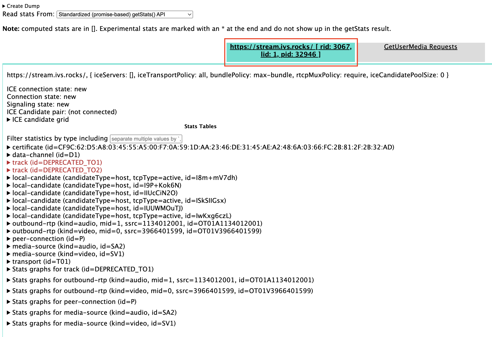 5. Open the **Create Dump** expandable section
at the very top of the screen. 6. Select **Download the PeerConnection updates and stats
data** at the top of the screen (right below **Create Dump**), to download the `.txt`
file from the relevant session. 7. Once downloaded, the file will show an historical view of the WebRTC
connection. You can view this in various tools or send it to the AWS Support
team for further analysis.

## Monitoring and Events

Questions in this section are about IVS monitoring, metrics, and events.

Topics:

- [How do I monitor
  stream-starvation events?](#monitor-metrics-events-stream-starvation "#monitor-metrics-events-stream-starvation")
- [How do I use Amazon CloudWatch to
  monitor IVS service quotas?](#monitor-metrics-service-quotas "#monitor-metrics-service-quotas")
- [How do I diagnose stream
  instability using IVS Stream Health?](#monitor-metrics-stream-instability "#monitor-metrics-stream-instability")

### How do I monitor

stream-starvation events?

We recommend the following methods of monitoring for stream-starvation
events:

- [Amazon EventBridge with Amazon IVS](eventbridge.md#eventbridge-examples-stream-health-change "eventbridge.md#eventbridge-examples-stream-health-change") — When a stream-starvation
  event starts or ends, IVS produces an EventBridge stream health change
  event. Using Amazon EventBridge targets and rules, you can use these
  stream-starvation event to get alerts when stream starvation is occurring.
  For details on targets and rules, see the [Amazon EventBridge User Guide](../../../eventbridge/latest/userguide/eb-what-is.md "../../../eventbridge/latest/userguide/eb-what-is.md").
- [Monitoring Amazon IVS Low-Latency
  Streaming](stream-health.md "stream-health.md") — During a live-stream session, data is recorded and
  then available via IVS stream-health analytics. This includes information
  about encoder configuration, ingest metrics, and stream-session events. This
  is beneficial when monitoring an ongoing stream or retroactively evaluating
  a stream. You can use the IVS console or API to identify streams that have
  experienced starvation. Stream-session data is available for 60 days, even
  after a channel is deleted, so this can be useful for identifying past
  streams with starvation events.
- Filtering Streams by Health — With the IVS console or the IVS [ListStreams](../LowLatencyAPIReference/API_ListStreams.md "../LowLatencyAPIReference/API_ListStreams.md") API operation, you can use the `health`
  filter to find stream sessions that are in a `STARVING` state.
  Also, the IVS CloudWatch metric for `ConcurrentStreams` includes
  a `Health` dimension that you can use to gather a total count of
  streams that are in a stream-starvation state. See [Monitoring Amazon IVS Low-Latency
  Streaming](stream-health.md "stream-health.md").
- You can use the IVS [GetStream](../LowLatencyAPIReference/API_GetStream.md "../LowLatencyAPIReference/API_GetStream.md") operation to analyze an individual stream.

Also see [What is stream
starvation?](#broadcast-encode-stream-starvation "#broadcast-encode-stream-starvation")

### How do I use Amazon CloudWatch to

monitor IVS service quotas?

You can use Amazon CloudWatch to proactively monitor/manage IVS service quotas.
See [IVS Service
Quotas](service-quotas.md "service-quotas.md"). This documentation includes information on creating CloudWatch
alarms for usage metrics.

We recommend that you set up a proper SNS topic to notify the correct
individuals/groups when an alarm is triggered. If the alarm is triggered and the
quota is adjustable, you should request a service-quota increase with a new value.
See [IVS Service
Quotas](service-quotas.md "service-quotas.md") for information on requesting an increase.

### How do I diagnose stream

instability using IVS Stream Health?

We recommend that you evaluate stream instability using the IVS Stream Health
dashboard. Instructions are in [Monitoring Amazon IVS
Low-Latency Streaming](stream-health.md "stream-health.md").

The dashboard has time-series graphs for video bitrate, frame rate, and audio
bitrate; examples are below. Also, you can click **View in
CloudWatch** to view the data in Amazon CloudWatch.

Several scenarios are discussed below.

#### Low Internet Bandwidth or

Internet Congestion

In this case, the stream is relatively unstable, even when bitrates are
lowered. Either there is not enough bandwidth between the broadcaster and the
ISP or between the ISP and IVS, or something is wrong in the network path to
IVS. To resolve this, check that no other network process is using bandwidth, or
contact the ISP for network diagnostics.

**IVS Stream Health dashboard**:

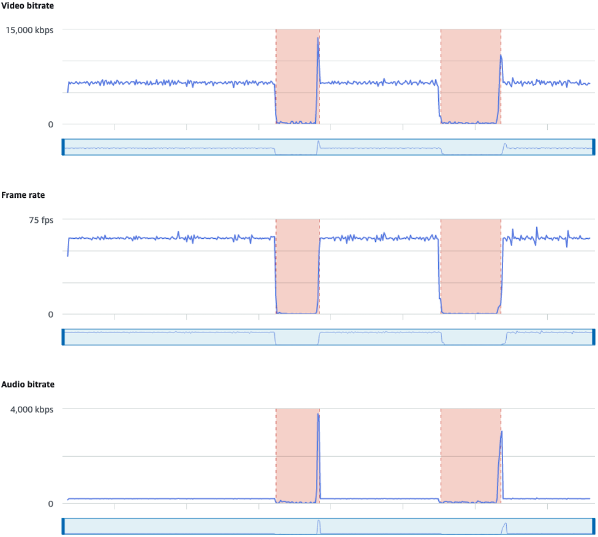

**CloudWatch**:

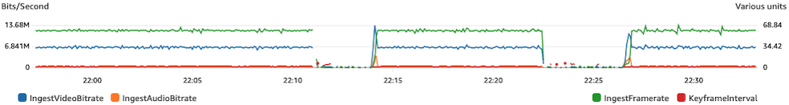

#### Excessive High Bitrate

A higher bitrate does not necessarily mean better quality; here, high bitrate
is causing instability. In many cases, due to network congestion, high bitrates
causes stream instability throughout a broadcast. Adhere to the maximum bitrates
listed in [Resolution/Bitrate/FPS](streaming-config.md#streaming-config-settings-res-bitrate-fps "streaming-config.md#streaming-config-settings-res-bitrate-fps").

**IVS Stream Health dashboard**:

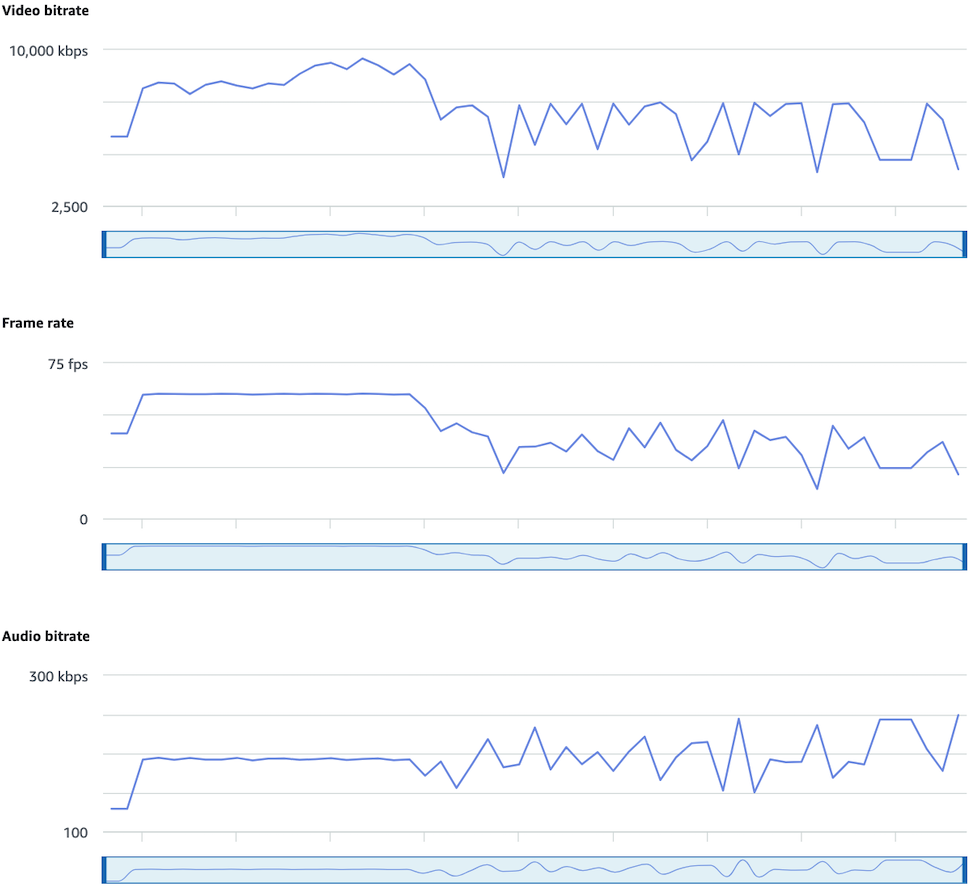

**CloudWatch**:

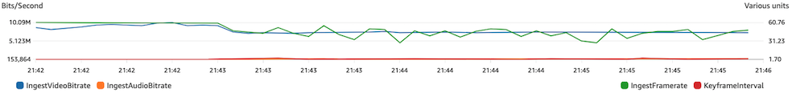

#### Network or Hardware

Problems

Video encoding takes a lot of computing resources, and sometimes the machine
doing the video encoding cannot keep up with the load. In this case, verify that
the machine is not overloaded (running too many things at a time) and that the
encoder is up to date. Consider switching to an encoding preset that uses less
CPU.

**IVS Stream Health dashboard**:

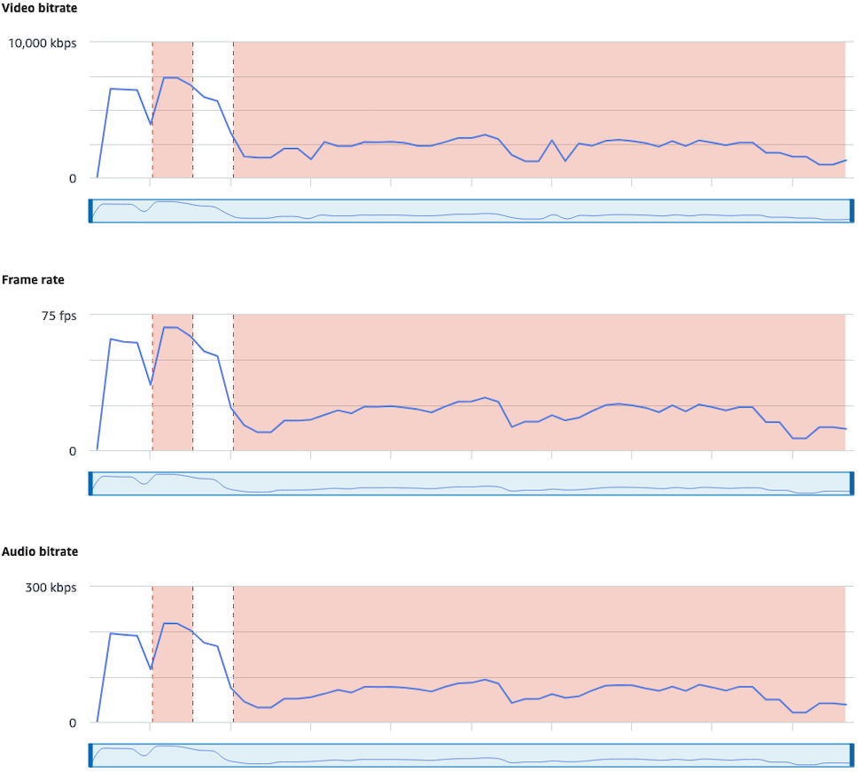

**CloudWatch**:

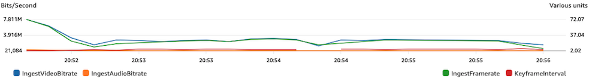

#### Bitrate Spikes and

Dips

Sometimes streaming encoders try to be too smart and optimize bitrate, often
depending on the complexity of the frame being compressed. If the bitrate
fluctuates rapidly, viewers may experience buffering from trying to load too
much data. Ensure that Constant Bitrate (CBR) is enabled, as it maintains a
consistent bitrate across the stream, regardless of frame complexity. Be aware
that dips also can happen; that can be a sign that your machine does not have
enough CPU power for the encoder to compress video.

**IVS Stream Health dashboard**:

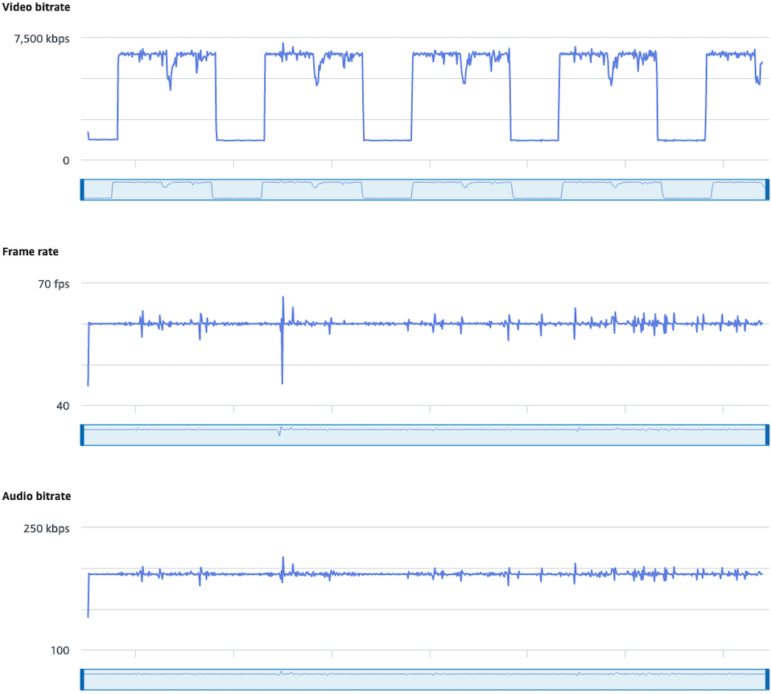

**CloudWatch**:

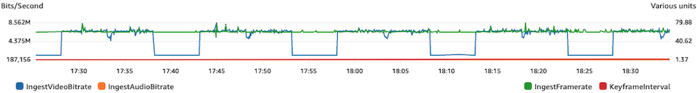

#### Internet

Disconnection

When a broadcast device experiences an internet issue, IVS servers enter a
30-second period in which they evaluate whether the same connection is
re-established. If the same connection is not re-established, the IVS server
ends the stream session. Some encoders will try to reconnect to the broadcast
session if the internet connection is lost, in which case a new stream session
may be started after the initial stream ends.

**IVS Stream Health dashboard**:

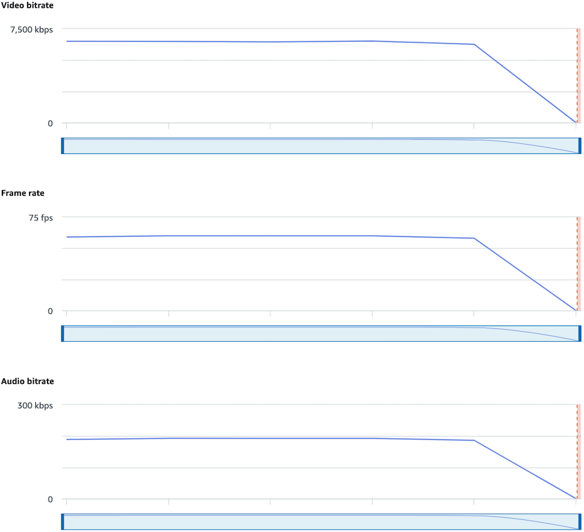

**CloudWatch**:

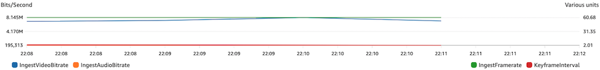

## Stream Playback

Most of the information in this section is specific to the IVS Player SDK and may not
apply to other players. For more information, see [Amazon IVS
Player](player.md "player.md").

Topics:

- [How do I debug IVS player
  behaviors?](#playback-player-behavior "#playback-player-behavior")
- [Why did playback freeze/stop for all
  viewers?](#playback-viewer-freeze "#playback-viewer-freeze")
- [What is causing the IVS player to
  buffer?](#playback-player-buffering "#playback-player-buffering")

### How do I debug IVS player

behaviors?

To enable verbose logging to assist in debugging the IVS Player, use the
`setLogLevel` player method. Alter the log level of the player to use
the `DEBUG` argument; then the IVS Player will produce verbose logging
around the state and logic occurring on the IVS Player.

To quickly test using the IVS Player, with or without `DEBUG` logs
enabled, use the [https://debug.ivsdemos.com/](https://debug.ivsdemos.com/ "https://debug.ivsdemos.com/") testing site. If `DEBUG` logs
are enabled via the settings menu, you can view the logs in the browser console
view.

### Why did playback freeze/stop for all

viewers?

If playback for all viewers freezes/stops at the same time within the content,
this probably is the result of an upstream behavior. Often the root cause is the
broadcast encoder.

[Stream starvation](#broadcast-encode-stream-starvation "#broadcast-encode-stream-starvation") or
adverse broadcast-encoder behaviors can have an impact on all viewers
simultaneously. If the broadcasting encoding disconnects and a new stream session is
started, all viewers stop receiving content concurrently. When you are evaluating
this behavior, we recommend you evaluate the stream session using [Monitoring Amazon IVS Low-Latency
Streaming](stream-health.md "stream-health.md").

### What is causing the IVS player to

buffer?

In the context of playback of live-streaming video and audio, "buffering" means
the playback device is unable to download the content before the content is supposed
to be played. Buffering can manifest in several ways: content may randomly stop and
start (also known as stuttering), content may stop for long periods of time (also
known as freezing), or the player may enter a `BUFFERING` state.

There are many causes of buffering, which we can organize into three main
categories:

- **Viewer-side buffering** often occurs when a
  single viewer or small group of viewers are impacted by a buffering event.
  The root cause of these buffering events often stems from a local network
  (LAN) or playback-device issue. In the case of a slow local network or
  device issue, the buffering may be resolved by ensuring that adaptive
  bitrate playback (ABR) is enabled, manually selecting a lower quality, or
  reducing the bandwidth being used by other programs and devices.
- **Network-level buffering** — Issues can
  occur between the local network and the IVS distribution server, otherwise
  known as the ISP level. Buffering behaviors that arise at the ISP level can
  be hard to troubleshoot, as full visibility into the ISP may be impossible.
  Behaviors like latency and network strain (e.g., the ISP cannot handle the
  overall incoming/outgoing traffic) can cause delays in providing content to
  the viewer.
- **Broadcast-side buffering** — Issues on the
  broadcast side of the live stream session can cause large-scale
  viewer-buffering problems. For example, if a broadcasting device stops
  sending data to IVS, IVS has no content to deliver to the player, and the
  IVS Player enters a buffering state when no content is being downloaded. In
  many cases, a broadcast-side buffering event results in most, if not all,
  viewers being impacted simultaneously.

## Auto-Record to Amazon S3

For more information, see [Auto-Record to Amazon
S3](record-to-s3.md "record-to-s3.md").

Topics:

- [Why is some recording content
  missing?](#autorecord-s3-missing-content "#autorecord-s3-missing-content")
- [Can KMS-S3 encryption be used with
  auto-record to S3?](#autorecord-s3-kms_s3_encryption "#autorecord-s3-kms_s3_encryption")

### Why is some recording content

missing?

There are various reasons why recorded content may be missing. We recommend the
following steps to troubleshoot the missing content:

1. Ensure that Auto-Record to S3 is enabled for the desired IVS
   channel:
   1. Console — On the details page for the relevant channel, in the
      **General configuration** section,
      ensure that Auto-record to S3 is `Enabled`. If it is
      enabled, check the **Recording
      configuration** to ensure that both **Storage** and **Recording prefix** are correct.
   2. CLI — Run `get-channel` and pass in the desired IVS
      channel ARN:

   ```
   aws ivs get-channel --arn "arn:aws:ivs:us-west-2:123456789012:channel/abcdABCDefgh"
   ```

   See if a `recordingConfigurationArn` is
   returned.

2. Look in the designated S3 bucket for the Recording Contents for the
   specific stream session (see [S3
   Prefix](record-to-s3.md#r2s3-prefix "record-to-s3.md#r2s3-prefix").) The S3 key prefix for a recorded session is in the
   Amazon EventBridge [Recording State Change event](eventbridge.md#eventbridge-examples-recording-state-change "eventbridge.md#eventbridge-examples-recording-state-change"). Note: If the [merge fragmented streams](record-to-s3.md#r2s3-merge-fragmented-streams "record-to-s3.md#r2s3-merge-fragmented-streams") feature is enabled, some content may
   be another recorded session.
3. If the overall stream duration was less than 10 seconds or the content of
   the stream was missing (i.e., stream starvation occurred), recorded content
   may be missing as nothing was generated.

### Can KMS-S3 encryption be used with

auto-record to S3?

The IVS auto-record to Amazon S3 feature does not support [KMS-S3 encryption](../../../AmazonS3/latest/userguide/UsingKMSEncryption.md "../../../AmazonS3/latest/userguide/UsingKMSEncryption.md"). When attempting to use KMS-S3 encryption, the
recording start will fail and produce a [Recording Start Failure EventBridge event](eventbridge.md#eventbridge-examples-recording-state-change "eventbridge.md#eventbridge-examples-recording-state-change"). The recommended
workaround is to use the supported [SSE-S3 encryption](../../../AmazonS3/latest/userguide/UsingServerSideEncryption.md "../../../AmazonS3/latest/userguide/UsingServerSideEncryption.md"), which is enabled by default on all objects
uploaded to Amazon S3.

## Miscellaneous Topics

Questions in this section are about topics that cannot be categorized
elsewhere.

Topics:

- [What does the "pending
  verification" error mean?](#misc-pending-verification-error "#misc-pending-verification-error")
- [Can I estimate the cost of IVS usage?](#misc-ivs-usage-cost "#misc-ivs-usage-cost")

### What does the "pending

verification" error mean?

When using IVS, an error may appear that states: "Your account is pending
verification. Until the verification process is complete, you may not be able to
carry out requests with this account. If you have questions, contact AWS
Support."

This indicates that the AWS account you are using must be verified with AWS before
you can use IVS. (While your account may work with other AWS services, IVS uses an
enhanced verification method.)

To verify your AWS account, contact AWS Account Support — with the error message
that you are receiving — from the AWS Support Center: [https://support.console.aws.amazon.com/support/home?#/](https://support.console.aws.amazon.com/support/home?#/ "https://support.console.aws.amazon.com/support/home?#/")

### Can I estimate the cost of IVS usage?

While the exact cost of IVS usage cannot be determined before a stream session, a
rough cost estimator is at: [https://ivs.rocks/calculator](https://ivs.rocks/calculator "https://ivs.rocks/calculator"). Additional pricing information is at:
[https://aws.amazon.com/ivs/pricing/](https://aws.amazon.com/ivs/pricing/ "https://aws.amazon.com/ivs/pricing/").
