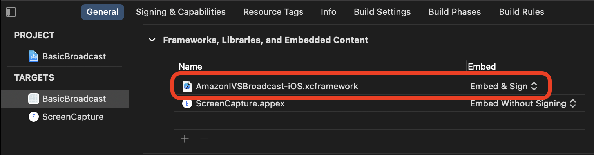

# Getting Started​ with the IVS iOS

Broadcast SDK | Real-Time Streaming

This document takes you through the steps involved in getting started with the IVS
real-time streaming iOS broadcast SDK.

## Install the Library

We recommend that you integrate broadcast SDK via Swift Package Manager.
(Alternatively, you can integrate via CocoaPods or manually add the framework to
your project.)

### Recommended: Integrate the

Broadcast SDK (Swift Package Manager)

1. Download the Package.swift file from [https://broadcast.live-video.net/1.36.0/Package.swift](https://broadcast.live-video.net/1.36.0/Package.swift "https://broadcast.live-video.net/1.36.0/Package.swift").
2. In your project, create a new directory named AmazonIVSBroadcast and
   add it to version control.
3. Place the downloaded Package.swift file in the new directory.
4. In Xcode, go to **File > Add Package
   Dependencies** and select **Add
   Local...**
5. Navigate to and select the AmazonIVSBroadcast directory that you
   created, and select **Add Package**.
6. When prompted to **Choose Package Products for
   AmazonIVSBroadcast**, select **AmazonIVSBroadcastStages** as your **Package Product** by setting your application target in
   the **Add to Target** section.
7. Select **Add Package**.

**Important**: The IVS real-time streaming broadcast SDK includes all features of
the IVS low-latency streaming broadcast SDK. It is not possible to integrate
both SDKs in the same project.

### Alternate Approach: Integrate

the Broadcast SDK (CocoaPods)

**Important**: CocoaPods is in maintenance mode
(security fixes only) and after December 2026, no new packages or updates can be
published to the CocoaPods repository. Existing packages will remain available
but frozen. We recommend using Swift Package Manager for all new
projects.

Real-time functionality is published as a subspec of the iOS Low-Latency
Streaming broadcast SDK. This is so customers can choose to include or exclude
it based on their feature needs. Including it increases the package size.

Releases are published via CocoaPods under the name
`AmazonIVSBroadcast`. Add this dependency to your Podfile:

```
pod 'AmazonIVSBroadcast/Stages'
```

Run `pod install` and the SDK will be available in your
`.xcworkspace`.

**Important:** The IVS real-time streaming
broadcast SDK (i.e., with the stage subspec) includes all features of the IVS
low-latency streaming broadcast SDK. _It is not possible
to integrate both SDKs in the same project._ If you add the stage
subspec via CocoaPods to your project, be sure to remove any other lines in the
Podfile containing `AmazonIVSBroadcast`. For example, do not have
both these lines in your Podfile:

```
pod 'AmazonIVSBroadcast'
pod 'AmazonIVSBroadcast/Stages'
```

### Alternate Approach: Install the

Framework Manually

1. Download the latest version from [https://broadcast.live-video.net/1.36.0/AmazonIVSBroadcast-Stages.xcframework.zip](https://broadcast.live-video.net/1.36.0/AmazonIVSBroadcast-Stages.xcframework.zip "https://broadcast.live-video.net/1.36.0/AmazonIVSBroadcast-Stages.xcframework.zip").
2. Extract the contents of the archive.
   `AmazonIVSBroadcast.xcframework` contains the SDK for
   both device and simulator.
3. Embed `AmazonIVSBroadcast.xcframework` by dragging it into
   the **Frameworks, Libraries, and Embedded
   Content** section of the **General** tab for your application target.



## Request Permissions

Your app must request permission to access the user’s camera and mic. (This is not
specific to Amazon IVS; it is required for any application that needs access to
cameras and microphones.)

Here, we check whether the user has already granted permissions and, if not, we
ask for them:

```
switch AVCaptureDevice.authorizationStatus(for: .video) {
case .authorized: // permission already granted.
case .notDetermined:
   AVCaptureDevice.requestAccess(for: .video) { granted in
       // permission granted based on granted bool.
   }
case .denied, .restricted: // permission denied.
@unknown default: // permissions unknown.
}
```

You need to do this for both `.video` and `.audio` media
types, if you want access to cameras and microphones, respectively.

You also need to add entries for `NSCameraUsageDescription` and
`NSMicrophoneUsageDescription` to your `Info.plist`.
Otherwise, your app will crash when trying to request permissions.

## Disable the Application Idle

Timer

This is optional but recommended. It prevents your device from going to sleep
while using the broadcast SDK, which would interrupt the broadcast.

```
override func viewDidAppear(_ animated: Bool) {
   super.viewDidAppear(animated)
   UIApplication.shared.isIdleTimerDisabled = true
}
override func viewDidDisappear(_ animated: Bool) {
   super.viewDidDisappear(animated)
   UIApplication.shared.isIdleTimerDisabled = false
}
```
