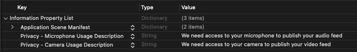

# Step 4: Integrate the IVS Broadcast

SDK

IVS provides a broadcast SDK for web, Android, and iOS that you can integrate into
your application. The broadcast SDK is used for both sending and receiving video. If you
have [configured RTMP Ingest for
your stage](rt-stream-ingest.md "rt-stream-ingest.md"), you may use any encoder that can broadcast to an RTMP endpoint
(e.g., OBS or ffmpeg).

In this section, we write a simple application that enables two or more participants
to interact in real time. The steps below guide you through creating an app called
BasicRealTime. The full app code is on CodePen and GitHub:

- Web: [https://codepen.io/amazon-ivs/pen/ZEqgrpo](https://codepen.io/amazon-ivs/pen/ZEqgrpo "https://codepen.io/amazon-ivs/pen/ZEqgrpo")
- Android: [https://github.com/aws-samples/amazon-ivs-real-time-streaming-android-samples](https://github.com/aws-samples/amazon-ivs-real-time-streaming-android-samples "https://github.com/aws-samples/amazon-ivs-real-time-streaming-android-samples")
- iOS: [https://github.com/aws-samples/amazon-ivs-real-time-streaming-ios-samples](https://github.com/aws-samples/amazon-ivs-real-time-streaming-ios-samples "https://github.com/aws-samples/amazon-ivs-real-time-streaming-ios-samples")

## Web

### Set Up Files

To start, set up your files by creating a folder and an initial HTML and JS
file:

```
mkdir realtime-web-example
cd realtime-web-example
touch index.html
touch app.js
```

You can install the broadcast SDK using a script tag or npm. Our example uses
the script tag for simplicity but is easy to modify if you choose to use npm
later.

### Using a Script

Tag

The Web broadcast SDK is distributed as a JavaScript library and can be
retrieved at [https://web-broadcast.live-video.net/1.32.0/amazon-ivs-web-broadcast.js](https://web-broadcast.live-video.net/1.32.0/amazon-ivs-web-broadcast.js "https://web-broadcast.live-video.net/1.32.0/amazon-ivs-web-broadcast.js").

When loaded via `<script>` tag, the library exposes a global
variable in the window scope named `IVSBroadcastClient`.

### Using npm

To install the npm package:

```
npm install amazon-ivs-web-broadcast
```

You can now access the IVSBroadcastClient object:

```
const { Stage } = IVSBroadcastClient;
```

## Android

### Create the

Android Project

1. In Android Studio, create a **New
   Project**.
2. Choose **Empty Views Activity**.

Note: In some older versions of Android Studio, the View-based
activity is called **Empty Activity**. If
your Android Studio window shows **Empty
Activity** and does _not_
show **Empty Views** Activity, select
**Empty Activity**. Otherwise, don't
select **Empty Activity**, since we'll be
using View APIs (not Jetpack Compose). 3. Give your project a **Name**, then select
**Finish**.

### Install the

Broadcast SDK

To add the Amazon IVS Android broadcast library to your Android development
environment, add the library to your module’s `build.gradle` file, as
shown here (for the latest version of the Amazon IVS broadcast SDK). In newer
projects the `mavenCentral` repository may already be included in
your `settings.gradle` file, if that is the case you can omit the
`repositories` block. For our sample, we’ll also need to enable
data binding in the `android` block.

```
android {
    dataBinding.enabled true
}

repositories {
    mavenCentral()
}

dependencies {
     implementation 'com.amazonaws:ivs-broadcast:1.39.0:stages@aar'
}
```

Alternately, to install the SDK manually, download the latest version from
this location:

[https://search.maven.org/artifact/com.amazonaws/ivs-broadcast](https://search.maven.org/artifact/com.amazonaws/ivs-broadcast "https://search.maven.org/artifact/com.amazonaws/ivs-broadcast")

## iOS

### Create the iOS

Project

1. Create a new Xcode project.
2. For **Platform**, select **iOS**.
3. For **Application**, select **App**.
4. Enter the **Product Name** of your app,
   then select **Next**.
5. Choose (navigate to) a directory in which to save the project, then
   select **Create**.

Next you need to bring in the SDK. For instructions, see [Install the Library](broadcast-ios-getting-started.md#broadcast-ios-install "broadcast-ios-getting-started.md#broadcast-ios-install") in the _iOS Broadcast SDK Guide_.

### Configure

Permissions

You need to update your project’s `Info.plist` to add two new
entries for `NSCameraUsageDescription` and
`NSMicrophoneUsageDescription`. For the values, provide
user-facing explanations of why your app is asking for camera and microphone
access.


