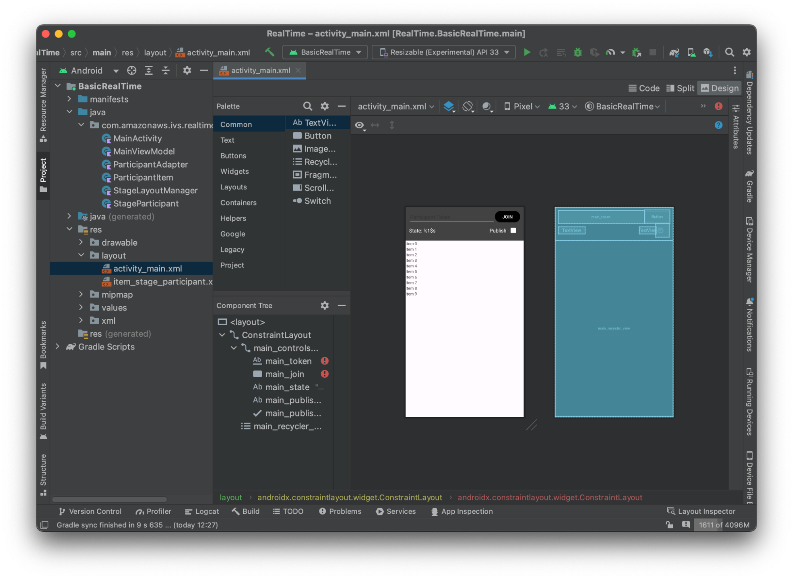
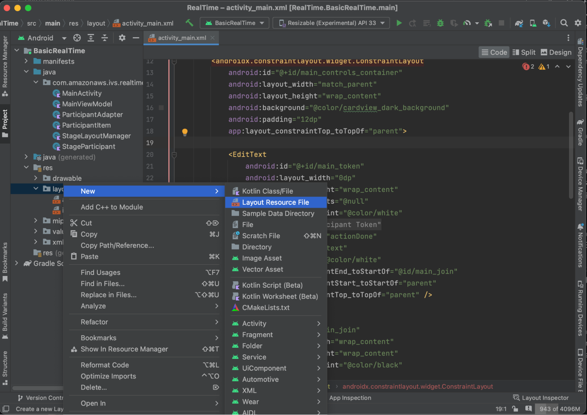
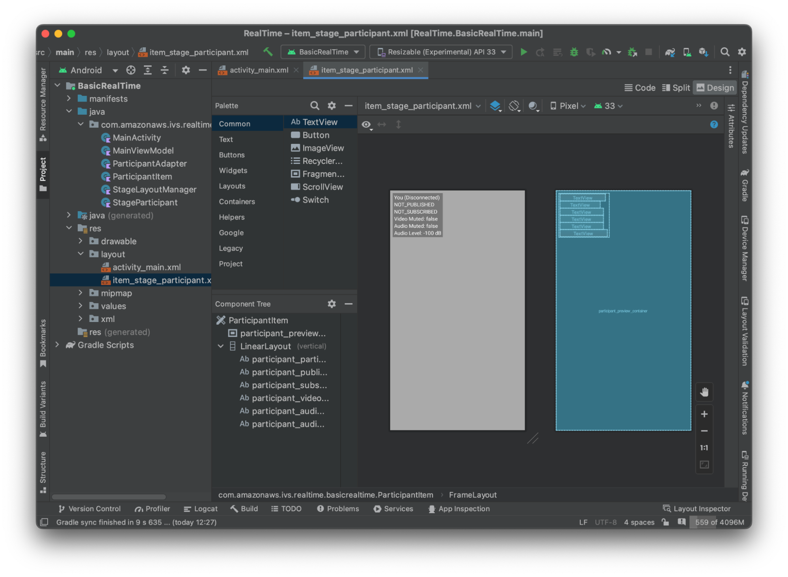

# Publish & Subscribe with the

IVS Android Broadcast SDK

This section takes you through the steps involved in publishing and subscribing to
a stage using your Android app.

## Create Views

We start by creating a simple layout for our app using the auto-created
`activity_main.xml` file. The layout contains an
`EditText` to add a token, a Join `Button`, a
`TextView` to show the stage state, and a `CheckBox`
to toggle publishing.



Here is the XML behind the view:

```
<?xml version="1.0" encoding="utf-8"?>
<layout xmlns:android="http://schemas.android.com/apk/res/android"
    xmlns:app="http://schemas.android.com/apk/res-auto"
    xmlns:tools="http://schemas.android.com/tools">

    <androidx.constraintlayout.widget.ConstraintLayout
        android:keepScreenOn="true"
        android:layout_width="match_parent"
        android:layout_height="match_parent"
        tools:context=".BasicActivity">

        <androidx.constraintlayout.widget.ConstraintLayout
            android:id="@+id/main_controls_container"
            android:layout_width="match_parent"
            android:layout_height="wrap_content"
            android:background="@color/cardview_dark_background"
            android:padding="12dp"
            app:layout_constraintTop_toTopOf="parent">

            <EditText
                android:id="@+id/main_token"
                android:layout_width="0dp"
                android:layout_height="wrap_content"
                android:autofillHints="@null"
                android:backgroundTint="@color/white"
                android:hint="@string/token"
                android:imeOptions="actionDone"
                android:inputType="text"
                android:textColor="@color/white"
                app:layout_constraintEnd_toStartOf="@id/main_join"
                app:layout_constraintStart_toStartOf="parent"
                app:layout_constraintTop_toTopOf="parent" />

            <Button
                android:id="@+id/main_join"
                android:layout_width="wrap_content"
                android:layout_height="wrap_content"
                android:backgroundTint="@color/black"
                android:text="@string/join"
                android:textAllCaps="true"
                android:textColor="@color/white"
                android:textSize="16sp"
                app:layout_constraintBottom_toBottomOf="@+id/main_token"
                app:layout_constraintEnd_toEndOf="parent"
                app:layout_constraintStart_toEndOf="@id/main_token" />

            <TextView
                android:id="@+id/main_state"
                android:layout_width="wrap_content"
                android:layout_height="wrap_content"
                android:text="@string/state"
                android:textColor="@color/white"
                android:textSize="18sp"
                app:layout_constraintBottom_toBottomOf="parent"
                app:layout_constraintStart_toStartOf="parent"
                app:layout_constraintTop_toBottomOf="@id/main_token" />

            <TextView
                android:id="@+id/main_publish_text"
                android:layout_width="wrap_content"
                android:layout_height="wrap_content"
                android:text="@string/publish"
                android:textColor="@color/white"
                android:textSize="18sp"
                app:layout_constraintBottom_toBottomOf="parent"
                app:layout_constraintEnd_toStartOf="@id/main_publish_checkbox"
                app:layout_constraintTop_toBottomOf="@id/main_token" />

            <CheckBox
                android:id="@+id/main_publish_checkbox"
                android:layout_width="wrap_content"
                android:layout_height="wrap_content"
                android:buttonTint="@color/white"
                android:checked="true"
                app:layout_constraintBottom_toBottomOf="@id/main_publish_text"
                app:layout_constraintEnd_toEndOf="parent"
                app:layout_constraintTop_toTopOf="@id/main_publish_text" />

        </androidx.constraintlayout.widget.ConstraintLayout>

        <androidx.recyclerview.widget.RecyclerView
            android:id="@+id/main_recycler_view"
            android:layout_width="match_parent"
            android:layout_height="0dp"
            app:layout_constraintTop_toBottomOf="@+id/main_controls_container"
            app:layout_constraintBottom_toBottomOf="parent" />

    </androidx.constraintlayout.widget.ConstraintLayout>
<layout>
```

We referenced a couple of string IDs here, so we’ll create our entire
`strings.xml` file now:

```
<resources>
    <string name="app_name">BasicRealTime</string>
    <string name="join">Join</string>
    <string name="leave">Leave</string>
    <string name="token">Participant Token</string>
    <string name="publish">Publish</string>
    <string name="state">State: %1$s</string>
</resources>
```

Let’s link those views in the XML to our `MainActivity.kt`:

```
import android.widget.Button
import android.widget.CheckBox
import android.widget.EditText
import android.widget.TextView
import androidx.recyclerview.widget.RecyclerView

private lateinit var checkboxPublish: CheckBox
private lateinit var recyclerView: RecyclerView
private lateinit var buttonJoin: Button
private lateinit var textViewState: TextView
private lateinit var editTextToken: EditText

override fun onCreate(savedInstanceState: Bundle?) {
    super.onCreate(savedInstanceState)
    setContentView(R.layout.activity_main)

    checkboxPublish = findViewById(R.id.main_publish_checkbox)
    recyclerView = findViewById(R.id.main_recycler_view)
    buttonJoin = findViewById(R.id.main_join)
    textViewState = findViewById(R.id.main_state)
    editTextToken = findViewById(R.id.main_token)
}

```

Now we create an item view for our `RecyclerView`. To do this,
right-click your `res/layout` directory and select **New > Layout Resource File**. Name this new file
`item_stage_participant.xml`.



The layout for this item is simple: it contains a view for rendering a
participant’s video stream and a list of labels for displaying information about
the participant:



Here is the XML:

```
<?xml version="1.0" encoding="utf-8"?>
<com.amazonaws.ivs.realtime.basicrealtime.ParticipantItem xmlns:android="http://schemas.android.com/apk/res/android"
    xmlns:app="http://schemas.android.com/apk/res-auto"
    xmlns:tools="http://schemas.android.com/tools"
    android:layout_width="match_parent"
    android:layout_height="match_parent">

    <FrameLayout
        android:id="@+id/participant_preview_container"
        android:layout_width="match_parent"
        android:layout_height="match_parent"
        tools:background="@android:color/darker_gray" />

    <LinearLayout
        android:layout_width="wrap_content"
        android:layout_height="wrap_content"
        android:layout_marginStart="8dp"
        android:layout_marginTop="8dp"
        android:background="#50000000"
        android:orientation="vertical"
        android:paddingLeft="4dp"
        android:paddingTop="2dp"
        android:paddingRight="4dp"
        android:paddingBottom="2dp"
        app:layout_constraintStart_toStartOf="parent"
        app:layout_constraintTop_toTopOf="parent">

        <TextView
            android:id="@+id/participant_participant_id"
            android:layout_width="wrap_content"
            android:layout_height="wrap_content"
            android:textColor="@android:color/white"
            android:textSize="16sp"
            tools:text="You (Disconnected)" />

        <TextView
            android:id="@+id/participant_publishing"
            android:layout_width="wrap_content"
            android:layout_height="wrap_content"
            android:textColor="@android:color/white"
            android:textSize="16sp"
            tools:text="NOT_PUBLISHED" />

        <TextView
            android:id="@+id/participant_subscribed"
            android:layout_width="wrap_content"
            android:layout_height="wrap_content"
            android:textColor="@android:color/white"
            android:textSize="16sp"
            tools:text="NOT_SUBSCRIBED" />

        <TextView
            android:id="@+id/participant_video_muted"
            android:layout_width="wrap_content"
            android:layout_height="wrap_content"
            android:textColor="@android:color/white"
            android:textSize="16sp"
            tools:text="Video Muted: false" />

        <TextView
            android:id="@+id/participant_audio_muted"
            android:layout_width="wrap_content"
            android:layout_height="wrap_content"
            android:textColor="@android:color/white"
            android:textSize="16sp"
            tools:text="Audio Muted: false" />

        <TextView
            android:id="@+id/participant_audio_level"
            android:layout_width="wrap_content"
            android:layout_height="wrap_content"
            android:textColor="@android:color/white"
            android:textSize="16sp"
            tools:text="Audio Level: -100 dB" />

    </LinearLayout>

</com.amazonaws.ivs.realtime.basicrealtime.ParticipantItem>
```

This XML file inflates a class we haven’t created yet,
`ParticipantItem`. Because the XML includes the full namespace,
be sure to update this XML file to your namespace. Let’s create this class and
set up the views, but otherwise leave it blank for now.

Create a new Kotlin class, `ParticipantItem`:

```
package com.amazonaws.ivs.realtime.basicrealtime

import android.content.Context
import android.util.AttributeSet
import android.widget.FrameLayout
import android.widget.TextView
import kotlin.math.roundToInt

class ParticipantItem @JvmOverloads constructor(
    context: Context,
    attrs: AttributeSet? = null,
    defStyleAttr: Int = 0,
    defStyleRes: Int = 0,
) : FrameLayout(context, attrs, defStyleAttr, defStyleRes) {

    private lateinit var previewContainer: FrameLayout
    private lateinit var textViewParticipantId: TextView
    private lateinit var textViewPublish: TextView
    private lateinit var textViewSubscribe: TextView
    private lateinit var textViewVideoMuted: TextView
    private lateinit var textViewAudioMuted: TextView
    private lateinit var textViewAudioLevel: TextView

    override fun onFinishInflate() {
        super.onFinishInflate()
        previewContainer = findViewById(R.id.participant_preview_container)
        textViewParticipantId = findViewById(R.id.participant_participant_id)
        textViewPublish = findViewById(R.id.participant_publishing)
        textViewSubscribe = findViewById(R.id.participant_subscribed)
        textViewVideoMuted = findViewById(R.id.participant_video_muted)
        textViewAudioMuted = findViewById(R.id.participant_audio_muted)
        textViewAudioLevel = findViewById(R.id.participant_audio_level)
    }
}
```

## Permissions

To use the camera and microphone, you need to request permissions from the
user. We follow a standard permissions flow for this:

```
override fun onStart() {
    super.onStart()
    requestPermission()
}

private val requestPermissionLauncher =
    registerForActivityResult(ActivityResultContracts.RequestMultiplePermissions()) { permissions ->
        if (permissions[Manifest.permission.CAMERA] == true && permissions[Manifest.permission.RECORD_AUDIO] == true) {
            viewModel.permissionGranted() // we will add this later
        }
    }

private val permissions = listOf(
    Manifest.permission.CAMERA,
    Manifest.permission.RECORD_AUDIO,
)

private fun requestPermission() {
    when {
        this.hasPermissions(permissions) -> viewModel.permissionGranted() // we will add this later
        else -> requestPermissionLauncher.launch(permissions.toTypedArray())
    }
}

private fun Context.hasPermissions(permissions: List<String>): Boolean {
    return permissions.all {
        ContextCompat.checkSelfPermission(this, it) == PackageManager.PERMISSION_GRANTED
    }
}
```

## App State

Our application keeps track of the participants locally in a
`MainViewModel.kt` and the state will be communicated back to the
`MainActivity` using Kotlin’s [StateFlow](https://kotlinlang.org/api/kotlinx.coroutines/kotlinx-coroutines-core/kotlinx.coroutines.flow/-state-flow/ "https://kotlinlang.org/api/kotlinx.coroutines/kotlinx-coroutines-core/kotlinx.coroutines.flow/-state-flow/").

Create a new Kotlin class `MainViewModel`:

```
package com.amazonaws.ivs.realtime.basicrealtime

import android.app.Application
import androidx.lifecycle.AndroidViewModel

class MainViewModel(application: Application) : AndroidViewModel(application), Stage.Strategy, StageRenderer {

}
```

In `MainActivity.kt` we manage our view model:

```
import androidx.activity.viewModels

private val viewModel: MainViewModel by viewModels()
```

To use `AndroidViewModel` and these Kotlin `ViewModel`
extensions, you’ll need to add the following to your module’s
`build.gradle` file:

```
implementation 'androidx.core:core-ktx:1.10.1'
implementation "androidx.activity:activity-ktx:1.7.2"
implementation 'androidx.appcompat:appcompat:1.6.1'
implementation 'com.google.android.material:material:1.10.0'
implementation "androidx.lifecycle:lifecycle-extensions:2.2.0"

def lifecycle_version = "2.6.1"
implementation "androidx.lifecycle:lifecycle-livedata-ktx:$lifecycle_version"
implementation "androidx.lifecycle:lifecycle-viewmodel-ktx:$lifecycle_version"
implementation 'androidx.constraintlayout:constraintlayout:2.1.4'
```

### RecyclerView Adapter

We’ll create a simple `RecyclerView.Adapter` subclass to keep
track of our participants and update our `RecyclerView` on stage
events. But first, we need a class that represents a participant. Create a
new Kotlin class `StageParticipant`:

```
package com.amazonaws.ivs.realtime.basicrealtime

import com.amazonaws.ivs.broadcast.Stage
import com.amazonaws.ivs.broadcast.StageStream

class StageParticipant(val isLocal: Boolean, var participantId: String?) {
    var publishState = Stage.PublishState.NOT_PUBLISHED
    var subscribeState = Stage.SubscribeState.NOT_SUBSCRIBED
    var streams = mutableListOf<StageStream>()

    val stableID: String
        get() {
            return if (isLocal) {
                "LocalUser"
            } else {
                requireNotNull(participantId)
            }
        }
}
```

We’ll use this class in the `ParticipantAdapter` class that
we’ll create next. We start by defining the class and creating a variable to
track the participants:

```
package com.amazonaws.ivs.realtime.basicrealtime

import android.view.LayoutInflater
import android.view.ViewGroup
import androidx.recyclerview.widget.RecyclerView

class ParticipantAdapter : RecyclerView.Adapter<ParticipantAdapter.ViewHolder>() {

    private val participants = mutableListOf<StageParticipant>()
```

We also have to define our `RecyclerView.ViewHolder` before
implementing the rest of the overrides:

```
class ViewHolder(val participantItem: ParticipantItem) : RecyclerView.ViewHolder(participantItem)
```

Using this, we can implement the standard
`RecyclerView.Adapter` overrides:

```
override fun onCreateViewHolder(parent: ViewGroup, viewType: Int): ViewHolder {
    val item = LayoutInflater.from(parent.context)
        .inflate(R.layout.item_stage_participant, parent, false) as ParticipantItem
    return ViewHolder(item)
}

override fun getItemCount(): Int {
    return participants.size
}

override fun getItemId(position: Int): Long =
    participants[position]
        .stableID
        .hashCode()
        .toLong()

override fun onBindViewHolder(holder: ViewHolder, position: Int) {
    return holder.participantItem.bind(participants[position])
}

override fun onBindViewHolder(holder: ViewHolder, position: Int, payloads: MutableList<Any>) {
    val updates = payloads.filterIsInstance<StageParticipant>()
    if (updates.isNotEmpty()) {
        updates.forEach { holder.participantItem.bind(it) // implemented later }
    } else {
        super.onBindViewHolder(holder, position, payloads)
    }
}
```

Finally, we add new methods that we will call from our
`MainViewModel` when changes to participants are made. These
methods are standard CRUD operations on the adapter.

```
fun participantJoined(participant: StageParticipant) {
    participants.add(participant)
    notifyItemInserted(participants.size - 1)
}

fun participantLeft(participantId: String) {
    val index = participants.indexOfFirst { it.participantId == participantId }
    if (index != -1) {
        participants.removeAt(index)
        notifyItemRemoved(index)
    }
}

fun participantUpdated(participantId: String?, update: (participant: StageParticipant) -> Unit) {
    val index = participants.indexOfFirst { it.participantId == participantId }
    if (index != -1) {
        update(participants[index])
        notifyItemChanged(index, participants[index])
    }
}
```

Back in `MainViewModel` we need to create and hold a reference
to this adapter:

```
internal val participantAdapter = ParticipantAdapter()
```

## Stage

State

We also need to track some stage state within `MainViewModel`.
Let’s define those properties now:

```
private val _connectionState = MutableStateFlow(Stage.ConnectionState.DISCONNECTED)
val connectionState = _connectionState.asStateFlow()

private var publishEnabled: Boolean = false
    set(value) {
        field = value
        // Because the strategy returns the value of `checkboxPublish.isChecked`, just call `refreshStrategy`.
        stage?.refreshStrategy()
    }

private var deviceDiscovery: DeviceDiscovery? = null
private var stage: Stage? = null
private var streams = mutableListOf<LocalStageStream>()
```

To see your own preview before joining a stage, we create a local participant
immediately:

```
init {
    deviceDiscovery = DeviceDiscovery(application)

    // Create a local participant immediately to render our camera preview and microphone stats
    val localParticipant = StageParticipant(true, null)
    participantAdapter.participantJoined(localParticipant)
}
```

We want to make sure we clean up these resources when our
`ViewModel` is cleaned up. We override `onCleared()`
right away, so we don’t forget to clean these resources.

```
override fun onCleared() {
    stage?.release()
    deviceDiscovery?.release()
    deviceDiscovery = null
    super.onCleared()
}
```

Now we populate our local `streams` property as soon as permissions
are granted, implementing the `permissionsGranted` method that we
called earlier:

```
internal fun permissionGranted() {
    val deviceDiscovery = deviceDiscovery ?: return
    streams.clear()
    val devices = deviceDiscovery.listLocalDevices()
    // Camera
    devices
        .filter { it.descriptor.type == Device.Descriptor.DeviceType.CAMERA }
        .maxByOrNull { it.descriptor.position == Device.Descriptor.Position.FRONT }
        ?.let { streams.add(ImageLocalStageStream(it)) }
    // Microphone
    devices
        .filter { it.descriptor.type == Device.Descriptor.DeviceType.MICROPHONE }
        .maxByOrNull { it.descriptor.isDefault }
        ?.let { streams.add(AudioLocalStageStream(it)) }

    stage?.refreshStrategy()

    // Update our local participant with these new streams
    participantAdapter.participantUpdated(null) {
        it.streams.clear()
        it.streams.addAll(streams)
    }
}
```

## Implementing the

Stage SDK

Three core [concepts](android-publish-subscribe.md#android-publish-subscribe-concepts "android-publish-subscribe.md#android-publish-subscribe-concepts")
underlie real-time functionality: stage, strategy, and renderer. The design goal
is minimizing the amount of client-side logic necessary to build a working
product.

### Stage.Strategy

Our `Stage.Strategy` implementation is simple:

```
override fun stageStreamsToPublishForParticipant(
    stage: Stage,
    participantInfo: ParticipantInfo
): MutableList<LocalStageStream> {
    // Return the camera and microphone to be published.
    // This is only called if `shouldPublishFromParticipant` returns true.
    return streams
}

override fun shouldPublishFromParticipant(stage: Stage, participantInfo: ParticipantInfo): Boolean {
    return publishEnabled
}

override fun shouldSubscribeToParticipant(stage: Stage, participantInfo: ParticipantInfo): Stage.SubscribeType {
    // Subscribe to both audio and video for all publishing participants.
    return Stage.SubscribeType.AUDIO_VIDEO
}
```

To summarize, we publish based on our internal `publishEnabled`
state, and if we publish we will publish the streams we collected earlier.
Finally for this sample, we always subscribe to other participants,
receiving both their audio and video.

### StageRenderer

The `StageRenderer` implementation also is fairly simple,
though given the number of functions it contains quite a bit more code. The
general approach in this renderer is to update our
`ParticipantAdapter` when the SDK notifies us of a change to
a participant. There are certain scenarios where we handle local
participants differently, because we have decided to manage them ourselves
so they can see their camera preview before joining.

```
override fun onError(exception: BroadcastException) {
    Toast.makeText(getApplication(), "onError ${exception.localizedMessage}", Toast.LENGTH_LONG).show()
    Log.e("BasicRealTime", "onError $exception")
}

override fun onConnectionStateChanged(
    stage: Stage,
    connectionState: Stage.ConnectionState,
    exception: BroadcastException?
) {
    _connectionState.value = connectionState
}

override fun onParticipantJoined(stage: Stage, participantInfo: ParticipantInfo) {
    if (participantInfo.isLocal) {
        // If this is the local participant joining the stage, update the participant with a null ID because we
        // manually added that participant when setting up our preview
        participantAdapter.participantUpdated(null) {
            it.participantId = participantInfo.participantId
        }
    } else {
        // If they are not local, add them normally
        participantAdapter.participantJoined(
            StageParticipant(
                participantInfo.isLocal,
                participantInfo.participantId
            )
        )
    }
}

override fun onParticipantLeft(stage: Stage, participantInfo: ParticipantInfo) {
    if (participantInfo.isLocal) {
        // If this is the local participant leaving the stage, update the ID but keep it around because
        // we want to keep the camera preview active
        participantAdapter.participantUpdated(participantInfo.participantId) {
            it.participantId = null
        }
    } else {
        // If they are not local, have them leave normally
        participantAdapter.participantLeft(participantInfo.participantId)
    }
}

override fun onParticipantPublishStateChanged(
    stage: Stage,
    participantInfo: ParticipantInfo,
    publishState: Stage.PublishState
) {
    // Update the publishing state of this participant
    participantAdapter.participantUpdated(participantInfo.participantId) {
        it.publishState = publishState
    }
}

override fun onParticipantSubscribeStateChanged(
    stage: Stage,
    participantInfo: ParticipantInfo,
    subscribeState: Stage.SubscribeState
) {
    // Update the subscribe state of this participant
    participantAdapter.participantUpdated(participantInfo.participantId) {
        it.subscribeState = subscribeState
    }
}

override fun onStreamsAdded(stage: Stage, participantInfo: ParticipantInfo, streams: MutableList<StageStream>) {
    // We don't want to take any action for the local participant because we track those streams locally
    if (participantInfo.isLocal) {
        return
    }
    // For remote participants, add these new streams to that participant's streams array.
    participantAdapter.participantUpdated(participantInfo.participantId) {
        it.streams.addAll(streams)
    }
}

override fun onStreamsRemoved(stage: Stage, participantInfo: ParticipantInfo, streams: MutableList<StageStream>) {
    // We don't want to take any action for the local participant because we track those streams locally
    if (participantInfo.isLocal) {
        return
    }
    // For remote participants, remove these streams from that participant's streams array.
    participantAdapter.participantUpdated(participantInfo.participantId) {
        it.streams.removeAll(streams)
    }
}

override fun onStreamsMutedChanged(
    stage: Stage,
    participantInfo: ParticipantInfo,
    streams: MutableList<StageStream>
) {
    // We don't want to take any action for the local participant because we track those streams locally
    if (participantInfo.isLocal) {
        return
    }
    // For remote participants, notify the adapter that the participant has been updated. There is no need to modify
    // the `streams` property on the `StageParticipant` because it is the same `StageStream` instance. Just
    // query the `isMuted` property again.
    participantAdapter.participantUpdated(participantInfo.participantId) {}
}
```

## Implementing a Custom

RecyclerView LayoutManager

Laying out different numbers of participants can be complex. You want them to
take up the entire parent view’s frame but you don’t want to handle each
participant configuration independently. To make this easy, we’ll walk through
implementing a `RecyclerView.LayoutManager`.

Create another new class, `StageLayoutManager`, which should extend
`GridLayoutManager`. This class is designed to calculate the
layout for each participant based on the number of participants in a flow-based
row/column layout. Each row is the same height as the others, but columns can be
different widths per row. See the code comment above the `layouts`
variable for a description of how to customize this behavior.

```
package com.amazonaws.ivs.realtime.basicrealtime

import android.content.Context
import androidx.recyclerview.widget.GridLayoutManager
import androidx.recyclerview.widget.RecyclerView

class StageLayoutManager(context: Context?) : GridLayoutManager(context, 6) {

    companion object {
        /**
         * This 2D array contains the description of how the grid of participants should be rendered
         * The index of the 1st dimension is the number of participants needed to active that configuration
         * Meaning if there is 1 participant, index 0 will be used. If there are 5 participants, index 4 will be used.
         *
         * The 2nd dimension is a description of the layout. The length of the array is the number of rows that
         * will exist, and then each number within that array is the number of columns in each row.
         *
         * See the code comments next to each index for concrete examples.
         *
         * This can be customized to fit any layout configuration needed.
         */
        val layouts: List<List<Int>> = listOf(
            // 1 participant
            listOf(1), // 1 row, full width
            // 2 participants
            listOf(1, 1), // 2 rows, all columns are full width
            // 3 participants
            listOf(1, 2), // 2 rows, first row's column is full width then 2nd row's columns are 1/2 width
            // 4 participants
            listOf(2, 2), // 2 rows, all columns are 1/2 width
            // 5 participants
            listOf(1, 2, 2), // 3 rows, first row's column is full width, 2nd and 3rd row's columns are 1/2 width
            // 6 participants
            listOf(2, 2, 2), // 3 rows, all column are 1/2 width
            // 7 participants
            listOf(2, 2, 3), // 3 rows, 1st and 2nd row's columns are 1/2 width, 3rd row's columns are 1/3rd width
            // 8 participants
            listOf(2, 3, 3),
            // 9 participants
            listOf(3, 3, 3),
            // 10 participants
            listOf(2, 3, 2, 3),
            // 11 participants
            listOf(2, 3, 3, 3),
            // 12 participants
            listOf(3, 3, 3, 3),
        )
    }

    init {
        spanSizeLookup = object : SpanSizeLookup() {
            override fun getSpanSize(position: Int): Int {
                if (itemCount <= 0) {
                    return 1
                }
                // Calculate the row we're in
                val config = layouts[itemCount - 1]
                var row = 0
                var curPosition = position
                while (curPosition - config[row] >= 0) {
                    curPosition -= config[row]
                    row++
                }
                // spanCount == max spans, config[row] = number of columns we want
                // So spanCount / config[row] would be something like 6 / 3 if we want 3 columns.
                // So this will take up 2 spans, with a max of 6 is 1/3rd of the view.
                return spanCount / config[row]
            }
        }
    }

    override fun onLayoutChildren(recycler: RecyclerView.Recycler?, state: RecyclerView.State?) {
        if (itemCount <= 0 || state?.isPreLayout == true) return

        val parentHeight = height
        val itemHeight = parentHeight / layouts[itemCount - 1].size // height divided by number of rows.

        // Set the height of each view based on how many rows exist for the current participant count.
        for (i in 0 until childCount) {
            val child = getChildAt(i) ?: continue
            val layoutParams = child.layoutParams as RecyclerView.LayoutParams
            if (layoutParams.height != itemHeight) {
                layoutParams.height = itemHeight
                child.layoutParams = layoutParams
            }
        }
        // After we set the height for all our views, call super.
        // This works because our RecyclerView can not scroll and all views are always visible with stable IDs.
        super.onLayoutChildren(recycler, state)
    }

    override fun canScrollVertically(): Boolean = false
    override fun canScrollHorizontally(): Boolean = false
}
```

Back in `MainActivity.kt` we need to set the adapter and layout
manager for our `RecyclerView`:

```
// In onCreate after setting recyclerView.
recyclerView.layoutManager = StageLayoutManager(this)
recyclerView.adapter = viewModel.participantAdapter

```

## Hooking Up UI

Actions

We are getting close; there are just a few UI actions that we need to hook
up.

First we’ll have our `MainActivity` observe the
`StateFlow` changes from `MainViewModel`:

```
// At the end of your onCreate method
lifecycleScope.launch {
    repeatOnLifecycle(Lifecycle.State.CREATED) {
        viewModel.connectionState.collect { state ->
            buttonJoin.setText(if (state == ConnectionState.DISCONNECTED) R.string.join else R.string.leave)
            textViewState.text = getString(R.string.state, state.name)
        }
    }
}
```

Next we add listeners to our Join button and Publish checkbox:

```
buttonJoin.setOnClickListener {
    viewModel.joinStage(editTextToken.text.toString())
}
checkboxPublish.setOnCheckedChangeListener { _, isChecked ->
    viewModel.setPublishEnabled(isChecked)
}
```

Both of the above call functionality in our `MainViewModel`, which
we implement now:

```
internal fun joinStage(token: String) {
    if (_connectionState.value != Stage.ConnectionState.DISCONNECTED) {
        // If we're already connected to a stage, leave it.
        stage?.leave()
    } else {
        if (token.isEmpty()) {
            Toast.makeText(getApplication(), "Empty Token", Toast.LENGTH_SHORT).show()
            return
        }
        try {
            // Destroy the old stage first before creating a new one.
            stage?.release()
            val stage = Stage(getApplication(), token, this)
            stage.addRenderer(this)
            stage.join()
            this.stage = stage
        } catch (e: BroadcastException) {
            Toast.makeText(getApplication(), "Failed to join stage ${e.localizedMessage}", Toast.LENGTH_LONG).show()
            e.printStackTrace()
        }
    }
}

internal fun setPublishEnabled(enabled: Boolean) {
    publishEnabled = enabled
}
```

## Rendering the

Participants

Finally, we need to render the data we receive from the SDK onto the
participant item that we created earlier. We already have the
`RecyclerView` logic finished, so we just need to implement the
`bind` API in `ParticipantItem`.

We’ll start by adding the empty function and then walk through it step by
step:

```
fun bind(participant: StageParticipant) {

}
```

First we’ll handle the easy state, the participant ID, publish state, and
subscribe state. For these, we just update our `TextViews`
directly:

```
val participantId = if (participant.isLocal) {
    "You (${participant.participantId ?: "Disconnected"})"
} else {
    participant.participantId
}
textViewParticipantId.text = participantId
textViewPublish.text = participant.publishState.name
textViewSubscribe.text = participant.subscribeState.name
```

Next we’ll update the audio and video muted states. To get the muted state, we
need to find the `ImageDevice` and `AudioDevice` from the
streams array. To optimize performance, we remember the last attached device
IDs.

```
// This belongs outside the `bind` API.
private var imageDeviceUrn: String? = null
private var audioDeviceUrn: String? = null

// This belongs inside the `bind` API.
val newImageStream = participant
    .streams
    .firstOrNull { it.device is ImageDevice }
textViewVideoMuted.text = if (newImageStream != null) {
    if (newImageStream.muted) "Video muted" else "Video not muted"
} else {
    "No video stream"
}

val newAudioStream = participant
    .streams
    .firstOrNull { it.device is AudioDevice }
textViewAudioMuted.text = if (newAudioStream != null) {
    if (newAudioStream.muted) "Audio muted" else "Audio not muted"
} else {
    "No audio stream"
}
```

Finally we want to render a preview for the `imageDevice`:

```
if (newImageStream?.device?.descriptor?.urn != imageDeviceUrn) {
    // If the device has changed, remove all subviews from the preview container
    previewContainer.removeAllViews()
    (newImageStream?.device as? ImageDevice)?.let {
        val preview = it.getPreviewView(BroadcastConfiguration.AspectMode.FIT)
        previewContainer.addView(preview)
        preview.layoutParams = FrameLayout.LayoutParams(
            FrameLayout.LayoutParams.MATCH_PARENT,
            FrameLayout.LayoutParams.MATCH_PARENT
        )
    }
}
imageDeviceUrn = newImageStream?.device?.descriptor?.urn
```

And we display audio stats from the `audioDevice`:

```
if (newAudioStream?.device?.descriptor?.urn != audioDeviceUrn) {
    (newAudioStream?.device as? AudioDevice)?.let {
        it.setStatsCallback { _, rms ->
            textViewAudioLevel.text = "Audio Level: ${rms.roundToInt()} dB"
        }
    }
}
audioDeviceUrn = newAudioStream?.device?.descriptor?.urn
```
