# Publish & Subscribe with the IVS

iOS Broadcast SDK

This section takes you through the steps involved in publishing and subscribing to
a stage using your iOS app.

## Create Views

We start by using the auto-created `ViewController.swift` file to
import `AmazonIVSBroadcast` and then add some `@IBOutlets`
to link:

```
import AmazonIVSBroadcast

class ViewController: UIViewController {

    @IBOutlet private var textFieldToken: UITextField!
    @IBOutlet private var buttonJoin: UIButton!
    @IBOutlet private var labelState: UILabel!
    @IBOutlet private var switchPublish: UISwitch!
    @IBOutlet private var collectionViewParticipants: UICollectionView!
```

Now we create those views and link them up in `Main.storyboard`.
Here is the view structure that we’ll use:

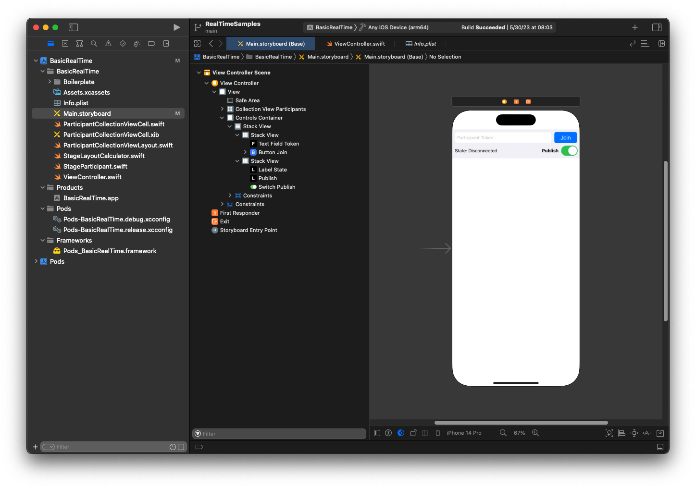

For AutoLayout configuration, we need to customize three views. The first view
is **Collection View Participants** (a
`UICollectionView`). Bound **Leading**, **Trailing**, and
**Bottom** to **Safe
Area**. Also bound **Top** to
**Controls Container**.

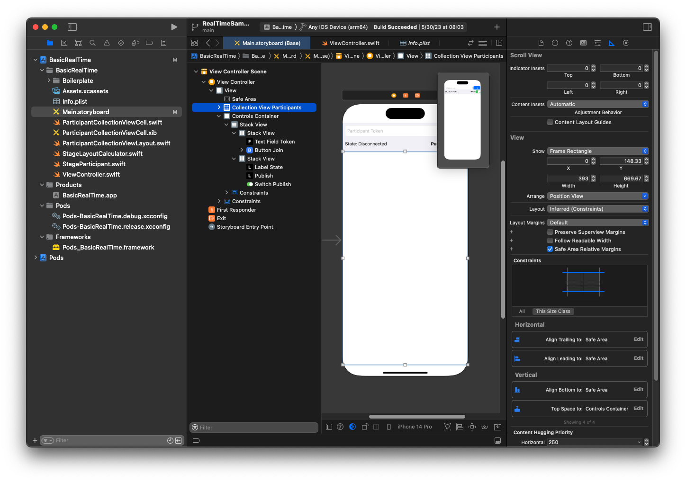

The second view is **Controls Container**. Bound
**Leading**, **Trailing**, and **Top** to **Safe Area**:

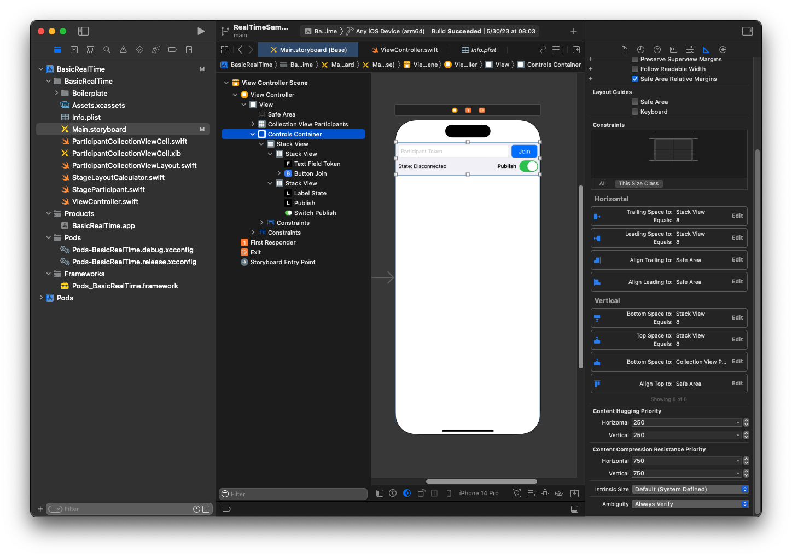

The third and last view is **Vertical Stack
View**. Bound **Top**, **Leading**, **Trailing**,
and **Bottom** to **Superview**. For styling, set the spacing to 8 instead of 0.

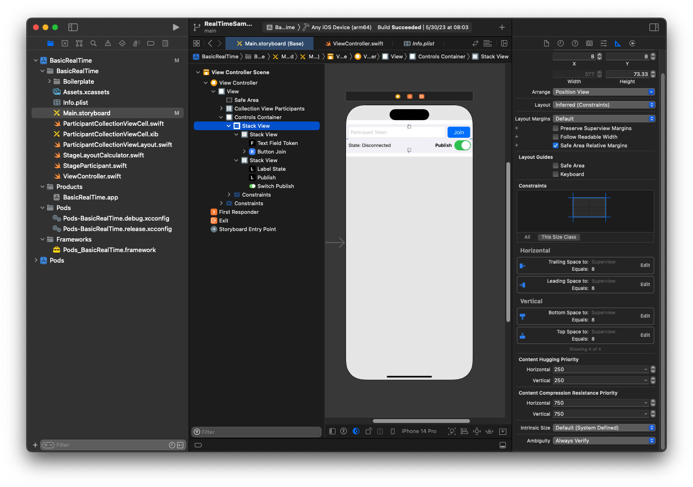

The **UIStackViews** will handle the layout of
the remaining views. For all three **UIStackViews**, use **Fill** as the
**Alignment** and **Distribution**.

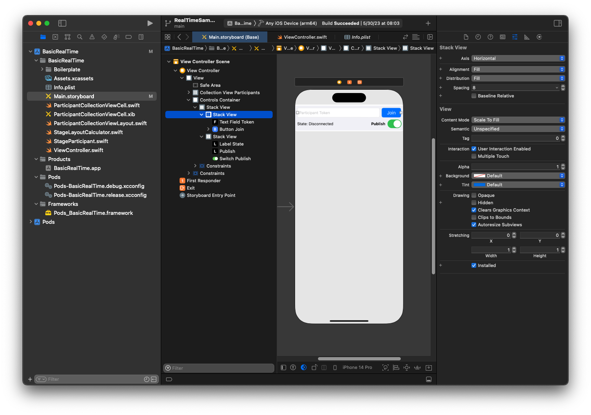

Finally, let’s link these views to our `ViewController`. From
above, map the following views:

- **Text Field Join** binds to
  `textFieldToken`.
- **Button Join** binds to
  `buttonJoin`.
- **Label State** binds to
  `labelState`.
- **Switch Publish** binds to
  `switchPublish`.
- **Collection View Participants** binds to
  `collectionViewParticipants`.

Also use this time to set the `dataSource` of the **Collection View Participants** item to the owning
`ViewController`:

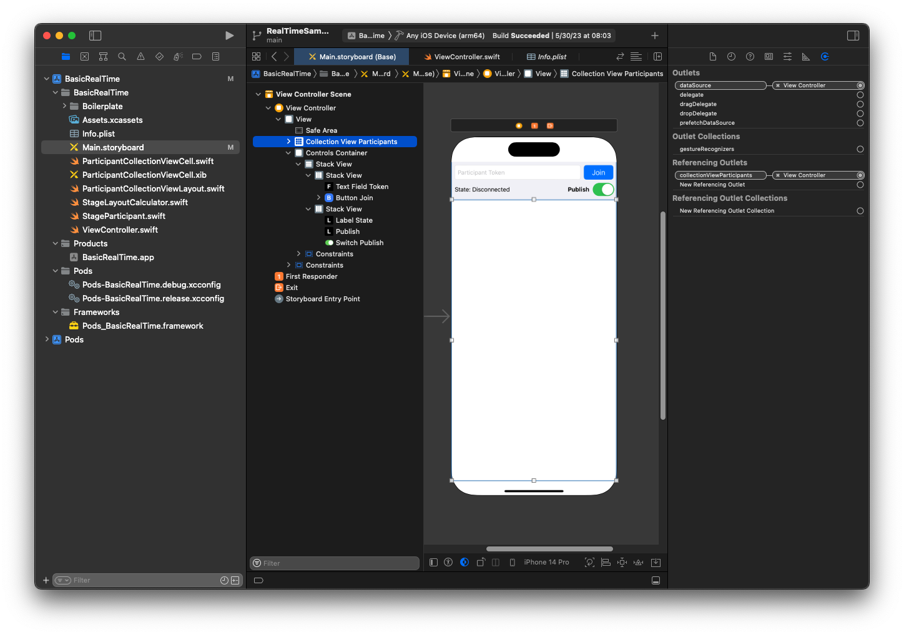

Now we create the `UICollectionViewCell` subclass in which to
render the participants. Start by creating a new **Cocoa
Touch Class** file:

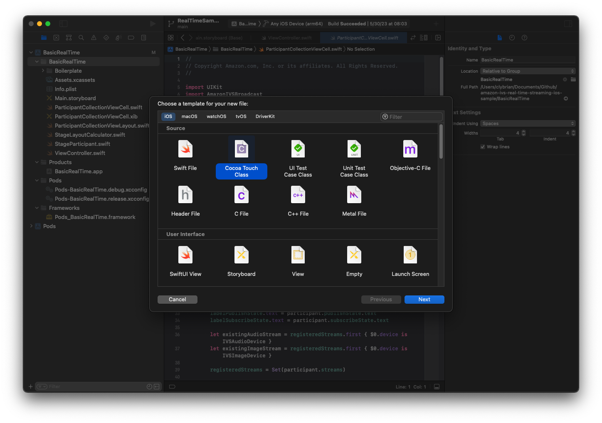

Name it `ParticipantUICollectionViewCell` and make it a subclass of
`UICollectionViewCell` in Swift. We start in the Swift file
again, creating our `@IBOutlets` to link:

```
import AmazonIVSBroadcast

class ParticipantCollectionViewCell: UICollectionViewCell {

    @IBOutlet private var viewPreviewContainer: UIView!
    @IBOutlet private var labelParticipantId: UILabel!
    @IBOutlet private var labelSubscribeState: UILabel!
    @IBOutlet private var labelPublishState: UILabel!
    @IBOutlet private var labelVideoMuted: UILabel!
    @IBOutlet private var labelAudioMuted: UILabel!
    @IBOutlet private var labelAudioVolume: UILabel!
```

In the associated XIB file, create this view hierarchy:

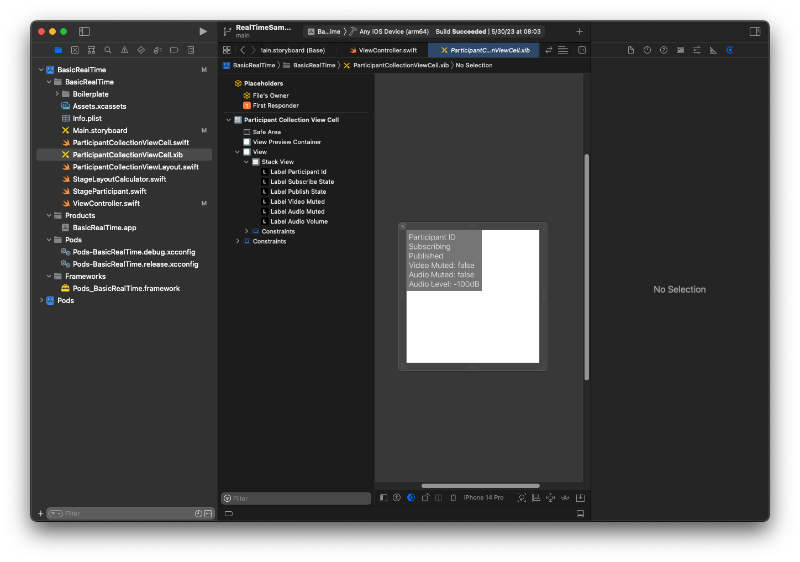

For AutoLayout, we’ll modify three views again. The first view is **View Preview Container**. Set **Trailing**, **Leading**, **Top**, and **Bottom** to
**Participant Collection View Cell**.


The second view is **View**. Set **Leading** and **Top** to
**Participant Collection View Cell** and change
the value to 4.

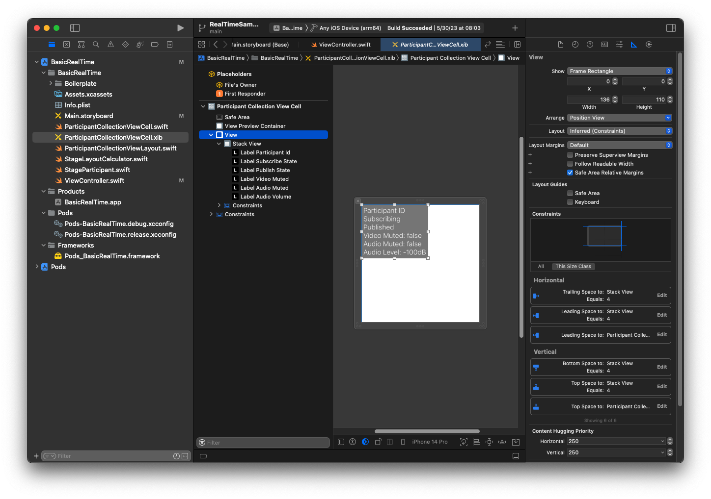

The third view is **Stack View**. Set **Trailing**, **Leading**,
**Top**, and **Bottom** to **Superview** and change
the value to 4.

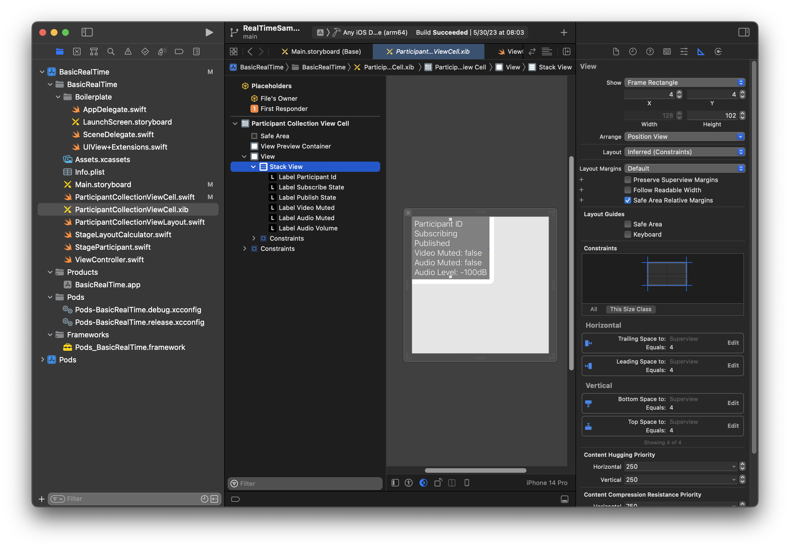

## Permissions and Idle

Timer

Going back to our `ViewController`, we will disable the system idle
timer to prevent the device from going to sleep while our application is being
used:

```
override func viewDidAppear(_ animated: Bool) {
    super.viewDidAppear(animated)
    // Prevent the screen from turning off during a call.
    UIApplication.shared.isIdleTimerDisabled = true
}

override func viewDidDisappear(_ animated: Bool) {
    super.viewDidDisappear(animated)
    UIApplication.shared.isIdleTimerDisabled = false
}
```

Next we request camera and microphone permissions from the system:

```
private func checkPermissions() {
    checkOrGetPermission(for: .video) { [weak self] granted in
        guard granted else {
            print("Video permission denied")
            return
        }
        self?.checkOrGetPermission(for: .audio) { [weak self] granted in
            guard granted else {
                print("Audio permission denied")
                return
            }
            self?.setupLocalUser() // we will cover this later
        }
    }
}

private func checkOrGetPermission(for mediaType: AVMediaType, _ result: @escaping (Bool) -> Void) {
    func mainThreadResult(_ success: Bool) {
        DispatchQueue.main.async {
            result(success)
        }
    }
    switch AVCaptureDevice.authorizationStatus(for: mediaType) {
    case .authorized: mainThreadResult(true)
    case .notDetermined:
        AVCaptureDevice.requestAccess(for: mediaType) { granted in
            mainThreadResult(granted)
        }
    case .denied, .restricted: mainThreadResult(false)
    @unknown default: mainThreadResult(false)
    }
}
```

## App State

We need to configure our `collectionViewParticipants` with the
layout file that we created earlier:

```
override func viewDidLoad() {
    super.viewDidLoad()
    // We render everything to exactly the frame, so don't allow scrolling.
    collectionViewParticipants.isScrollEnabled = false
    collectionViewParticipants.register(UINib(nibName: "ParticipantCollectionViewCell", bundle: .main), forCellWithReuseIdentifier: "ParticipantCollectionViewCell")
}
```

To represent each participant, we create a simple struct called
`StageParticipant`. This can be included in the
`ViewController.swift` file, or a new file can be created.

```
import Foundation
import AmazonIVSBroadcast

struct StageParticipant {
    let isLocal: Bool
    var participantId: String?
    var publishState: IVSParticipantPublishState = .notPublished
    var subscribeState: IVSParticipantSubscribeState = .notSubscribed
    var streams: [IVSStageStream] = []

    init(isLocal: Bool, participantId: String?) {
        self.isLocal = isLocal
        self.participantId = participantId
    }
}
```

To track those participants, we keep an array of them as a private property in
our `ViewController`:

```
private var participants = [StageParticipant]()
```

This property will be used to power our
`UICollectionViewDataSource` that was linked from the storyboard
earlier:

```
extension ViewController: UICollectionViewDataSource {

    func collectionView(_ collectionView: UICollectionView, numberOfItemsInSection section: Int) -> Int {
        return participants.count
    }

    func collectionView(_ collectionView: UICollectionView, cellForItemAt indexPath: IndexPath) -> UICollectionViewCell {
        if let cell = collectionView.dequeueReusableCell(withReuseIdentifier: "ParticipantCollectionViewCell", for: indexPath) as? ParticipantCollectionViewCell {
            cell.set(participant: participants[indexPath.row])
            return cell
        } else {
            fatalError("Couldn't load custom cell type 'ParticipantCollectionViewCell'")
        }
    }

}
```

To see your own preview before joining a stage, we create a local participant
immediately:

```
override func viewDidLoad() {
    /* existing UICollectionView code */
    participants.append(StageParticipant(isLocal: true, participantId: nil))
}
```

This results in a participant cell being rendered immediately once the app is
running, representing the local participant.

Users want to be able to see themselves before joining a stage, so next we
implement the `setupLocalUser()` method that gets called from the
permissions-handling code earlier. We store the camera and microphone reference
as `IVSLocalStageStream` objects.

```
private var streams = [IVSLocalStageStream]()
private let deviceDiscovery = IVSDeviceDiscovery()

private func setupLocalUser() {
    // Gather our camera and microphone once permissions have been granted
    let devices = deviceDiscovery.listLocalDevices()
    streams.removeAll()
    if let camera = devices.compactMap({ $0 as? IVSCamera }).first {
        streams.append(IVSLocalStageStream(device: camera))
        // Use a front camera if available.
        if let frontSource = camera.listAvailableInputSources().first(where: { $0.position == .front }) {
            camera.setPreferredInputSource(frontSource)
        }
    }
    if let mic = devices.compactMap({ $0 as? IVSMicrophone }).first {
        streams.append(IVSLocalStageStream(device: mic))
    }
    participants[0].streams = streams
    participantsChanged(index: 0, changeType: .updated)
}
```

Here we’ve found the device’s camera and microphone through the SDK and stored
them in our local `streams` object, then assigned the
`streams` array of the first participant (the local participant
that we created earlier) to our `streams`. Finally we call
`participantsChanged` with an `index` of 0 and
`changeType` of `updated`. That function is a helper
function for updating our `UICollectionView` with nice animations.
Here’s what it looks like:

```
private func participantsChanged(index: Int, changeType: ChangeType) {
    switch changeType {
    case .joined:
        collectionViewParticipants?.insertItems(at: [IndexPath(item: index, section: 0)])
    case .updated:
        // Instead of doing reloadItems, just grab the cell and update it ourselves. It saves a create/destroy of a cell
        // and more importantly fixes some UI flicker. We disable scrolling so the index path per cell
        // never changes.
        if let cell = collectionViewParticipants?.cellForItem(at: IndexPath(item: index, section: 0)) as? ParticipantCollectionViewCell {
            cell.set(participant: participants[index])
        }
    case .left:
        collectionViewParticipants?.deleteItems(at: [IndexPath(item: index, section: 0)])
    }
}
```

Don’t worry about `cell.set` yet; we’ll get to that later, but
that’s where we will render the cell’s contents based on the participant.

The `ChangeType` is a simple enum:

```
enum ChangeType {
    case joined, updated, left
}
```

Finally, we want to keep track of whether the stage is connected. We use a
simple `bool` to track that, which will automatically update our UI
when it is updated itself.

```
private var connectingOrConnected = false {
    didSet {
        buttonJoin.setTitle(connectingOrConnected ? "Leave" : "Join", for: .normal)
        buttonJoin.tintColor = connectingOrConnected ? .systemRed : .systemBlue
    }
}
```

## Implement the Stage

SDK

Three core [concepts](ios-publish-subscribe.md#ios-publish-subscribe-concepts "ios-publish-subscribe.md#ios-publish-subscribe-concepts")
underlie real-time functionality: stage, strategy, and renderer. The design goal
is minimizing the amount of client-side logic necessary to build a working
product.

### IVSStageStrategy

Our `IVSStageStrategy` implementation is simple:

```
extension ViewController: IVSStageStrategy {
    func stage(_ stage: IVSStage, streamsToPublishForParticipant participant: IVSParticipantInfo) -> [IVSLocalStageStream] {
        // Return the camera and microphone to be published.
        // This is only called if `shouldPublishParticipant` returns true.
        return streams
    }

    func stage(_ stage: IVSStage, shouldPublishParticipant participant: IVSParticipantInfo) -> Bool {
        // Our publish status is based directly on the UISwitch view
        return switchPublish.isOn
    }

    func stage(_ stage: IVSStage, shouldSubscribeToParticipant participant: IVSParticipantInfo) -> IVSStageSubscribeType {
        // Subscribe to both audio and video for all publishing participants.
        return .audioVideo
    }
}
```

To summarize, we only publish if the publish switch is in the “on”
position, and if we publish we will publish the streams that we collected
earlier. Finally, for this sample, we always subscribe to other
participants, receiving both their audio and video.

### IVSStageRenderer

The `IVSStageRenderer` implementation also is fairly simple,
though given the number of functions it contains quite a bit more code. The
general approach in this renderer is to update our `participants`
array when the SDK notifies us of a change to a participant. There are
certain scenarios where we handle local participants differently, because we
have decided to manage them ourselves so they can see their camera preview
before joining.

```
extension ViewController: IVSStageRenderer {

    func stage(_ stage: IVSStage, didChange connectionState: IVSStageConnectionState, withError error: Error?) {
        labelState.text = connectionState.text
        connectingOrConnected = connectionState != .disconnected
    }

    func stage(_ stage: IVSStage, participantDidJoin participant: IVSParticipantInfo) {
        if participant.isLocal {
            // If this is the local participant joining the Stage, update the first participant in our array because we
            // manually added that participant when setting up our preview
            participants[0].participantId = participant.participantId
            participantsChanged(index: 0, changeType: .updated)
        } else {
            // If they are not local, add them to the array as a newly joined participant.
            participants.append(StageParticipant(isLocal: false, participantId: participant.participantId))
            participantsChanged(index: (participants.count - 1), changeType: .joined)
        }
    }

    func stage(_ stage: IVSStage, participantDidLeave participant: IVSParticipantInfo) {
        if participant.isLocal {
            // If this is the local participant leaving the Stage, update the first participant in our array because
            // we want to keep the camera preview active
            participants[0].participantId = nil
            participantsChanged(index: 0, changeType: .updated)
        } else {
            // If they are not local, find their index and remove them from the array.
            if let index = participants.firstIndex(where: { $0.participantId == participant.participantId }) {
                participants.remove(at: index)
                participantsChanged(index: index, changeType: .left)
            }
        }
    }

    func stage(_ stage: IVSStage, participant: IVSParticipantInfo, didChange publishState: IVSParticipantPublishState) {
        // Update the publishing state of this participant
        mutatingParticipant(participant.participantId) { data in
            data.publishState = publishState
        }
    }

    func stage(_ stage: IVSStage, participant: IVSParticipantInfo, didChange subscribeState: IVSParticipantSubscribeState) {
        // Update the subscribe state of this participant
        mutatingParticipant(participant.participantId) { data in
            data.subscribeState = subscribeState
        }
    }

    func stage(_ stage: IVSStage, participant: IVSParticipantInfo, didChangeMutedStreams streams: [IVSStageStream]) {
        // We don't want to take any action for the local participant because we track those streams locally
        if participant.isLocal { return }
        // For remote participants, notify the UICollectionView that they have updated. There is no need to modify
        // the `streams` property on the `StageParticipant` because it is the same `IVSStageStream` instance. Just
        // query the `isMuted` property again.
        if let index = participants.firstIndex(where: { $0.participantId == participant.participantId }) {
            participantsChanged(index: index, changeType: .updated)
        }
    }

    func stage(_ stage: IVSStage, participant: IVSParticipantInfo, didAdd streams: [IVSStageStream]) {
        // We don't want to take any action for the local participant because we track those streams locally
        if participant.isLocal { return }
        // For remote participants, add these new streams to that participant's streams array.
        mutatingParticipant(participant.participantId) { data in
            data.streams.append(contentsOf: streams)
        }
    }

    func stage(_ stage: IVSStage, participant: IVSParticipantInfo, didRemove streams: [IVSStageStream]) {
        // We don't want to take any action for the local participant because we track those streams locally
        if participant.isLocal { return }
        // For remote participants, remove these streams from that participant's streams array.
        mutatingParticipant(participant.participantId) { data in
            let oldUrns = streams.map { $0.device.descriptor().urn }
            data.streams.removeAll(where: { stream in
                return oldUrns.contains(stream.device.descriptor().urn)
            })
        }
    }

    // A helper function to find a participant by its ID, mutate that participant, and then update the UICollectionView accordingly.
    private func mutatingParticipant(_ participantId: String?, modifier: (inout StageParticipant) -> Void) {
        guard let index = participants.firstIndex(where: { $0.participantId == participantId }) else {
            fatalError("Something is out of sync, investigate if this was a sample app or SDK issue.")
        }

        var participant = participants[index]
        modifier(&participant)
        participants[index] = participant
        participantsChanged(index: index, changeType: .updated)
    }
}
```

This code uses an extension to convert the connection state into
human-friendly text:

```
extension IVSStageConnectionState {
    var text: String {
        switch self {
        case .disconnected: return "Disconnected"
        case .connecting: return "Connecting"
        case .connected: return "Connected"
        @unknown default: fatalError()
        }
    }
}
```

## Implementing a Custom

UICollectionViewLayout

Laying out different numbers of participants can be complex. You want them to
take up the entire parent view’s frame but you don’t want to handle each
participant configuration independently. To make this easy, we’ll walk through
implementing a `UICollectionViewLayout`.

Create another new file, `ParticipantCollectionViewLayout.swift`,
which should extend `UICollectionViewLayout`. This class will use
another class called `StageLayoutCalculator`, which we’ll cover soon.
The class receives calculated frame values for each participant and then
generates the necessary `UICollectionViewLayoutAttributes`
objects.

```
import Foundation
import UIKit

/**
 Code modified from https://developer.apple.com/documentation/uikit/views_and_controls/collection_views/layouts/customizing_collection_view_layouts?language=objc
 */
class ParticipantCollectionViewLayout: UICollectionViewLayout {

    private let layoutCalculator = StageLayoutCalculator()

    private var contentBounds = CGRect.zero
    private var cachedAttributes = [UICollectionViewLayoutAttributes]()

    override func prepare() {
        super.prepare()

        guard let collectionView = collectionView else { return }

        cachedAttributes.removeAll()
        contentBounds = CGRect(origin: .zero, size: collectionView.bounds.size)

        layoutCalculator.calculateFrames(participantCount: collectionView.numberOfItems(inSection: 0),
                                         width: collectionView.bounds.size.width,
                                         height: collectionView.bounds.size.height,
                                         padding: 4)
        .enumerated()
        .forEach { (index, frame) in
            let attributes = UICollectionViewLayoutAttributes(forCellWith: IndexPath(item: index, section: 0))
            attributes.frame = frame
            cachedAttributes.append(attributes)
            contentBounds = contentBounds.union(frame)
        }
    }

    override var collectionViewContentSize: CGSize {
        return contentBounds.size
    }

    override func shouldInvalidateLayout(forBoundsChange newBounds: CGRect) -> Bool {
        guard let collectionView = collectionView else { return false }
        return !newBounds.size.equalTo(collectionView.bounds.size)
    }

    override func layoutAttributesForItem(at indexPath: IndexPath) -> UICollectionViewLayoutAttributes? {
        return cachedAttributes[indexPath.item]
    }

    override func layoutAttributesForElements(in rect: CGRect) -> [UICollectionViewLayoutAttributes]? {
        var attributesArray = [UICollectionViewLayoutAttributes]()

        // Find any cell that sits within the query rect.
        guard let lastIndex = cachedAttributes.indices.last, let firstMatchIndex = binSearch(rect, start: 0, end: lastIndex) else {
            return attributesArray
        }

        // Starting from the match, loop up and down through the array until all the attributes
        // have been added within the query rect.
        for attributes in cachedAttributes[..<firstMatchIndex].reversed() {
            guard attributes.frame.maxY >= rect.minY else { break }
            attributesArray.append(attributes)
        }

        for attributes in cachedAttributes[firstMatchIndex...] {
            guard attributes.frame.minY <= rect.maxY else { break }
            attributesArray.append(attributes)
        }

        return attributesArray
    }

    // Perform a binary search on the cached attributes array.
    func binSearch(_ rect: CGRect, start: Int, end: Int) -> Int? {
        if end < start { return nil }

        let mid = (start + end) / 2
        let attr = cachedAttributes[mid]

        if attr.frame.intersects(rect) {
            return mid
        } else {
            if attr.frame.maxY < rect.minY {
                return binSearch(rect, start: (mid + 1), end: end)
            } else {
                return binSearch(rect, start: start, end: (mid - 1))
            }
        }
    }
}
```

More important is the `StageLayoutCalculator.swift` class. It is
designed to calculate the frames for each participant based on the number of
participants in a flow-based row/column layout. Each row is the same height as
the others, but the columns can be different widths per row. See the code
comment above the `layouts` variable for a description of how to
customize this behavior.

```
import Foundation
import UIKit

class StageLayoutCalculator {

    /// This 2D array contains the description of how the grid of participants should be rendered
    /// The index of the 1st dimension is the number of participants needed to active that configuration
    /// Meaning if there is 1 participant, index 0 will be used. If there are 5 participants, index 4 will be used.
    ///
    /// The 2nd dimension is a description of the layout. The length of the array is the number of rows that
    /// will exist, and then each number within that array is the number of columns in each row.
    ///
    /// See the code comments next to each index for concrete examples.
    ///
    /// This can be customized to fit any layout configuration needed.
    private let layouts: [[Int]] = [
        // 1 participant
        [ 1 ], // 1 row, full width
        // 2 participants
        [ 1, 1 ], // 2 rows, all columns are full width
        // 3 participants
        [ 1, 2 ], // 2 rows, first row's column is full width then 2nd row's columns are 1/2 width
        // 4 participants
        [ 2, 2 ], // 2 rows, all columns are 1/2 width
        // 5 participants
        [ 1, 2, 2 ], // 3 rows, first row's column is full width, 2nd and 3rd row's columns are 1/2 width
        // 6 participants
        [ 2, 2, 2 ], // 3 rows, all column are 1/2 width
        // 7 participants
        [ 2, 2, 3 ], // 3 rows, 1st and 2nd row's columns are 1/2 width, 3rd row's columns are 1/3rd width
        // 8 participants
        [ 2, 3, 3 ],
        // 9 participants
        [ 3, 3, 3 ],
        // 10 participants
        [ 2, 3, 2, 3 ],
        // 11 participants
        [ 2, 3, 3, 3 ],
        // 12 participants
        [ 3, 3, 3, 3 ],
    ]

    // Given a frame (this could be for a UICollectionView, or a Broadcast Mixer's canvas), calculate the frames for each
    // participant, with optional padding.
    func calculateFrames(participantCount: Int, width: CGFloat, height: CGFloat, padding: CGFloat) -> [CGRect] {
        if participantCount > layouts.count {
            fatalError("Only \(layouts.count) participants are supported at this time")
        }
        if participantCount == 0 {
            return []
        }
        var currentIndex = 0
        var lastFrame: CGRect = .zero

        // If the height is less than the width, the rows and columns will be flipped.
        // Meaning for 6 participants, there will be 2 rows of 3 columns each.
        let isVertical = height > width

        let halfPadding = padding / 2.0

        let layout = layouts[participantCount - 1] // 1 participant is in index 0, so `-1`.
        let rowHeight = (isVertical ? height : width) / CGFloat(layout.count)

        var frames = [CGRect]()
        for row in 0 ..< layout.count {
            // layout[row] is the number of columns in a layout
            let itemWidth = (isVertical ? width : height) / CGFloat(layout[row])
            let segmentFrame = CGRect(x: (isVertical ? 0 : lastFrame.maxX) + halfPadding,
                                      y: (isVertical ? lastFrame.maxY : 0) + halfPadding,
                                      width: (isVertical ? itemWidth : rowHeight) - padding,
                                      height: (isVertical ? rowHeight : itemWidth) - padding)

            for column in 0 ..< layout[row] {
                var frame = segmentFrame
                if isVertical {
                    frame.origin.x = (itemWidth * CGFloat(column)) + halfPadding
                } else {
                    frame.origin.y = (itemWidth * CGFloat(column)) + halfPadding
                }
                frames.append(frame)
                currentIndex += 1
            }

            lastFrame = segmentFrame
            lastFrame.origin.x += halfPadding
            lastFrame.origin.y += halfPadding
        }
        return frames
    }

}
```

Back in `Main.storyboard`, be sure to set the layout class for the
`UICollectionView` to the class we just created:

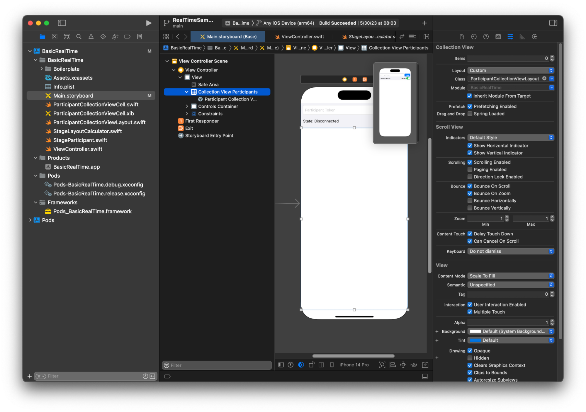

## Hooking Up UI

Actions

We are getting close, there are a few `IBActions` that we need to
create.

First we’ll handle the join button. It responds differently based on the value
of `connectingOrConnected`. When it is already connected, it just
leaves the stage. If it is disconnected, it reads the text from the token
`UITextField` and creates a new `IVSStage` with that
text. Then we add our `ViewController` as the `strategy`,
`errorDelegate`, and renderer for the `IVSStage`, and
finally we join the stage asynchronously.

```
@IBAction private func joinTapped(_ sender: UIButton) {
    if connectingOrConnected {
        // If we're already connected to a Stage, leave it.
        stage?.leave()
    } else {
        guard let token = textFieldToken.text else {
            print("No token")
            return
        }
        // Hide the keyboard after tapping Join
        textFieldToken.resignFirstResponder()
        do {
            // Destroy the old Stage first before creating a new one.
            self.stage = nil
            let stage = try IVSStage(token: token, strategy: self)
            stage.errorDelegate = self
            stage.addRenderer(self)
            try stage.join()
            self.stage = stage
        } catch {
            print("Failed to join stage - \(error)")
        }
    }
}
```

The other UI action we need to hook up is the publish switch:

```
@IBAction private func publishToggled(_ sender: UISwitch) {
    // Because the strategy returns the value of `switchPublish.isOn`, just call `refreshStrategy`.
    stage?.refreshStrategy()
}
```

## Rendering the

Participants

Finally, we need to render the data we receive from the SDK onto the
participant cell that we created earlier. We already have the
`UICollectionView` logic finished, so we just need to implement
the `set` API in
`ParticipantCollectionViewCell.swift`.

We’ll start by adding the `empty` function and then walk through it
step by step:

```
func set(participant: StageParticipant) {

}
```

First we handle the easy state, the participant ID, publish state, and
subscribe state. For these, we just update our `UILabels`
directly:

```
labelParticipantId.text = participant.isLocal ? "You (\(participant.participantId ?? "Disconnected"))" : participant.participantId
labelPublishState.text = participant.publishState.text
labelSubscribeState.text = participant.subscribeState.text
```

The text properties of the publish and subscribe enums come from local
extensions:

```
extension IVSParticipantPublishState {
    var text: String {
        switch self {
        case .notPublished: return "Not Published"
        case .attemptingPublish: return "Attempting to Publish"
        case .published: return "Published"
        @unknown default: fatalError()
        }
    }
}

extension IVSParticipantSubscribeState {
    var text: String {
        switch self {
        case .notSubscribed: return "Not Subscribed"
        case .attemptingSubscribe: return "Attempting to Subscribe"
        case .subscribed: return "Subscribed"
        @unknown default: fatalError()
        }
    }
}
```

Next we update the audio and video muted states. To get the muted states we
need to find the `IVSImageDevice` and `IVSAudioDevice`
from the `streams` array. To optimize performance, we will remember
the last devices attached.

```
// This belongs outside `set(participant:)`
private var registeredStreams: Set<IVSStageStream> = []
private var imageDevice: IVSImageDevice? {
    return registeredStreams.lazy.compactMap { $0.device as? IVSImageDevice }.first
}
private var audioDevice: IVSAudioDevice? {
    return registeredStreams.lazy.compactMap { $0.device as? IVSAudioDevice }.first
}

// This belongs inside `set(participant:)`
let existingAudioStream = registeredStreams.first { $0.device is IVSAudioDevice }
let existingImageStream = registeredStreams.first { $0.device is IVSImageDevice }

registeredStreams = Set(participant.streams)

let newAudioStream = participant.streams.first { $0.device is IVSAudioDevice }
let newImageStream = participant.streams.first { $0.device is IVSImageDevice }

// `isMuted != false` covers the stream not existing, as well as being muted.
labelVideoMuted.text = "Video Muted: \(newImageStream?.isMuted != false)"
labelAudioMuted.text = "Audio Muted: \(newAudioStream?.isMuted != false)"
```

Finally we want to render a preview for the `imageDevice` and
display audio stats from the `audioDevice`:

```
if existingImageStream !== newImageStream {
    // The image stream has changed
    updatePreview() // We’ll cover this next
}

if existingAudioStream !== newAudioStream {
    (existingAudioStream?.device as? IVSAudioDevice)?.setStatsCallback(nil)
    audioDevice?.setStatsCallback( { [weak self] stats in
        self?.labelAudioVolume.text = String(format: "Audio Level: %.0f dB", stats.rms)
    })
    // When the audio stream changes, it will take some time to receive new stats. Reset the value temporarily.
    self.labelAudioVolume.text = "Audio Level: -100 dB"
}
```

The last function we need to create is `updatePreview()`, which
adds a preview of the participant to our view:

```
private func updatePreview() {
    // Remove any old previews from the preview container
    viewPreviewContainer.subviews.forEach { $0.removeFromSuperview() }
    if let imageDevice = self.imageDevice {
        if let preview = try? imageDevice.previewView(with: .fit) {
            viewPreviewContainer.addSubviewMatchFrame(preview)
        }
    }
}
```

The above uses a helper function on `UIView` to make embedding
subviews easier:

```
extension UIView {
    func addSubviewMatchFrame(_ view: UIView) {
        view.translatesAutoresizingMaskIntoConstraints = false
        self.addSubview(view)
        NSLayoutConstraint.activate([
            view.topAnchor.constraint(equalTo: self.topAnchor, constant: 0),
            view.bottomAnchor.constraint(equalTo: self.bottomAnchor, constant: 0),
            view.leadingAnchor.constraint(equalTo: self.leadingAnchor, constant: 0),
            view.trailingAnchor.constraint(equalTo: self.trailingAnchor, constant: 0),
        ])
    }
}
```
