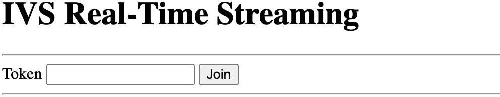

# Publish & Subscribe with the IVS

Web Broadcast SDK

This section takes you through the steps involved in publishing and subscribing to
a stage using your web app.

## Create HTML

Boilerplate

First let's create the HTML boilerplate and import the library as a script
tag:

```
<!DOCTYPE html>
<html lang="en">

<head>
  <meta charset="UTF-8" />
  <meta http-equiv="X-UA-Compatible" content="IE=edge" />
  <meta name="viewport" content="width=device-width, initial-scale=1.0" />

  <!-- Import the SDK -->
  <script src="https://web-broadcast.live-video.net/1.32.0/amazon-ivs-web-broadcast.js"></script>
</head>

<body>

<!-- TODO - fill in with next sections -->
<script src="./app.js"></script>

</body>
</html>
```

## Accept Token Input and Add

Join/Leave Buttons

Here we fill in the body with our input controls. These take as input the
token, and they set up **Join** and **Leave** buttons. Typically applications will request
the token from your application's API, but for this example you'll copy and
paste the token into the token input.

```
<h1>IVS Real-Time Streaming</h1>
<hr />

<label for="token">Token</label>
<input type="text" id="token" name="token" />
<button class="button" id="join-button">Join</button>
<button class="button" id="leave-button" style="display: none;">Leave</button>
<hr />
```

## Add Media Container

Elements

These elements will hold the media for our local and remote participants. We
add a script tag to load our application's logic defined in
`app.js`.

```
<!-- Local Participant -->
<div id="local-media"></div>

<!-- Remote Participants -->
<div id="remote-media"></div>

<!-- Load Script -->
<script src="./app.js"></script>

```

This completes the HTML page and you should see this when loading
`index.html` in a browser:



## Create app.js

Let's move to defining the contents of our `app.js` file. Begin by
importing all the requisite properties from the SDK's global:

```
const {
  Stage,
  LocalStageStream,
  SubscribeType,
  StageEvents,
  ConnectionState,
  StreamType
} = IVSBroadcastClient;
```

## Create Application

Variables

Establish variables to hold references to our **Join** and **Leave** button HTML
elements and store state for the application:

```
let joinButton = document.getElementById("join-button");
let leaveButton = document.getElementById("leave-button");

// Stage management
let stage;
let joining = false;
let connected = false;
let localCamera;
let localMic;
let cameraStageStream;
let micStageStream;
```

## Create joinStage 1:

Define the Function and Validate Input

The `joinStage` function takes the input token, creates a
connection to the stage, and begins to publish video and audio retrieved from
`getUserMedia`.

To start, we define the function and validate the state and token input. We'll
flesh out this function in the next few sections.

```
const joinStage = async () => {
  if (connected || joining) {
    return;
  }
  joining = true;

  const token = document.getElementById("token").value;

  if (!token) {
    window.alert("Please enter a participant token");
    joining = false;
    return;
  }

  // Fill in with the next sections
};
```

## Create joinStage 2: Get

Media to Publish

Here is the media that will be published to the stage:

```
async function getCamera() {
  // Use Max Width and Height
  return navigator.mediaDevices.getUserMedia({
    video: true,
    audio: false
  });
}

async function getMic() {
  return navigator.mediaDevices.getUserMedia({
    video: false,
    audio: true
  });
}

// Retrieve the User Media currently set on the page
localCamera = await getCamera();
localMic = await getMic();

// Create StageStreams for Audio and Video
cameraStageStream = new LocalStageStream(localCamera.getVideoTracks()[0]);
micStageStream = new LocalStageStream(localMic.getAudioTracks()[0]);
```

## Create joinStage 3:

Define the Stage Strategy and Create the Stage

This stage strategy is the heart of the decision logic that the SDK uses to
decide what to publish and which participants to subscribe to. For more
information on the function's purpose, see [Strategy](web-publish-subscribe.md#web-publish-subscribe-concepts-strategy "web-publish-subscribe.md#web-publish-subscribe-concepts-strategy").

This strategy is simple. After joining the stage, publish the streams we just
retrieved and subscribe to every remote participant's audio and video:

```
const strategy = {
  stageStreamsToPublish() {
    return [cameraStageStream, micStageStream];
  },
  shouldPublishParticipant() {
    return true;
  },
  shouldSubscribeToParticipant() {
    return SubscribeType.AUDIO_VIDEO;
  }
};

stage = new Stage(token, strategy);
```

## Create joinStage 4:

Handle Stage Events and Render Media

Stages emit many events. We'll need to listen to the
`STAGE_PARTICIPANT_STREAMS_ADDED` and
`STAGE_PARTICIPANT_LEFT` to render and remove media to and from
the page. A more exhaustive set of events are listed in [Events](web-publish-subscribe.md#web-publish-subscribe-concepts-events "web-publish-subscribe.md#web-publish-subscribe-concepts-events").

Note that we create four helper functions here to assist us in managing
necessary DOM elements: `setupParticipant`,
`teardownParticipant`, `createVideoEl`, and
`createContainer`.

```
stage.on(StageEvents.STAGE_CONNECTION_STATE_CHANGED, (state) => {
  connected = state === ConnectionState.CONNECTED;

  if (connected) {
    joining = false;
    joinButton.style = "display: none";
    leaveButton.style = "display: inline-block";
  }
});

stage.on(
  StageEvents.STAGE_PARTICIPANT_STREAMS_ADDED,
  (participant, streams) => {
    console.log("Participant Media Added: ", participant, streams);

    let streamsToDisplay = streams;

    if (participant.isLocal) {
      // Ensure to exclude local audio streams, otherwise echo will occur
      streamsToDisplay = streams.filter(
        (stream) => stream.streamType === StreamType.VIDEO
      );
    }

    const videoEl = setupParticipant(participant);
    streamsToDisplay.forEach((stream) =>
      videoEl.srcObject.addTrack(stream.mediaStreamTrack)
    );
  }
);

stage.on(StageEvents.STAGE_PARTICIPANT_LEFT, (participant) => {
  console.log("Participant Left: ", participant);
  teardownParticipant(participant);
});


// Helper functions for managing DOM

function setupParticipant({ isLocal, id }) {
  const groupId = isLocal ? "local-media" : "remote-media";
  const groupContainer = document.getElementById(groupId);

  const participantContainerId = isLocal ? "local" : id;
  const participantContainer = createContainer(participantContainerId);
  const videoEl = createVideoEl(participantContainerId);

  participantContainer.appendChild(videoEl);
  groupContainer.appendChild(participantContainer);

  return videoEl;
}

function teardownParticipant({ isLocal, id }) {
  const groupId = isLocal ? "local-media" : "remote-media";
  const groupContainer = document.getElementById(groupId);
  const participantContainerId = isLocal ? "local" : id;

  const participantDiv = document.getElementById(
    participantContainerId + "-container"
  );
  if (!participantDiv) {
    return;
  }
  groupContainer.removeChild(participantDiv);
}

function createVideoEl(id) {
  const videoEl = document.createElement("video");
  videoEl.id = id;
  videoEl.autoplay = true;
  videoEl.playsInline = true;
  videoEl.srcObject = new MediaStream();
  return videoEl;
}

function createContainer(id) {
  const participantContainer = document.createElement("div");
  participantContainer.classList = "participant-container";
  participantContainer.id = id + "-container";

  return participantContainer;
}
```

## Create joinStage 5:

Join the Stage

Let's complete our `joinStage` function by finally joining the
stage!

```
try {
  await stage.join();
} catch (err) {
  joining = false;
  connected = false;
  console.error(err.message);
}

```

## Create

leaveStage

Define the `leaveStage` function which the leave button will
invoke.

```
const leaveStage = async () => {
  stage.leave();

  joining = false;
  connected = false;
};
```

## Initialize Input-Event

Handlers

We'll add one last function to our `app.js` file. This function is
invoked immediately when the page loads and establishes event handlers for
joining and leaving the stage.

```
const init = async () => {
  try {
    // Prevents issues on Safari/FF so devices are not blank
    await navigator.mediaDevices.getUserMedia({ video: true, audio: true });
  } catch (e) {
    alert(
      "Problem retrieving media! Enable camera and microphone permissions."
    );
  }

  joinButton.addEventListener("click", () => {
    joinStage();
  });

  leaveButton.addEventListener("click", () => {
    leaveStage();
    joinButton.style = "display: inline-block";
    leaveButton.style = "display: none";
  });
};

init(); // call the function
```

## Run the Application and

Provide a Token

At this point you can share the web page locally or with others, [open the page](#getting-started-pub-sub-web-media "#getting-started-pub-sub-web-media"), and put in
a participant token and join the stage.

## What’s Next?

For more detailed examples involving npm, React, and more, see the [IVS Broadcast SDK: Web Guide (Real-Time Streaming
Guide)](broadcast-web.md "broadcast-web.md").
