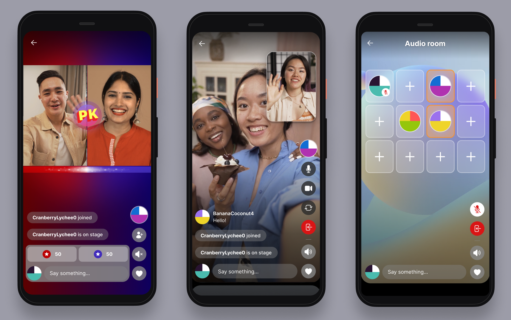

# IVS Resources and Support | Real-Time

Streaming

This document lists resources to help support your use of Amazon IVS real-time
streaming.

## Demos and Other Resources

[https://ivs.rocks/](https://ivs.rocks/ "https://ivs.rocks/") is a dedicated site to
browse published content (demos, code samples, blog posts), estimate cost, and
experience IVS through live demos. For demos and code samples, see [https://ivs.rocks/examples](https://ivs.rocks/examples "https://ivs.rocks/examples").

The [Amazon IVS page on the DEV Community
site](https://dev.to/t/amazonivs "https://dev.to/t/amazonivs") has a wealth of demos and blog posts. For example, [Getting Started with Amazon
Interactive Video Service](https://dev.to/recursivecodes/series/19342 "https://dev.to/recursivecodes/series/19342") is a series of articles about using IVS, for
beginners. The articles give step-by-step walkthroughs of IVS APIs with interactive
demos embedded in the posts. All the demos can be run directly in the posts themselves
via an embedded CodePen.

The [AWS Blogs](https://aws.amazon.com/blogs "https://aws.amazon.com/blogs") site has many IVS blog
postings on a variety of topics. Filter for IVS by selecting **Product or solution** > **Media Services** >
**Amazon Interactive Video Service** on the right side
of the page.

On GitHub, the IVS real-time streaming demo for iOS and Android shows developers how
to use IVS to build a compelling real-time, social-user-generated content
application:

This application features a scrollable feed of user-generated real-time streams. Users
can create video streams and audio-only rooms. Video-stream guests can join in guest
spot or versus (VS) mode. Instructions on how to deploy the required backend and build
the application are available in the following GitHub repositories:

- iOS: [https://github.com/aws-samples/amazon-ivs-real-time-for-ios-demo/](https://github.com/aws-samples/amazon-ivs-real-time-for-ios-demo/ "https://github.com/aws-samples/amazon-ivs-real-time-for-ios-demo/")
- Android: [https://github.com/aws-samples/amazon-ivs-real-time-for-android-demo/](https://github.com/aws-samples/amazon-ivs-real-time-for-android-demo/ "https://github.com/aws-samples/amazon-ivs-real-time-for-android-demo/")
- Backend: [https://github.com/aws-samples/amazon-ivs-real-time-serverless-demo/](https://github.com/aws-samples/amazon-ivs-real-time-serverless-demo/ "https://github.com/aws-samples/amazon-ivs-real-time-serverless-demo/")

## Support

The [AWS Support Center](https://console.aws.amazon.com/support/home "https://console.aws.amazon.com/support/home") offers a range of plans
that provide access to tools and expertise to support your AWS solutions. All support
plans provide 24/7 access to customer service. For technical support and more resources
to plan, deploy, and improve your AWS environment, choose a support plan that best
aligns with your AWS use case.

[AWS
Premium Support](https://aws.amazon.com/premiumsupport/ "https://aws.amazon.com/premiumsupport/") is a one-on-one, fast-response support
channel to help you build and run applications on AWS.

[AWS re:Post](https://repost.aws/tags/TAAkUVScqiTFmkt-h6LdmJHw/amazon-interactive-video-service "https://repost.aws/tags/TAAkUVScqiTFmkt-h6LdmJHw/amazon-interactive-video-service") is a community-based
Q&A site for developers to discuss technical questions related to Amazon IVS.

[Contact
AWS](https://aws.amazon.com/contact-us/ "https://aws.amazon.com/contact-us/") has links for nontechnical inquiries about your billing
or account. For technical questions, use the discussion forums or support links above.
