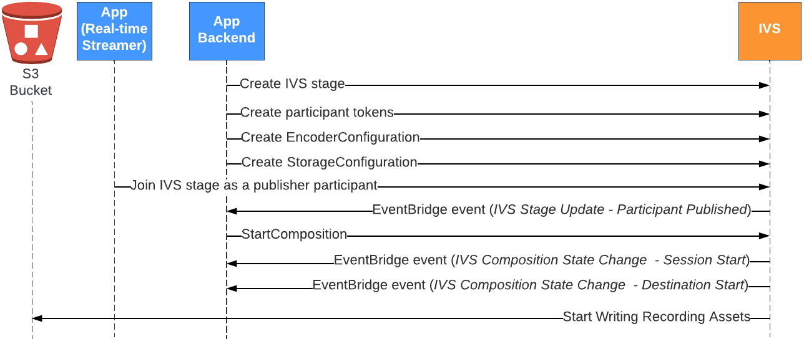

# IVS Composite Recording | Real-Time Streaming

This document explains how to use the composite-recording feature within
[server-side composition](server-side-composition.md "server-side-composition.md"). Composite recording allows you to generate
HLS recordings of an IVS stage by effectively combining all stage publishers into one view using an IVS server, and then saving the resulting
video to an S3 bucket.

Standard S3 storage and request costs apply. Thumbnails incur no additional IVS charges. For details, see [Amazon IVS Pricing](https://aws.amazon.com/ivs/pricing/ "https://aws.amazon.com/ivs/pricing/").

## Prerequisites

To use composite recording, you must have a stage with active publishers and an S3 bucket to
use as the recording destination. Below, we describe one possible workflow that uses
EventBridge events to record a composition to an S3 bucket. Alternatively, you can
start and stop compositions based on your own app logic.

1. Create [an IVS stage](getting-started-create-stage.md "getting-started-create-stage.md") and participant tokens for each publisher.
2. Create an [EncoderConfiguration](../RealTimeAPIReference/API_CreateEncoderConfiguration.md "../RealTimeAPIReference/API_CreateEncoderConfiguration.md")
   (an object representing how the recorded video should be rendered).
3. Create an [S3 bucket](../../../AmazonS3/latest/userguide/creating-bucket.md "../../../AmazonS3/latest/userguide/creating-bucket.md")
   and a [StorageConfiguration](../RealTimeAPIReference/API_CreateStorageConfiguration.md "../RealTimeAPIReference/API_CreateStorageConfiguration.md")
   (where the recording contents will be stored).

**Important**: If you use an existing S3 bucket, the **Object Ownership** setting must be **Bucket owner enforced** or **Bucket owner preferred**. For details, see the S3 documentation on [controlling ownership of objects](../../../AmazonS3/latest/userguide/about-object-ownership.md "../../../AmazonS3/latest/userguide/about-object-ownership.md"). 4. [Join the stage and publish to it](getting-started-pub-sub.md "getting-started-pub-sub.md"). 5. When you receive a Participant Published [EventBridge event](eventbridge.md "eventbridge.md"),
call [StartComposition](../RealTimeAPIReference/API_StartComposition.md "../RealTimeAPIReference/API_StartComposition.md")
with an S3 DestinationConfiguration object as the destination 6. After a few seconds, you should be able to see the HLS segments being persisted to
your S3 buckets.



**Note:** A composition performs auto-shutdown after 60 seconds of
inactivity from publisher participants on the stage.
At that point, the composition is terminated and transitions to a
`STOPPED` state. A composition is automatically deleted after a few minutes in the `STOPPED` state.
For details, see [Composition Lifecycle](ssc-overview.md#ssc-composition-endpoint "ssc-overview.md#ssc-composition-endpoint") in _Server-Side Composition_.

## Composite Recording Example: StartComposition with an S3 Bucket Destination

The example below shows a typical call to the [StartComposition](../RealTimeAPIReference/API_StartComposition.md "../RealTimeAPIReference/API_StartComposition.md")
operation, specifying S3 as the only destination for the composition. Once the composition transitions to an `ACTIVE` state,
video segments and metadata will start to be written to the S3 bucket specified by the `storageConfiguration` object. To
create compositions with different layouts, see “Layouts” in [Server-Side Composition](ssc-overview.md#ssc-api-layouts "ssc-overview.md#ssc-api-layouts")
and the [IVS Real-Time Streaming API Reference](../RealTimeAPIReference/API_LayoutConfiguration.md "../RealTimeAPIReference/API_LayoutConfiguration.md").

### Request

```
POST /StartComposition HTTP/1.1
Content-type: application/json

{
   "destinations": [
      {
         "s3": {
            "encoderConfigurationArns": [
              "arn:aws:ivs:ap-northeast-1:927810967299:encoder-configuration/PAAwglkRtjge"
            ],
            "storageConfigurationArn": "arn:aws:ivs:ap-northeast-1:927810967299:storage-configuration/ZBcEbgbE24Cq",
	    "thumbnailConfigurations": [
	       {
		  "storage": ["LATEST", "SEQUENTIAL"],
		  "targetIntervalSeconds": 30
               }
	    ]
	 }
      }
   ],
   "idempotencyToken": "db1i782f1g9",
   "stageArn": "arn:aws:ivs:ap-northeast-1:927810967299:stage/WyGkzNFGwiwr"
}
```

### Response

```
{
    "composition": {
        "arn": "arn:aws:ivs:ap-northeast-1:927810967299:composition/s2AdaGUbvQgp",
        "destinations": [
            {
                "configuration": {
                    "name": "",
                    "s3": {
                        "encoderConfigurationArns": [
                            "arn:aws:ivs:ap-northeast-1:927810967299:encoder-configuration/PAAwglkRtjge"
                        ],
                        "recordingConfiguration": {
                            "format": "HLS"
                        },
                        "storageConfigurationArn": "arn:aws:ivs:ap-northeast-1:927810967299:storage-configuration/ZBcEbgbE24Cq",
	                "thumbnailConfigurations": [
	                   {
		              "storage": ["LATEST", "SEQUENTIAL"],
		              "targetIntervalSeconds": 30
                           }
	                ]
                    }
                },
                "detail": {
                    "s3": {
                        "recordingPrefix": "MNALAcH9j2EJ/s2AdaGUbvQgp/2pBRKrNgX1ff/composite"
                    }
                },
                "id": "2pBRKrNgX1ff",
                "state": "STARTING"
            }
        ],
        "layout": null,
        "stageArn": "arn:aws:ivs:ap-northeast-1:927810967299:stage/WyGkzNFGwiwr",
        "startTime": "2023-11-01T06:25:37Z",
        "state": "STARTING",
        "tags": {}
    }
}
```

The `recordingPrefix` field, present in the StartComposition response
can be used to determine where the recording contents will be stored.

## Recording Contents

When the composition transitions to an `ACTIVE` state,
HLS video segments, metadata files, and thumbnails (if configured) will start being written to the
S3 bucket specified during the StartComposition call. This content is available for post-processing
or playback as on-demand video.

Note that after a composition becomes live, an “IVS Composition State Change” event is emitted, and it may
take a little time before the manifest files, video segments, and thumbnails are written. We recommend that you play back or process
recorded streams only after the “IVS Composition State Change (Session End)” event is received. For details,
see [Using EventBridge with IVS Real-Time Streaming](eventbridge.md "eventbridge.md") .

The following is a sample directory structure and contents of a recording of a live IVS session:

```
MNALAcH9j2EJ/s2AdaGUbvQgp/2pBRKrNgX1ff/composite
   events
      recording-started.json
      recording-ended.json
   media
      hls
      thumbnails
      latest_thumbnail
```

The `events` folder contains the metadata files corresponding to the recording event. JSON metadata
files are generated when recording starts, ends successfully, or ends with failures:

- `events/recording-started.json`
- `events/recording-ended.json`
- `events/recording-failed.json`

A given `events` folder will contain `recording-started.json` and either
`recording-ended.json` or `recording-failed.json`.

These contain metadata related to the recorded session and its output formats. JSON details are given below.

The `media` folder contains the supported media contents. The `hls` subfolder contains all media and the manifest
files generated during the composition session and is playable with the IVS player. The HLS manifest is located in
the `multivariant.m3u8` folder. If configured, the `thumbnails` and `latest_thumbnail` subfolders contain JPEG thumbnail media files generated during the composition session.

## Bucket Policy for StorageConfiguration

When a StorageConfiguration object is created, IVS will get access to write content to the specified S3 bucket.
This access is granted by making modifications to the S3 bucket's policy. _If the policy for the bucket is
altered in a way that removes IVS's access, ongoing and new recordings will fail._

The example below shows an S3 bucket policy that allows IVS to write to the S3 bucket:

JSON

```
`{
 "Version":"2012-10-17",
 "Statement": [
 {
 "Sid": "CompositeWrite-y1d212y",
 "Effect": "Allow",
 "Principal": {
 "Service": "ivs-composite.ap-northeast-1.amazonaws.com"
 },
 "Action": [
 "s3:PutObject",
 "s3:PutObjectAcl"
 ],
 "Resource": "arn:aws:s3:::my-s3-bucket/*",
 "Condition": {
 "StringEquals": {
 "s3:x-amz-acl": "bucket-owner-full-control"
 },
 "Bool": {
 "aws:SecureTransport": "true"
 }
 }
 }
 ]
}`

```

## JSON Metadata Files

This metadata is in JSON format. It comprises the following information:

| Field                      | Type    | Required    | Description                                                                                                                                                                                                                                                                                                                                                                                                                      |
| -------------------------- | ------- | ----------- | -------------------------------------------------------------------------------------------------------------------------------------------------------------------------------------------------------------------------------------------------------------------------------------------------------------------------------------------------------------------------------------------------------------------------------- |
| `stage_arn`                | string  | Yes         | ARN of the stage being used as the source of the composition.                                                                                                                                                                                                                                                                                                                                                                    |
| `media`                    | object  | Yes         | Object that contains the enumerated objects of media content<br>available for this recording. Valid values: `"hls"`.                                                                                                                                                                                                                                                                                                             |
| • `hls`                    | object  | Yes         | Enumerated field that describes the Apple HLS format<br>output.                                                                                                                                                                                                                                                                                                                                                                  |
| • + `duration_ms`          | integer | Conditional | Duration of the recorded HLS content in milliseconds. This is<br>available only when `recording_status` is<br>`"RECORDING_ENDED"` or<br>`"RECORDING_ENDED_WITH_FAILURE"`. If a failure<br>occurred before any recording was done, this is 0.                                                                                                                                                                                     |
| • + `path`                 | string  | Yes         | Relative path from the S3 prefix where HLS content is<br>stored.                                                                                                                                                                                                                                                                                                                                                                 |
| • + `playlist`             | string  | Yes         | Name of the HLS master playlist file.                                                                                                                                                                                                                                                                                                                                                                                            |
| • + `renditions`           | object  | Yes         | Array of renditions (HLS variant) of metadata objects. There<br>always is at least one rendition.                                                                                                                                                                                                                                                                                                                                |
| • + - `path`               | string  | Yes         | Relative path from the S3 prefix where HLS content is stored<br>for this rendition.                                                                                                                                                                                                                                                                                                                                              |
| • + - `playlist`           | string  | Yes         | Name of the media playlist file for this<br>rendition.                                                                                                                                                                                                                                                                                                                                                                           |
| • + - `resolution_height`  | int     | Conditional | Pixel resolution height of the encoded video. This is available<br>only when the rendition contains a video track.                                                                                                                                                                                                                                                                                                               |
| • + - `resolution_width`   | int     | Conditional | Pixel resolution width of the encoded video. This is available<br>only when the rendition contains a video track.                                                                                                                                                                                                                                                                                                                |
| • `thumbnails`             | object  | Conditional | Enumerated field that describes thumbnails output. This is available only when the thumbnail configuration’s `storage` field includes `SEQUENTIAL`                                                                                                                                                                                                                                                                               |
| • + `path`                 | string  | Yes         | Relative path from the S3 prefix where sequential thumbnail content is stored.                                                                                                                                                                                                                                                                                                                                                   |
| • + `resolutions`          | object  | Yes         | Array of resolutions (thumbnail variants) of metadata objects. There always is at least one resolution.                                                                                                                                                                                                                                                                                                                          |
| • + - `path`               | string  | Yes         | Relative path from the S3 prefix where thumbnail content is stored for this resolution.                                                                                                                                                                                                                                                                                                                                          |
| • + - `resolution_height`  | int     | Yes         | Pixel resolution height of the thumbnails.                                                                                                                                                                                                                                                                                                                                                                                       |
| • + - `resolution_width`   | int     | Yes         | Pixel resolution width of the thumbnails.                                                                                                                                                                                                                                                                                                                                                                                        |
| • `latest_thumbnail`       | object  | Conditional | Enumerated field that describes thumbnails output. This is available only when the thumbnail configuration’s `storage` field includes `LATEST`.                                                                                                                                                                                                                                                                                  |
| • + `path`                 | string  | Yes         | Relative path from the S3 prefix where `latest_thumbnail` is stored.                                                                                                                                                                                                                                                                                                                                                             |
| • + `resolutions`          | object  | Yes         | Array of resolutions (thumbnail variants) of metadata objects. There always is at least one resolution.                                                                                                                                                                                                                                                                                                                          |
| • + - `path`               | string  | Yes         | Relative path from the S3 prefix where the latest thumbnail is stored for this resolution.                                                                                                                                                                                                                                                                                                                                       |
| • + - `resolution_height`  | int     | Yes         | Pixel resolution height of the latest thumbnail.                                                                                                                                                                                                                                                                                                                                                                                 |
| • + - `resolution_width`   | int     | Yes         | Pixel resolution width of the latest thumbnail.                                                                                                                                                                                                                                                                                                                                                                                  |
| `recording_ended_at`       | string  | Conditional | RFC 3339 UTC timestamp when the recording ended. This is<br>available only when `recording_status` is<br>`"RECORDING_ENDED"` or<br>`"RECORDING_ENDED_WITH_FAILURE"`.<br>`recording_started_at` and<br>`recording_ended_at` are timestamps when these events<br>are generated and may not exactly match the HLS video-segment<br>timestamps. To accurately determine the duration of a recording, use<br>the `duration_ms` field. |
| `recording_started_at`     | string  | Conditional | RFC 3339 UTC timestamp when the recording started.<br>This is unavailable when `recording_status` is `RECORDING_START_FAILED`.<br>See the note above for `recording_ended_at`.                                                                                                                                                                                                                                                   |
| `recording_status`         | string  | Yes         | Status of the recording. Valid values:<br>`"RECORDING_STARTED"`,<br>`"RECORDING_ENDED"`, `"RECORDING_START_FAILED"`,<br>`"RECORDING_ENDED_WITH_FAILURE"`.                                                                                                                                                                                                                                                                        |
| `recording_status_message` | string  | Conditional | Descriptive information on the status. This is available only<br>when `recording_status` is `"RECORDING_ENDED"`<br>or `"RECORDING_ENDED_WITH_FAILURE"`.                                                                                                                                                                                                                                                                          |
| `version`                  | string  | Yes         | The version of the metadata schema.                                                                                                                                                                                                                                                                                                                                                                                              |

### Example: recording-started.json

```
{
  "version": "v1",
  "stage_arn": "arn:aws:ivs:ap-northeast-1:123456789012:stage/aAbBcCdDeE12",
  "recording_started_at": "2023-11-01T06:01:36Z",
  "recording_status": "RECORDING_STARTED",
  "media": {
    "hls": {
      "path": "media/hls",
      "playlist": "multivariant.m3u8",
      "renditions": [
        {
          "path": "720p30-abcdeABCDE12",
          "playlist": "playlist.m3u8",
          "resolution_width": 1280,
          "resolution_height": 720
        }
      ]
    },
    "thumbnails": {
      "path": "media/thumbnails",
      "resolutions": [
        {
          "path": "1280x720",
          "resolution_width": 1280,
          "resolution_height": 720
        }
      ]
    },
    "latest_thumbnail": {
      "path": "media/latest_thumbnail",
      "resolutions": [
        {
          "path": "1280x720",
          "resolution_width": 1280,
          "resolution_height": 720
        }
      ]
    }
  }
}
```

### Example: recording-ended.json

```
{
  "version": "v1",
  "stage_arn": "arn:aws:ivs:ap-northeast-1:123456789012:stage/aAbBcCdDeE12",
  "recording_started_at": "2023-10-27T17:00:44Z",
  "recording_ended_at": "2023-10-27T17:08:24Z",
  "recording_status": "RECORDING_ENDED",
  "media": {
    "hls": {
      "duration_ms": 460315,
      "path": "media/hls",
      "playlist": "multivariant.m3u8",
      "renditions": [
        {
          "path": "720p30-abcdeABCDE12",
          "playlist": "playlist.m3u8",
          "resolution_width": 1280,
          "resolution_height": 720
        }
      ]
    },
    "thumbnails": {
      "path": "media/thumbnails",
      "resolutions": [
        {
          "path": "1280x720",
          "resolution_width": 1280,
          "resolution_height": 720
        }
      ]
    },
    "latest_thumbnail": {
      "path": "media/latest_thumbnail",
      "resolutions": [
        {
          "path": "1280x720",
          "resolution_width": 1280,
          "resolution_height": 720
        }
      ]
    }
  }
}
```

### Example: recording-failed.json

```
{
  "version": "v1",
  "stage_arn": "arn:aws:ivs:ap-northeast-1:123456789012:stage/aAbBcCdDeE12",
  "recording_started_at": "2023-10-27T17:00:44Z",
  "recording_ended_at": "2023-10-27T17:08:24Z",
  "recording_status": "RECORDING_ENDED_WITH_FAILURE",
  "media": {
    "hls": {
      "duration_ms": 460315,
      "path": "media/hls",
      "playlist": "multivariant.m3u8",
      "renditions": [
        {
          "path": "720p30-abcdeABCDE12",
          "playlist": "playlist.m3u8",
          "resolution_width": 1280,
          "resolution_height": 720
        }
      ]
    },
    "thumbnails": {
      "path": "media/thumbnails",
      "resolutions": [
        {
          "path": "1280x720",
          "resolution_width": 1280,
          "resolution_height": 720
        }
      ]
    },
    "latest_thumbnail": {
      "path": "media/latest_thumbnail",
      "resolutions": [
        {
          "path": "1280x720",
          "resolution_width": 1280,
          "resolution_height": 720
        }
      ]
    }
  }
}
```

## Playback of Recorded Content from Private Buckets

By default, the recorded content is private; hence, these objects are inaccessible for playback
using the direct S3 URL. If you try to open the HLS multivariate playlist (m3u8 file) for playback using
the IVS player or another player, you will get an error (e.g., “You do not have permission to access
the requested resource”). Instead, you can play back these files with the Amazon CloudFront CDN (Content Delivery Network).

CloudFront distributions can be configured to serve content from private buckets. Typically this
is preferable to having openly accessible buckets where reads bypass the controls offered by CloudFront.
You can set up your distribution to be served from a private bucket by creating an origin access control (OAC),
which is a special CloudFront user that has read permissions on the private origin bucket. You can create the
OAC after you create your distribution, through the CloudFront console or API.
See [Creating a new
origin access control](../../../AmazonCloudFront/latest/DeveloperGuide/private-content-restricting-access-to-s3.md#create-oac-overview-s3 "../../../AmazonCloudFront/latest/DeveloperGuide/private-content-restricting-access-to-s3.md#create-oac-overview-s3") in the _Amazon CloudFront Developer Guide_.

### Setting Up Playback using CloudFront with CORS Enabled

This example covers how a developer can set up a CloudFront distribution with CORS enabled, enabling playback of
their recordings from any domain. This is especially useful during the development phase, but you can modify the example
below to match your production needs.

#### Step 1: Create an S3 Bucket

Create an S3 bucket that will be used to store the recordings. Note that the bucket needs to be in
the same region that you use for your IVS workflow.

Add a permissive CORS policy to the bucket:

1. In the AWS console, go to the **S3 Bucket Permissions** tab.
2. Copy the CORS policy below and paste it under **Cross-origin resource sharing (CORS)**.
   This will enable CORS access on the S3 bucket.

```
[
    {
        "AllowedHeaders": [
            "*"
        ],
        "AllowedMethods": [
            "PUT",
            "POST",
            "DELETE",
            "GET"
        ],
        "AllowedOrigins": [
            "*"
        ],
        "ExposeHeaders": [
            "x-amz-server-side-encryption",
            "x-amz-request-id",
            "x-amz-id-2"
        ]
    }
]
```

#### Step 2: Create a CloudFront Distribution

See [Creating a CloudFront distribution](../../../AmazonCloudFront/latest/DeveloperGuide/distribution-web-creating-console.md "../../../AmazonCloudFront/latest/DeveloperGuide/distribution-web-creating-console.md") in the _CloudFront Developer Guide_.

Using the AWS console, enter the following information:

| For this field …                                      | Choose this …                                                          |
| ----------------------------------------------------- | ---------------------------------------------------------------------- |
| Origin Domain                                         | The S3 bucket created in the previous step                             |
| Origin Access                                         | Origin access control settings (recommended), using default parameters |
| Default cache behavior: Viewer Protocol Policy        | Redirect HTTP to HTTPS                                                 |
| Default cache behavior: Allowed HTTP methods          | GET, HEAD and OPTIONS                                                  |
| Default cache behavior: Cache key and origin requests | CachingDisabled policy                                                 |
| Default cache behavior: Origin request policy         | CORS-S3Origin                                                          |
| Default cache behavior: Response headers policy       | SimpleCORS                                                             |
| Web Application Firewall                              | Enable security protections                                            |

Then save the CloudFront distribution.

#### Step 3: Set Up the S3 Bucket Policy

1. Delete any StorageConfiguration that you have set up for the S3 bucket. This will remove any bucket policies
   that were automatically added when creating the policy for that bucket.
2. Go to your CloudFront Distribution, make sure all distribution fields are in the states defined in the previous step,
   and **Copy the Bucket Policy** (use the **Copy policy** button).
3. Go to your S3 bucket. On the **Permissions** tab, select
   **Edit Bucket Policy** and paste the bucket policy that you copied
   in the previous step. After this step, the bucket policy should have the CloudFront policy exclusively.
4. Create a StorageConfiguration, specifying the S3 bucket.

After the StorageConfiguration is created, you will see two items in the S3 bucket policy, one allowing
CloudFront to read contents and another one allowing IVS to write contents. An example of a final bucket policy,
with CloudFront and IVS access, is shown in
[Example: S3 Bucket Policy with CloudFront and IVS Access](#comp-rec-playback-example "#comp-rec-playback-example").

#### Step 4: Play Back Recordings

After you successfully set up the CloudFront distribution and update the bucket policy, you should be able to
play back recordings using the IVS player:

1. Successfully start a Composition and make sure you have a recording stored on the S3 bucket.
2. After following the Step 1 through Step 3 in this example, the video files should be available for
   consumption through the CloudFront URL. Your CloudFront URL is the **Distribution domain name**
   on the **Details**
   tab in the Amazon CloudFront console. It should be something like this:

`a1b23cdef4ghij.cloudfront.net` 3. To play the recorded video through the CloudFront distribution, find the object key for your
`multivariant.m3u8` file under the s3 bucket. It should be something like this:

`FDew6Szq5iTt/9NIpWJHj0wPT/fjFKbylPb3k4/composite/media/hls/multivariant.m3u8` 4. Append the object key to the end of your CloudFront URL. Your final URL will be something like this:

`https://a1b23cdef4ghij.cloudfront.net/FDew6Szq5iTt/9NIpWJHj0wPT/fjFKbylPb3k4/composite/media/hls/multivariant.m3u8` 5. You can now add the final URL to the source attribute of an IVS player to watch the full recording.
To watch the recorded video, you can use the demo in [Getting Started](../LowLatencyUserGuide/web-getting-started.md "../LowLatencyUserGuide/web-getting-started.md") in the _IVS Player SDK: Web Guide_.

### Example: S3 Bucket Policy with CloudFront and IVS Access

The snippet below illustrates an S3 bucket policy that allows CloudFront to read content to the private bucket and IVS to write content to the bucket.
**Note: Do not copy and paste the snippet below to your own bucket. Your policy should contain the IDs that are relevant to your
CloudFront distribution and StorageConfiguration.**

JSON

```
`{
 "Version":"2012-10-17",
 "Statement": [
 {
 "Sid": "CompositeWrite-7eiKaIGkC9DO",
 "Effect": "Allow",
 "Principal": {
 "Service": "ivs-composite.ap-northeast-1.amazonaws.com"
 },
 "Action": [
 "s3:PutObject",
 "s3:PutObjectAcl"
 ],
 "Resource": "arn:aws:s3:::eicheane-test-1026-2-ivs-recordings/*",
 "Condition": {
 "StringEquals": {
 "s3:x-amz-acl": "bucket-owner-full-control"
 },
 "Bool": {
 "aws:SecureTransport": "true"
 }
 }
 },
 {
 "Sid": "AllowCloudFrontServicePrincipal",
 "Effect": "Allow",
 "Principal": {
 "Service": "cloudfront.amazonaws.com"
 },
 "Action": "s3:GetObject",
 "Resource": "arn:aws:s3:::eicheane-test-1026-2-ivs-recordings/*",
 "Condition": {
 "StringEquals": {
 "AWS:SourceArn": "arn:aws:cloudfront::844311324168:distribution/E1NG4YMW5MN25A"
 }
 }
 }
 ]
}`

```

## Troubleshooting

- **The composition is not written to the S3 bucket —** Ensure that the S3 bucket and
  StorageConfiguration objects are created and in the same region. Also ensure that IVS has access to the bucket by
  checking your bucket policy; see [Bucket Policy for StorageConfiguration](#comp-rec-bucket-policy "#comp-rec-bucket-policy").
- **I can’t find a composition when performing _ListCompositions_ —**
  Compositions are ephemeral resources. Once they transition to a final state, they are deleted automatically after a few minutes.
- **My composition stops automatically —** A composition will stop automatically
  if there is no publisher on the stage for more than 60 seconds.

## Known Issue

The media playlist written by composite recording has the tag `#EXT-X-PLAYLIST-TYPE:EVENT`
while the composition is ongoing. When composition is done, the tag is updated to `#EXT-X-PLAYLIST-TYPE:VOD`.
For a smooth playback experience, we recommend that you use this playlist only after the composition finalizes successfully.
