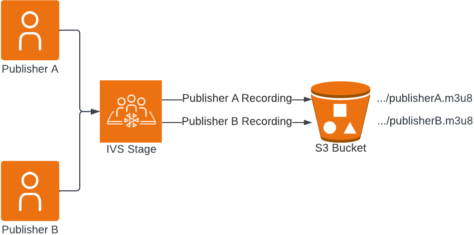
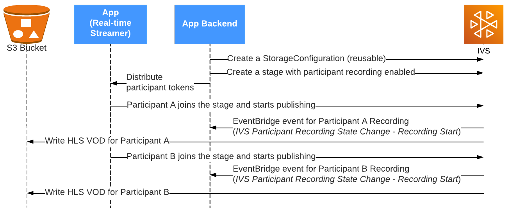

# IVS Individual Participant Recording |

Real-Time Streaming

This document explains how to use individual participant recording with IVS real-time
streaming.

Standard S3 storage and request costs apply. Thumbnails incur no additional IVS charges.
For details, see [Amazon IVS
Pricing](https://aws.amazon.com/ivs/pricing/ "https://aws.amazon.com/ivs/pricing/").

## Introduction

Individual participant recording allows IVS real-time streaming customers to record
IVS stage publishers individually into S3 buckets. When individual participant recording
is enabled for a stage, publisher content is recorded once they start publishing to the
stage.

**Note:** If you need to have all stage participants
mixed in a single video, the composite recording feature is a better fit. See [Recording](rt-recording.md "rt-recording.md") for a summary of recording IVS
real-time-streaming content.



## Workflow



### 1. Create an S3 Bucket

You will need an S3 bucket to write VODs. For details, see the S3 documentation on
[how to create buckets](../../../AmazonS3/latest/userguide/creating-bucket.md "../../../AmazonS3/latest/userguide/creating-bucket.md"). Note that for individual participant recording,
the S3 buckets must be created in the same AWS region as the IVS stage.

**Important**: If you use an existing S3
bucket:

- The **Object Ownership** setting must be
  **Bucket owner enforced** or **Bucket owner preferred**.
- The **Default Encryption** setting must be
  **Server-side encryption with Amazon S3 managed keys
  (SSE-S3)**.

For details, see the S3 documentation on [controlling ownership of objects](../../../AmazonS3/latest/userguide/about-object-ownership.md "../../../AmazonS3/latest/userguide/about-object-ownership.md") and [protecting data with encryption](../../../AmazonS3/latest/userguide/UsingEncryption.md "../../../AmazonS3/latest/userguide/UsingEncryption.md").

### 2. Create a

StorageConfiguration Object

After creating a bucket, call the IVS real-time streaming API to [create a StorageConfiguration](../RealTimeAPIReference/API_CreateStorageConfiguration.md "../RealTimeAPIReference/API_CreateStorageConfiguration.md") object. Once the storage configuration is
successfully created, IVS will have permission to write to the provided S3 bucket.
You can re-use this StorageConfiguration object on multiple stages.

### 3. Create a Stage with

Participant Tokens

Now you need to [create an IVS
stage](../RealTimeAPIReference/API_CreateStage.md "../RealTimeAPIReference/API_CreateStage.md") with individual participant recording enabled (by setting the
AutoParticipantRecordingConfiguration object), as well as participant tokens for
each publisher.

The request below creates a stage with two participant tokens and individual
participant recording enabled.

```

POST /CreateStage HTTP/1.1
Content-type: application/json

{
   "autoParticipantRecordingConfiguration": {
      "mediaTypes": ["AUDIO_VIDEO"],
      "storageConfigurationArn": "arn:aws:ivs:us-west-2:123456789012:storage-configuration/AbCdef1G2hij",
      "thumbnailConfiguration": {
         "recordingMode": "INTERVAL",
         "storage": ["LATEST", "SEQUENTIAL"],
         "targetIntervalSeconds": 60
      }
   },
   "name": "TestStage",
   "participantTokenConfigurations": [
      {
         "capabilities": ["PUBLISH", "SUBSCRIBE"],
         "duration": 20160,
         "userId": "1"
      },
      {
         "capabilities": ["PUBLISH", "SUBSCRIBE"],
         "duration": 20160,
         "userId": "2"
      }
   ]
}
```

### 4. Join the Stage as an

Active Publisher

Distribute the participant tokens to your publishers, and have them join the stage
and start [publishing to
it](getting-started-pub-sub.md "getting-started-pub-sub.md").

When they join the stage and start publishing to it using one of [IVS
real-time streaming broadcast SDKs](broadcast.md "broadcast.md"), the participant-recording process
starts automatically and sends you an [EventBridge
event](eventbridge.md "eventbridge.md") indicating that the recording started. (The event is IVS
Participant Recording State Change - Recording Start.) Concurrently, the
participant-recording process starts writing the VOD and metadata files to the
configured S3 bucket. Note: Participants connected for extremely short durations
(less than 5s) are not guaranteed to be recorded.

There are two ways to get the S3 prefix for each recording:

- Listen to the EventBridge event:

```
{
   "version": "0",
   "id": "12345678-1a23-4567-a1bc-1a2b34567890",
   "detail-type": "IVS Participant Recording State Change",
   "source": "aws.ivs",
   "account": "123456789012",
   "time": "2024-03-13T22:19:04Z",
   "region": "us-east-1",
   "resources": ["arn:aws:ivs:us-west-2:123456789012:stage/AbCdef1G2hij"],
   "detail": {
      "session_id": "st-ZyXwvu1T2s",
      "event_name": "Recording Start",
      "participant_id": "xYz1c2d3e4f",
      "recording_s3_bucket_name": "ivs-recordings",
      "recording_s3_key_prefix": "<stage_id>/<session_id>/<participant_id>/2024-01-01T12-00-55Z"
   }
}
```

- Use the [GetParticipant](../RealTimeAPIReference/API_GetParticipant.md "../RealTimeAPIReference/API_GetParticipant.md") API operation — The response includes the S3
  bucket and prefix to where a participant is being recorded. Here is the
  request:

```
POST /GetParticipant HTTP/1.1
Content-type: application/json
{
   "participantID": "xYz1c2d3e4f",
   "sessionId": "st-ZyXwvu1T2s",
   "stageArn": "arn:aws:ivs:us-west-2:123456789012:stage/AbCdef1G2hij"
}
```

And here is the response:

```
Content-type: application/json
{
   "participant": {
      ...
      "recordingS3BucketName": "ivs-recordings",
      "recordingS3Prefix": "<stage_id>/<session_id>/<participant_id>",
      "recordingState": "ACTIVE",
      ...
   }
}
```

### 5. Play Back the VOD

After the recording is finalized, you can watch it using the [IVS player](https://debug.ivsdemos.com/?p=ivs "https://debug.ivsdemos.com/?p=ivs"). See [Playback of Recorded Content from Private Buckets](rt-composite-recording.md#comp-rec-playback "rt-composite-recording.md#comp-rec-playback") for instructions on
setting up CloudFront distributions for VOD playback.

## Audio-Only Recording

When setting up individual participant recording, you can choose to have only audio
HLS segments written to your S3 bucket. To use this feature, choose the `AUDIO_ONLY
 mediaType` when creating the stage:

```
POST /CreateStage HTTP/1.1
Content-type: application/json

{
   "autoParticipantRecordingConfiguration": {
      "storageConfigurationArn": "arn:aws:ivs:us-west-2:123456789012:storage-configuration/AbCdef1G2hij",
      "mediaTypes": ["AUDIO_ONLY"],
      "thumbnailConfiguration": {
         "recordingMode": "DISABLED"
      }
   },
   "name": "TestStage",
   "participantTokenConfigurations": [
      {
         "capabilities": ["PUBLISH", "SUBSCRIBE"],
         "duration": 20160,
         "userId": "1"
      },
      {
         "capabilities": ["PUBLISH", "SUBSCRIBE"],
         "duration": 20160,
         "userId": "2"
      }
   ]
}
```

## Thumbnail-Only Recording

When setting up individual participant recording, you can choose to have only
thumbnails written to your S3 bucket. To use this feature, set `mediaType` to
`NONE` when creating the stage. This ensures that no HLS segments are
generated; thumbnails are still created and written to your S3 bucket.

```
POST /CreateStage HTTP/1.1
Content-type: application/json
{
   "autoParticipantRecordingConfiguration": {
      "storageConfigurationArn": "arn:aws:ivs:us-west-2:123456789012:storage-configuration/AbCdef1G2hij",
      "mediaTypes": ["NONE"],
      "thumbnailConfiguration": {
         "recordingMode": "INTERVAL",
         "storage": ["LATEST", "SEQUENTIAL"],
         "targetIntervalSeconds": 60
      }
   },
   "name": "TestStage",
   "participantTokenConfigurations": [
      {
         "capabilities": ["PUBLISH", "SUBSCRIBE"],
         "duration": 20160,
         "userId": "1"
      },
      {
         "capabilities": ["PUBLISH", "SUBSCRIBE"],
         "duration": 20160,
         "userId": "2"
      }
   ]
}
```

## Recording Contents

When individual participant recording is active, HLS video segments, metadata files,
and thumbnails will start being written to the S3 bucket provided when the stage was
created. This content is available for post-processing or playback as on-demand
video.

Note that after a recording is finalized, an IVS Participant Recording State Change -
Recording End event is sent through EventBridge. We recommend that you play back or
process recorded streams only after this event is received. For details, see [Using EventBridge with IVS Real-Time Streaming](eventbridge.md "eventbridge.md").

The following is a sample directory structure and contents of a recording of a live
IVS session:

```
s3://mybucket/stageId/stageSessionId/participantId/timestamp
   events
      recording-started.json
      recording-ended.json
   media
      hls
	 multivariant.m3u8
         high
            playlist.m3u8
            1.mp4
      thumbnails
         high
            1.jpg
            2.jpg
      latest_thumbnail
         high
            thumb.jpg
```

The `events` folder contains the metadata files corresponding to the
recording event. JSON metadata files are generated when recording starts, ends
successfully, or ends with failures:

- `events/recording-started.json`
- `events/recording-ended.json`
- `events/recording-failed.json`

A given `events` folder contains `recording-started.json` and
either `recording-ended.json` or `recording-failed.json`. These
contain metadata related to the recorded session and its output formats. JSON details
are given below.

The `media` folder contains the supported media contents. The
`hls` subfolder contains all media and the manifest files generated
during the recording session and is playable with the IVS player. If configured, the
`thumbnails` and `latest_thumbnail` subfolders contain JPEG
thumbnail media files generated during the recording session.

## Merge Fragmented Individual Participant

Recordings

The `recordingReconnectWindowSeconds` property on a recording configuration
allows you to specify a window of time (in seconds) during which, if a stage publisher
disconnects from a stage and then reconnects, IVS tries to record to the same S3 prefix
as the previous session. In other words, if a publisher disconnects and then reconnects
within the specified interval, the multiple recordings are considered a single recording
and merged together.

If thumbnail recording is enabled in `SEQUENTIAL` mode, then thumbnails are
also merged under the same `recordingS3Prefix`. When the recordings are
merged, the thumbnail counter restarts from the previous thumbnail value that was
written for the previous recording.

**IVS Recording State Change events in Amazon
EventBridge:** Recording End events and recording-ended JSON metadata files
are delayed by at least `recordingReconnectWindowSeconds`, as IVS waits to
ensure a new stream is not started.

For instructions on setting up the merge-streams functionality, see [Step 2: Create a Stage with Optional
Participant Recording](getting-started-create-stage.md "getting-started-create-stage.md") in _Getting Started with Amazon IVS Real-Time
Streaming_.

### Eligibility

For multiple recordings to be merged using the same S3 prefix, certain conditions
must be met for all the recordings:

- The value of the `recordingReconnectWindowSeconds` property of
  the AutoParticipantRecordingConfiguration for the stage is set greater than

0.

- The `StorageConfigurationArn` used to write the VOD artifacts
  is the same for each recording.
- The time difference in seconds between when the participant leaves and
  rejoins the stage is less than or equal to
  `recordingReconnectWindowSeconds`.

Note that the default value of `recordingReconnectWindowSeconds` is 0,
which disables merging.

## Synchronize Multiple Participant

Recordings

Individual participant recordings include `EXT-X-PROGRAM-DATE-TIME` tags in
HLS playlists, which provide precise UTC timestamps with millisecond accuracy for
synchronizing recordings from multiple participants during post-processing.

When you record multiple participants individually and want to create a synchronized
composition (such as a side-by-side or picture-in-picture layout), you can use these
timestamps to align the recordings accurately, even if participants joined the stage at
different times or experienced discontinuities potentially caused by network
interruptions.

Each participant's HLS playlist includes `EXT-X-PROGRAM-DATE-TIME` tags
that mark:

- The start of the recording (first segment).
- Any discontinuity points during the recording; e.g., when stitching occurs.

These timestamps use millisecond precision and are synchronized across all
participants using the same time reference.

### Example HLS

Playlist

```
#EXTM3U
#EXT-X-VERSION:7
#EXT-X-TARGETDURATION:12
#EXT-X-PLAYLIST-TYPE:VOD
#EXT-X-MAP:URI="init-0.mp4"
#EXT-X-PROGRAM-DATE-TIME:2024-01-01T12:00:00.000Z
#EXTINF:3.30091,
0.mp4
#EXTINF:5.63794,
1.mp4
#EXTINF:2.74290,
2.mp4
#EXT-X-DISCONTINUITY
#EXT-X-MAP:URI="init-1.mp4"
#EXT-X-PROGRAM-DATE-TIME:2024-01-01T12:00:52.772Z
#EXTINF:2.54412,
3.mp4
#EXTINF:5.63649,
4.mp4
```

The `EXT-X-PROGRAM-DATE-TIME` tags provide the exact UTC time for the
first segment and at each discontinuity point, enabling precise synchronization with
other participants' recordings.

### Synchronization

Workflow

To synchronize multiple participant recordings, extract the
`EXT-X-PROGRAM-DATE-TIME` timestamps from each participant's HLS
playlist and use them to calculate time offsets. These offsets can then be applied
during post-processing composition using video processing tools like FFmpeg. When
discontinuities are present in the recordings, timestamps at those points provide
the necessary timing references to maintain accurate synchronization throughout the
entire recording.

Note: For real-time synchronized output without post-processing, consider using
server-side composition instead of individual participant recording.

## JSON Metadata Files

This metadata is in JSON format. It comprises the following information:

| Field                      | Type    | Required    | Description                                                                                                                                                                                                                                                                                                                                                                                                                                   |
| -------------------------- | ------- | ----------- | --------------------------------------------------------------------------------------------------------------------------------------------------------------------------------------------------------------------------------------------------------------------------------------------------------------------------------------------------------------------------------------------------------------------------------------------- |
| `stage_arn`                | string  | Yes         | ARN of the stage being used as the source of the<br>recording.                                                                                                                                                                                                                                                                                                                                                                                |
| `session_id`               | string  | Yes         | String representing the stage's `session_id` where<br>the participant is recorded.                                                                                                                                                                                                                                                                                                                                                            |
| `participant_id`           | string  | Yes         | String representing the identifier of the recorded<br>participant.                                                                                                                                                                                                                                                                                                                                                                            |
| `recording_started_at`     | string  | Conditional | RFC 3339 UTC timestamp when the recording started. This is<br>unavailable when `recording_status` is<br>`RECORDING_START_FAILED`. Also, see the note below<br>for `recording_ended_at`.                                                                                                                                                                                                                                                       |
| `recording_ended_at`       | string  | Conditional | RFC 3339 UTC timestamp when the recording ended. This is<br>available only when `recording_status` is<br>`"RECORDING_ENDED"` or<br>`"RECORDING_ENDED_WITH_FAILURE"`.<br>**Note:**<br>`recording_started_at` and<br>`recording_ended_at` are timestamps when these events<br>are generated and may not exactly match the HLS video-segment<br>timestamps. To accurately determine the duration of a recording, use<br>the `duration_ms` field. |
| `recording_status`         | string  | Yes         | Status of the recording. Valid values:<br>`"RECORDING_STARTED"`,<br>`"RECORDING_ENDED"`,<br>`"RECORDING_START_FAILED"`,<br>`"RECORDING_ENDED_WITH_FAILURE"`.                                                                                                                                                                                                                                                                                  |
| `recording_status_message` | string  | Conditional | Descriptive information on the status. This is available only<br>when `recording_status` is `"RECORDING_ENDED"`<br>or `"RECORDING_ENDED_WITH_FAILURE"`.                                                                                                                                                                                                                                                                                       |
| `media`                    | object  | Yes         | Object that contains the enumerated objects of media content<br>available for this recording. Valid value:<br>`"hls"`.                                                                                                                                                                                                                                                                                                                        |
| • `hls`                    | object  | Yes         | Enumerated field that describes the Apple HLS format<br>output.                                                                                                                                                                                                                                                                                                                                                                               |
| • + `duration_ms`          | integer | Conditional | Duration of the recorded HLS content in milliseconds. This is<br>available only when `recording_status` is<br>`"RECORDING_ENDED"` or<br>`"RECORDING_ENDED_WITH_FAILURE"`. If a failure<br>occurred before any recording was done, this is 0.                                                                                                                                                                                                  |
| • + `path`                 | string  | Yes         | Relative path from the S3 prefix where HLS content is<br>stored.                                                                                                                                                                                                                                                                                                                                                                              |
| • + `playlist`             | string  | Yes         | Name of the HLS master playlist file.                                                                                                                                                                                                                                                                                                                                                                                                         |
| • + `renditions`           | object  | Yes         | Array of renditions (HLS variants) of metadata objects. There<br>always is at least one rendition.                                                                                                                                                                                                                                                                                                                                            |
| • + - `path`               | string  | Yes         | Relative path from the S3 prefix where HLS content is stored<br>for this rendition.                                                                                                                                                                                                                                                                                                                                                           |
| • + - `playlist`           | string  | Yes         | Name of the media playlist file for this<br>rendition.                                                                                                                                                                                                                                                                                                                                                                                        |
| • `thumbnails`             | object  | Conditional | Enumerated field that describes thumbnails output. This is<br>available only when the thumbnail configuration’s<br>`storage` field includes<br>`SEQUENTIAL`                                                                                                                                                                                                                                                                                   |
| • + `path`                 | string  | Yes         | Relative path from the S3 prefix where sequential thumbnail<br>content is stored.                                                                                                                                                                                                                                                                                                                                                             |
| • + `renditions`           | object  | Yes         | Array of renditions (thumbnail variants) of metadata objects.<br>There always is at least one rendition.                                                                                                                                                                                                                                                                                                                                      |
| • + - `path`               | string  | Yes         | Relative path from the S3 prefix where thumbnail content is<br>stored for this rendition.                                                                                                                                                                                                                                                                                                                                                     |
| • `latest_thumbnail`       | object  | Conditional | Enumerated field that describes thumbnails output. This is<br>available only when the thumbnail configuration’s<br>`storage` field includes<br>`LATEST`.                                                                                                                                                                                                                                                                                      |
| • + `path`                 | string  | Yes         | Relative path from the S3 prefix where<br>`latest_thumbnail` is stored.                                                                                                                                                                                                                                                                                                                                                                       |
| • + `renditions`           | object  | Yes         | Array of renditions (thumbnail variants) of metadata objects.<br>There always is at least one rendition.                                                                                                                                                                                                                                                                                                                                      |
| • + - `path`               | string  | Yes         | Relative path from the S3 prefix where the latest thumbnail is<br>stored for this rendition.                                                                                                                                                                                                                                                                                                                                                  |
| `version`                  | string  | Yes         | The version of the metadata schema.                                                                                                                                                                                                                                                                                                                                                                                                           |

### Example:

recording-started.json

```
{
   "version": "v1",
   "stage_arn": "arn:aws:ivs:us-west-2:aws_account_id:stage/AbCdef1G2hij",
   "session_id": "st-ZyXwvu1T2s",
   "participant_id": "xYz1c2d3e4f",
   "recording_started_at": "2024-03-13T13:17:17Z",
   "recording_status": "RECORDING_STARTED",
   "media": {
      "hls": {
         "path": "media/hls",
         "playlist": "multivariant.m3u8",
         "renditions": [
            {
               "path": "high",
               "playlist": "playlist.m3u8"
            }
         ]
      },
      "thumbnails": {
         "path": "media/thumbnails",
         "renditions": [
            {
               "path": "high"
            }
         ]
      },
      "latest_thumbnail": {
         "path": "media/latest_thumbnail",
         "renditions": [
            {
               "path": "high"
            }
         ]
      }
   }
}
```

### Example: recording-ended.json

```
{
   "version": "v1",
   "stage_arn": "arn:aws:ivs:us-west-2:aws_account_id:stage/AbCdef1G2hij",
   "session_id": "st-ZyXwvu1T2s",
   "participant_id": "xYz1c2d3e4f",
   "recording_started_at": "2024-03-13T19:44:19Z",
   "recording_ended_at": "2024-03-13T19:55:04Z",
   "recording_status": "RECORDING_ENDED",
   "media": {
      "hls": {
         "duration_ms": 645237,
         "path": "media/hls",
         "playlist": "multivariant.m3u8",
         "renditions": [
            {
               "path": "high",
               "playlist": "playlist.m3u8"
            }
         ]
      },
      "thumbnails": {
         "path": "media/thumbnails",
         "renditions": [
            {
               "path": "high"
            }
         ]
      },
      "latest_thumbnail": {
         "path": "media/latest_thumbnail",
         "renditions": [
            {
               "path": "high"
            }
         ]
      }
   }
}
```

### Example:

recording-failed.json

```
{
   "version": "v1",
   "stage_arn": "arn:aws:ivs:us-west-2:aws_account_id:stage/AbCdef1G2hij",
   "session_id": "st-ZyXwvu1T2s",
   "participant_id": "xYz1c2d3e4f",
   "recording_started_at": "2024-03-13T19:44:19Z",
   "recording_ended_at": "2024-03-13T19:55:04Z",
   "recording_status": "RECORDING_ENDED_WITH_FAILURE",
   "media": {
      "hls": {
         "duration_ms": 645237,
         "path": "media/hls",
         "playlist": "multivariant.m3u8",
         "renditions": [
            {
               "path": "high",
               "playlist": "playlist.m3u8"
            }
         ]
      },
      "thumbnails": {
         "path": "media/thumbnails",
         "renditions": [
            {
               "path": "high"
            }
         ]
      },
      "latest_thumbnail": {
         "path": "media/latest_thumbnail",
         "renditions": [
            {
               "path": "high"
            }
         ]
      }
   }
}
```

## Converting Recordings to MP4

Individual participant recordings are stored in the HLS format, consisting of
playlists and fragmented MP4 (fMP4) segments. To convert an HLS recording into a single
MP4 file, install FFmpeg and run the following command:

```
ffmpeg -i /path/to/playlist.m3u8 -i /path/to/playlist.m3u8 -map 0:v -map 1:a -c copy output.mp4
```
