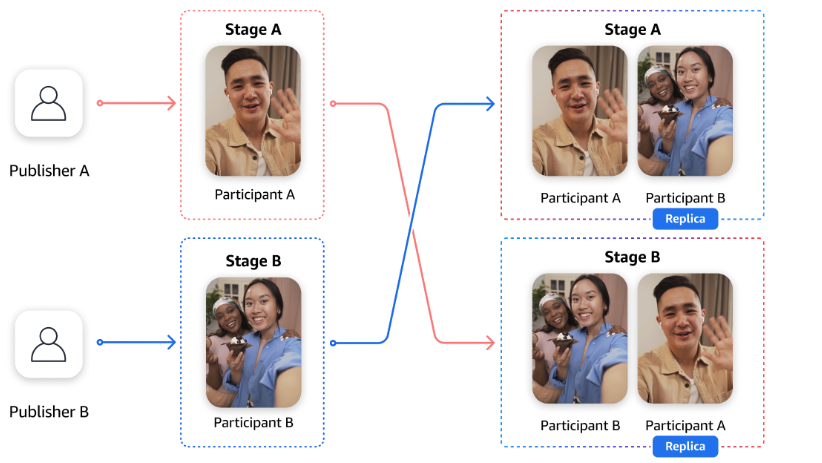

# IVS Participant Replication | Real-Time Streaming

Participant replication allows you to copy a participant from one stage to another. This is useful when you want the same
participant to appear in multiple stages at the same time, enabling cross-stage interactions.

A common use case in social live-streaming applications is competitions, often called VS Mode, where two streamers are
temporarily matched so they can interact with each other in real time, while viewers of each stream can see both streamers.

**Key Concepts:**

- **Source stage** — The stage where the participant originally joined, which is used as the source for
  replication.
- **Destination stage** — The stage to which the participant is replicated.
- **Replicated participant** — A participant in a stage that is replicated to one or more destination stages.
- **Replica participant** — A participant in a destination stage that is replicated from another stage
  (the source stage).

## Using Participant Replication



### Prerequisites

To use participant replication, you must have at least two stages already created. For example, in the above scenario,
we have two active publishers:

1. **Participant A**, connected to **stage A**
2. **Participant B**, connected to **stage B**

We will replicate participant A into stage B and participant B into stage A temporarily, to support a head-to-head competition.

### Start Participant Replication

To replicate participants, use the StartParticipantReplication operation. You must call this once for each replication direction.

Replicate participant A to stage B:

```
aws ivs-realtime start-participant-replication \
  --source-stage-arn arn:aws:ivs:us-east-1:123456789012:stage/StageA \
  --destination-stage-arn arn:aws:ivs:us-east-1:123456789012:stage/StageB \
  --participant-id participant-a-id \
  --reconnect-window-seconds 10
```

Replicate participant B to stage A:

```
aws ivs-realtime start-participant-replication \
  --source-stage-arn arn:aws:ivs:us-east-1:123456789012:stage/StageB \
  --destination-stage-arn arn:aws:ivs:us-east-1:123456789012:stage/StageA \
  --participant-id participant-b-id \
  --reconnect-window-seconds 10
```

Once the replication is started, participants remain replicated until you explicitly stop it using the
StopParticipantReplication operation. A replicated participant who disconnects and later reconnects within the interval specified by
`reconnectWindowSeconds` will automatically appear again in both the source and destination stages.
The default value for `reconnectWindowSeconds` is 0.

### Stop Participant Replication

To stop replication, call the StopParticipantReplication operation.

Stop replication of participant A from stage A to stage B:

```
aws ivs-realtime stop-participant-replication \
  --source-stage-arn arn:aws:ivs:us-east-1:123456789012:stage/StageA \
  --destination-stage-arn arn:aws:ivs:us-east-1:123456789012:stage/StageB \
  --participant-id participant-a-id

```

Stop replication of participant B from stage B to stage A:

```
aws ivs-realtime stop-participant-replication \
  --source-stage-arn arn:aws:ivs:us-east-1:123456789012:stage/StageB \
  --destination-stage-arn arn:aws:ivs:us-east-1:123456789012:stage/StageA \
  --participant-id participant-b-id

```
