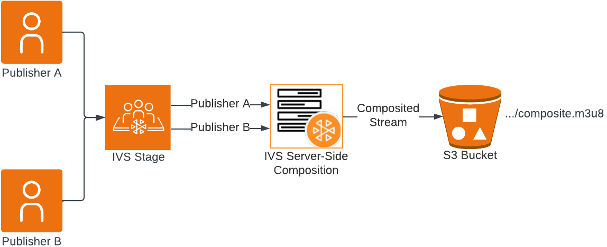

# IVS Recording | Real-Time Streaming

There are two recording options for IVS real-time streaming:

- With individual participant recording, each publisher’s media is recorded in separate files.
- In contrast, composite recording combines media from all publishers into a single view and records it in one file.
  Individual participant recording incurs no additional Amazon IVS charges, while composite recording incurs charges for the hourly rate for the video encoded. Both recording options incur standard S3 storage and request costs. For more details, see [Amazon IVS pricing](https://aws.amazon.com/ivs/pricing/ "https://aws.amazon.com/ivs/pricing/").

For a more customizable solution, consider using the open-source [IVSStageSaver](https://github.com/aws-samples/amazon-ivs-stage-recorder "https://github.com/aws-samples/amazon-ivs-stage-recorder")r project as the foundation for your own self-hosted recording service.

## Individual Participant Recording

This option is ideal for live streams with a single publisher or when separate recordings of each publisher are needed, especially for moderation purposes. For more details, see [Individual Participant Recording](rt-individual-participant-recording.md "rt-individual-participant-recording.md").

## Composite Recording

This option combines media from multiple publishers into a single view and records it in one file, ideal for a video-on-demand experience. For more details, see [Composite Recording](rt-composite-recording.md "rt-composite-recording.md").

## Thumbnails

Thumbnail recording for IVS real-time streaming can be set up for both individual participant recordings and composite (multi-participant) recordings. To enable or disable thumbnail recording and adjust the interval at which thumbnails are generated:

- For individual participant recordings, use the `thumbnailConfiguration` property.
- For composite recordings, use the `thumbnailConfigurations` property.

Thumbnail intervals range from 1 to 86400 seconds (24 hours); by default, thumbnail recording is disabled. For details, see the [Amazon IVS Real-Time Streaming API Reference](../RealTimeAPIReference/Welcome.md "../RealTimeAPIReference/Welcome.md").

A thumbnail configuration includes a `storage` field, which can be set to `SEQUENTIAL` and/or `LATEST`. The `storage` field determines the S3 storage behavior for the thumbnails:

- `SEQUENTIAL` saves all thumbnails in a serial manner. This is the default.
- `LATEST` saves only the most recent thumbnail, overwriting the previous one.

If you specify both `SEQUENTIAL` and `LATEST`, thumbnails are written to two separate S3 paths, one for the sequential archive and one for the latest thumbnail.
