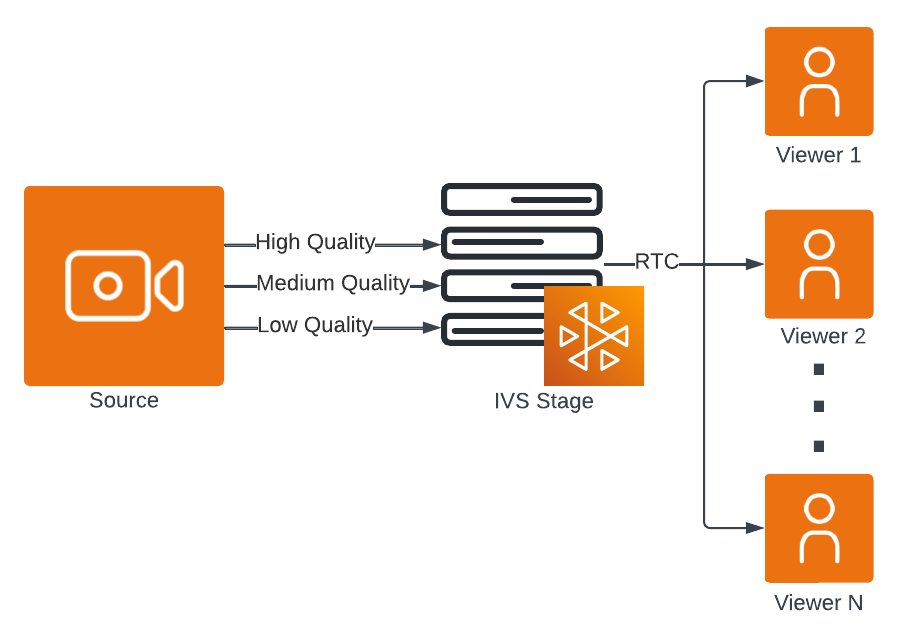

# IVS RTMP Publishing | Real-Time Streaming

This document outlines the process of publishing to an IVS stage using RTMP. For
additional details on various ingest options, refer to the [Stream Ingest](rt-stream-ingest.md "rt-stream-ingest.md")
documentation

## Prerequisites

### Create a Stage

To create a stage, use the following command:

`aws ivs-realtime create-stage --name "test-stage"`

See [CreateStage](../RealTimeAPIReference/API_CreateStage.md "../RealTimeAPIReference/API_CreateStage.md")
for details, including the response.

**Important:** In the response, note the
`endpoints` field, which lists both RTMP and RTMPS endpoints. These
are required for setting up your RTMP encoder.

### Create an Ingest

Configuration

To publish to a stage using RTMPS, you must first create an ingest configuration
and associate it with your stage. When you publish to the stage (using the stream
key from the ingest configuration and the RTMP endpoint from the stage), the media
will be published to the stage as a participant. You have the option to specify a
`userId` and custom `attributes`, which will be associated
with the [participant](../RealTimeAPIReference/API_Participant.md "../RealTimeAPIReference/API_Participant.md")
that connects to the stage.

```
aws ivs-realtime create-ingest-configuration \
  --name 'test' \
  --stage-arn arn:aws:ivs:us-east-1:123456789012:stage/8faHz1SQp0ik \
  --user-id '123' \
  --ingest-protocol 'RTMPS'
```

See [CreateIngestConfiguration](../RealTimeAPIReference/API_CreateIngestConfiguration.md "../RealTimeAPIReference/API_CreateIngestConfiguration.md") for details, including the response.

When creating an ingest configuration, you can associate it with a specific stage
ARN up front. Without this association, the stream key is unusable. Also, ingest
configurations (including the `stageArn` field) can be updated via the
[UpdateIngestConfiguration](../RealTimeAPIReference/API_UpdateIngestConfiguration.md "../RealTimeAPIReference/API_UpdateIngestConfiguration.md") operation, allowing you to reuse the same
configuration for different stages.

**Note:** The ingest configuration
`insecureIngest` field defaults to `false`, requiring the
use of RTMPS. RTMP connections will be rejected. If you must use RTMP, set
`insecureIngest` to `true`. We recommend using RTMPS
unless you have specific and verified use cases that require RTMP.

## RTMP Single-Track Video

Below we describe how to use OBS Studio; however, you can use any RTMP encoder that
meets the IVS [media specifications](rt-stream-ingest.md#supported-media-specifications "rt-stream-ingest.md#supported-media-specifications").

### OBS Guide

1.  Download and install the software: [https://obsproject.com/download](https://obsproject.com/download "https://obsproject.com/download").
2.  Click **Settings**. In the **Stream** section of the **Settings** panel, select **Custom** from the **Service**
    dropdown.
3.  For the **Server**, enter the RTMP or RTMPS
    endpoint from the stage.
4.  For the **Stream Key**, enter the
    `streamKey` from the ingest configuration.
5.  Configure your video settings as you normally would, with a few
    restrictions:

        1. IVS real-time streaming supports input up to 720p at 8.5 Mbps. If
         you exceed either of these limits, your stream will be
         disconnected.
        2. We recommend setting your **Keyframe
         Interval** in the **Output** panel to 1s or 2s. A low keyframe interval
         allows video playback to start more quickly for viewers. We also
         recommend setting **CPU Usage Preset**
         to **veryfast** and **Tune** to **zerolatency**, to enable the lowest latency.
        3. Because OBS does not support simulcast, we recommend keeping your
         bitrate below 2.5 Mbps. This enables viewers on lower-bandwidth
         connections to watch.
        4. Disable B-frames, as streams with B-frames will be automatically
         disconnected. Do one of the following:


        	* In x264 options, enter `bframes=0
        	 sliced-threads=0`.
        	* Set B-frames to 0 if it is an option (e.g., for
        	 NVENC).

    Note: RTMP streams must include both audio and video tracks, or they will
    be disconnected.

6.  Select **Start Streaming**

**Important:** If your encoder’s maximum bitrate is
set to 8.5 Mbps, the publisher occasionally disappears from the session. This is
because the maximum bitrate setting is only a target, and encoders occasionally go
over the target. To prevent this, set your encoder’s maximum bitrate lower; e.g. to
6 Mbps.

## E-RTMP Multitrack Video

IVS supports the multitrack video capability of E-RTMP (Enhanced Real-Time Messaging
Protocol), which allows you to publish multiple video qualities in a single RTMP stream
to your IVS stage. This enables adaptive bitrate streaming, so subscribers can
automatically watch in the best quality for their network connection.

Once ingested, the different video qualities are delivered to subscribers as simulcast
layers. To configure which layers are received by subscribers, see the "Layered Encoding
with Simulcast" sections in the real-time streaming broadcast SDK guides: [Android](broadcast-android.md "broadcast-android.md"), [iOS](broadcast-ios.md "broadcast-ios.md"), and [Web](broadcast-web.md "broadcast-web.md").

For sample code, see [aws-samples/sample-amazon-ivs-multitrack-video](https://github.com/aws-samples/sample-amazon-ivs-multitrack-video "https://github.com/aws-samples/sample-amazon-ivs-multitrack-video") on GitHub.

This diagram illustrates how publishing with multitrack video works:



### OBS Guide

1. Download and install OBS Studio:
   1. Windows: Multitrack video is supported starting in OBS Studio
      30.2.
   2. macOS: Multitrack video is supported starting in OBS Studio 31.1
      Beta (Apple Silicon only).
   3. Download at: [https://obsproject.com/download](https://obsproject.com/download "https://obsproject.com/download").

2. Click **Settings**. In the **Stream** section of the **Settings** panel, select **Amazon
   IVS** from the **Service**
   dropdown.
3. For the **Server**, leave the setting as
   **Auto**.
4. For the **Stream Key**, enter the
   `streamKey` from the ingest configuration.
5. Under the **Multitrack Video** section, check
   **Enable Multitrack Video**.
6. In the **Video** panel, set the desired
   **Base (Canvas Resolution)** and **Output (Scaled) Resolution**. IVS real-time
   streaming supports input up to 720p. If you exceed this limit, your stream
   will be disconnected.

When multitrack video is enabled, settings such as the number of video
tracks, their bitrates, and the keyframe interval are automatically
configured based on the device’s capabilities. 7. Select **Start Streaming**.

### Publishing with FFmpeg

You can use FFmpeg to publish live video and audio to IVS real-time streaming over
RTMP. FFmpeg is a free, open-source project comprising a comprehensive suite of
software libraries and tools for processing video, audio, and other multimedia
content.

The following example command publishes a stream that includes a color pattern and
a tone:

```
ffmpeg \
 -re \
 -f lavfi -i testsrc=d=300:s=1280x720:r=60,format=yuv420p \
 -f lavfi -i sine=f=440:b=4:d=300 \
 -c:v libx264 \
 -b:v 2500k \
 -g 60 -bf 0 \
 -profile:v baseline \
 -preset veryfast \
 -tune zerolatency \
 -x264opts sliced-threads=0 \
 -c:a aac \
 -ac 2 \
 -b:a 160k \
 -ar 48000 \
 -f flv \
 rtmps://$INGEST_ENDPOINT/app/$STREAM_KEY
```

In the example, replace `$INGEST_ENDPOINT` and `$STREAM_KEY`
with your own values from the IVS console or API.

This configuration meets the [Supported Media Specifications](rt-stream-ingest.md#supported-media-specifications "rt-stream-ingest.md#supported-media-specifications") for IVS real-time streaming,
including H.264 video (baseline profile, no B-frames, no sliced threads) and AAC
audio.

## Private Ingest to Stages

You can publish RTMP(S) and E-RTMP(S) streams to a stage from resources inside your
Amazon VPC or from Direct Connect, by using an interface VPC endpoint. This enables a
private connection between your VPC and IVS, keeping ingest traffic within the AWS
network. To set up and configure an interface VPC endpoint for IVS, see [IVS Private Ingest](../LowLatencyUserGuide/private-ingest-ll.md "../LowLatencyUserGuide/private-ingest-ll.md") in the _IVS Low-Latency Streaming User
Guide_.
