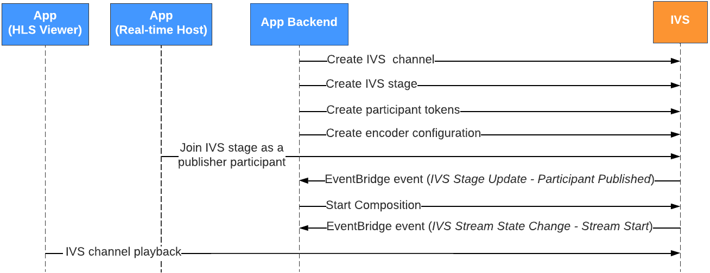

# Getting Started with IVS Server-Side Composition

This document takes you through the steps involved in getting started with IVS server-side composition.

## Prerequisites

To use server-side composition, you must have a stage with active publishers and
use an IVS channel and/or an S3 bucket as the composition destination.

To
create an S3 bucket, see the S3 documentation on [how to create buckets](../../../AmazonS3/latest/userguide/creating-bucket.md "../../../AmazonS3/latest/userguide/creating-bucket.md"). The S3 bucket must be created in the same AWS
region as the IVS stage.

**Important**: If you use an existing S3
bucket:

- The **Object Ownership** setting must be
  **Bucket owner enforced** or **Bucket owner preferred**.
- The **Default Encryption** setting must be
  **Server-side encryption with Amazon S3 managed keys
  (SSE-S3)**.

For details, see the S3 documentation on [controlling ownership of objects](../../../AmazonS3/latest/userguide/about-object-ownership.md "../../../AmazonS3/latest/userguide/about-object-ownership.md") and [protecting data with encryption](../../../AmazonS3/latest/userguide/UsingEncryption.md "../../../AmazonS3/latest/userguide/UsingEncryption.md").

## API Instructions

Below, we
describe one possible workflow that uses EventBridge events to start a composition
that broadcasts the stage to an IVS channel when a participant publishes.
Alternatively, you can start and stop compositions based on your own app logic. See
[Composite Recording](rt-composite-recording.md "rt-composite-recording.md") for another
example which showcases the use of server-side composition to record a stage
directly to an S3 bucket.

1. Create an IVS channel. See [Getting
   Started with Amazon IVS Low-Latency Streaming](../LowLatencyUserGuide/getting-started.md "../LowLatencyUserGuide/getting-started.md").
2. Create an IVS stage and participant tokens for each publisher.
3. Create an [EncoderConfiguration](../RealTimeAPIReference/API_EncoderConfiguration.md "../RealTimeAPIReference/API_EncoderConfiguration.md").
4. Join the stage and publish to it. (See the "Publishing and Subscribing"
   sections of the real-time streaming broadcast SDK guides: [Web](web-publish-subscribe.md "web-publish-subscribe.md"), [Android](android-publish-subscribe.md "android-publish-subscribe.md"), and [iOS](ios-publish-subscribe.md "ios-publish-subscribe.md").)
5. When you receive a Participant Published EventBridge event, call [StartComposition](../RealTimeAPIReference/API_StartComposition.md "../RealTimeAPIReference/API_StartComposition.md") with your desired layout configuration.
6. Wait for a few seconds and see the composited view in the channel
   playback.



**Note**: A Composition performs auto-shutdown after
60 seconds of inactivity from publisher participants on the stage. At that point,
the Composition is terminated and transitions to a `STOPPED` state. A
Composition is automatically deleted after a few minutes in the `STOPPED`
state.

## CLI Instructions

Using the AWS CLI is an advanced option and requires that you first download and
configure the CLI on your machine. For details, see the [AWS
Command Line Interface User Guide](../../../cli/latest/userguide/cli-chap-welcome.md "../../../cli/latest/userguide/cli-chap-welcome.md").

Now you can use the CLI to create and manage resources. The Composition operations
are under the `ivs-realtime` namespace.

### Create the

EncoderConfiguration Resource

An EncoderConfiguration is an object that allows you to customize the format
of the generated video (height, width, bitrate, and other streaming parameters).
You can reuse an EncoderConfiguration every time you call the Composition
operation, as explained in the next step.

The command below creates an EncoderConfiguration resource that configures
server-side video composition parameters like video bitrate, frame rate and
resolution:

```
aws ivs-realtime create-encoder-configuration --name "MyEncoderConfig" --video "bitrate=2500000,height=720,width=1280,framerate=30"
```

The response is:

```
{
"encoderConfiguration": {
  "arn": "arn:aws:ivs:us-east-1:927810967299:encoder-configuration/9W59OBY2M8s4",
  "name": "MyEncoderConfig",
  "tags": {},
  "video": {
	 "bitrate": 2500000,
	 "framerate": 30,
	 "height": 720,
	 "width": 1280
    }
  }
}
```

### Start a

Composition

Using the EncoderConfiguration ARN provided in the response above, create your
Composition resource:

**Grid Layout Example**

```
aws ivs-realtime start-composition --stage-arn "arn:aws:ivs:us-east-1:927810967299:stage/8faHz1SQp0ik" --destinations '[{"channel": {"channelArn": "arn:aws:ivs:us-east-1:927810967299:channel/DOlMW4dfMR8r", "encoderConfigurationArn": "arn:aws:ivs:us-east-1:927810967299:encoder-configuration/9W59OBY2M8s4"}}]' --layout '{"grid":{"participantOrderAttribute":"order","featuredParticipantAttribute":"isFeatured","videoFillMode":"COVER","gridGap":0}}'
```

**PiP Layout Example**

```
aws ivs-realtime start-composition --stage-arn "arn:aws:ivs:us-east-1:927810967299:stage/8faHz1SQp0ik" --destinations '[{"channel": {"channelArn": "arn:aws:ivs:us-east-1:927810967299:channel/DOlMW4dfMR8r", "encoderConfigurationArn": "arn:aws:ivs:us-east-1:927810967299:encoder-configuration/DEkQHWPVaOwO"}}]' --layout '{"pip":{"participantOrderAttribute":"priority","pipParticipantAttribute":"isPip","pipOffset":10,"pipPosition":"TOP_RIGHT"}}'
```

**Note**: You can use [this tool](https://composition.ivsdemos.com/ "https://composition.ivsdemos.com/") to more easily generate the `--layout` configuration based on your layout choices.

The response will show that the Composition is created with a
`STARTING` state. Once the Composition starts publishing the
composition, the state transitions to `ACTIVE`. (You can see the
state by calling the ListCompositions or GetComposition operation.)

Once a Composition is `ACTIVE`, the composite view of the IVS stage
is visible on the IVS channel, using ListCompositions:

```
aws ivs-realtime list-compositions
```

The response is:

```
{
"compositions": [
  {
	 "arn": "arn:aws:ivs:us-east-1:927810967299:composition/YVoaXkKdEdRP",
	 "destinations": [
		{
		   "id": "bD9rRoN91fHU",
		   "startTime": "2023-09-21T15:38:39+00:00",
		   "state": "ACTIVE"
		}
	 ],
	 "stageArn": "arn:aws:ivs:us-east-1:927810967299:stage/8faHz1SQp0ik",
	 "startTime": "2023-09-21T15:38:37+00:00",
	 "state": "ACTIVE",
	 "tags": {}
    }
  ]
}
```

**Note**: You need to have publisher participants
actively publishing to the stage to keep the composition alive. For more
information, see the "Publishing and Subscribing" sections of the real-time
streaming broadcast SDK guides: [Web](web-publish-subscribe.md "web-publish-subscribe.md"),
[Android](android-publish-subscribe.md "android-publish-subscribe.md"), and [iOS](ios-publish-subscribe.md "ios-publish-subscribe.md").
You must create a distinct stage token for each participant.
