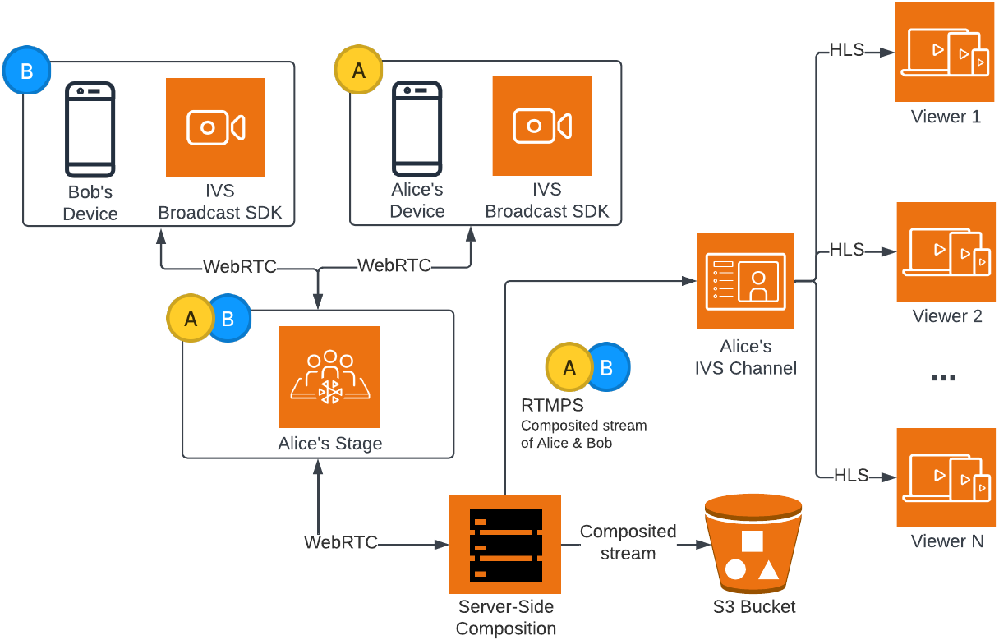
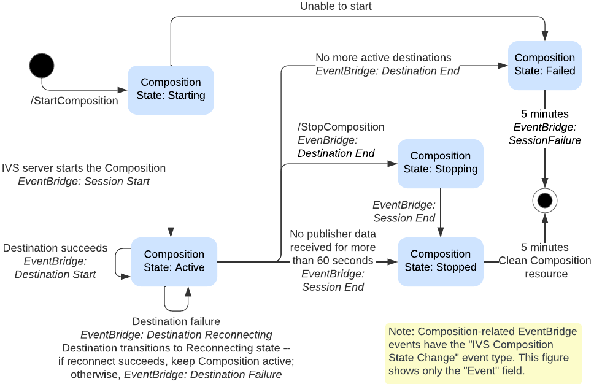
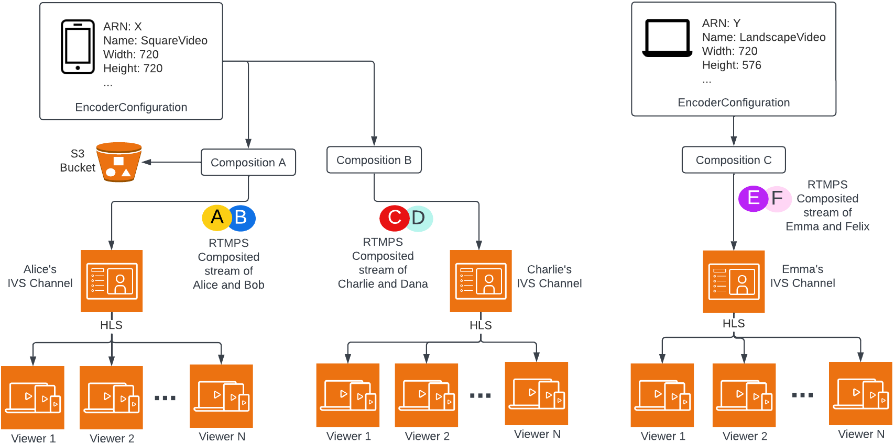
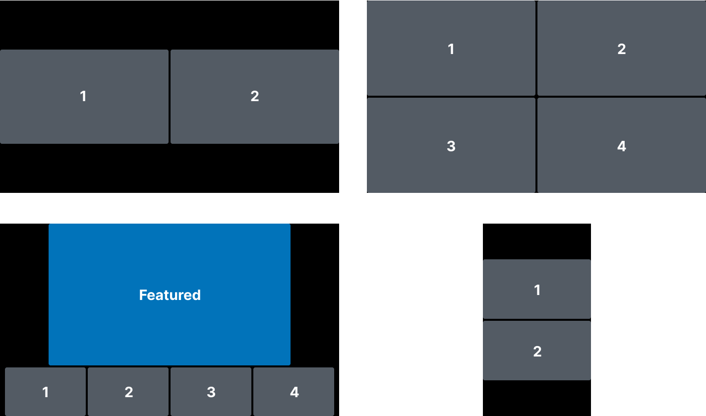
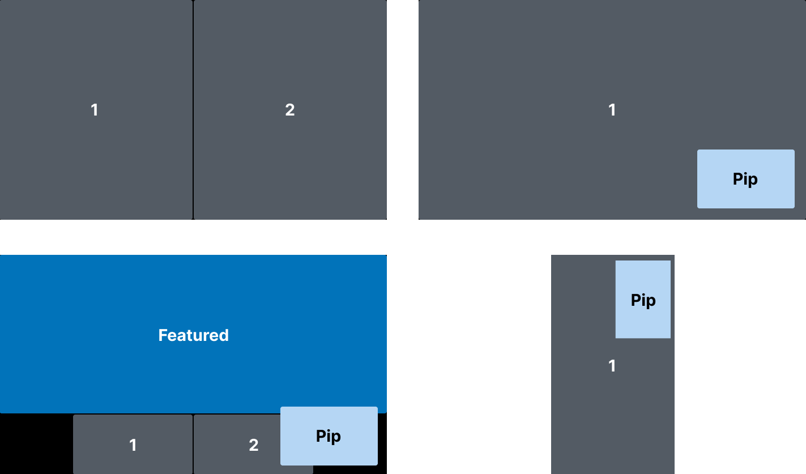

# Overview of IVS Server-Side Composition

This diagram illustrates how server-side composition works:

## Benefits

Compared to client-side composition, server-side composition has the following
benefits:

- **Reduced client load** — With server-side
  composition, the burden of processing and combining audio and video sources is
  shifted from individual client devices to the server itself. Server-side
  composition eliminates the need for client devices to use their CPU and network
  resources for compositing the view and transmitting it to IVS. This means
  viewers can watch the broadcast without their devices having to handle
  resource-intensive tasks, which can lead to improved battery life and smoother
  viewing experiences.
- **Consistent quality** — Server-side composition
  allows for precise control over the quality, resolution, and bitrate of the
  final stream. This ensures a consistent viewing experience for all viewers,
  regardless of their individual devices' capabilities.
- **Resilience** — By centralizing the composition
  process on the server, the broadcast becomes more robust. Even if a publisher
  device experiences technical limitations or fluctuations, the server can adapt
  and provide a smoother stream to all audience members.
- **Bandwidth efficiency** — Since the server
  handles the composition, stage publishers do not have to spend extra bandwidth
  broadcasting the video to IVS.

Alternatively, to broadcast a stage to an IVS channel, you can do the composition
client side; see [Enabling Multiple Hosts on
an IVS Stream](../LowLatencyUserGuide/multiple-hosts.md "../LowLatencyUserGuide/multiple-hosts.md") in the _IVS Low-Latency Streaming User
Guide_.

## Composition Lifecycle

Use the diagram below to understand the state transitions of a composition:

At a high level, the life cycle of a Composition is as follows:

1. A Composition resource is created when the user calls the StartComposition
   operation.
2. Once IVS successfully starts the Composition, an “IVS Composition State Change
   (Session Start)” EventBridge event is sent. See [Using EventBridge with IVS Real-Time Streaming](eventbridge.md "eventbridge.md") for details about
   events.
3. Once a Composition is in an active state, the following can happen:
   - User stops the Composition — If the StopComposition operation is
     called, IVS initiates a graceful shutdown of the Composition, sending
     "Destination End" events followed by a "Session End" event.
   - Composition performs auto-shutdown — If the IVS stage is deleted or no participant is
     actively publishing to the IVS stage for 60 seconds, the Composition is
     finalized automatically and EventBridge events are sent.
   - Destination failure — If a destination unexpectedly fails (e.g., the
     IVS channel gets deleted), the destination transitions to the
     `RECONNECTING` state and a “Destination Reconnecting”
     event is sent. If recovery is impossible, IVS transitions the
     destination to the `FAILED` state and a “Destination Failure”
     event is sent. IVS keeps the composition alive if at least one of its
     destinations is active.

4. Once the composition is in the `STOPPED` or `FAILED`
   state, it is automatically cleaned up after five minutes. (Then it no longer is
   retrieved by ListCompositions or GetComposition.)

## IVS API

Server-side composition uses these key API elements:

- An _EncoderConfiguration_ object allows you
  to customize the format of the video to be generated (height, width, bitrate,
  and other streaming parameters). You can reuse an EncoderConfiguration every
  time you call the StartComposition operation.
- _Composition_ operations track the video
  composition and output to an IVS channel.
- _StorageConfiguration_ tracks the S3 bucket
  where compositions are recorded.

To use server-side composition, you need to create an EncoderConfiguration and attach
it when calling the StartComposition operation. In this example, the SquareVideo
EncoderConfiguration is used in two Compositions:

For complete information, see [IVS Real-Time Streaming API
Reference](../RealTimeAPIReference/Welcome.md "../RealTimeAPIReference/Welcome.md").

## Layouts

The StartComposition operation offers two layout options: grid and pip (Picture-in-Picture).

### Grid Layout

The grid layout arranges stage participants in a grid of equally sized slots. It provides several customizable properties:

- `videoAspectRatio` sets the participant display mode to control the aspect ratio of video tiles.
- `videoFillMode` defines how video content fits within the participant tile.
- `gridGap` specifies the spacing between participant tiles in pixels.
- `omitStoppedVideo` allows excluding stopped video streams from the composition.
- `featuredParticipantAttribute` identifies the featured slot. When this is set, the featured participant is displayed in a larger slot on the main screen, with other participants shown below it.
- `participantOrderAttribute` enables custom participant ordering based on attribute values in participant tokens. When specified, participants are ordered numerically by their attribute values, with participants lacking the attribute falling back to arrival-time ordering. This provides optional deterministic positioning and allows for role-based layouts.

For details on grid layout (including valid values and defaults for all fields), see the [GridConfiguration](../RealTimeAPIReference/API_GridConfiguration.md "../RealTimeAPIReference/API_GridConfiguration.md") data type.

### Picture-in-Picture (PiP) Layout

The PiP layout enables displaying a participant in an overlay window with configurable size, position, and behavior. Key properties include:

- `pipParticipantAttribute` specifies the participant for the PiP window.
- `pipPosition` determines the corner position of the PiP window.
- `pipWidth` and `pipHeight`configure the width and height of the PiP window.
- `pipOffset` sets the offset position of the PiP window in pixels from the closest edges.
- `pipBehavior` defines PiP behavior when all other participants have left.

Like the grid layout, the PiP layout supports `featuredParticipantAttribute`, `omitStoppedVideo`, `videoFillMode`, `gridGap`, and `participantOrderAttribute` to further customize the composition. The `participantOrderAttribute` enables custom participant ordering for both selecting the participant for the PiP window and positioning grid participants based on attribute values in participant tokens.

For details on PiP layout (including valid values and defaults for all fields), see the [PipConfiguration](../RealTimeAPIReference/API_PipConfiguration.md "../RealTimeAPIReference/API_PipConfiguration.md") data type.

**Note**: The maximum resolution supported by a stage publisher on server-side composition is 1080p. If a publisher sends video higher than 1080p, the publisher will be rendered as an audio-only participant.

**Important**: Ensure your application does not depend on the specific features of the current layout, such as size and position of tiles. _Visual improvements to layouts can be introduced at any time_.
