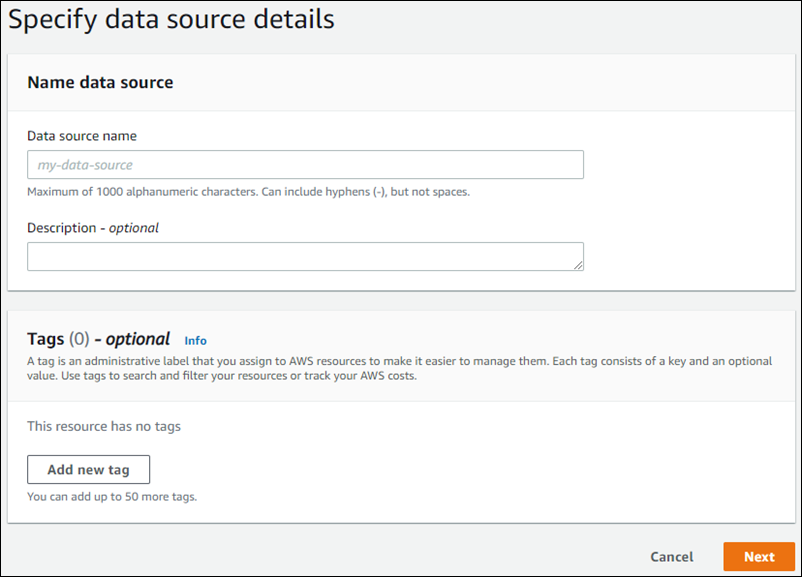

# Custom data source connector

Use a custom data source when you have a repository that Amazon Kendra doesn’t yet
provide a data source connector for. You can use it to see the same run history metrics that
Amazon Kendra data sources provide even when you can't use Amazon Kendra's
data sources to sync your repositories. Use this to create a consistent sync monitoring
experience between Amazon Kendra data sources and custom ones. Specifically, use a
custom data source to see sync metrics for a data source connector that you created using
the [BatchPutDocument](../APIReference/API_BatchPutDocument.md "../APIReference/API_BatchPutDocument.md") and [BatchDeleteDocument](../APIReference/API_BatchDeleteDocument.md "../APIReference/API_BatchDeleteDocument.md") APIs.

For troubleshooting your Amazon Kendra custom data source connector, see [Troubleshooting data sources](troubleshooting-data-sources.md "troubleshooting-data-sources.md").

When you create a custom data source, you have complete control over how the documents to
index are selected. Amazon Kendra only provides metric information that you can use to
monitor your data source sync jobs. You must create and run the crawler that determines the
documents your data source indexes.

You must specify the main title of your documents using the [Document](../APIReference/API_Document.md "../APIReference/API_Document.md") object, and
`_source_uri` in [DocumentAttribute](../APIReference/API_DocumentAttribute.md "../APIReference/API_DocumentAttribute.md") in
order to have `DocumentTitle` and `DocumentURI` included in the
response of the `Query` result.

You create an identifier for your custom data source using the console or by using the
[CreateDataSource](../APIReference/API_CreateDataSource.md "../APIReference/API_CreateDataSource.md") API. To use the console, give your data source a name, and
optionally a description and resource tags. After the data source is created, a data source
ID is shown. Copy this ID to use when you synchronize the data source with the index.


You can also create a custom data source using the `CreateDataSource` API. The
API returns an ID to use when you synchronize the data source. When you use the
`CreateDataSource` API to create a custom data source, you can't set the
`Configuration`, `RoleArn` or `Schedule` parameters. If
you set these parameters, Amazon Kendra returns a `ValidationException`
exception.

To use a custom data source, create an application that is responsible for updating the
Amazon Kendra index. The application depends on a crawler that you create. The
crawler reads the documents in your repository and determines which should be sent to
Amazon Kendra. Your application should perform the following steps:

1. Crawl your repository and make a list of the documents in your repository that are
   added, updated, or deleted.
2. Call the [StartDataSourceSyncJob](../APIReference/API_StartDataSourceSyncJob.md "../APIReference/API_StartDataSourceSyncJob.md") API to signal that a sync job is starting. You
   provide a data source ID to identify the data source that is synchronizing. Amazon Kendra returns a execution ID to identify a particular sync job.
3. Call the [BatchDeleteDocument](../APIReference/API_BatchDeleteDocument.md "../APIReference/API_BatchDeleteDocument.md") API to remove documents from the index. You provide
   the data source ID and execution ID to identify the data source that is
   synchronizing and the job that this update is associated with.
4. Call the [StopDataSourceSyncJob](../APIReference/API_StopDataSourceSyncJob.md "../APIReference/API_StopDataSourceSyncJob.md") API to signal the end of the sync job. After you
   call the `StopDataSourceSyncJob` API, the associated execution ID is no
   longer valid.
5. Call the [ListDataSourceSyncJobs](../APIReference/API_ListDataSourceSyncJobs.md "../APIReference/API_ListDataSourceSyncJobs.md") API with the index and data source identifiers
   to list the sync jobs for the data source and to see metrics for the sync
   jobs.
   After you end a sync job, you can start a new synchronization job. There can be a period
   of time before all of the submitted documents are added to the index. Use the
   `ListDataSourceSyncJobs` API to see the status of the sync job. If the
   `Status` returned for the sync job is `SYNCING_INDEXING`, some
   documents are still being indexed. You can start a new sync job when the status of the
   previous job is `FAILED` or `SUCCEEDED`.

After you call the `StopDataSourceSyncJob` API, you can't use a sync job
identifier in a call to the `BatchPutDocument` or
`BatchDeleteDocument` APIs. If you do, all of the documents submitted are
returned in the `FailedDocuments` response message from the API.

## Required attributes

When you submit a document to Amazon Kendra using the
`BatchPutDocument` API, each document requires two attributes to identify
the data source and synchronization run that it belongs to. You must provide the
following two attributes to map documents from your custom data source correctly to an
Amazon Kendra index:

- `_data_source_id`—The identifier of the data source. This is
  returned when you create the data source with the console or the
  `CreateDataSource` API.
- `_data_source_sync_job_execution_id`—The identifier of the
  sync run. This is returned when you start the index synchronization with the
  `StartDataSourceSyncJob` API.

The following is the JSON required to index a document using a custom data
source.

```
{
    "Documents": [
        {
            "Attributes": [
                {
                    "Key": "_data_source_id",
                    "Value": {
                        "StringValue": "`data source identifier`"
                    }
                },
                {
                    "Key": "_data_source_sync_job_execution_id",
                    "Value": {
                        "StringValue": "`sync job identifier`"
                    }
                }
            ],
            "Blob": "`document content`",
            "ContentType": "`content type`",
            "Id": "`document identifier`",
            "Title": "`document title`"
        }
    ],
    "IndexId": "`index identifier`",
    "RoleArn": "`IAM role ARN`"
}
```

When you remove a document from the index using the `BatchDeleteDocument`
API, you need to specify the following two fields in the
`DataSourceSyncJobMetricTarget` parameter:

- `DataSourceId`—The identifier of the data source. This is
  returned when you create the data source with the console or the
  `CreateDataSource` API.
- `DataSourceSyncJobId`—The identifier of the sync run. This
  is returned when you start the index synchronization with the
  `StartDataSourceSyncJob` API.

The following is the JSON required to delete a document from the index using the
`BatchDeleteDocument` API.

```
{
    "DataSourceSyncJobMetricTarget": {
        "DataSourceId": "`data source identifier`",
        "DataSourceSyncJobId": "`sync job identifier`"
    },
    "DocumentIdList": [
        "`document identifier`"
    ],
    "IndexId": "`index identifier`"
}
```

## Viewing metrics

After a sync job is finished, you can use the [DataSourceSyncJobMetrics](../APIReference/API_DataSourceSyncJobMetrics.md "../APIReference/API_DataSourceSyncJobMetrics.md") API to get the metrics associated with the sync
job. Use this to monitor your custom data source syncs.

If you submit the same document multiple times, either as part of the
`BatchPutDocument` API, the `BatchDeleteDocument` API, or if
the document is submitted for both addition and deletion, the document is only counted
once in the metrics.

- `DocumentsAdded`—The number of documents submitted using the
  `BatchPutDocument` API associated with this sync job added to the
  index for the first time. If a document is submitted for addition more than once
  in a sync, the document is only counted once in the metrics.
- `DocumentsDeleted`—The number of documents submitted using
  the `BatchDeleteDocument` API associated with this sync job deleted
  from the index. If a document is submitted for deletion more than once in a
  sync, the document is only counted once in the metrics.
- `DocumentsFailed`—The number of documents associated with
  this sync job that failed indexing. These are documents that were accepted by
  Amazon Kendra for indexing but could not be indexed or deleted. If a
  document isn't accepted by Amazon Kendra, the identifier for the document
  is returned in the `FailedDocuments` response property of the
  `BatchPutDocument` and `BatchDeleteDocument`
  APIs.
- `DocumentsModified`—The number of modified documents
  submitted using the `BatchPutDocument` API associated with this sync
  job that were modified in the Amazon Kendra index.

Amazon Kendra also emits Amazon CloudWatch metrics while indexing documents.
For more information, see [Monitoring Amazon Kendra with
Amazon CloudWatch](cloudwatch-metrics.md "cloudwatch-metrics.md").

Amazon Kendra doesn't return the `DocumentsScanned` metric for custom
data sources. It also emits the CloudWatch metrics listed in the document [Metrics for Amazon Kendra data sources](cloudwatch-metrics.md#cloudwatch-metrics-data-source "cloudwatch-metrics.md#cloudwatch-metrics-data-source").

## Learn more

To learn more about integrating Amazon Kendra with your custom data source,
see:

- [Adding custom data sources to Amazon Kendra](https://aws.amazon.com/blogs/machine-learning/adding-custom-data-sources-to-amazon-kendra/ "https://aws.amazon.com/blogs/machine-learning/adding-custom-data-sources-to-amazon-kendra/")
