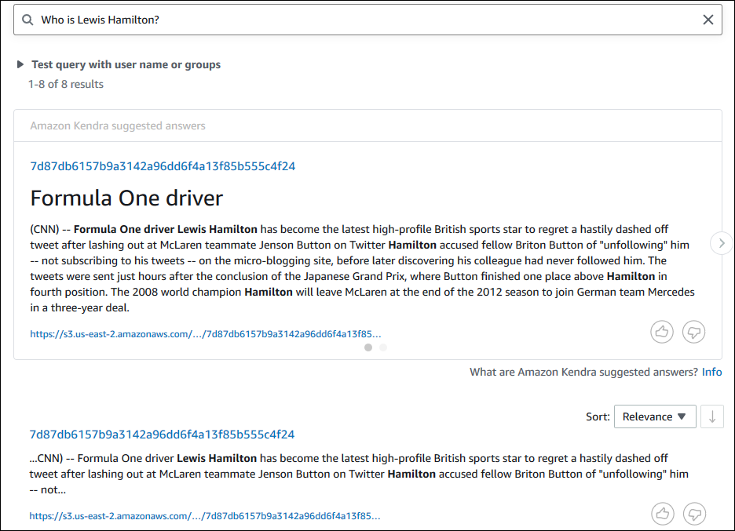
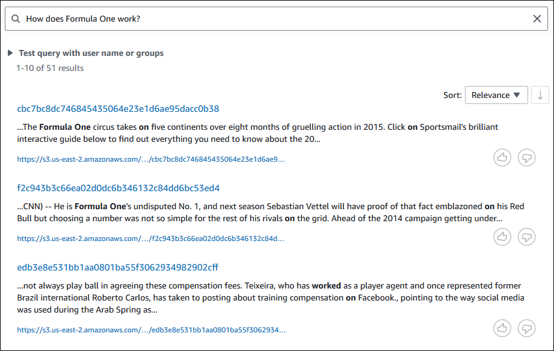
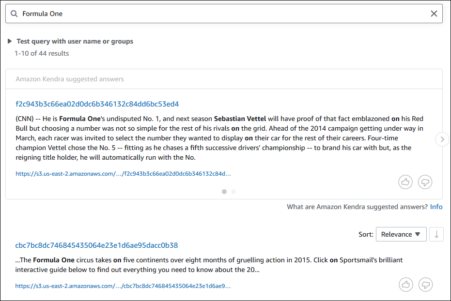
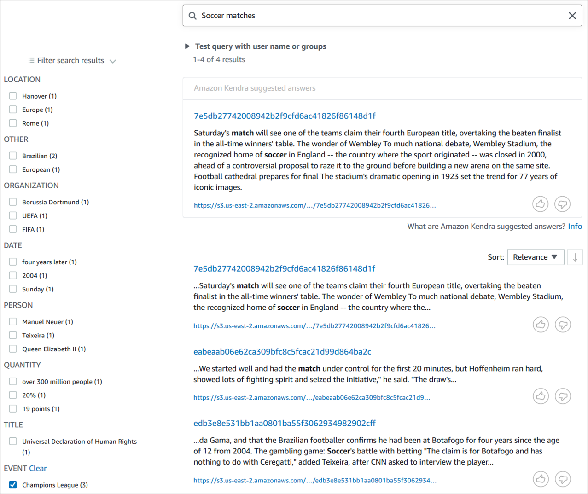

# Step 5: Querying the Amazon Kendra

index

Your Amazon Kendra index is now ready for natural language queries. When you search your index,
Amazon Kendra uses all the data and metadata you provided to return the most accurate answers to your
search query.

There are three kinds of queries that Amazon Kendra can answer:

- Factoid queries ("who", "what", "when", or "where" questions)
- Descriptive queries ("how" questions)
- Keyword searches (questions whose intent and scope are not clear)

###### Topics

- [Querying your Amazon Kendra
  index](#tutorial-search-metadata-query-kendra-basic "#tutorial-search-metadata-query-kendra-basic")
- [Filtering your search
  results](#tutorial-search-metadata-query-kendra-filters "#tutorial-search-metadata-query-kendra-filters")

## Querying your Amazon Kendra

index

You can query your Amazon Kendra index using questions that correspond to the three kinds of
queries that Amazon Kendra supports. For more information, see [Queries](searching-example.md "searching-example.md").

The example questions in this section have been chosen based on the sample
dataset.

1. Open the Amazon Kendra console at [https://console.aws.amazon.com/kendra/](https://console.aws.amazon.com/kendra/ "https://console.aws.amazon.com/kendra/").
2. From the **Indexes** list, click on
   `kendra-index`.
3. From the left navigation menu, choose the option to search your index.
4. To run a sample factoid query, enter `Who is Lewis
Hamilton?` in the search box and press enter.

The first returned result is the Amazon Kendra suggested answer, together with the data
file containing the answer. The rest of the results form the set of recommended
documents.

 5. To run a descriptive query, enter `How does Formula One
 work?` in the search box and press enter.

You will see another result returned by the Amazon Kendra console, this time with the
relevant phrase highlighted.

 6. To run a keyword search, enter `Formula One` in the search
box and press enter.

You will see another result returned by the Amazon Kendra console, followed by the
results for all other mentions of the phrase in the dataset.



1. To run a sample factoid query, use the [query](https://awscli.amazonaws.com/v2/documentation/api/latest/reference/kendra/query.html "https://awscli.amazonaws.com/v2/documentation/api/latest/reference/kendra/query.html") command:

Linux

```
aws kendra query \
        --index-id `kendra-index-id` \
        --query-text `"Who is Lewis Hamilton?"` \
        --region `aws-region`
```

Where:

    * `kendra-index-id` is your saved
     `kendra-index-id`,
    * `aws-region` is your AWS region.

macOS

```
aws kendra query \
        --index-id `kendra-index-id` \
        --query-text `"Who is Lewis Hamilton?"` \
        --region `aws-region`
```

Where:

    * `kendra-index-id` is your saved
     `kendra-index-id`,
    * `aws-region` is your AWS region.

Windows

```
aws kendra query ^
        --index-id `kendra-index-id` ^
        --query-text `"Who is Lewis Hamilton?"` ^
        --region `aws-region`
```

Where:

    * `kendra-index-id` is your saved
     `kendra-index-id`,
    * `aws-region` is your AWS region.

The AWS CLI displays the results of your query. 2. To run a sample descriptive query, use the [query](https://awscli.amazonaws.com/v2/documentation/api/latest/reference/kendra/query.html "https://awscli.amazonaws.com/v2/documentation/api/latest/reference/kendra/query.html") command:

Linux

```
aws kendra query \
        --index-id `kendra-index-id` \
        --query-text `"How does Formula One work?"` \
        --region `aws-region`
```

Where:

    * `kendra-index-id` is your saved
     `kendra-index-id`,
    * `aws-region` is your AWS region.

macOS

```
aws kendra query \
        --index-id `kendra-index-id` \
        --query-text `"How does Formula One work?"` \
        --region `aws-region`
```

Where:

    * `kendra-index-id` is your saved
     `kendra-index-id`,
    * `aws-region` is your AWS region.

Windows

```
aws kendra query ^
        --index-id `kendra-index-id` ^
        --query-text `"How does Formula One work?"` ^
        --region `aws-region`
```

Where:

    * `kendra-index-id` is your saved
     `kendra-index-id`,
    * `aws-region` is your AWS region.

The AWS CLI displays the results to your query. 3. To run a sample keyword search, use the [query](https://awscli.amazonaws.com/v2/documentation/api/latest/reference/kendra/query.html "https://awscli.amazonaws.com/v2/documentation/api/latest/reference/kendra/query.html") command:

Linux

```
aws kendra query \
        --index-id `kendra-index-id` \
        --query-text `"Formula One"` \
        --region `aws-region`
```

Where:

    * `kendra-index-id` is your saved
     `kendra-index-id`,
    * `aws-region` is your AWS region.

macOS

```
aws kendra query \
        --index-id `kendra-index-id` \
        --query-text `"Formula One"` \
        --region `aws-region`
```

Where:

    * `kendra-index-id` is your saved
     `kendra-index-id`,
    * `aws-region` is your AWS region.

Windows

```
aws kendra query ^
        --index-id `kendra-index-id` ^
        --query-text `"Formula One"` ^
        --region `aws-region`
```

Where:

    * `kendra-index-id` is your saved
     `kendra-index-id`,
    * `aws-region` is your AWS region.

The AWS CLI displays the returned answers to your query.

## Filtering your search

results

You can filter and sort your search results using custom document attributes in the
Amazon Kendra console. For more information on how Amazon Kendra processes queries, see [Filtering
queries](filtering.md "filtering.md").

1. Open the Amazon Kendra console at [https://console.aws.amazon.com/kendra/](https://console.aws.amazon.com/kendra/ "https://console.aws.amazon.com/kendra/").
2. From the **Indexes** list, click on
   `kendra-index`.
3. From the left navigation menu, choose the option to search your index.
4. In the search box, enter `Soccer matches` as a query and
   press enter.
5. From the left navigation menu, choose **Filter search results**
   to see a list of facets you can use to filter your search.
6. Select the check box for "Champions League" under the **EVENT**
   subheading, to see your search results filtered only by the results containing
   "Champions League".



1. To see the entities of a specific type (such as `EVENT`) that are
   available for a search, use the [query](https://awscli.amazonaws.com/v2/documentation/api/latest/reference/kendra/query.html "https://awscli.amazonaws.com/v2/documentation/api/latest/reference/kendra/query.html") command:

Linux

```
aws kendra query \
        --index-id `kendra-index-id` \
        --query-text `"Soccer matches"` \
        --facets '[{"DocumentAttributeKey":"EVENT"}]' \
        --region `aws-region`
```

Where:

    * `kendra-index-id` is your saved
     `kendra-index-id`,
    * `aws-region` is your AWS region.

macOS

```
aws kendra query \
        --index-id `kendra-index-id` \
        --query-text `"Soccer matches"` \
        --facets '[{"DocumentAttributeKey":"EVENT"}]' \
        --region `aws-region`
```

Where:

    * `kendra-index-id` is your saved
     `kendra-index-id`,
    * `aws-region` is your AWS region.

Windows

```
aws kendra query ^
        --index-id `kendra-index-id` ^
        --query-text `"Soccer matches"` ^
        --facets '[{"DocumentAttributeKey":"EVENT"}]' ^
        --region `aws-region`
```

Where:

    * `kendra-index-id` is your saved
     `kendra-index-id`,
    * `aws-region` is your AWS region.

The AWS CLI displays the search results. To get a list of facets of type
`EVENT`, navigate to the "FacetResults" section of the AWS CLI output to
see a list of filterable facets with their counts. For example, one of the facets is
"Champions League".

###### Note

Instead of `EVENT`, you can choose any of the index fields you
created in [Creating an Amazon Kendra index](tutorial-search-metadata-create-index-ingest.md#tutorial-search-metadata-create-index "tutorial-search-metadata-create-index-ingest.md#tutorial-search-metadata-create-index") for the
`DocumentAttributeKey` value. 2. To run the same search but filter only by the results containing "Champions
League", use the [query](https://awscli.amazonaws.com/v2/documentation/api/latest/reference/kendra/query.html "https://awscli.amazonaws.com/v2/documentation/api/latest/reference/kendra/query.html") command:

Linux

```
aws kendra query \
        --index-id `kendra-index-id` \
        --query-text `"Soccer matches"` \
        --attribute-filter '{"ContainsAny":{"Key":"EVENT","Value":{"StringListValue":["Champions League"]}}}' \
        --region `aws-region`
```

Where:

    * `kendra-index-id` is your saved
     `kendra-index-id`,
    * `aws-region` is your AWS region.

macOS

```
aws kendra query \
        --index-id `kendra-index-id` \
        --query-text `"Soccer matches"` \
        --attribute-filter '{"ContainsAny":{"Key":"EVENT","Value":{"StringListValue":["Champions League"]}}}' \
        --region `aws-region`
```

Where:

    * `kendra-index-id` is your saved
     `kendra-index-id`,
    * `aws-region` is your AWS region.

Windows

```
aws kendra query ^
        --index-id `kendra-index-id` ^
        --query-text `"Soccer matches"` ^
        --attribute-filter '{"ContainsAny":{"Key":"EVENT","Value":{"StringListValue":["Champions League"]}}}' ^
        --region `aws-region`
```

Where:

    * `kendra-index-id` is your saved
     `kendra-index-id`,
    * `aws-region` is your AWS region.

The AWS CLI displays the filtered search results.
