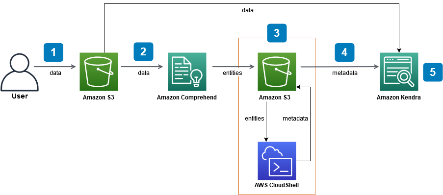

# Tutorial: Building a metadata-enriched, intelligent

search solution with Amazon Kendra

This tutorial shows you how to build a metadata-enriched, natural language based,
intelligent search solution for your enterprise data using [Amazon Kendra](https://aws.amazon.com/kendra/ "https://aws.amazon.com/kendra/"), [Amazon Comprehend](https://aws.amazon.com/comprehend/ "https://aws.amazon.com/comprehend/"), [Amazon Simple Storage Service](https://aws.amazon.com/s3/ "https://aws.amazon.com/s3/") (S3), and [AWS CloudShell](https://aws.amazon.com/cloudshell/ "https://aws.amazon.com/cloudshell/").

Amazon Kendra is an intelligent search service that can build a search index for your unstructured,
natural language data repositories. To make it easier for your customers to find and filter
relevant answers, you can use Amazon Comprehend to extract metadata from your data and ingest it into your
Amazon Kendra search index.

Amazon Comprehend is a natural language processing (NLP) service that can identify entities. Entities
are references to people, places, locations, organizations, and objects in your data.

This tutorial uses a sample dataset of news articles to extract entities, convert them to
metadata, and ingest them into your Amazon Kendra index to run searches on. The added metadata lets you
filter your search results using any subset of these entities, and improves search accuracy. By
following this tutorial, you will learn how to create a search solution for your enterprise data
without any specialized machine learning knowledge.

**This tutorial shows you how to build your search solution using the
following steps:**

1. Storing a sample dataset of news articles in Amazon S3.
2. Using Amazon Comprehend to extract entities from your data.
3. Running a Python 3 script to convert the entities into Amazon Kendra index metadata format and
   storing this metadata in S3.
4. Creating an Amazon Kendra search index and ingesting the data and the metadata.
5. Querying the search index.
   **The following diagram shows the workflow:**


**Estimated time to complete this tutorial:** 1 hour

**Estimated cost:** Some of the actions in this tutorial incur
charges on your AWS account. For more information on the cost of each service, see the price
pages for [Amazon S3](https://aws.amazon.com/s3/pricing/ "https://aws.amazon.com/s3/pricing/"), [Amazon Comprehend](https://aws.amazon.com/comprehend/pricing/ "https://aws.amazon.com/comprehend/pricing/"), [AWS CloudShell](https://aws.amazon.com/cloudshell/pricing/ "https://aws.amazon.com/cloudshell/pricing/"), and [Amazon Kendra](https://aws.amazon.com/kendra/pricing/ "https://aws.amazon.com/kendra/pricing/").

###### Topics

- [Prerequisites](#tutorial-search-metadata-prereqs "#tutorial-search-metadata-prereqs")
- [Step 1: Adding documents to
  Amazon S3](tutorial-search-metadata-add-documents.md "tutorial-search-metadata-add-documents.md")
- [Step 2: Running an entities
  analysis job on Amazon Comprehend](tutorial-search-metadata-entities-analysis.md "tutorial-search-metadata-entities-analysis.md")
- [Step 3: Formatting the entities
  analysis output as Amazon Kendra metadata](tutorial-search-metadata-format-output.md "tutorial-search-metadata-format-output.md")
- [Step 4: Creating an Amazon Kendra index
  and ingesting the metadata](tutorial-search-metadata-create-index-ingest.md "tutorial-search-metadata-create-index-ingest.md")
- [Step 5: Querying the Amazon Kendra
  index](tutorial-search-metadata-query-kendra.md "tutorial-search-metadata-query-kendra.md")
- [Step 6: Cleaning up](tutorial-search-metadata-cleanup.md "tutorial-search-metadata-cleanup.md")

## Prerequisites

To complete this tutorial, you need the following resources:

- An AWS account. If you do not have an AWS account, follow the steps in [Setting up Amazon Kendra](setup.md#aws-kendra-set-up-aws-account "setup.md#aws-kendra-set-up-aws-account") to set up your AWS account.
- A development computer running Windows, macOS, or Linux, to access the AWS
  Management Console. For more information, see [Configuring the AWS Management Console](../../../awsconsolehelpdocs/latest/gsg/working-with-console.md "../../../awsconsolehelpdocs/latest/gsg/working-with-console.md").
- An [AWS Identity and Access Management](https://aws.amazon.com/iam/ "https://aws.amazon.com/iam/") (IAM) user. To learn
  how to set up an IAM user and group for your account, see the [Getting
  Started](../../../IAM/latest/UserGuide/getting-started.md "../../../IAM/latest/UserGuide/getting-started.md") section in the _IAM User Guide_.

If you are using the AWS Command Line Interface, you also need to attach the following policy to your
IAM user to grant it the basic permissions required to complete this tutorial.

JSON

```
`{
 "Version":"2012-10-17",
 "Statement": [
 {
 "Effect": "Allow",
 "Action": [
 "iam:GetUserPolicy",
 "iam:DeletePolicy",
 "iam:CreateRole",
 "iam:AttachRolePolicy",
 "iam:DetachRolePolicy",
 "iam:AttachUserPolicy",
 "iam:DeleteRole",
 "iam:CreatePolicy",
 "iam:GetRolePolicy",
 "s3:CreateBucket",
 "s3:ListBucket",
 "s3:DeleteObject",
 "s3:DeleteBucket",
 "s3:PutObject",
 "s3:GetObject",
 "s3:ListAllMyBuckets",
 "comprehend:StartEntitiesDetectionJob",
 "comprehend:BatchDetectEntities",
 "comprehend:ListEntitiesDetectionJobs",
 "comprehend:DescribeEntitiesDetectionJob",
 "comprehend:StopEntitiesDetectionJob",
 "comprehend:DetectEntities",
 "kendra:Query",
 "kendra:StopDataSourceSyncJob",
 "kendra:CreateDataSource",
 "kendra:BatchPutDocument",
 "kendra:DeleteIndex",
 "kendra:StartDataSourceSyncJob",
 "kendra:CreateIndex",
 "kendra:ListDataSources",
 "kendra:UpdateIndex",
 "kendra:DescribeIndex",
 "kendra:DeleteDataSource",
 "kendra:ListIndices",
 "kendra:ListDataSourceSyncJobs",
 "kendra:DescribeDataSource",
 "kendra:BatchDeleteDocument"
 ],
 "Resource": "*"
 },
 {
 "Sid": "iamPassRole",
 "Effect": "Allow",
 "Action": "iam:PassRole",
 "Resource": "*",
 "Condition": {
 "StringEquals": {
 "iam:PassedToService": [
 "s3.amazonaws.com",
 "comprehend.amazonaws.com",
 "kendra.amazonaws.com"
 ]
 }
 }
 }
 ]
}`

```

For more information, see [Creating IAM policies](../../../IAM/latest/UserGuide/access_policies_create.md "../../../IAM/latest/UserGuide/access_policies_create.md") and [Adding and removing IAM identity permissions.](../../../IAM/latest/UserGuide/access_policies_manage-attach-detach.md "../../../IAM/latest/UserGuide/access_policies_manage-attach-detach.md")

- The [AWS Regional Services List](https://aws.amazon.com/about-aws/global-infrastructure/regional-product-services/ "https://aws.amazon.com/about-aws/global-infrastructure/regional-product-services/"). To reduce latency, you should choose the AWS
  region closest to your geographic location that is supported by both Amazon Comprehend and
  Amazon Kendra.
- (Optional) An [AWS Key Management Service](../../../kms/latest/developerguide/overview.md "../../../kms/latest/developerguide/overview.md"). While this tutorial does not use encryption, you might want to use
  encryption best practices for your specific use case.
- (Optional) An [Amazon Virtual Private Cloud](../../../vpc/latest/userguide/what-is-amazon-vpc.md "../../../vpc/latest/userguide/what-is-amazon-vpc.md"). While this tutorial does not use a VPC, you might want to use VPC
  best practices to ensure data security for your specific use case.
