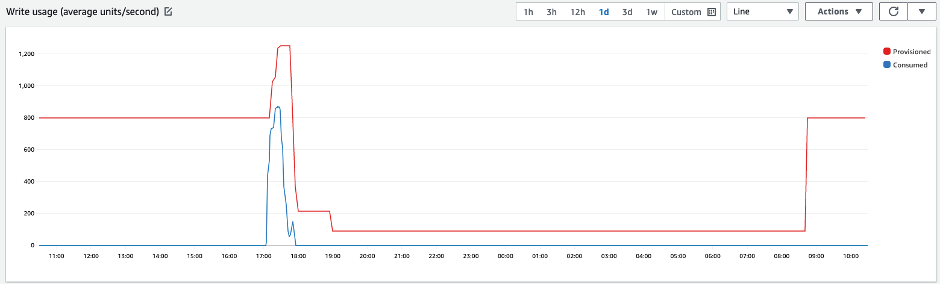
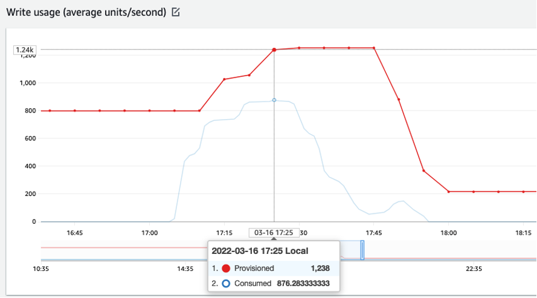
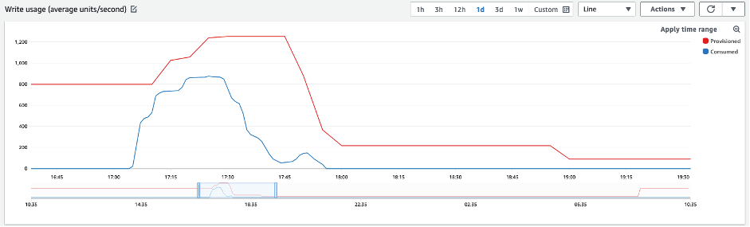

# Evaluate your table's Application Auto Scaling

settings

This section provides an overview of how to evaluate the Application Auto Scaling settings of your Amazon Keyspaces
tables. [Amazon Keyspaces Application Auto Scaling](autoscaling.md "autoscaling.md") is a feature that manages
table throughput based on your application traffic and your
target utilization metric. This ensures your tables have the required capacity
required for your application patterns.

The Application Auto Scaling service monitors your current table utilization and compares it to
the target utilization value: `TargetValue`. It notifies you if it is time to
increase or decrease the allocated capacity.

###### Topics

- [Understanding
  your Application Auto Scaling settings](#CostOptimization_AutoScalingSettings_UnderProvisionedTables "#CostOptimization_AutoScalingSettings_UnderProvisionedTables")
- [How to identify
  tables with low target utilization (<=50%)](#CostOptimization_AutoScalingSettings_IdentifyLowUtilization "#CostOptimization_AutoScalingSettings_IdentifyLowUtilization")
- [How to address
  workloads with seasonal variance](#CostOptimization_AutoScalingSettings_SeasonalVariance "#CostOptimization_AutoScalingSettings_SeasonalVariance")
- [How to address spiky
  workloads with unknown patterns](#CostOptimization_AutoScalingSettings_UnknownPatterns "#CostOptimization_AutoScalingSettings_UnknownPatterns")
- [How to address workloads
  with linked applications](#CostOptimization_AutoScalingSettings_BetweenRanges "#CostOptimization_AutoScalingSettings_BetweenRanges")

## Understanding

your Application Auto Scaling settings

Defining the correct value for the target utilization, initial step, and final values is
an activity that requires involvement from your operations team. This allows you to properly
define the values based on historical application usage, which is used to trigger the
Application Auto Scaling policies. The utilization target is the percentage of your total capacity
that needs to be met during a period of time before the Application Auto Scaling rules apply.

When you set a **high utilization target (a target around
90%)** it means your traffic needs to be higher than 90% for a period of time
before the Application Auto Scaling is activated. You should not use a high utilization target unless your
application is very constant and doesn’t receive spikes in traffic.

When you set a very **low utilization (a target less than
50%)** it means your application would need to reach 50% of the provisioned
capacity before it triggers an Application Auto Scaling policy. Unless your application traffic grows at
a very aggressive rate, this usually translates into unused capacity and wasted resources.

## How to identify

tables with low target utilization (<=50%)

You can use either the AWS CLI or AWS Management Console to monitor and identify the
`TargetValues` for your Application Auto Scaling policies in your Amazon Keyspaces resources.

###### Note

When you're using multi-Region tables in provisioned capacity mode with Amazon Keyspaces auto scaling,
make sure to use the Amazon Keyspaces API operations to configure auto scaling. The
underlying Application Auto Scaling API operations that Amazon Keyspaces calls on your behalf don't have multi-Region
capabilities. For more information, see [View the provisioned capacity and auto scaling settings for a multi-Region table in Amazon Keyspaces](tables-mrr-view.md "tables-mrr-view.md").

AWS CLI

1. Return the entire list of resources by running the following command:

```
aws application-autoscaling describe-scaling-policies --service-namespace cassandra
```

This command will return the entire list of Application Auto Scaling policies that are
issued to any Amazon Keyspaces resource. If you only want to retrieve the resources from a
particular table, you can add the `–resource-id parameter`. For
example:

```
aws application-autoscaling describe-scaling-policies --service-namespace cassandra --resource-id "keyspace/`keyspace-name`/table/`table-name`”
```

2. Return only the auto scaling policies for a particular table by running the
   following command

```
aws application-autoscaling describe-scaling-policies --service-namespace cassandra --resource-id "keyspace/`keyspace-name`/table/`table-name`”
```

The values for the Application Auto Scaling policies are highlighted
below. You need to ensure that the target value is greater than 50% to avoid
over-provisioning. You should obtain a result similar to the following:

```
{
    "ScalingPolicies": [
        {
            "PolicyARN": "arn:aws:autoscaling:us-east-1:111122223333:scalingPolicy:<uuid>:resource/keyspaces/table/table-name-scaling-policy",
            "PolicyName": $<full-table-name>”,
            "ServiceNamespace": "cassandra",
            "ResourceId": "keyspace/keyspace-name/table/table-name",
            "ScalableDimension": "cassandra:table:WriteCapacityUnits",
            "PolicyType": "TargetTrackingScaling",
            "TargetTrackingScalingPolicyConfiguration": {
                **"TargetValue": 70.0**,
                "PredefinedMetricSpecification": {
                    "PredefinedMetricType": "KeyspacesWriteCapacityUtilization"
                }
            },
            "Alarms": [
                ...
            ],
            "CreationTime": "2022-03-04T16:23:48.641000+10:00"
        },
        {
            "PolicyARN": "arn:aws:autoscaling:us-east-1:111122223333:scalingPolicy:<uuid>:resource/keyspaces/table/table-name-scaling-policy",
            "PolicyName":$<full-table-name>”,
            "ServiceNamespace": "cassandra",
            "ResourceId": "keyspace/keyspace-name/table/table-name",
            "ScalableDimension": "cassandra:table:ReadCapacityUnits",
            "PolicyType": "TargetTrackingScaling",
            "TargetTrackingScalingPolicyConfiguration": {
                **"TargetValue": 70.0**,
                "PredefinedMetricSpecification": {
                    "PredefinedMetricType": "KeyspacesReadCapacityUtilization"
                }
            },
            "Alarms": [
                ...
            ],
            "CreationTime": "2022-03-04T16:23:47.820000+10:00"
        }
    ]
}

```

AWS Management Console

1. Log into the AWS Management Console and navigate to the CloudWatch service page at [Getting Started with the AWS Management Console](../../../awsconsolehelpdocs/latest/gsg/getting-started.md "../../../awsconsolehelpdocs/latest/gsg/getting-started.md").
   Select the appropriate AWS Region if necessary.
2. On the left navigation bar, select **Tables**. On
   the **Tables** page, select the table's **Name**.
3. On the **Table Details** page on the **Capacity** tab, review your table's Application Auto Scaling
   settings.

If your target utilization values are less than or equal to 50%, you should explore your
table utilization metrics to see if they are [under-provisioned or
over-provisioned](CostOptimization_RightSizedProvisioning.md "CostOptimization_RightSizedProvisioning.md").

## How to address

workloads with seasonal variance

Consider the following scenario: your application is operating under a minimum average
value most of the time, but the utilization target is low so your application can react
quickly to events that happen at certain hours in the day and you have enough capacity and
avoid getting throttled. This scenario is common when you have an application that is very
busy during normal office hours (9 AM to 5 PM) but then it works at a base level during after
hours. Since some users start to connect before 9 am, the application uses this low
threshold to ramp up quickly to get to the _required_ capacity during peak
hours.

This scenario could look like this:

- Between 5 PM and 9 AM the `ConsumedWriteCapacityUnits` units stay between 90 and
  100
- Users start to connect to the application before 9 AM and the capacity units increases
  considerably (the maximum value you’ve seen is 1500 WCU)
- On average, your application usage varies between 800 to 1200 during working
  hours

If the previous scenario applies to your application, consider using [scheduled application auto
scaling](../../../autoscaling/application/userguide/examples-scheduled-actions.md "../../../autoscaling/application/userguide/examples-scheduled-actions.md"), where your table could still have an Application Auto Scaling rule
configured, but with a less aggressive target utilization that only provisions the extra
capacity at the specific intervals you require.

You can use the AWS CLI to execute the following steps to create a scheduled auto scaling rule
that executes based on the time of day and the day of the week.

1. Register your Amazon Keyspaces table as a scalable target with
   Application Auto Scaling. A scalable target is a resource that
   Application Auto Scaling can scale out or in.

```
aws application-autoscaling register-scalable-target \
    --service-namespace cassandra \
    --scalable-dimension cassandra:table:WriteCapacityUnits \
    --resource-id keyspace/`keyspace-name`/table/`table-name` \
    --min-capacity 90 \
    --max-capacity 1500
```

2. Set up scheduled actions according to your requirements.

You need two rules to cover the scenario: one to scale up and another to scale down.
The first rule to scale up the scheduled action is shown in the following example.

```
aws application-autoscaling put-scheduled-action \
    --service-namespace cassandra \
    --scalable-dimension cassandra:table:WriteCapacityUnits \
    --resource-id keyspace/`keyspace-name`/table/`table-name` \
    --scheduled-action-name my-8-5-scheduled-action \
    --scalable-target-action MinCapacity=800,MaxCapacity=1500 \
    --schedule "cron(45 8 ? * MON-FRI *)" \
    --timezone "Australia/Brisbane"
```

The second rule to scale down the scheduled action is shown in this example.

```
aws application-autoscaling put-scheduled-action \
    --service-namespace cassandra \
    --scalable-dimension cassandra:table:WriteCapacityUnits \
    --resource-id keyspace/`keyspace-name`/table/`table-name` \
    --scheduled-action-name my-5-8-scheduled-down-action \
    --scalable-target-action MinCapacity=90,MaxCapacity=1500 \
    --schedule "cron(15 17 ? * MON-FRI *)" \
    --timezone "Australia/Brisbane"
```

3. Run the following command to validate both rules have been activated:

```
aws application-autoscaling describe-scheduled-actions --service-namespace cassandra
```

You should get a result like this:

```
{
    "ScheduledActions": [
        {
            "ScheduledActionName": "my-5-8-scheduled-down-action",
            "ScheduledActionARN": "arn:aws:autoscaling:us-east-1:111122223333:scheduledAction:<uuid>:resource/keyspaces/table/table-name:scheduledActionName/my-5-8-scheduled-down-action",
            "ServiceNamespace": "cassandra",
            "Schedule": "cron(15 17 ? * MON-FRI *)",
            "Timezone": "Australia/Brisbane",
            "ResourceId": "keyspace/keyspace-name/table/table-name",
            "ScalableDimension": "cassandra:table:WriteCapacityUnits",
            "ScalableTargetAction": {
                "MinCapacity": 90,
                "MaxCapacity": 1500
            },
            "CreationTime": "2022-03-15T17:30:25.100000+10:00"
        },
        {
            "ScheduledActionName": "my-8-5-scheduled-action",
            "ScheduledActionARN": "arn:aws:autoscaling:us-east-1:111122223333:scheduledAction:<uuid>:resource/keyspaces/table/table-name:scheduledActionName/my-8-5-scheduled-action",
            "ServiceNamespace": "cassandra",
            "Schedule": "cron(45 8 ? * MON-FRI *)",
            "Timezone": "Australia/Brisbane",
            "ResourceId": "keyspace/keyspace-name/table/table-name",
            "ScalableDimension": "cassandra:table:WriteCapacityUnits",
            "ScalableTargetAction": {
                "MinCapacity": 800,
                "MaxCapacity": 1500
            },
            "CreationTime": "2022-03-15T17:28:57.816000+10:00"
        }
    ]
}
```

The following picture shows a sample workload that always keeps the 70% target
utilization. Notice how the auto scaling rules are still applying and the throughput is not
getting reduced.



Zooming in, we can see there was a spike in the application that triggered the 70% auto
scaling threshold, forcing the autoscaling to kick in and provide the extra capacity required
for the table. The scheduled auto scaling action will affect maximum and minimum values, and
it's your responsibility to set them up.





## How to address spiky

workloads with unknown patterns

In this scenario, the application uses a very low utilization target, because you don’t
know the application patterns yet, and you want to ensure your workload is not
experiencing low capacity throughput errors.

Consider using [on-demand capacity mode](ReadWriteCapacityMode.md "ReadWriteCapacityMode.md") instead.
On-demand tables are perfect for spiky
workloads where you don’t know the traffic patterns. With on-demand capacity mode, you pay per
request for the data reads and writes your application performs on your tables. You do not
need to specify how much read and write throughput you expect your application to perform, as
Amazon Keyspaces instantly accommodates your workloads as they ramp up or down.

## How to address workloads

with linked applications

In this scenario, the application depends on other systems, like batch processing
scenarios where you can have big spikes in traffic according to events in the application
logic.

Consider developing custom application auto-scaling logic that reacts to those events where
you can
increase table capacity and `TargetValues` depending on your specific needs. You
could benefit from Amazon EventBridge and use a combination of AWS services like
Λ and Step Functions to react to your specific application needs.
