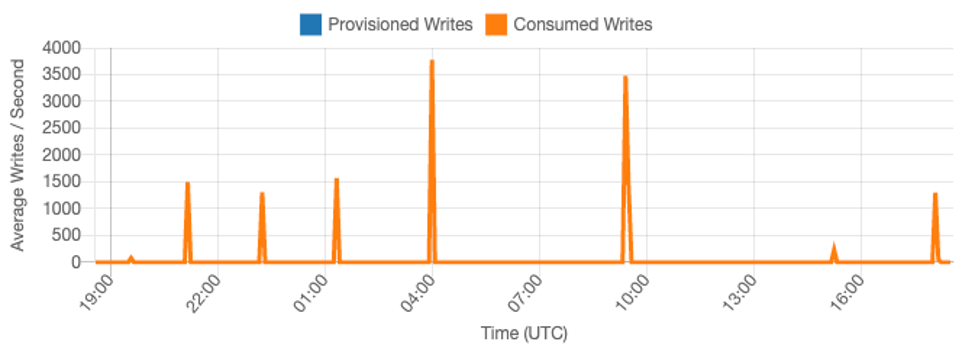
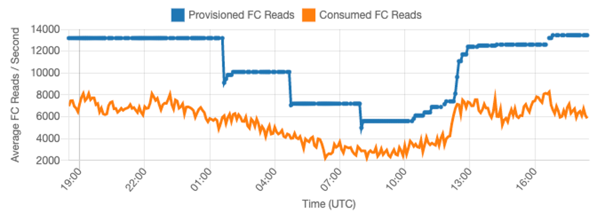

# Evaluate your table's capacity mode

This section provides an overview of how to select the appropriate capacity mode for your
Amazon Keyspaces table. Each mode is tuned to meet the needs of a different workload in terms of
responsiveness to change in throughput, as well as how that usage is billed. You must
balance these factors when making your decision.

###### Topics

- [What table capacity modes are
  available](#CostOptimization_TableCapacityMode_Overview "#CostOptimization_TableCapacityMode_Overview")
- [When to select on-demand
  capacity mode](#CostOptimization_TableCapacityMode_OnDemand "#CostOptimization_TableCapacityMode_OnDemand")
- [When to select provisioned
  capacity mode](#CostOptimization_TableCapacityMode_Provisioned "#CostOptimization_TableCapacityMode_Provisioned")
- [Additional factors to
  consider when choosing a table capacity mode](#CostOptimization_TableCapacityMode_AdditionalFactors "#CostOptimization_TableCapacityMode_AdditionalFactors")

## What table capacity modes are

available

When you create an Amazon Keyspaces table, you must select either on-demand or provisioned
capacity mode. For more information, see [Configure read/write capacity modes in Amazon Keyspaces](ReadWriteCapacityMode.md "ReadWriteCapacityMode.md").

###### On-demand capacity mode

The on-demand capacity mode is designed to eliminate the need to plan or provision
the capacity of your Amazon Keyspaces table. In this mode, your table instantly accommodates
requests without the need to scale any resources up or down (up to twice the
previous peak throughput of the table).

On-demand tables are billed by counting the number of actual requests against the
table, so you only pay for what you use rather than what has been provisioned.

###### Provisioned capacity mode

The provisioned capacity mode is a more traditional model where you can define how much
capacity the table has available for requests either directly or with the assistance of
Application Auto Scaling. Because a specific capacity is provisioned for the table at any given time,
billing is based off of the capacity provisioned rather than the number of requests. Going
over the allocated capacity can also cause the table to reject requests and reduce the
experience of your application's users.

Provisioned capacity mode requires a balance between not over-provisioning or under
provisioning the table to achieve both, low occurrence of insufficient throughput capacity
errors, and optimized costs.

## When to select on-demand

capacity mode

When optimizing for cost, on-demand mode is your best choice when you have an unpredictable workload
similar to the one shown in the following graph.

These factors contribute to this type of workload:

- Unpredictable request timing (resulting in traffic spikes)
- Variable volume of requests (resulting from batch workloads)
- Drops to zero or below 18% of the peak for a given hour (resulting from development or test
  environments)

For workloads with the above characteristics, using Application Auto Scaling to maintain enough
capacity for the table to respond to spikes in traffic may lead to undesirable
outcomes. Either the table could be over-provisioned and costing more than necessary, or
the table could be under provisioned and requests are leading to unnecessary low
capacity throughput errors. In cases like this, on-demand tables are the better choice.

Because on-demand tables are billed by request, there is nothing further you need to do at
the table level to optimize for cost. You should regularly evaluate your on-demand tables to
verify the workload still has the above characteristics. If the workload has stabilized,
consider changing to provisioned mode to maintain cost optimization.

## When to select provisioned

capacity mode

An ideal workload for provisioned capacity mode is one with a more predictable usage
pattern like shown in the graph below.

The following factors contribute to a predictable workload:

- Predicable/cyclical traffic for a given hour or day
- Limited short term bursts of traffic

Since the traffic volumes within a given time or day are more stable, you can set the
provisioned capacity relatively close to the actual consumed capacity of
the table. Cost optimizing a provisioned capacity table is ultimately an exercise in
getting the provisioned capacity (blue line) as close to the consumed capacity (orange
line) as possible without increasing `ThrottledRequests` events for the table. The
space between the two lines is both, wasted capacity as well as insurance against a bad
user experience due to insufficient throughput capacity errors.

Amazon Keyspaces provides Application Auto Scaling for provisioned capacity tables, which automatically balances
this on your behalf. You can track your consumed capacity throughout the day and
configure the provisioned capacity of the table based on a handful of variables.

###### Minimum capacity units

You can set the minimum capacity of a table to limit the occurrence of insufficient
throughput capacity errors, but it doesn't
reduce the cost of the table. If your table has periods of low usage followed by a
sudden burst of high usage, setting the minimum can prevent Application Auto Scaling from
setting the table capacity too low.

###### Maximum capacity units

You can set the maximum capacity of a table to limit a table scaling higher than
intended. Consider applying a maximum for development or test tables, where
large-scale load testing is not desired. You can set a maximum for any table, but be
sure to regularly evaluate this setting against the table baseline when using it in
production, to prevent accidental insufficient throughput capacity errors.

###### Target utilization

Setting the target utilization of the table is the primary means of cost
optimization for a provisioned capacity table. Setting a lower percent value here
increases how much the table is over-provisioned, increasing cost, but reducing the
risk of insufficient throughput capacity errors. Setting a higher percentage value
decreases by how much the table is over-provisioned, but increases the risk of
insufficient throughput capacity errors.

## Additional factors to

consider when choosing a table capacity mode

When deciding between the two capacity modes, there are some additional factors worth
considering.

When deciding between the two table modes, consider how much this additional discount
affects the cost of the table. In many cases, even a relatively unpredictable workload
can be more cost effective to run on an over-provisioned provisioned capacity table with
reserved capacity.

###### Improving predictability of your workload

In some situations, a workload may seemingly have both, a predictable and an
unpredictable pattern. While this can be easily supported with an on-demand table,
costs will likely be lower if the unpredictable patterns in the workload can be
improved.

One of the most common causes of these patterns are batch imports. This type of traffic can
often exceed the baseline capacity of the table to such a degree that insufficient throughput capacity errors would occur
if it were to run. To keep a workload like this running on a provisioned capacity table,
consider the following options:

- If the batch occurs at scheduled times, you can schedule an increase to your
  application auto- scaling capacity before it runs.
- If the batch occurs randomly, consider trying to extend the time it takes to run rather than
  executing as fast as possible.
- Add a ramp up period to the import, where the velocity of the import starts
  small but is slowly increased over a few minutes until Application Auto Scaling
  has had the opportunity to start adjusting table capacity.
