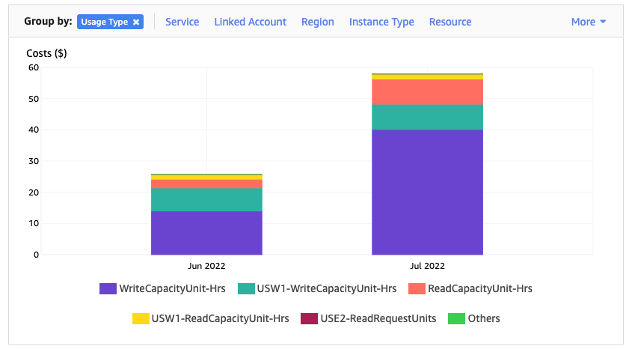

# Evaluate your costs at the table level

The Cost Explorer tool found within the AWS Management Console allows you to see costs broken down by type,
for example read, write, storage, and backup charges. You can also see these costs summarized by
period such as month or day.

One common challenge with Cost Explorer is that you can't review the costs of only one particular
table easily, because Cost Explorer doesn't let you filter or group by costs of a specific table. You
can view the metric **Billable table size (Bytes)** of each table in the Amazon Keyspaces console
on the table's **Monitor** tab. If you need more cost related information
per table, this section shows you how to use [tagging](tagging-keyspaces.md "tagging-keyspaces.md") to
perform individual table cost analysis in Cost Explorer.

###### Topics

- [How to view the costs of a
  single Amazon Keyspaces table](#CostOptimization_TableLevelCostAnalysis_ViewInfo "#CostOptimization_TableLevelCostAnalysis_ViewInfo")
- [Cost Explorer's default
  view](#CostOptimization_TableLevelCostAnalysis_CostExplorer "#CostOptimization_TableLevelCostAnalysis_CostExplorer")
- [How to use and apply table
  tags in Cost Explorer](#CostOptimization_TableLevelCostAnalysis_Tagging "#CostOptimization_TableLevelCostAnalysis_Tagging")

## How to view the costs of a

single Amazon Keyspaces table

You can see basic information about an Amazon Keyspaces table in the console, including the primary key schema, the billable table size,
and capacity related metrics. You can use the size of the table to calculate the monthly storage
cost for the table. For example, $0.25 per GB in the US East (N. Virginia) AWS Region.

If the table is using provisioned capacity mode, the current read capacity unit (RCU)
and write capacity unit (WCU) settings are
returned as well. You can use this information to calculate the current read and write costs for the
table. Note that these costs could change, especially if you have configured the table with Amazon Keyspaces automatic scaling.

## Cost Explorer's default

view

The default view in Cost Explorer provides charts showing the cost of consumed resources, for
example throughput and storage. You can choose to group these costs by period, such as
totals by month or by day. The costs of storage, reads, writes, and other categories can
be broken out and compared as well.

## How to use and apply table

tags in Cost Explorer

By default, Cost Explorer does not provide a summary of the costs for any one specific table,
because it combines the costs of multiple tables into a total. However, you can use
[AWS resource
tagging](../../../general/latest/gr/aws_tagging.md "../../../general/latest/gr/aws_tagging.md") to identify each table by a metadata tag. Tags are key-value pairs
that you can use for a variety of purposes, for example to identify all resources
belonging to a project or department. For more information, see [Working with tags and labels for Amazon Keyspaces resources](tagging-keyspaces.md "tagging-keyspaces.md").

For this example, we use a table with the name **MyTable**.

1. Set a tag with the key of **table_name** and the value of
   **MyTable**.
2. [Activate the tag
   within Cost Explorer](../../../awsaccountbilling/latest/aboutv2/activating-tags.md "../../../awsaccountbilling/latest/aboutv2/activating-tags.md") and then filter on the tag value to gain more visibility into each
   table's costs.

###### Note

It may take one or two days for the tag to start appearing in Cost Explorer

You can set metadata tags yourself in the console, or programmatically with CQL, the
AWS CLI, or the AWS SDK. Consider requiring a **table_name** tag to be set as part of your organization’s new table
creation process. For more information, see [Create cost allocation reports using tags for Amazon Keyspaces](CostAllocationReports.md "CostAllocationReports.md").
