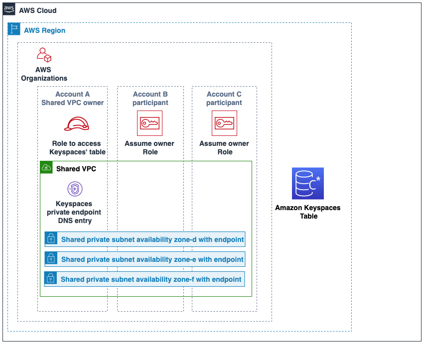

# Configure cross-account access to Amazon Keyspaces using VPC endpoints in a shared VPC

You can create different AWS accounts to separate
resources from applications. For example, you can create one account for your Amazon Keyspaces tables,
a different account for applications in a development environment, and another account for applications
in a production environment. This topic walks
you through the configuration steps required to set up cross-account access for Amazon Keyspaces using interface VPC endpoints
in a shared VPC.

For detailed steps how to configure a VPC endpoint for Amazon Keyspaces, see [Step 3: Create a VPC endpoint
for Amazon Keyspaces](vpc-endpoints-tutorial.md "vpc-endpoints-tutorial.md").

In this example we use the following three accounts in a shared VPC:

- `Account A:111111111111` – This account contains infrastructure, including the
  VPC endpoints, the VPC subnets, and Amazon Keyspaces tables.
- `Account B:222222222222` – This account contains an application in a development
  environment that needs to connect to the Amazon Keyspaces table in `Account A:111111111111`.
- `Account C:333333333333` – This account contains an application in a production environment
  that needs to connect to the Amazon Keyspaces table in `Account A:111111111111`.


`Account A:111111111111` is the account that contains the resources (an Amazon Keyspaces table) that
`Account B:222222222222` and `Account C:333333333333` need to access, so
`Account A:111111111111` is the _trusting_ account.
`Account B:222222222222` and `Account C:333333333333` are the accounts
with the principals that need access to the resources (an Amazon Keyspaces table) in `Account A:111111111111`,
so `Account B:222222222222` and `Account C:333333333333` are the
_trusted_ accounts. The trusting account grants the permissions
to the trusted accounts by sharing an IAM role. The following procedure outlines the
configuration steps required in `Account A:111111111111`.

###### Configuration for `Account A:111111111111`

1. Use AWS Resource Access Manager to create a resource share for the subnet and share the private subnet
   with `Account B:222222222222` and `Account C:333333333333`.

`Account B:222222222222` and `Account C:333333333333` can now see and create resources
in the subnet that has been shared with them. 2. Create an Amazon Keyspaces private VPC endpoint powered by AWS PrivateLink. This creates multiple
endpoints across shared subnets and DNS entries for the Amazon Keyspaces service endpoint. 3. Create an Amazon Keyspaces keyspace and table. 4. Create an IAM role in `Account A:111111111111` that has full access to the Amazon Keyspaces table, read access to the Amazon Keyspaces system tables,
and is able to describe the Amazon EC2 VPC resources as shown in the following policy example.

```
{
    "Version": "2012-10-17",
    "Statement": [
        {
            "Sid": "CrossAccountAccess",
            "Effect": "Allow",
            "Action": [
                "ec2:DescribeNetworkInterfaces",
                "ec2:DescribeVpcEndpoints",
                "cassandra:*"
            ],
            "Resource": "*"
        }
    ]
}
```

5. Configure a trust policy for the IAM role in `Account A:111111111111` so that
   `Account B:222222222222` and `Account C:333333333333` can
   assume the role as trusted accounts.
   This is shown in the following example.

```
{
  "Version": "2012-10-17",
  "Statement": [
    {
      "Effect": "Allow",
      "Principal": {
        "AWS": [
          "arn:aws:iam::222222222222:role/Cross-Account-Role-B",
          "arn:aws:iam::333333333333:role/Cross-Account-Role-C"
        ]
      },
      "Action": "sts:AssumeRole",
      "Condition": {}
    }
  ]
}
```

For more information about cross-account IAM policies, see [Cross-account policies](../../../IAM/latest/UserGuide/reference_policies_evaluation-logic-cross-account.md "../../../IAM/latest/UserGuide/reference_policies_evaluation-logic-cross-account.md") in the IAM User Guide.

###### Configuration in `Account B:222222222222` and `Account C:333333333333`

1. In `Account B:222222222222` and `Account C:333333333333`,
   create new roles and
   attach the following policy that allows the principal to assume the shared role
   created in `Account A:111111111111`.

```
{
    "Version": "2012-10-17",
    "Statement": [
        {
            "Effect": "Allow",
            "Principal": {
                "Service": "ec2.amazonaws.com"
            },
            "Action": "sts:AssumeRole"
        }
    ]
}
```

Allowing the principal to assume the shared role is implemented using the
`AssumeRole` API of the AWS Security Token Service (AWS STS). For more information, see
[Providing access to an IAM user in another AWS account that you own](../../../IAM/latest/UserGuide/id_roles_common-scenarios_aws-accounts.md "../../../IAM/latest/UserGuide/id_roles_common-scenarios_aws-accounts.md")
in the IAM User Guide. 2. In `Account B:222222222222` and `Account C:333333333333`, you can create
applications that utilize the SIGV4 authentication plugin, which allows an
application to assume the shared role to connect to the Amazon Keyspaces table located in
`Account A:111111111111` through the VPC endpoint in the shared VPC.
For more information about the SIGV4 authentication plugin, see [Create credentials for programmatic access to Amazon Keyspaces](programmatic.md "programmatic.md") . For more
information on how to configure an application to assume a role in another AWS account,
see [Authentication and
access](../../../sdkref/latest/guide/access.md "../../../sdkref/latest/guide/access.md") in the _AWS SDKs and Tools Reference Guide_.
