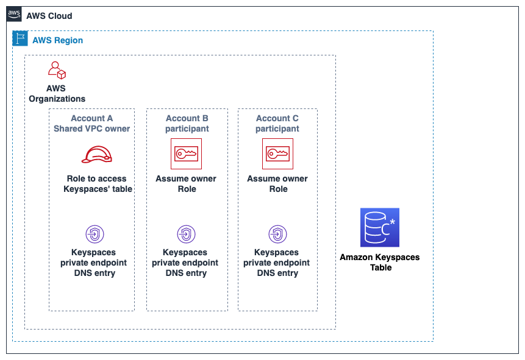

# Configuring cross-account access to Amazon Keyspaces without a shared VPC

If the Amazon Keyspaces table and private VPC endpoint are owned by different accounts but are
not sharing a VPC, applications can still connect cross-account using VPC endpoints.
Because the accounts are not sharing the VPC endpoints, `Account A:111111111111`,
`Account B:222222222222`, and `Account C:333333333333` require their own
VPC endpoints. To the Cassandra client driver, Amazon Keyspaces appears like a single node instead
of a multi-node cluster. Upon connection, the client driver reaches the DNS server which
returns one of the available endpoints in the account’s VPC.

You can also access Amazon Keyspaces tables across different accounts without a shared VPC endpoint by using the public
endpoints or deploying a private VPC endpoint in each account. When not using a shared VPC, each
account requires its own VPC endpoint. In this example `Account A:111111111111`, `Account B:222222222222`,
and `Account C:333333333333`
require their own VPC endpoints to access the table in `Account A:111111111111`. When using VPC endpoints in
this configuration, Amazon Keyspaces appears as a single node cluster to the Cassandra client
driver instead of a multi-node cluster. Upon connection, the client driver reaches the DNS server
which returns one of the available endpoints in the account’s VPC. But the client driver is not able to access
the `system.peers` table to discover additional endpoints. Because there are less hosts available, the driver
makes less connections. To adjust this, increase the connection pool setting of the driver by a factor of three.


`Account A:111111111111` is the account that contains the resources (an Amazon Keyspaces table) that
`Account B:222222222222` and `Account C:333333333333` need to access, so
`Account A:111111111111` is the _trusting_ account.
`Account B:222222222222` and `Account C:333333333333` are the accounts
with the principals that need access to the resources (an Amazon Keyspaces table) in `Account A:111111111111`,
so `Account B:222222222222` and `Account C:333333333333` are the
_trusted_ accounts. The trusting account grants the permissions
to the trusted accounts by sharing an IAM role. The following procedure outlines the
configuration steps required in `Account A:111111111111`.

###### Configuration for `Account A:111111111111`

1. Create an Amazon Keyspaces keyspace and table in `Account A:111111111111`.
2. Create an IAM role in `Account A:111111111111` that has full access to the Amazon Keyspaces table and
   read access to the Amazon Keyspaces system tables.

```
{
   "Version":"2012-10-17",
   "Statement":[
      {
         "Effect":"Allow",
         "Action":[
            "cassandra:Select",
            "cassandra:Modify"
         ],
         "Resource":[
            "arn:aws:cassandra:`us-east-1`:111111111111:/keyspace/mykeyspace/table/mytable",
            "arn:aws:cassandra:`us-east-1`:111111111111:/keyspace/system*"
         ]
      }
   ]
}
```

3. Configure a trust policy for the IAM role in `Account A:111111111111` so that
   principals in `Account B:222222222222` and `Account C:333333333333`
   can assume the role as trusted accounts. This is shown in the following example.

```
{
  "Version": "2012-10-17",
  "Statement": [
    {
      "Effect": "Allow",
      "Principal": {
        "AWS": [
          "arn:aws:iam::222222222222:role/Cross-Account-Role-B",
          "arn:aws:iam::333333333333:role/Cross-Account-Role-C"
        ]
      },
      "Action": "sts:AssumeRole",
      "Condition": {}
    }
  ]
}
```

For more information about cross-account IAM policies, see [Cross-account policies](../../../IAM/latest/UserGuide/reference_policies_evaluation-logic-cross-account.md "../../../IAM/latest/UserGuide/reference_policies_evaluation-logic-cross-account.md") in the IAM User Guide. 4. Configure the VPC endpoint in `Account A:111111111111` and attach permissions to the
endpoint that allow the roles from `Account B:222222222222` and
`Account C:333333333333` to assume the role in `Account
 A` using the VPC endpoint. These permissions are valid for the VPC
endpoint that they are attached to. For more information about VPC endpoint
policies, see [Controlling access to interface VPC
endpoints for Amazon Keyspaces](vpc-endpoints.md#interface-vpc-endpoints-policies "vpc-endpoints.md#interface-vpc-endpoints-policies").

```
{{
  "Version": "2012-10-17",
  "Statement": [
    {
      "Sid": "AllowAccessfromSpecificIAMroles",
      "Effect": "Allow",
      "Action": "cassandra:*",
      "Resource": "*",
      "Principal": "*",
      "Condition": {
        "ArnEquals": {
          "aws:PrincipalArn": [
            "arn:aws:iam::222222222222:role/Cross-Account-Role-B",
            "arn:aws:iam::333333333333:role/Cross-Account-Role-C"
          ]
        }
      }
    }
  ]
}
```

###### Configuration in `Account B:222222222222` and `Account C:333333333333`

1. In `Account B:222222222222` and `Account C:333333333333`, create new roles and
   attach the following policy that allows the principal to assume the shared role
   created in `Account A:111111111111`.

```
{
    "Version": "2012-10-17",
    "Statement": {
            "Effect": "Allow",
            "Action": "sts:AssumeRole",
            "Resource": "arn:aws:iam::111111111111:role/keyspaces_access"
        }
}
```

Allowing the principal to assume the shared role is implemented using the
`AssumeRole` API of the AWS Security Token Service (AWS STS). For more information, see
[Providing access to an IAM user in another AWS account that you own](../../../IAM/latest/UserGuide/id_roles_common-scenarios_aws-accounts.md "../../../IAM/latest/UserGuide/id_roles_common-scenarios_aws-accounts.md")
in the IAM User Guide. 2. In `Account B:222222222222` and `Account C:333333333333`, you can create
applications that utilize the SIGV4 authentication plugin, which allows an
application to assume the shared role to connect to the Amazon Keyspaces table located in
`Account A:111111111111`. For more information about the SIGV4
authentication plugin, see [Create credentials for programmatic access to Amazon Keyspaces](programmatic.md "programmatic.md") . For more
information on how to configure an application to assume a role in another AWS account,
see [Authentication and
access](../../../sdkref/latest/guide/access.md "../../../sdkref/latest/guide/access.md") in the _AWS SDKs and Tools Reference Guide_.
