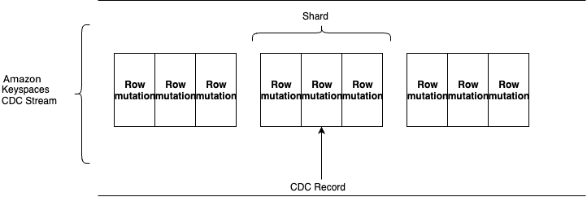

# How change data capture (CDC) streams work in Amazon Keyspaces

This section provides an overview of how change data capture (CDC) streams work in Amazon Keyspaces.

Amazon Keyspaces change data capture (CDC) records an ordered sequence of row-level modifications in Amazon Keyspaces tables and stores
this information in a log called _stream_ for up to 24 hours. Every row-level modification generates
a new CDC record that holds the primary key column information as well as the “before” and “after” states of the row
including all the columns. Applications can access the stream and view the mutations in near-real time.

When you enable CDC on your table, Amazon Keyspaces creates a new CDC stream and starts to capture information about
every modification in the table. The CDC stream has an Amazon Resource Name (ARN) with the following format:

```
arn:${Partition}:cassandra:{Region}:${Account}:/keyspace/${keyspaceName}/table/${tableName}/stream/${streamLabel}
```

You can select the type of information or the _view type_ that the CDC stream collects for each record
when you first enable the CDC stream. You can't change the view type of the stream afterward. Amazon Keyspaces supports the following view types:

- `NEW_AND_OLD_IMAGES` – Captures the versions of the row before as well as after the mutation. This is the default.
- `NEW_IMAGE` – Captures the version of the row after the mutation.
- `OLD_IMAGE` – Captures the version of the row before the mutation.
- `KEYS_ONLY` – Captures the partition and clustering keys of the row that was mutated.
  Every CDC stream consists of records. Each record represents a single row modification in an Amazon Keyspaces table. Records are logically organized into
  groups known as _shards_. These groups are logically organized by ranges of the
  primary key (combination of partition key, clustering key ranges) and are an internal construct of Amazon Keyspaces. Each shard acts as a container for multiple
  records, and contains information required for accessing and iterating through these records.


Each CDC record is assigned a sequence number, reflecting the order in which the record was published within the shard.
The sequence number is guaranteed to be increasing and unique within each shard.

Amazon Keyspaces creates and deletes shards automatically. Based on traffic loads Amazon Keyspaces can also split or merge shards over time.
For example, Amazon Keyspaces can split one shard into multiple new shards or merge shards into a new single shard. Amazon Keyspaces APIs publish the shard and CDC stream
information to allow consuming applications to process records in the right order by accessing the entire lineage graph of a shard.

Amazon Keyspaces CDC is based on the following principles that you can rely on when building your application:

- Each row-level mutation record appears exactly once in the CDC stream.
- When you consume shards in order of lineage, each row-level mutation record appears in
  the same sequence as the actual mutation order on the primary key.

###### Topics

- [Data retention](#CDC_how-it-works-data-retention "#CDC_how-it-works-data-retention")
- [TTL data expiration](#CDC_how-it-works-ttl "#CDC_how-it-works-ttl")
- [Batch operations](#CDC_how-it-works-batch-operations "#CDC_how-it-works-batch-operations")
- [Static columns](#CDC_how-it-works-static "#CDC_how-it-works-static")
- [Encryption at rest](#CDC_how-it-works-encryption "#CDC_how-it-works-encryption")
- [Multi-Region replication](#CDC_how-it-works-mrr "#CDC_how-it-works-mrr")
- [Integration with AWS services](#howitworks_integration "#howitworks_integration")

## How data retention works for CDC streams in

Amazon Keyspaces

Amazon Keyspaces retains the records in the CDC stream for a period of 24 hours. You can't change the retention period.
If you disable CDC on a table, the data in the stream continues to be readable for 24 hours. After this time,
the data expires and the records are automatically deleted.

## How Time to Live (TTL) data expiration works with CDC streams in

Amazon Keyspaces

Amazon Keyspaces shows the expiration time at the column/cell level as well as the row level in a
metadata field called `expirationTime` in the CDC change records. When Amazon Keyspaces
TTL detects expiration of a cell, CDC creates a new change record that shows TTL
as the origin of the change. For more information about TTL, see [Expire data with Time to Live (TTL) for Amazon Keyspaces (for Apache Cassandra)](TTL.md "TTL.md").

## How batch operations work for CDC streams in

Amazon Keyspaces

Batch operations are internally divided into individual row-level modifications. Amazon Keyspaces retains all records within CDC streams
at the row-level, even if the modification occurred in a batch operation. Amazon Keyspaces maintains the order of records within the CDC stream
in the same sequence as the mutation order that occurred at the row-level or on the primary key.

## How static columns work in CDC streams in

Amazon Keyspaces

Static column values are shared among all rows in a partition in Cassandra. Due to this behavior, Amazon Keyspaces captures any updates to a static column
as a separate record in the CDC stream. The following examples summarize the behavior of static column mutations:

- When only the static column is updated, the CDC stream contains a row-modification for the static column as the only column in the row.
- When a row is updated without any change to the static column,
  the CDC stream contains a row-modification that contains all columns except the static column.
- When a row is updated along with the static column, the CDC stream contains two separate row-modifications,
  one for the static column and the other for the rest of the row.

## How encryption at rest works for CDC streams in

Amazon Keyspaces

To encrypt the data at rest in the CDC ordered log, Amazon Keyspaces uses the same encryption key
that is already used for the table. For more information about encryption at rest, see
[Encryption at rest in Amazon Keyspaces](EncryptionAtRest.md "EncryptionAtRest.md").

## How multi-Region replication works for CDC streams in

Amazon Keyspaces

You can enable and disable CDC streams for individual replicas of a multi-Region table by using either the `update-table` API or
the `ALTER TABLE` CQL command. Due to asynchronous replication and conflict resolution, CDC streams for multi-Region
tables are not consistent across AWS Regions. Therefore, the records that Amazon Keyspaces captures in the stream might
appear in a different order in different Regions.

For more information about multi-Region replication, see [Multi-Region replication for Amazon Keyspaces (for Apache Cassandra)](multiRegion-replication.md "multiRegion-replication.md").

## CDC streams and integration with AWS

services

### How to work with VPC endpoints for CDC streams in

Amazon Keyspaces

You can use VPC endpoints to access Amazon Keyspaces CDC streams. For information about how to create and
access VPC endpoints for streams, see [Using Amazon Keyspaces CDC streams with interface VPC endpoints](vpc-endpoints-streams.md "vpc-endpoints-streams.md").

### How monitoring with CloudWatch works for CDC streams in

Amazon Keyspaces

You can use Amazon CloudWatch to monitor API calls made to the Amazon Keyspaces CDC endpoint. For more
information about the available metrics, see [Metrics for Amazon Keyspaces change data capture (CDC)](metrics-dimensions.md#keyspaces-cdc-metrics "metrics-dimensions.md#keyspaces-cdc-metrics").

### How logging with CloudTrail works for CDC streams in

Amazon Keyspaces

Amazon Keyspaces CDC is integrated with AWS CloudTrail, a service that provides a record of actions taken by a user, role, or an AWS service in Amazon Keyspaces.
CloudTrail captures Data Definition Language (DDL) API calls and Data Manipulation Language (DML) API calls for Amazon Keyspaces as events.
The calls that are captured include calls from the Amazon Keyspaces console and programmatic calls to the Amazon Keyspaces API operations.

For more information about the CDC events captured by CloudTrail, see [Logging Amazon Keyspaces API calls with AWS CloudTrail](logging-using-cloudtrail.md "logging-using-cloudtrail.md").

### How tagging works for CDC streams in

Amazon Keyspaces

Amazon Keyspaces CDC streams are a taggable resource. You can tag a stream when you create a
table programmatically using CQL, the AWS SDK, or the AWS CLI. You can also tag
existing streams, delete tags, or view tags of a stream. For more information, see
[Tag keyspaces, tables, and streams in Amazon Keyspaces](Tagging.md "Tagging.md").
