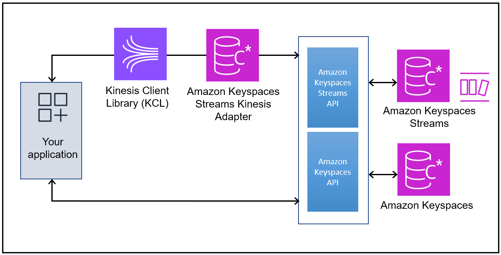

# Use the Kinesis Client Library (KCL) to process Amazon Keyspaces streams

This topic describes how to use the Kinesis Client Library (KCL) to consume and process data from Amazon Keyspaces change data capture (CDC) streams.

Instead of working directly with the Amazon Keyspaces Streams API, working with the Kinesis Client Library (KCL) provides many benefits, for example:

- Built in shard lineage tracking and iterator handling.
- Automatic load balancing across workers.
- Fault tolerance and recovery from worker failures.
- Checkpointing to track processing progress.
- Adaptation to changes in stream capacity.
- Simplified distributed computing for processing CDC records.
  The following section outlines why and how to use the Kinesis Client Library (KCL) to process streams
  and provides an example for processing an Amazon Keyspaces CDC stream with the KCL.

For information about pricing, see [Amazon Keyspaces (for Apache Cassandra)
pricing](https://aws.amazon.com/keyspaces/pricing "https://aws.amazon.com/keyspaces/pricing").

## What is the Kinesis Client Library?

The Kinesis Client Library (KCL) is a standalone Java software library designed to simplify the process of consuming
and processing data from streams. KCL handles many of the complex tasks associated with distributed computing,
letting you focus on implementing your business logic when processing stream data. KCL manages activities such as load
balancing across multiple workers, responding to worker failures, checkpointing processed records, and responding to
changes in the number of shards in the stream.

To process Amazon Keyspaces CDC streams, you can use the design patterns found in the KCL for working with stream shards and stream records.
The KCL simplifies coding by providing useful
abstractions above the low-level Kinesis Data Streams API. For more information about the KCL, see
[Develop consumers with KCL](../../../kinesis/latest/dev/develop-kcl-consumers.md "../../../kinesis/latest/dev/develop-kcl-consumers.md") in the _Amazon Kinesis Data Streams Developer Guide_.

To write applications using the KCL, you use the Amazon Keyspaces Streams Kinesis Adapter. The Kinesis
Adapter implements the Kinesis Data Streams interface so that you can use the KCL for consuming and
processing records from Amazon Keyspaces streams. For instructions on how to set up and install the Amazon Keyspaces
streams Kinesis adapter, visit the [GitHub](https://github.com/aws/keyspaces-streams-kinesis-adapter "https://github.com/aws/keyspaces-streams-kinesis-adapter") repository.

The following diagram shows how these libraries interact with each other.

KCL is frequently updated to incorporate newer versions of underlying libraries, security improvements, and bug fixes.
We recommend that you use the latest version of KCL to avoid known issues and benefit from all latest improvements.
To find the latest KCL version, see [KCL GitHub repository](https://github.com/awslabs/amazon-kinesis-client "https://github.com/awslabs/amazon-kinesis-client").

## KCL concepts

Before you implement a consumer application using KCL, you should understand the following concepts:

**KCL consumer application**

A KCL consumer application is a program that processes data from an Amazon Keyspaces CDC stream. The KCL acts as an intermediary between your
consumer application code and the Amazon Keyspaces CDC stream.

**Worker**

A worker is an execution unit of your KCL consumer application that processes data from the Amazon Keyspaces CDC stream. Your application can run
multiple workers distributed across multiple instances.

**Record processor**

A record processor is the logic in your application that processes data from a shard in the Amazon Keyspaces CDC stream. A record processor
is instantiated by a worker for each shard it manages.

**Lease**

A lease represents the processing responsibility for a shard. Workers use leases to coordinate which worker is processing
which shard. KCL stores lease data in a table in Amazon DynamoDB.

**Checkpoint**

A checkpoint is a record of the position in the shard up to which the record processor has successfully processed records.
Checkpointing enables your application to resume processing from where it left off if a worker fails.

With the Amazon Keyspaces Kinesis adapter in place, you can begin developing against the KCL interface,
with the API calls seamlessly directed at the Amazon Keyspaces stream endpoint. For a list of available
endpoints, see [How to access CDC stream endpoints in
Amazon Keyspaces](CDC_access-endpoints.md "CDC_access-endpoints.md").

When your application starts, it calls the KCL to instantiate a worker. You must provide
the worker with configuration information for the application, such as the stream descriptor
and AWS credentials, and the name of a record processor class that you provide. As it runs
the code in the record processor, the worker performs the following tasks:

- Connects to the stream
- Enumerates the shards within the stream
- Coordinates shard associations with other workers (if any)
- Instantiates a record processor for every shard it manages
- Pulls records from the stream
- Pushes the records to the corresponding record processor
- Checkpoints processed records
- Balances shard-worker associations when the worker instance count changes
- Balances shard-worker associations when shards are split
