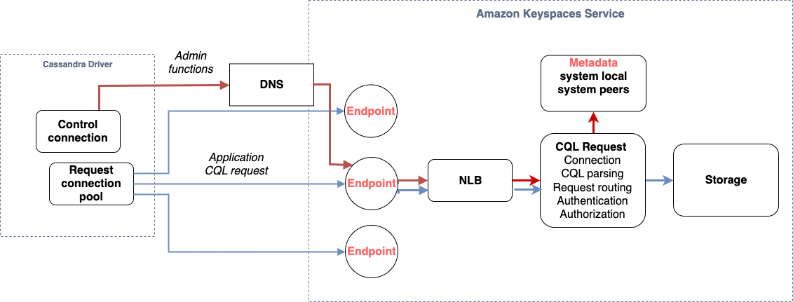
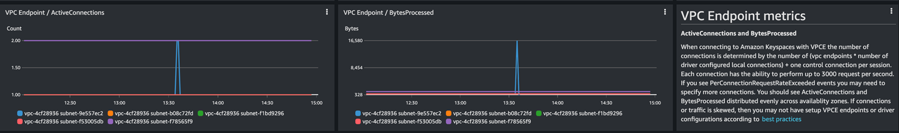

# Optimize client driver connections for the serverless environment

To communicate with Amazon Keyspaces, you can use any of the existing Apache Cassandra client drivers of your choice. Because Amazon Keyspaces is
a serverless service, we recommend that you optimize the connection configuration of your client driver for the throughput
needs of your application. This topic introduces best practices including how to calculate how many connections your
application requires, as well as monitoring and error handling of connections.

###### Topics

- [How connections work in Amazon Keyspaces](#connections.howtheywork "#connections.howtheywork")
- [How to configure connections in Amazon Keyspaces](#connections.howtoconfigure "#connections.howtoconfigure")
- [How to configure the retry policy for connections in Amazon Keyspaces](#connections.retry-policies "#connections.retry-policies")
- [How to configure connections over VPC endpoints in Amazon Keyspaces](#connections.VPCendpoints "#connections.VPCendpoints")
- [How to monitor connections in Amazon Keyspaces](#connections.howtomonitor "#connections.howtomonitor")
- [How to handle connection errors in Amazon Keyspaces](#connections.errorhandling "#connections.errorhandling")

## How connections work in Amazon Keyspaces

This sections gives an overview of how client driver connections work in Amazon Keyspaces. Because Cassandra client driver misconfiguration
can result in `PerConnectionRequestExceeded`
events in Amazon Keyspaces, configuring the right amount of connections in the client driver configuration is required to avoid these and
similar connection errors.

When connecting to Amazon Keyspaces, the driver requires a seed endpoint to establish an initial connection. Amazon Keyspaces uses DNS to route the initial connection
to one of the many available endpoints.
The endpoints are attached to network load balancers that in turn establish a connection to one of the request handlers in the fleet.
After the initial connection is established, the client driver gathers information about
all available endpoints from the `system.peers` table. With this information, the client driver can create additional
connections to the listed endpoints. The number
of connections the client driver can create is limited by the number of local connections specified in the client driver settings.
By default, most client drivers establish one connection
per endpoint and establish a connection pool to Cassandra and load balance queries over that pool of connections.
Although multiple connections can be established to the same endpoint,
behind the network load balancer they may be connected to many different request handlers. When connecting through the public endpoint,
establishing one connection to each of the nine endpoints listed in the `system.peers` table results in nine connections
to different request handlers.



## How to configure connections in Amazon Keyspaces

Amazon Keyspaces supports up to 3,000 CQL queries per TCP connection per second. Because there's no limit on the number of
connections a driver can establish, we recommend to target only **500 CQL requests per second per connection**
to allow for overhead, traffic bursts, and better load balancing. Follow these steps to ensure
that your driver's connection is correctly configured for the needs of your
application.

**Increase the number of connections per IP address your driver is maintaining in its connection
pool.**

- Most Cassandra drivers establish a connection pool to Cassandra and
  load balance queries over that pool of connections. The default behavior of most
  drivers is to establish a single connection to each endpoint. Amazon Keyspaces exposes nine
  peer IP addresses to drivers, so based on the default behavior of most drivers,
  this results in 9 connections. Amazon Keyspaces supports up to 3,000 CQL queries per TCP
  connection per second, therefore, the maximum CQL query throughput of a driver using
  the default settings is 27,000 CQL queries per second. If you use the driver's default settings, a single
  connection may have to process more than the maximum CQL query throughput of
  3,000 CQL queries per second. This could result in `PerConnectionRequestExceeded` events.
- To avoid `PerConnectionRequestExceeded`
  events, you must configure the driver to create additional connections per endpoint to distribute the throughput.
- As a best practice in Amazon Keyspaces, assume that each connection can
  support **500 CQL queries per second**.
- That means that for a production application that needs to support an estimated 27,000 CQL queries
  per second distributed over the nine available endpoints, you must configure six connections per
  endpoint. This ensures that each connection processes no more than 500 requests per second.

**Calculate the number of connections per IP address you need to configure for your driver
based on the needs of your application.**

To determine the number of connections you need to configure per endpoint for your
application, consider the following example. You have an application that needs to
support 20,000 CQL queries per second consisting of 10,000 `INSERT`, 5,000
`SELECT`, and 5,000 `DELETE` operations. The Java application
is running on three instances on Amazon Elastic Container Service (Amazon ECS) where each instance establishes a single
session to Amazon Keyspaces. The calculation you can use to estimate how many connections you need
to configure for your driver uses the following input.

1. The number of requests per second your application needs to support.
2. The number of the available instances with one subtracted to account for maintenance or failure.
3. The number of available endpoints. If you're connecting over public endpoints, you have nine available endpoints. If you're using VPC
   endpoints, you have between two and five available endpoints, depending on the Region.
4. Use 500 CQL queries per second per connection as a best practice for Amazon Keyspaces.
5. Round up the result.

For this example, the formula looks like this.

```
20,000 CQL queries / (3 instances - 1 failure) / 9 public endpoints / 500 CQL queries per second = ROUND(2.22) = 3
```

Based on this calculation, you need to specify three local connections per endpoint in the driver configuration.
For remote connections, configure only one connection per endpoint.

## How to configure the retry policy for connections in Amazon Keyspaces

When configuring the retry policy for a connection to Amazon Keyspaces, we recommend that you implement the Amazon Keyspaces retry policy
`AmazonKeyspacesExponentialRetryPolicy`. This retry policy is better suited to retry across different
connections to Amazon Keyspaces than the driver's `DefaultRetryPolicy`.

With the `AmazonKeyspacesExponentialRetryPolicy`, you can configure the number of retry attempts for the
connection that meet your needs. By default, the number of retry attempts for the
`AmazonKeyspacesExponentialRetryPolicy` is set to 3.

An additional advantage is that the Amazon Keyspaces retry policy passes back the original exception returned by the service,
which indicates why the request attempt failed. The default retry policy only returns the generic
`NoHostAvailableException`, which might hide insights into the request failure.

To configure the request retry policy using the `AmazonKeyspacesExponentialRetryPolicy`, we recommend that you
configure a small number of retries, and handle any returned exceptions in your application code.

For code examples implementing retry policies, see [Amazon Keyspaces retry policies](https://github.com/aws-samples/amazon-keyspaces-java-driver-helpers/tree/main/src/main/java/com/aws/ssa/keyspaces/retry "https://github.com/aws-samples/amazon-keyspaces-java-driver-helpers/tree/main/src/main/java/com/aws/ssa/keyspaces/retry") on Github.

## How to configure connections over VPC endpoints in Amazon Keyspaces

When connecting over private VPC endpoints, you have most likely 3 endpoints
available. The number of VPC endpoints can be different per Region, based on the number
of Availability Zones, and the number of subnets in the assigned VPC. US East (N. Virginia) Region has
five Availability Zones and you can have up to five Amazon Keyspaces endpoints. US West (N. California) Region has
two Availability Zones and you can have up to two Amazon Keyspaces endpoints. The number of
endpoints does not impact scale, but it does increase the number of connections you need
to establish in the driver configuration. Consider the following example. Your
application needs to support 20,000 CQL queries and is running on three instances on
Amazon ECS where each instance establishes a single session to Amazon Keyspaces. The only difference is
how many endpoints are available in the different AWS Regions.

Connections required in the US East (N. Virginia) Region:

```
20,000 CQL queries / (3 instances - 1 failure) / 5 private VPC endpoints / 500 CQL queries per second = 4 local connections
```

Connections required in the US West (N. California) Region:

```
20,000 CQL queries / (3 instances - 1 failure) / 2 private VPC endpoints / 500 CQL queries per second = 10 local connections
```

###### Important

When using private VPC endpoints, additional permissions are required for Amazon Keyspaces to discover
the available VPC endpoints dynamically and populate the
`system.peers` table. For more information, see [Populating system.peers table entries with
interface VPC endpoint information](vpc-endpoints.md#system_peers "vpc-endpoints.md#system_peers").

When accessing Amazon Keyspaces through a private VPC endpoint using a different AWS account, it’s likely that you only see a
single Amazon Keyspaces endpoint. Again this doesn't impact the scale of possible throughput to Amazon Keyspaces, but it may require
you to increase the number of connections in your driver configuration. This example shows the same calculation for a single
available endpoint.

```
20,000 CQL queries / (3 instances - 1 failure) / 1 private VPC endpoints / 500 CQL queries per second = 20 local connections
```

To learn more about cross-account access to Amazon Keyspaces using a shared VPC, see
[Configure cross-account access to Amazon Keyspaces using VPC endpoints in a shared VPC](access.cross-account.md "access.cross-account.md").

## How to monitor connections in Amazon Keyspaces

To help identify the number of endpoints your application is connected to, you can log the number of peers discovered
in the `system.peers` table. The following example is an example of Java code which prints the number of peers
after the connection has been established.

```
ResultSet result = session.execute(new SimpleStatement("SELECT * FROM system.peers"));

logger.info("number of Amazon Keyspaces endpoints:" + result.all().stream().count());
```

###### Note

The CQL console or AWS console are not deployed within a VPC and therefore use the public endpoint. As a result,
running the `system.peers` query from applications located outside of the VPCE often results in 9 peers.
It may also be helpful to print the IP addresses of each peer.

You can also observe the number of peers when using a VPC endpoint by setting up VPCE Amazon CloudWatch metrics. In CloudWatch,
you can see the number of connections established to the VPC endpoint. The Cassandra drivers establish a connection
for each endpoint to send CQL queries and a control connection to gather system table information. The image below
shows the VPC endpoint
CloudWatch metrics after connecting to Amazon Keyspaces with 1 connection configured in the driver settings. The metric is showing six
active connections consisting of one control connection and five connections (1 per endpoint across Availability Zones).



To get started with monitoring the number of connections using a CloudWatch graph, you can deploy this CloudFormation template available on GitHub
in the [Amazon Keyspaces template](https://github.com/aws-samples/amazon-keyspaces-cloudwatch-cloudformation-templates "https://github.com/aws-samples/amazon-keyspaces-cloudwatch-cloudformation-templates")
repository.

## How to handle connection errors in Amazon Keyspaces

When exceeding the 3,000 request per connection quota, Amazon Keyspaces returns a
`PerConnectionRequestExceeded`event and the Cassandra driver receives a `WriteTimeout` or
`ReadTimeout` exception. You should retry this exception with exponential backoff in
your Cassandra retry policy or in your application. You should provide exponential
backoff to avoid sending additional request.

The default retry policy attempts to `try next host` in the query plan. Because Amazon Keyspaces may have one to three
available endpoints when connecting to the VPC endpoint, you may also see the `NoHostAvailableException` in addition
to the `WriteTimeout` and
`ReadTimeout` exceptions in your application logs. You can use Amazon Keyspaces provided retry policies, which retry on the
same endpoint but across different connections.

You can find examples for exponential retry
policies for Java on GitHub
in the
[Amazon Keyspaces Java code examples](https://github.com/aws-samples/amazon-keyspaces-java-driver-helpers/blob/main/src/main/java/com/aws/ssa/keyspaces/retry/AmazonKeyspacesExponentialRetryPolicy.java "https://github.com/aws-samples/amazon-keyspaces-java-driver-helpers/blob/main/src/main/java/com/aws/ssa/keyspaces/retry/AmazonKeyspacesExponentialRetryPolicy.java") repository. You can find additional language
examples on Github in the [Amazon Keyspaces code examples](https://github.com/aws-samples/amazon-keyspaces-examples "https://github.com/aws-samples/amazon-keyspaces-examples") repository.
