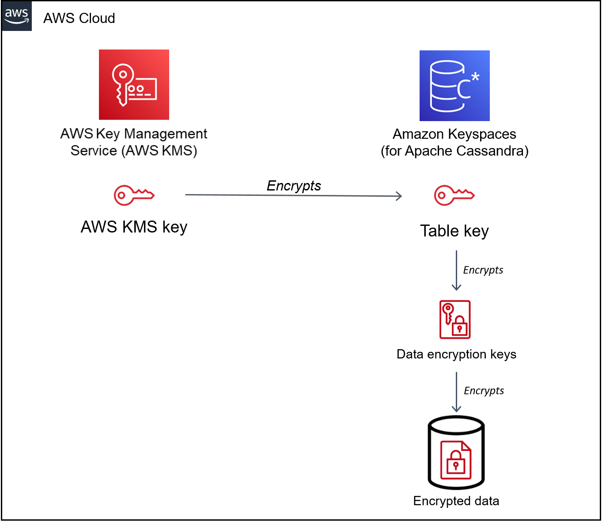

# Encryption at rest: How it works in Amazon Keyspaces

Amazon Keyspaces (for Apache Cassandra) _encryption at rest_ encrypts your data using the 256-bit
Advanced Encryption Standard (AES-256). This helps secure your data from unauthorized access to
the underlying storage. All customer data in Amazon Keyspaces tables is encrypted at rest by default, and
server-side encryption is transparent, which means that changes to applications aren't
required.

Encryption at rest integrates with AWS Key Management Service (AWS KMS) for managing the encryption key that
is used to encrypt your tables. When creating a new table or updating an existing table, you can
choose one of the following _AWS KMS key_ options:

- AWS owned key – This is the default encryption type. The key is owned by Amazon Keyspaces
  (no additional charge).
- Customer managed key – This key is stored in your account and is created, owned, and
  managed by you. You have full control over the customer managed key (AWS KMS charges
  apply).

**AWS KMS key (KMS key)**

Encryption at rest protects all your Amazon Keyspaces data with a AWS KMS key. By default,
Amazon Keyspaces uses an [AWS owned key](../../../kms/latest/developerguide/concepts.md#aws-owned-cmk "../../../kms/latest/developerguide/concepts.md#aws-owned-cmk"), a
multi-tenant encryption key that is created and managed in an Amazon Keyspaces service account.

However, you can encrypt your Amazon Keyspaces tables using a [customer managed key](../../../kms/latest/developerguide/concepts.md#customer-cmk "../../../kms/latest/developerguide/concepts.md#customer-cmk") in your
AWS account. You can select a different KMS key for each table in a keyspace. The
KMS key you select for a table is also used to encrypt all its metadata and restorable
backups.

You select the KMS key for a table when you create or update the table. You can
change the KMS key for a table at any time, either in the Amazon Keyspaces console or by using the
[ALTER TABLE](cql.ddl.md#cql.ddl.keyspace.alter "cql.ddl.md#cql.ddl.keyspace.alter") statement. The process of
switching KMS keys is seamless, and doesn't require downtime or cause service
degradation.

**Key hierarchy**

Amazon Keyspaces uses a key hierarchy to encrypt data. In this key hierarchy, the KMS key is
the root key. It's used to encrypt and decrypt the Amazon Keyspaces table encryption key. The table
encryption key is used to encrypt the encryption keys used internally by Amazon Keyspaces to encrypt
and decrypt data when performing read and write operations.

With the encryption key hierarchy, you can make changes to the KMS key without having
to reencrypt data or impacting applications and ongoing data operations.

**Table key**
The Amazon Keyspaces table key is used as a key encryption key. Amazon Keyspaces uses the table key to protect the
internal data encryption keys that are used to encrypt the data stored in tables, log
files, and restorable backups. Amazon Keyspaces generates a unique data encryption key for each
underlying structure in a table. However, multiple table rows might be protected by the
same data encryption key.

When you first set the KMS key to a customer managed key, AWS KMS generates a _data key_. The AWS KMS data key
refers to the table key in Amazon Keyspaces.

When you access an encrypted table, Amazon Keyspaces sends a request to AWS KMS to use the
KMS key to decrypt the table key. Then, it uses the plaintext table key to decrypt the
Amazon Keyspaces data encryption keys, and it uses the plaintext data encryption keys to decrypt
table data.

Amazon Keyspaces uses and stores the table key and data encryption keys outside of AWS KMS. It
protects all keys with [Advanced Encryption
Standard](https://en.wikipedia.org/wiki/Advanced_Encryption_Standard "https://en.wikipedia.org/wiki/Advanced_Encryption_Standard") (AES) encryption and 256-bit encryption keys. Then, it stores the
encrypted keys with the encrypted data so that they're available to decrypt the table data
on demand.

**Table key caching**
To avoid calling AWS KMS for every Amazon Keyspaces operation, Amazon Keyspaces caches the plaintext table keys for
each connection in memory. If Amazon Keyspaces gets a request for the cached table key after five
minutes of inactivity, it sends a new request to AWS KMS to decrypt the table key. This call
captures any changes made to the access policies of the KMS key in AWS KMS or AWS Identity and Access Management
(IAM) since the last request to decrypt the table key.

**Envelope encryption**

If you change the customer managed key for your table, Amazon Keyspaces generates a new table key. Then, it
uses the new table key to reencrypt the data encryption keys. It also uses the new table
key to encrypt previous table keys that are used to protect restorable backups. This
process is called envelope encryption. This ensures that you can access restorable backups
even if you rotate the customer managed key. For more information about envelope encryption, see
[Envelope Encryption](../../../kms/latest/developerguide/concepts.md#enveloping "../../../kms/latest/developerguide/concepts.md#enveloping") in the
_AWS Key Management Service Developer Guide_.

###### Topics

- [AWS owned keys](#keyspaces-owned "#keyspaces-owned")
- [Customer managed keys](#customer-managed "#customer-managed")
- [Encryption at rest usage notes](#encryption.usagenotes "#encryption.usagenotes")

## AWS owned keys

AWS owned keys aren't stored in your AWS account. They are part of a collection of
KMS keys that AWS owns and manages for use in multiple AWS accounts. AWS services can
use AWS owned keys to protect your data.

You can't view, manage, or use AWS owned keys, or audit their use. However, you don't
need to do any work or change any programs to protect the keys that encrypt your data.

You aren't charged a monthly fee or a usage fee for use of AWS owned keys, and they
don't count against AWS KMS quotas for your account.

## Customer managed keys

Customer managed keys are keys in your AWS account that you create, own, and manage. You have
full control over these KMS keys.

Use a customer managed key to get the following features:

- You create and manage the customer managed key, including setting and maintaining the [key
  policies](../../../kms/latest/developerguide/key-policies.md "../../../kms/latest/developerguide/key-policies.md"), [IAM policies](../../../kms/latest/developerguide/iam-policies.md "../../../kms/latest/developerguide/iam-policies.md"), and [grants](../../../kms/latest/developerguide/grants.md "../../../kms/latest/developerguide/grants.md") to
  control access to the customer managed key. You can [enable and disable](../../../kms/latest/developerguide/enabling-keys.md "../../../kms/latest/developerguide/enabling-keys.md") the
  customer managed key, enable and disable [automatic key rotation](../../../kms/latest/developerguide/rotate-keys.md "../../../kms/latest/developerguide/rotate-keys.md"), and
  [schedule
  the customer managed key](../../../kms/latest/developerguide/deleting-keys.md "../../../kms/latest/developerguide/deleting-keys.md") for deletion when it is no longer in use. You can create tags and
  aliases for the customer managed keys you manage.
- You can use a customer managed key with [imported key material](../../../kms/latest/developerguide/importing-keys.md "../../../kms/latest/developerguide/importing-keys.md") or a
  customer managed key in a [custom key store](../../../kms/latest/developerguide/custom-key-store-overview.md "../../../kms/latest/developerguide/custom-key-store-overview.md")
  that you own and manage.
- You can use AWS CloudTrail and Amazon CloudWatch Logs to track the requests that Amazon Keyspaces sends to AWS KMS on
  your behalf. For more information, see [Step 6: Configure monitoring with AWS CloudTrail](encryption.md#encryption-cmk-trail "encryption.md#encryption-cmk-trail").

Customer managed keys [incur a charge](https://aws.amazon.com/kms/pricing/ "https://aws.amazon.com/kms/pricing/") for each
API call, and AWS KMS quotas apply to these KMS keys. For more information, see [AWS KMS resource or request
quotas](../../../kms/latest/developerguide/limits.md "../../../kms/latest/developerguide/limits.md").

When you specify a customer managed key as the root encryption key for a table, restorable backups
are encrypted with the same encryption key that is specified for the table at the time the
backup is created. If the KMS key for the table is rotated, key enveloping ensures that the
latest KMS key has access to all restorable backups.

Amazon Keyspaces must have access to your customer managed key to provide you access to your table data. If the
state of the encryption key is set to disabled or it's scheduled for deletion, Amazon Keyspaces is unable
to encrypt or decrypt data. As a result, you are not able to perform read and write operations
on the table. As soon as the service detects that your encryption key is inaccessible, Amazon Keyspaces
sends an email notification to alert you.

You must restore access to your encryption key within seven days or Amazon Keyspaces deletes your
table automatically. As a precaution, Amazon Keyspaces creates a restorable backup of your table data
before deleting the table. Amazon Keyspaces maintains the restorable backup for 35 days. After 35 days,
you can no longer restore your table data. You aren't billed for the restorable backup, but
standard [restore charges apply](https://aws.amazon.com/keyspaces/pricing "https://aws.amazon.com/keyspaces/pricing").

You can use this restorable backup to restore your data to a new table. To initiate the
restore, the last customer managed key used for the table must be enabled, and Amazon Keyspaces must have access to
it.

###### Note

When you're creating a table that's encrypted using a customer managed key that's
inaccessible or scheduled for deletion before the creation process completes, an error
occurs. The create table operation fails, and you're sent an email notification.

## Encryption at rest usage notes

Consider the following when you're using encryption at rest in Amazon Keyspaces.

- Server-side encryption at rest is enabled on all Amazon Keyspaces tables and can't be disabled.
  The entire table is encrypted at rest, you can't select specific columns or rows for
  encryption.
- By default, Amazon Keyspaces uses a single-service default key (AWS owned key) for encrypting
  all of your tables. If this key doesn’t exist, it's created for you. Service default keys
  can't be disabled.
- Encryption at rest only encrypts data while it's static (at rest) on a persistent
  storage media. If data security is a concern for data in transit or data in use, you must
  take additional measures:
  - Data in transit: All your data in Amazon Keyspaces is encrypted in transit. By default, communications
    to and from Amazon Keyspaces are protected by using Secure Sockets Layer (SSL)/Transport Layer Security
    (TLS) encryption.
  - Data in use: Protect your data before sending it to Amazon Keyspaces by using client-side
    encryption.
  - Customer managed keys: Data at rest in your tables is always encrypted using your customer managed keys.
    However operations that perform atomic updates of multiple rows encrypt data temporarily
    using AWS owned keys during processing. This includes range delete operations and
    operations that simultaneously access static and non-static data.

- A single customer managed key can have up to 50,000 [grants](../../../kms/latest/developerguide/grants.md "../../../kms/latest/developerguide/grants.md"). Every Amazon Keyspaces table associated
  with a customer managed key consumes 2 grants. One grant is released when the table is deleted. The
  second grant is used to create an automatic snapshot of the table to protect from data
  loss in case Amazon Keyspaces lost access to the customer managed key unintentionally. This grant is released
  42 days after deletion of the table.
