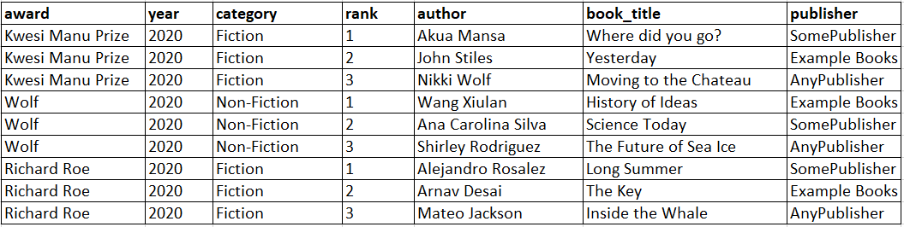

# Inserting and loading data into

an Amazon Keyspaces table

To create data in your `book_awards` table, use the
`INSERT` statement to add a single row.

1. Open AWS CloudShell and connect to Amazon Keyspaces using the following command. Make sure to update `us-east-1` with your
   own Region.

```
cqlsh-expansion cassandra.`us-east-1`.amazonaws.com 9142 --ssl
```

The output of that command should look like this.

```
`Connected to Amazon Keyspaces at cassandra.us-east-1.amazonaws.com:9142
[cqlsh 6.1.0 | Cassandra 3.11.2 | CQL spec 3.4.4 | Native protocol v4]
Use HELP for help.
cqlsh current consistency level is ONE.`
```

2. Before you can write data to your Amazon Keyspaces table using cqlsh, you must set the write consistency for the current cqlsh session to `LOCAL_QUORUM`. For more information about supported consistency
   levels, see [Write consistency levels](consistency.md#WriteConsistency "consistency.md#WriteConsistency"). Note that this step is not required if you are using the CQL editor in the AWS Management Console.

```
CONSISTENCY LOCAL_QUORUM;
```

3. To insert a single record, run the following command in the CQL editor.

```
INSERT INTO catalog.book_awards (award, year, category, rank, author, book_title, publisher)
VALUES ('Wolf', 2023, 'Fiction',3,'Shirley Rodriguez','Mountain', 'AnyPublisher') ;
```

4. Verify that the data was correctly added to your table by running the
   following command.

```
SELECT * FROM catalog.book_awards;
```

The output of the statement should look like this.

```
 `year | award | category | rank | author | book_title | publisher
------+-------+----------+------+-------------------+------------+--------------
 2023 | Wolf | Fiction | 3 | Shirley Rodriguez | Mountain | AnyPublisher

(1 rows)`
```

###### To insert multiple records from a file using cqlsh

1. Download the sample CSV file (`keyspaces_sample_table.csv`)
   contained in the archive file [samplemigration.zip](samples/samplemigration.md "samples/samplemigration.md"). Unzip the archive and take note of the path to
   `keyspaces_sample_table.csv`.

 2. Open AWS CloudShell in the AWS Management Console and connect to Amazon Keyspaces using the following
command. Make sure to update `us-east-1` with your own Region.

```
cqlsh-expansion cassandra.`us-east-1`.amazonaws.com 9142 --ssl
```

3. At the `cqlsh` prompt (`cqlsh>`), specify a
   keyspace.

```
USE `catalog` ;
```

4. Set write consistency to `LOCAL_QUORUM`. For more information about supported consistency
   levels, see [Write consistency levels](consistency.md#WriteConsistency "consistency.md#WriteConsistency").

```
CONSISTENCY LOCAL_QUORUM;
```

5. In the AWS CloudShell choose **Actions** on the top right side of the screen and then choose
   **Upload file** to upload the csv file downloaded earlier. Take note of the path to the file.
6. At the keyspace prompt (`cqlsh:`catalog`>`), run the following statement.

```
COPY book_awards (award, year, category, rank, author, book_title, publisher) FROM '/home/cloudshell-user/keyspaces_sample_table.csv' WITH header=TRUE ;
```

The output of the statement should look similar to this.

```
`cqlsh:catalog> COPY book_awards (award, year, category, rank, author, book_title, publisher) FROM '/home/cloudshell-user/keyspaces_sample_table.csv' WITH delimiter=',' AND header=TRUE ;
cqlsh current consistency level is LOCAL_QUORUM.
Reading options from /home/cloudshell-user/.cassandra/cqlshrc:[copy]: {'numprocesses': '16', 'maxattempts': '1000'}
Reading options from /home/cloudshell-user/.cassandra/cqlshrc:[copy-from]: {'ingestrate': '1500', 'maxparseerrors': '1000', 'maxinserterrors': '-1', 'maxbatchsize': '10', 'minbatchsize': '1', 'chunksize': '30'}
Reading options from the command line: {'delimiter': ',', 'header': 'TRUE'}
Using 16 child processes

Starting copy of catalog.book_awards with columns [award, year, category, rank, author, book_title, publisher].
OSError: handle is closed 0 rows/s; Avg. rate: 0 rows/s
Processed: 9 rows; Rate: 0 rows/s; Avg. rate: 0 rows/s
9 rows imported from 1 files in 0 day, 0 hour, 0 minute, and 26.706 seconds (0 skipped).`
```

7. Verify that the data was correctly added to your table by running the following query.

```
SELECT * FROM book_awards ;
```

You should see the following output.

```
 `year | award | category | rank | author | book_title | publisher
------+------------------+-------------+------+--------------------+-----------------------+---------------
 2020 | Wolf | Non-Fiction | 1 | Wang Xiulan | History of Ideas | Example Books
 2020 | Wolf | Non-Fiction | 2 | Ana Carolina Silva | Science Today | SomePublisher
 2020 | Wolf | Non-Fiction | 3 | Shirley Rodriguez | The Future of Sea Ice | AnyPublisher
 2020 | Kwesi Manu Prize | Fiction | 1 | Akua Mansa | Where did you go? | SomePublisher
 2020 | Kwesi Manu Prize | Fiction | 2 | John Stiles | Yesterday | Example Books
 2020 | Kwesi Manu Prize | Fiction | 3 | Nikki Wolf | Moving to the Chateau | AnyPublisher
 2020 | Richard Roe | Fiction | 1 | Alejandro Rosalez | Long Summer | SomePublisher
 2020 | Richard Roe | Fiction | 2 | Arnav Desai | The Key | Example Books
 2020 | Richard Roe | Fiction | 3 | Mateo Jackson | Inside the Whale | AnyPublisher

(9 rows)`
```

To learn more about using `cqlsh COPY` to upload data from csv files to an Amazon Keyspaces table, see
[Tutorial: Loading data into Amazon Keyspaces using cqlsh](bulk-upload.md "bulk-upload.md").
