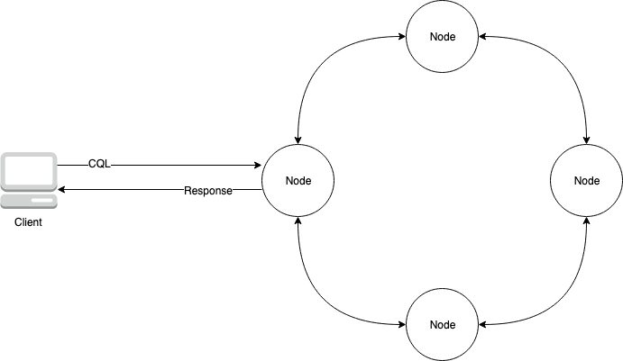
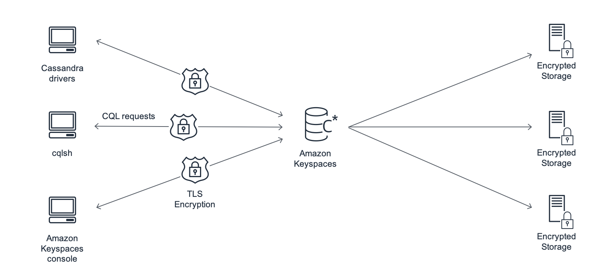

# Amazon Keyspaces: How it works

Amazon Keyspaces removes the administrative overhead of managing Cassandra. To
understand why, it's helpful to begin with Cassandra architecture and then compare it to
Amazon Keyspaces.

###### Topics

- [High-level architecture: Apache Cassandra
  vs. Amazon Keyspaces](#how-it-works.cassandra-arch "#how-it-works.cassandra-arch")
- [Cassandra data model](#how-it-works.data-model "#how-it-works.data-model")
- [Accessing Amazon Keyspaces from an
  application](#how-it-works.keyspaces-arch.accessing "#how-it-works.keyspaces-arch.accessing")

## High-level architecture: Apache Cassandra

vs. Amazon Keyspaces

Traditional Apache Cassandra is deployed in a cluster made up of one or more nodes.
You are responsible for managing each node and adding and removing nodes as your cluster
scales.

A client program accesses Cassandra by connecting to one of the nodes and issuing
Cassandra Query Language (CQL) statements.
_CQL_ is similar to SQL, the popular language used in relational
databases. Even though Cassandra is not a relational database, CQL provides a familiar
interface for querying and manipulating data in Cassandra.

The following diagram shows a simple Apache Cassandra cluster, consisting of four
nodes.



A production Cassandra deployment might consist of hundreds of nodes, running on
hundreds of physical computers across one or more physical data centers. This can cause
an operational burden for application developers who need to provision, patch, and
manage servers in addition to installing, maintaining, and operating software.

With Amazon Keyspaces (for Apache Cassandra), you don’t need to provision, patch, or manage servers, so you can
focus on building better applications. Amazon Keyspaces offers two throughput capacity modes for reads and writes: on-demand and provisioned.
You can choose your table’s throughput capacity mode to optimize the price of reads and writes based on the predictability and variability
of your workload.

With on-demand mode, you pay for only the reads and writes that your application actually performs. You do not need to specify your table’s
throughput capacity in advance. Amazon Keyspaces accommodates your application traffic almost instantly as it ramps up or down, making it a good option
for applications with unpredictable traffic.

Provisioned capacity mode helps you optimize the price of throughput if you have predictable application traffic and can forecast your table’s
capacity requirements in advance. With provisioned capacity mode, you specify the number of reads and writes per second that you expect your
application to perform. You can increase and decrease the provisioned capacity for your table automatically by
enabling [automatic scaling](autoscaling.md "autoscaling.md").

You can change the capacity mode of your table once per day as you learn more about
your workload’s traffic patterns, or if you expect to have a large burst in traffic,
such as from a major event that you anticipate will drive a lot of table traffic. For
more information about read and write capacity provisioning, see [Configure read/write capacity modes in Amazon Keyspaces](ReadWriteCapacityMode.md "ReadWriteCapacityMode.md").

Amazon Keyspaces (for Apache Cassandra) stores three copies of your data in multiple
[Availability
Zones](https://aws.amazon.com/about-aws/global-infrastructure/regions_az/ "https://aws.amazon.com/about-aws/global-infrastructure/regions_az/") for durability and high availability. In addition, you benefit from a
data center and network architecture that is built to meet the requirements of the most
security-sensitive organizations. Encryption at rest is automatically enabled when you
create a new Amazon Keyspaces table and all client connections require Transport Layer Security
(TLS). Additional AWS security features include [monitoring](monitoring.md "monitoring.md"), [AWS Identity and Access Management](security_iam_service-with-iam.md "security_iam_service-with-iam.md"),
and [virtual private cloud (VPC)
endpoints](vpc-endpoints.md "vpc-endpoints.md"). For an overview of all available security features, see [Security in Amazon Keyspaces (for Apache Cassandra)](security.md "security.md").

The following diagram shows the architecture of Amazon Keyspaces.



A client program accesses Amazon Keyspaces by connecting to a predetermined endpoint (hostname
and port number) and issuing CQL statements. For a list of available endpoints, see [Service endpoints for Amazon Keyspaces](programmatic.md "programmatic.md").

## Cassandra data model

How you model your data for your business case is critical to achieving optimal performance from Amazon Keyspaces. A poor data model can significantly
degrade performance.

Even though CQL looks similar to SQL, the backends of Cassandra and relational
databases are very different and must be approached differently. The following are some
of the more significant issues to consider:

**Storage**

You can visualize your Cassandra data in tables, with each row representing
a record and each column a field within that record.

**Table design: Query first**

There are no `JOIN`s in CQL. Therefore, you should design your
tables with the shape of your data and how you need to access it for your
business use cases. This might result in de-normalization with duplicated data.
You should design each of your tables specifically for a particular access
pattern.

**Partitions**

Your data is stored in partitions on disk. The number of partitions your
data is stored in and how it is distributed across the partitions is determined
by your _partition key_. How you define your partition key
can have a significant impact upon the performance of your queries. For best
practices, see [How to use partition keys effectively in Amazon Keyspaces](bp-partition-key-design.md "bp-partition-key-design.md").

**Primary key**

In Cassandra, data is stored as a key-value pair. Every Cassandra table must
have a primary key, which is the unique key to each row in the table. The
primary key is the composite of a required partition key and optional
clustering columns. The data that comprises the primary key must be unique
across all records in a table.

- **Partition key** – The partition
  key portion of the primary key is required and determines which partition
  of your cluster the data is stored in. The partition key can be a single
  column, or it can be a compound value composed of two or more columns.
  You would use a compound partition key if a single column partition key
  would result in a single partition or a very few partitions having most
  of the data and thus bearing the majority of the disk I/O operations.
- **Clustering column** – The
  optional clustering column portion of your primary key determines how the
  data is clustered and sorted within each partition. If you include a
  clustering column in your primary key, the clustering column can have one
  or more columns. If there are multiple columns in the clustering column,
  the sorting order is determined by the order that the columns are listed
  in the clustering column, from left to right.

For more information about NoSQL design and Amazon Keyspaces, see [Key differences and design principles of NoSQL design](bp-general-nosql-design.md "bp-general-nosql-design.md"). For more information about Amazon Keyspaces and data modeling, see [Data modeling best practices: recommendations for designing data models](data-modeling.md "data-modeling.md").

## Accessing Amazon Keyspaces from an

application

Amazon Keyspaces (for Apache Cassandra) implements the Apache Cassandra Query Language (CQL) API, so you can use
CQL and Cassandra drivers that you already use. Updating your application is as easy as
updating your Cassandra driver or `cqlsh` configuration to point to the Amazon Keyspaces
service endpoint. For more information about the required credentials, see [Create and configure AWS credentials for Amazon Keyspaces](access.md "access.md").

###### Note

To help you get started, you can find end-to-end code samples of connecting to Amazon Keyspaces by using various Cassandra client drivers in the
Amazon Keyspaces code example repository on [GitHub](https://github.com/aws-samples/amazon-keyspaces-examples "https://github.com/aws-samples/amazon-keyspaces-examples").

Consider the following Python program, which connects to a Cassandra cluster and
queries a table.

```
from cassandra.cluster import Cluster
#TLS/SSL configuration goes here

ksp = 'MyKeyspace'
tbl = 'WeatherData'

cluster = Cluster(['NNN.NNN.NNN.NNN'], port=NNNN)
session = cluster.connect(ksp)

session.execute('USE ' + ksp)

rows = session.execute('SELECT * FROM ' +  tbl)
for row in rows:
    print(row)
```

To run the same program against Amazon Keyspaces, you need to:

- **Add the cluster endpoint and port**: For example,
  the host can be replaced with a service endpoint, such as
  `cassandra.us-east-1.amazonaws.com` and the port number with:
  `9142`.
- **Add the TLS/SSL configuration**: For more
  information on adding the TLS/SSL configuration to connect to Amazon Keyspaces by using a
  Cassandra client Python driver, see [Using a Cassandra Python client driver to
  access Amazon Keyspaces programmatically](using_python_driver.md "using_python_driver.md").
