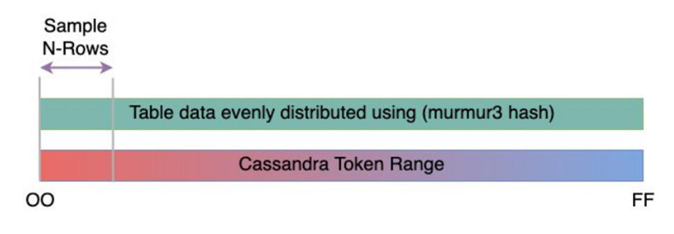
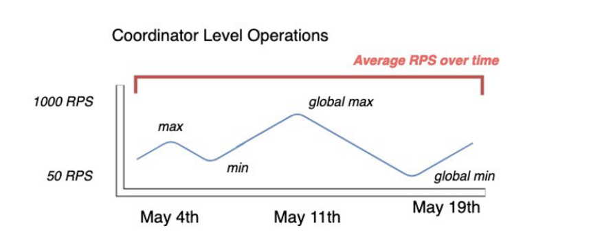

# Create a migration plan for migrating from Apache Cassandra to Amazon Keyspaces

For a successful migration from Apache Cassandra to Amazon Keyspaces, we recommend a review of the applicable migration concepts and best practices
as well as a comparison of the available options.

This topic outlines how the migration process works by introducing several key concepts and the tools and techniques available to you.
You can evaluate the different migration strategies to select the one that best meets your requirements.

###### Topics

- [Functional compatibility](#migrating-cassandra-compatibility "#migrating-cassandra-compatibility")
- [Estimate Amazon Keyspaces pricing](#migrating-cassandra-sizing "#migrating-cassandra-sizing")
- [Choose a migration strategy](#migrating-cassandra-strategy "#migrating-cassandra-strategy")
- [Online migration to Amazon Keyspaces: strategies and best practices](migrating-online.md "migrating-online.md")
- [Offline migration process: Apache Cassandra to Amazon Keyspaces](migrating-offline.md "migrating-offline.md")
- [Using a hybrid migration solution: Apache Cassandra to Amazon Keyspaces](migrating-hybrid.md "migrating-hybrid.md")

## Functional compatibility

Consider the functional differences between Apache Cassandra and Amazon Keyspaces carefully
before the migration. Amazon Keyspaces supports all commonly used Cassandra data-plane operations,
such as creating keyspaces and tables, reading data, and writing data.

However there are
some Cassandra APIs that Amazon Keyspaces doesn't support. For more information about supported APIs, see [Supported Cassandra APIs, operations, functions, and data
types](cassandra-apis.md "cassandra-apis.md").
For an overview of all functional differences between Amazon Keyspaces and Apache Cassandra, see [Functional differences: Amazon Keyspaces vs. Apache Cassandra](functional-differences.md "functional-differences.md").

To compare the Cassandra APIs and schema that you're using with supported
functionality in Amazon Keyspaces, you can run a compatibility script available in the
Amazon Keyspaces toolkit on
[GitHub](https://github.com/aws-samples/amazon-keyspaces-toolkit/blob/master/bin/toolkit-compat-tool.py "https://github.com/aws-samples/amazon-keyspaces-toolkit/blob/master/bin/toolkit-compat-tool.py").

###### How to use the compatibility script

1. Download the compatibility Python script from
   [GitHub](https://github.com/aws-samples/amazon-keyspaces-toolkit/blob/master/bin/toolkit-compat-tool.py "https://github.com/aws-samples/amazon-keyspaces-toolkit/blob/master/bin/toolkit-compat-tool.py")
   and move it to a location that has access to your existing Apache Cassandra cluster.
2. The compatibility script uses similar parameters as `CQLSH`. For `--host` and `--port`
   enter the IP address and the port you use to connect and run queries to one of the Cassandra nodes in your cluster.

If
your Cassandra cluster uses authentication, you also need to provide `-username` and `-password`.
To run the compatibility script, you can use the following command.

```
python toolkit-compat-tool.py --host `hostname or IP` -u "`username`" -p "`password`" --port `native transport port`
```

## Estimate Amazon Keyspaces pricing

This section provides an overview of the information you need to gather from your
Apache Cassandra tables to calculate the estimated cost for Amazon Keyspaces. Each one of your tables
requires different data types, needs to support different CQL queries, and maintains
distinctive read/write traffic.

Thinking of your requirements based on tables aligns
with Amazon Keyspaces table-level resource isolation and [read/write throughput capacity modes](ReadWriteCapacityMode.md "ReadWriteCapacityMode.md"). With Amazon Keyspaces, you can define read/write
capacity and [automatic scaling policies](autoscaling.md "autoscaling.md") for tables
independently.

Understanding table requirements helps you prioritize tables for
migration based on functionality, cost, and migration effort.

Collect the following Cassandra table metrics before a migration. This information
helps to estimate the cost of your workload on Amazon Keyspaces.

- **Table name** – The name of the fully qualified keyspace and table name.
- **Description** – A description of the table, for example how it’s used, or what type of data is stored in it.
- **Average reads per second** – The average number of coordinate-level reads against the table over a large time interval.
- **Average writes per second** – The average number of coordinate-level writes against the table over a large time interval.
- **Average row size in bytes** – The average row size in bytes.
- **Storage size in GBs** – The raw storage size for a table.
- **Read consistency breakdown** – The percentage of reads that use eventual consistency (`LOCAL_ONE` or `ONE`) vs. strong consistency (`LOCAL_QUORUM`).

This table shows an example of the information about your tables that you need to pull
together when planning a migration.

| Table name          | Description                              | Average reads per second | Average writes per second | Average row size in bytes | Storage size in GBs | Read consistency breakdown         |
| ------------------- | ---------------------------------------- | ------------------------ | ------------------------- | ------------------------- | ------------------- | ---------------------------------- |
| mykeyspace.mytable  | Used to store shopping cart history      | 10,000                   | 5,000                     | 2,200                     | 2,000               | 100% `LOCAL_ONE`                   |
| mykeyspace.mytable2 | Used to store latest profile information | 20,000                   | 1,000                     | 850                       | 1,000               | 25% `LOCAL_QUORUM` 75% `LOCAL_ONE` |

### How to collect table metrics

This section provides step by step instructions on how to collect the necessary table metrics from your
existing Cassandra cluster. These metrics include row size, table size, and read/write requests per second (RPS).
They allow you to assess throughput capacity requirements for an Amazon Keyspaces table and estimate pricing.

###### How to collect table metrics on the Cassandra source table

1. Determine row size

Row size is important for determining the read capacity and write capacity utilization in Amazon Keyspaces.
The following diagram shows the typical data distribution over a Cassandra token range.



You can use a row size sampler script available on [GitHub](https://github.com/aws-samples/amazon-keyspaces-toolkit/blob/master/bin/row-size-sampler.sh "https://github.com/aws-samples/amazon-keyspaces-toolkit/blob/master/bin/row-size-sampler.sh") to collect row size metrics for each table in your Cassandra
cluster.

The script exports table data from Apache Cassandra by using
`cqlsh` and `awk` to calculate the min, max, average,
and standard deviation of row size over a configurable sample set of table data.
The row size sampler passes the arguments to `cqlsh`, so the same
parameters can be used to connect and read from your Cassandra cluster.

The following statement is an example of this.

```
./row-size-sampler.sh `10.22.33.44` 9142 \\
   -u "`username`" -p "`password`" --ssl
```

For more information on how row size is calculated in Amazon Keyspaces, see [Estimate row size in Amazon Keyspaces](calculating-row-size.md "calculating-row-size.md"). 2. Determine table size

With Amazon Keyspaces, you don't need to provision storage in advance. Amazon Keyspaces monitors the
billable size of your tables continuously to determine your storage charges.
Storage is billed per GB-month. Amazon Keyspaces table size is based on the raw size
(uncompressed) of a single replica.

To monitor the table size in Amazon Keyspaces, you can use the metric
`BillableTableSizeInBytes`, which is displayed for each table in the AWS Management Console.

To estimate the billable size of your Amazon Keyspaces table, you can use either one of these two methods:

    * Use the average row size and multiply by the number or rows.


    You can estimate the size of the Amazon Keyspaces table by multiplying the average row size by the number of rows from your
     Cassandra source table. Use the row size sample script from the previous section to capture the average row size.
     To capture the row count, you can use tools like `dsbulk count` to determine the total number of rows in
     your source table.
    * Use the `nodetool` to gather table metadata.


    `Nodetool` is an administrative tool provided in the Apache Cassandra distribution that provides insight into the
     state of the Cassandra process and returns table metadata. You can use `nodetool` to sample metadata about table size and
     with that extrapolate the table size in Amazon Keyspaces.


    The command to use is `nodetool tablestats`. Tablestats returns the table's
     size and compression ratio. The table's size is stored as the `tablelivespace` for the table and you can divide it
     by the `compression ratio`. Then multiple this size value by the number of nodes. Finally divide by the replication factor
     (typically three).


    This is the complete formula for the calculation that you can use to assess table size.


    ```
    ((tablelivespace / compression ratio) * (total number of nodes))/ (replication factor)
    ```

    Let's assume that your Cassandra cluster has 12 nodes. Running the `nodetool tablestats` command returns
     a `tablelivespace` of 200 GB and a `compression ratio` of 0.5. The keyspace has a replication
     factor of three.


    This is how the calculation for this example looks like.


    ```
    (200 GB / 0.5) * (12 nodes)/ (replication factor of 3)
                            = 4,800 GB / 3
                            = 1,600 GB is the table size estimate for Amazon Keyspaces
    ```

3. Capture the number of reads and writes

To determine the capacity and scaling requirements for your Amazon Keyspaces tables,
capture the read and write request rate of your Cassandra tables before the migration.

Amazon Keyspaces is serverless and you only pay for what you use. In general, the
price of read/write throughput in Amazon Keyspaces is based on the number and size of the
requests.

There are two capacity modes in Amazon Keyspaces:

    * [On-demand](ReadWriteCapacityMode.md "ReadWriteCapacityMode.md") – This
     is a flexible billing option capable of serving
     thousands of requests per second without the need for capacity planning. It offers
     pay-per-request pricing for read and write requests so that you
     pay only for what you use.
    * [Provisioned](ReadWriteCapacityMode.md "ReadWriteCapacityMode.md") – If
     you choose provisioned throughput capacity mode,
     you specify the number of reads and writes per second that are required for your
     application. This helps you manage your Amazon Keyspaces usage to stay at or below a
     defined request rate to maintain predictability.


    Provisioned
     mode offers [auto scaling](autoscaling.md "autoscaling.md") to automatically
     adjust your provisioned rate to scale up or scale down to improve operational
     efficiency. For more information about serverless resource management, see [Managing serverless resources in
     Amazon Keyspaces (for Apache Cassandra)](serverless_resource_management.md "serverless_resource_management.md").

Because you provision read
and write throughput capacity in Amazon Keyspaces separately, you need to measure the request
rate for reads and writes in your existing tables independently.

To gather the most accurate utilization metrics from your existing Cassandra
cluster, capture the average requests per second (RPS) for coordinator-level
read and write operations over an extended period of time for a table that is
aggregated over all nodes in a single data center.

Capturing the average RPS
over a period of at least several weeks captures peaks and valleys in your
traffic patterns, as shown in the following diagram.



You have two options to determine the read and write request rate of your Cassandra table.

    * Use existing Cassandra monitoring


    You can use the metrics shown in the following table to observe read and write requests. Note that the
     metric names can change based on the monitoring tool that you're using.


    | Dimension | Cassandra JMX metric |
    | --- | --- |
    | Writes | `org.apache.cassandra.metrics:type=ClientRequest, scope=Write,name=Latency#Count` |
    | Reads | `org.apache.cassandra.metrics:type=ClientRequest, scope=Read,name=Latency#Count` |
    * Use the `nodetool`


    Use `nodetool tablestats` and `nodetool info` to capture average read and write operations
     from the table. `tablestats` returns the total read and write count from the time the node has
     been initiated. `nodetool info` provides the up-time for a node in seconds.


    To receive the per second average of
     read and writes, divide the read and write count by the node up-time in seconds. Then, for reads you divide by the
     consistency level ad for writes you divide by the replication factor. These calculations are expressed in the following
     formulas.


    Formula for average reads per second:


    ```
    ((number of reads * number of nodes in cluster) / read consistency quorum (2)) / uptime
    ```

    Formula for average writes per second:


    ```
    ((number of writes * number of nodes in cluster) / replication factor of 3) / uptime
    ```

    Let's assume we have a 12 node cluster that has been up for 4 weeks. `nodetool info` returns
     2,419,200 seconds of up-time and `nodetool tablestats` returns 1 billion writes and 2 billion reads. This
     example would result in the following calculation.


    ```
    ((2 billion reads * 12 in cluster) / read consistency quorum (2)) / 2,419,200 seconds
    =  12 billion reads / 2,419,200 seconds
    =  4,960 read request per second
                            ((1 billion writes * 12 in cluster) / replication factor of 3) / 2,419,200 seconds
    =  4 billion writes / 2,419,200 seconds
    =  1,653 write request per second
    ```

4. Determine the capacity utilization of the table

To estimate the average capacity utilization, start with the average request rates
and the average row size of your Cassandra source table.

Amazon Keyspaces uses _read capacity units_ (RCUs) and _write
capacity units_ (WCUs) to measure provisioned throughput capacity
for reads and writes for tables. For this estimate we use these units to
calculate the read and write capacity needs of the new Amazon Keyspaces table after migration.

Later in this topic we'll discuss how the choice between provisioned and on-demand capacity mode
affects billing. But for the estimate of capacity utilization in this example, we assume that the table is in provisioned mode.

    * **Reads** – One RCU represents one `LOCAL_QUORUM` read request, or two
     `LOCAL_ONE` read requests, for a row up to 4 KB in size. If you
     need to read a row that is larger than 4 KB, the read operation uses additional
     RCUs. The total number of RCUs required depends on the row size, and whether you
     want to use `LOCAL_QUORUM` or `LOCAL_ONE` read
     consistency.


    For example, reading an 8 KB row requires 2 RCUs using
     `LOCAL_QUORUM` read consistency, and 1 RCU if you choose
     `LOCAL_ONE` read consistency.
    * **Writes** – One WCU represents one write for a row up to 1 KB in
     size. All writes are using `LOCAL_QUORUM` consistency, and there is
     no additional charge for using lightweight transactions (LWTs).


    The total number of WCUs required depends on the row size. If you need to
     write a row that is larger than 1 KB, the write operation uses additional WCUs. For example, if your
     row size is 2 KB, you require 2 WCUs to perform one write request.

The following formula can be used to estimate the required RCUs and WCUs.

    * **Read
     capacity in RCUs** can be determined by multiplying reads per second by number of rows
     read per read multiplied by average row size divided by 4KB and rounded up to
     the nearest whole number.
    * **Write capacity in WCUs** can be determined by multiplying the number of requests by the
     average row size divided by 1KB and rounded up to the nearest whole number.

This is expressed in the following formulas.

```
Read requests per second * ROUNDUP((Average Row Size)/4096 per unit) =  RCUs per second

Write requests per second * ROUNDUP(Average Row Size/1024 per unit) = WCUs per second
```

For example, if you're performing 4,960 read requests with a row size of 2.5KB
on your Cassandra table, you need 4,960 RCUs in Amazon Keyspaces. If you're currently
performing 1,653 write requests per second with a row size of 2.5KB on your Cassandra table, you need
4,959 WCUs per second in Amazon Keyspaces.

This example is expressed in the following formulas.

```
4,960 read requests per second * ROUNDUP( 2.5KB /4KB bytes per unit)
= 4,960 read requests per second * 1 RCU
= 4,960 RCUs

1,653 write requests per second * ROUNDUP(2.5KB/1KB per unit)
= 1,653 requests per second * 3 WCUs
= 4,959 WCUs
```

Using `eventual consistency` allows you to save up to half of the throughput capacity on each read request. Each
eventually consistent read can consume up to 8KB. You can calculate eventual consistent reads by multiplying
the previous calculation by 0.5 as shown in the following formula.

```
4,960 read requests per second * ROUNDUP( 2.5KB /4KB per unit) * .5
= 2,480 read request per second * 1 RCU
= 2,480 RCUs
```

5. Calculate the monthly pricing estimate for Amazon Keyspaces

To estimate the monthly billing for the table based on read/write capacity throughput, you can calculate the pricing for on-demand and
for provisioned mode using different formulas and compare the options for your table.

**Provisioned mode** – Read and write capacity consumption is billed on an hourly rate
based on the capacity units per second. First, divide that rate by 0.7 to represent the default autoscaling target utilization
of 70%. Then multiple by 30 calendar days, 24 hours per day, and regional rate pricing.

This calculation is summarized in the following
formulas.

```
(read capacity per second / .7) * 24 hours * 30 days * regional rate
                (write capacity per second / .7) * 24 hours * 30 days * regional rate
```

**On-demand mode** – Read and write
capacity are billed on a per request rate. First, multiply the request rate
by 30 calendar days, and 24 hours per day. Then divide by one million
request units. Finally, multiply by the regional rate.

This calculation is
summarized in the following formulas.

```
((read capacity per second * 30 * 24 * 60 * 60) / 1 Million read request units) * regional rate
                ((write capacity per second * 30 * 24 * 60 * 60) / 1 Million write request units) * regional rate
```

## Choose a migration strategy

You can choose between the following migration strategies when migrating from Apache Cassandra to Amazon Keyspaces:

- **Online** – This is a live migration using dual writes
  to start writing new data to Amazon Keyspaces and the Cassandra cluster simultaneously. This migration type is recommended for applications
  that require zero downtime during migration and read after write consistency.

For more information about how to plan and implement an online migration strategy, see
[Online migration to Amazon Keyspaces: strategies and best practices](migrating-online.md "migrating-online.md").

- **Offline** – This migration technique involves copying a data set from Cassandra
  to Amazon Keyspaces during a downtime window. Offline migration can simplify the migration process, because it doesn't require changes
  to your application or conflict resolution between historical data and new writes.

For more information about how to
plan an offline migration, see [Offline migration process: Apache Cassandra to Amazon Keyspaces](migrating-offline.md "migrating-offline.md").

- **Hybrid** – This migration technique allows for changes to be replicated to Amazon Keyspaces
  in near real time, but without read after write consistency.

For more information about how to plan a hybrid migration, see [Using a hybrid migration solution: Apache Cassandra to Amazon Keyspaces](migrating-hybrid.md "migrating-hybrid.md").

After reviewing the migration techniques and best practices discussed in this topic, you can place
the available options in a decision tree to design a migration strategy based on your requirements and available resources.
