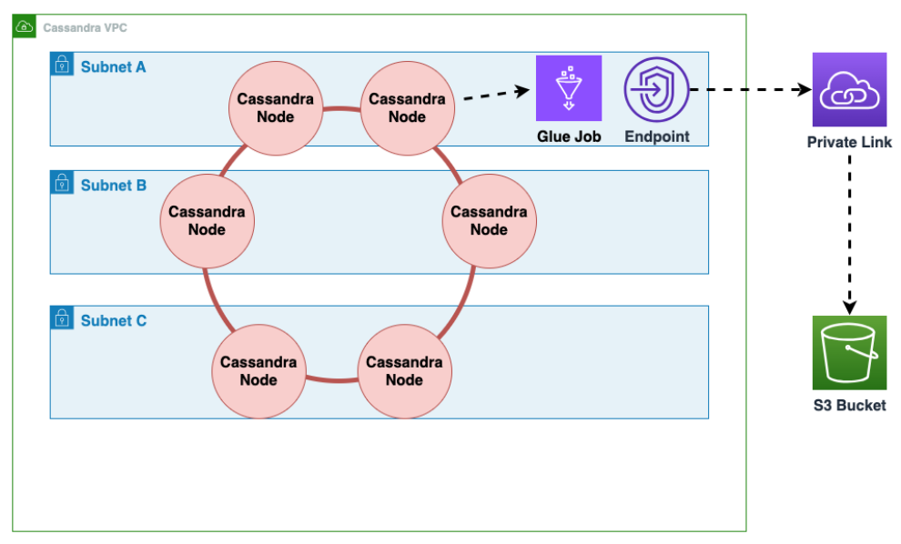
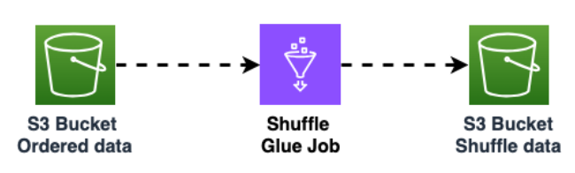
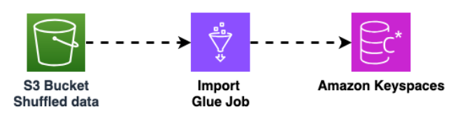

# Offline migration process: Apache Cassandra to Amazon Keyspaces

Offline migrations are suitable when you can afford downtime to perform the migration. It's common among enterprises
to have maintenance windows for patching, large releases, or downtime for hardware upgrades or major upgrades. Offline migration
can use this window to copy data and switch over the application traffic from Apache Cassandra to Amazon Keyspaces.

Offline migration reduces
modifications to the application because it doesn't require communication to both Cassandra and Amazon Keyspaces simultaneously. Additionally,
with the data flow paused, the exact state can be copied without maintaining mutations.

In this example, we use Amazon Simple Storage Service (Amazon S3) as a staging area for data during the offline
migration to minimize downtime. You can automatically import the data you stored in Parquet
format in Amazon S3 into an Amazon Keyspaces table using the Spark Cassandra connector and AWS Glue. The
following section is going to show the high-level overview of the process. You can find code
examples for this process on [Github](https://github.com/aws-samples/amazon-keyspaces-examples/tree/main/scala/datastax-v4/aws-glue "https://github.com/aws-samples/amazon-keyspaces-examples/tree/main/scala/datastax-v4/aws-glue").

The offline migration process from Apache Cassandra to Amazon Keyspaces using Amazon S3 and AWS Glue requires the following AWS Glue jobs.

1. An ETL job that extracts and transforms CQL data and stores it in an Amazon S3 bucket.
2. A second job that imports the data from the bucket to Amazon Keyspaces.
3. A third job to import incremental data.

###### How to perform an offline migration to Amazon Keyspaces from Cassandra running on Amazon EC2 in a Amazon Virtual Private Cloud

1. First you use AWS Glue to export table data from Cassandra in Parquet format and save it to an Amazon S3 bucket.
   You need to run an AWS Glue job using a AWS Glue connector to a VPC where the Amazon EC2 instance running Cassandra resides. Then,
   using the Amazon S3 private endpoint, you can save data to the Amazon S3 bucket.

The following diagram illustrates these steps.

 2. Shuffle the data in the Amazon S3 bucket to improve data randomization. Evenly imported data allows for more distributed traffic
in the target table.

This step
is required when exporting data from Cassandra with large partitions (partitions with more than 1000 rows) to avoid hot key patterns
when inserting the data into Amazon Keyspaces. Hot key issues cause `WriteThrottleEvents` in Amazon Keyspaces and result in increased load time.

 3. Use another AWS Glue job to import data from the Amazon S3 bucket into Amazon Keyspaces. The shuffled data in the Amazon S3 bucket is
stored in Parquet format.

For more information about the offline migration process, see the workshop [Amazon Keyspaces with AWS Glue](https://catalog.workshops.aws/unlocking-amazonkeyspaces/en-US/keyspaces-with-glue "https://catalog.workshops.aws/unlocking-amazonkeyspaces/en-US/keyspaces-with-glue")
