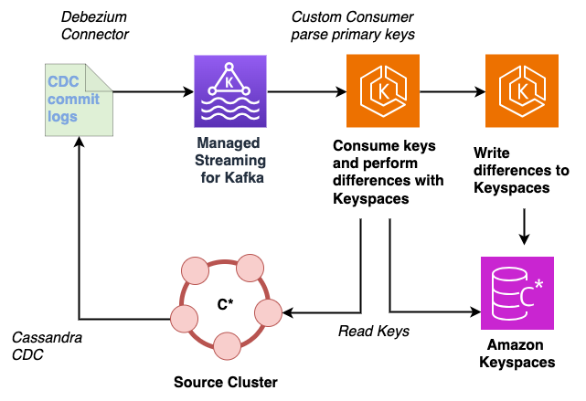

# Migrate data using change data capture (CDC)

If you're already familiar with configuring a change data capture (CDC) pipeline
with [Debezium](https://debezium.io/ "https://debezium.io/"), you can use this option to migrate data to Amazon Keyspaces as
an alternative to using CQLReplicator.
Debezium is an open-source, distributed platform for CDC, designed to monitor a database
and capture row-level changes reliably.

The [Debezium connector for Apache Cassandra](https://debezium.io/documentation/reference/stable/connectors/cassandra.html "https://debezium.io/documentation/reference/stable/connectors/cassandra.html") uploads changes to Amazon Managed Streaming for Apache Kafka
(Amazon MSK) so that they can be consumed and processed by downstream consumers which in turn
write the data to Amazon Keyspaces. For more information, see [Guidance for continuous data migration from Apache Cassandra to Amazon Keyspaces](https://aws.amazon.com/solutions/guidance/continuous-data-migration-from-apache-cassandra-to-amazon-keyspaces/ "https://aws.amazon.com/solutions/guidance/continuous-data-migration-from-apache-cassandra-to-amazon-keyspaces/").

To address any
potential data consistency issues, you can implement a process with Amazon MSK where a
consumer compares the keys or partitions in Cassandra with those in Amazon Keyspaces.

To implement this solution successfully, we recommend to consider the following.

- How to parse the CDC commit log, for example how to remove duplicate events.
- How to maintain the CDC directory, for example how to delete old logs.
- How to handle partial failures in Apache Cassandra, for example if a write only succeeds in one out of three replicas.
- How to handle resource allocation, for example increasing the size of the instance to account for
  additional CPU, memory, DISK, and IO requirements for the CDC process that occurs on a node.
  This pattern treats changes from Cassandra as a "hint" that a key may have changed from its previous state.
  To determine if there are changes to propagate to the destination database, you must first read from the source Cassandra cluster
  using a `LOCAL_QUORUM` operation to receive the latest records and then write them to Amazon Keyspaces.

In the case of range
deletes or range updates, you may need to perform a comparison against the entire partition to determine which write or
update events need to be written to your destination database.

In cases where writes are not idempotent, you also
need to compare your writes with what is already in the destination database before writing to Amazon Keyspaces.

The following diagram shows the typical architecture of a CDC pipeline using Debezium and Amazon MSK.

