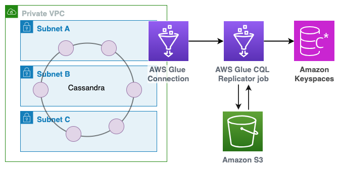

# Migrate data using CQLReplicator

With [CQLReplicator](https://github.com/aws-samples/cql-replicator "https://github.com/aws-samples/cql-replicator"), you can read data from Apache Cassandra in near real time through intelligently
scanning the Cassandra token ring using CQL queries. CQLReplicator doesn’t use Cassandra CDC and instead implements
a caching strategy to reduce the performance penalties of full scans.

To reduce the number of writes to the destination,
CQLReplicator automatically removes duplicate replication events. With CQLReplicator, you can tune the replication of
changes from the source database to the destination database, allowing for a near real time migration of data from
Apache Cassandra to Amazon Keyspaces.

The following diagram shows the typical architecture of a CQLReplicator job using AWS Glue.

1. To allow access
   to Apache Cassandra running in a private VPC, configure an AWS Glue connection with the connection type
   **Network**.
2. To remove duplicates and enable key caching with the CQLReplicator job, configure
   Amazon Simple Storage Service (Amazon S3).
3. The CQLReplicator job streams verified source database changes directly to Amazon Keyspaces.

For more information about the migration process using CQLReplicator, see the
following post on the AWS Database blog [Migrate Cassandra workloads to Amazon Keyspaces using CQLReplicator](https://aws.amazon.com/blogs/database/migrate-cassandra-workloads-to-amazon-keyspaces-using-cqlreplicator/ "https://aws.amazon.com/blogs/database/migrate-cassandra-workloads-to-amazon-keyspaces-using-cqlreplicator/") and the AWS
prescriptive guidance [Migrate Apache Cassandra workloads to Amazon Keyspaces by using AWS Glue](../../../prescriptive-guidance/latest/patterns/migrate-apache-cassandra-workloads-to-amazon-keyspaces-using-aws-glue.md "../../../prescriptive-guidance/latest/patterns/migrate-apache-cassandra-workloads-to-amazon-keyspaces-using-aws-glue.md").
