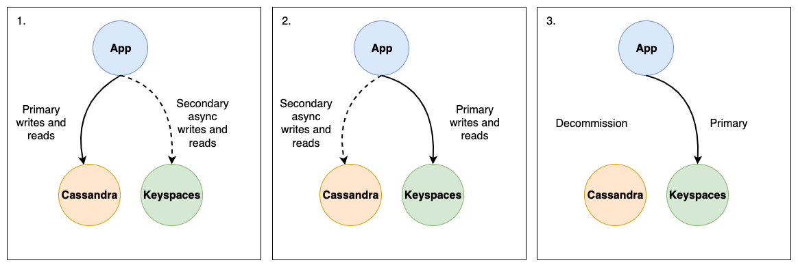
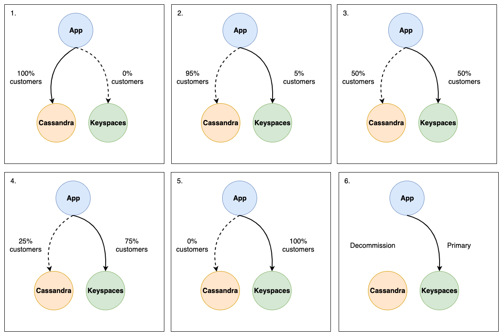

# Migrating the application during an online migration

In the fourth phase of an online migration, you are migrating your application and transitioning to Amazon Keyspaces
as the primary data store. This means that you switch your application to read and write directly from and to
Amazon Keyspaces. To ensure minimal disruption to your users, this should be a well-planned and coordinated process.

Two different recommended solution for application migration are available, the blue green cut over strategy and
the canary cut over strategy. The following sections outline these strategies in more detail.

- **Blue green strategy** – Using this approach, you switch your application
  to treat Amazon Keyspaces as the primary data store and Cassandra as the secondary data store in a single step. You can do this using
  an AWS AppConfig feature flag to control the election of primary and secondary data stores across the application instance. For
  more information about feature flags, see
  [Creating a feature flag configuration profile in AWS AppConfig](../../../appconfig/latest/userguide/appconfig-creating-configuration-and-profile-feature-flags.md "../../../appconfig/latest/userguide/appconfig-creating-configuration-and-profile-feature-flags.md").

After making
Amazon Keyspaces the primary data store, you monitor the application's behavior and performance, ensuring that Amazon Keyspaces meets your
requirements and that the migration is successful.

For example, if you implemented dual-reads for your application, during the
application migration phase you transition the primary reads going from
Cassandra to Amazon Keyspaces and the secondary reads from Amazon Keyspaces to Cassandra. After the
transition, you continue to monitor and compare results as described in the
[data validation](migration-online-validation.md "migration-online-validation.md") section to
ensure consistency across both databases before decommissioning Cassandra.

If you detect any issues, you can quickly roll back to the previous state by reverting to Cassandra as the primary data
store. You only proceed to the decommissioning phase of the migration if Amazon Keyspaces is meeting all your needs as the primary
data store.

- **Canary strategy** – In this approach, you gradually roll out the
  migration to a subset of your users or traffic. Initially, a small percentage of your application's traffic, for example
  5% of all traffic is routed to the version using Amazon Keyspaces as the primary data store, while the rest of the traffic continues
  to use Cassandra as the primary data store.

This allows you to thoroughly test the migrated version with real-world traffic
and monitor its performance, stability, and investigate potential issues. If you don't detect any issues, you can
incrementally increase the percentage of traffic routed to Amazon Keyspaces until it becomes the primary data store for all users
and traffic.

This staged roll out minimizes the risk of widespread service disruptions and allows for a more controlled
migration process. If any critical issues arise during the canary deployment, you can quickly roll back to the previous
version using Cassandra as the primary data store for the affected traffic segment. You only proceed to the decommissioning
phase of the migration after you have validated that Amazon Keyspaces processes 100% of your users and traffic as expected.

The following diagram illustrates the individual steps of the canary strategy.

