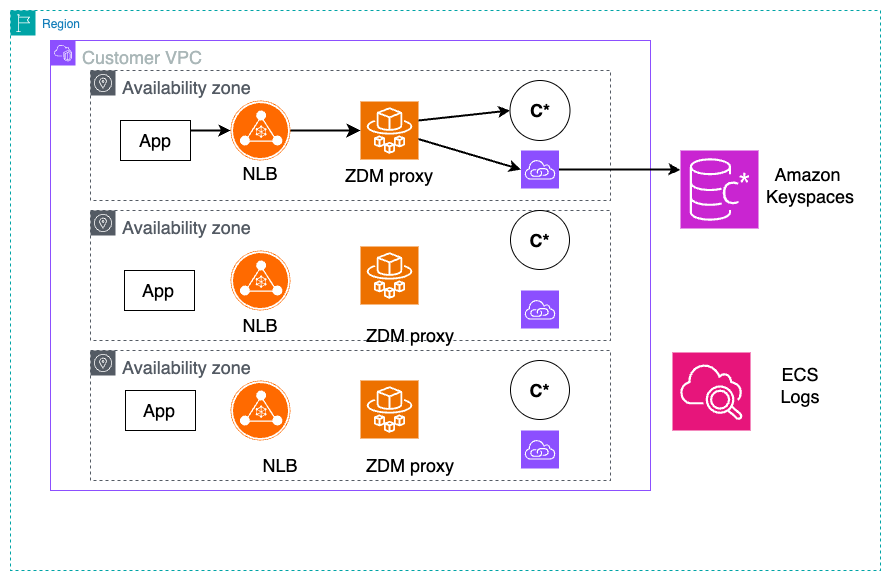
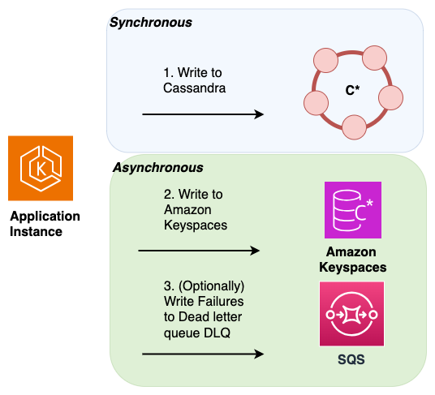

# Writing new data during an online migration

The first step in an online migration plan is to ensure that any new data written
by the application is stored in both databases, your existing Cassandra cluster and
Amazon Keyspaces. The goal is to provide a consistent view across the two data stores. You can do
this by applying all new writes to both databases. To implement dual writes, consider
one of the following three options.

- **ZDM Dual Write Proxy for Amazon Keyspaces Migration** – Using the ZDM
  Proxy for Amazon Keyspaces available on
  [Github](https://github.com/aws-samples/amazon-keyspaces-examples/blob/main/migration/online/zdm-proxy/README.md "https://github.com/aws-samples/amazon-keyspaces-examples/blob/main/migration/online/zdm-proxy/README.md"),
  you can migrate your Apache Cassandra workloads to Amazon Keyspaces without
  application downtime. This enhanced solution implements AWS best practices and
  extends the official ZDM Proxy capabilities.

      + Perform online migrations between Apache Cassandra and Amazon Keyspaces.
      + Write data to both source and target tables simultaneously without refactoring applications.
      + Validate queries through dual-read operations.

  The solution offers the following enhancements to work with AWS and Amazon Keyspaces.

      + **Container deployment** – Use a pre-configured Docker image from Amazon Elastic Container Registry (Amazon ECR) for VPC-accessible deployments.
      + **Infrastructure as code** – Deploy using AWS CloudFormation templates for automated setup on AWS Fargate.
      + **Amazon Keyspaces compatibility** – Access system tables with custom adaptations for Amazon Keyspaces.

  The solution runs on Amazon ECS with Fargate, providing serverless scalability based on your workload demands.
  A network load balancer distributes incoming application traffic across multiple Amazon ECS tasks for high availability.

- **Application dual writes** – You can implement dual writes with minimal
  changes to your application code by leveraging the existing Cassandra client libraries and drivers. You can either
  implement dual writes in your existing application, or create a new layer in the architecture to handle dual writes.
  For more information and a customer case study that shows how dual writes were implemented in an existing application,
  see [Cassandra migration case
  study](https://aws.amazon.com/solutions/case-studies/intuit-apache-migration-case-study/ "https://aws.amazon.com/solutions/case-studies/intuit-apache-migration-case-study/").

When implementing dual writes, you can designate one database as the leader and the other database as the follower.
This allows you to keep writing to your original source, or leader database without letting write failures to the follower,
or destination database disrupt the critical path of your application.

Instead of retrying failed writes to the follower,
you can use Amazon Simple Queue Service to record failed writes in a
[dead letter queue (DLQ)](../../../AWSSimpleQueueService/latest/SQSDeveloperGuide/sqs-dead-letter-queues.md "../../../AWSSimpleQueueService/latest/SQSDeveloperGuide/sqs-dead-letter-queues.md").
The DLQ lets you analyze the failed writes to the follower and determine why processing did not succeed in the destination
database.

For a more sophisticated dual write implementation, you can follow AWS best practices for designing a sequence of
local transactions using the [saga pattern](../../../prescriptive-guidance/latest/cloud-design-patterns/saga.md "../../../prescriptive-guidance/latest/cloud-design-patterns/saga.md").
A saga pattern ensures that if a transaction fails, the saga runs compensating
transactions to revert the database changes made by the previous transactions.

When using dual-writes for an online migration,
you can configure the dual-writes following the saga pattern so that each write is a local transaction to ensure atomic
operations across heterogeneous databases. For more information about designing distributed application using recommended
design patterns for the AWS Cloud, see
[Cloud design patterns, architectures, and implementations](../../../prescriptive-guidance/latest/cloud-design-patterns/introduction.md "../../../prescriptive-guidance/latest/cloud-design-patterns/introduction.md").

- **Messaging tier dual writes** – Instead of
  implementing dual writes at the application layer, you can use your existing messaging tier to perform dual writes
  to Cassandra and Amazon Keyspaces.

To do this you can configure an additional consumer to your messaging platform to send writes
to both data stores. This approach provides a simple low code strategy using the messaging tier to create two views across
both databases that are eventually consistent.
