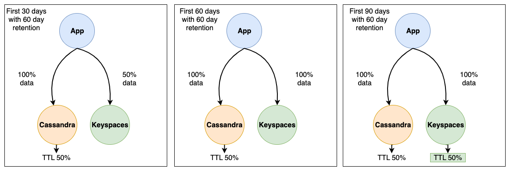

# Uploading historical data during an online migration

After implementing dual writes to ensure that new data is written to both data stores in real time, the next step
in the migration plan is to evaluate how much historical data you need to copy or bulk upload from Cassandra to Amazon Keyspaces.
This ensures that both, new data and historical data are going to be available in the new Amazon Keyspaces database before you’re
migrating the application.

Depending on your data retention requirements, for example how much historical data you
need to preserve based on your organizations policies, you can consider one the following two options.

- **Bulk upload of historical data** – The migration of
  historical data from your existing Cassandra deployment to Amazon Keyspaces can be achieved
  through various techniques, for example using AWS Glue or custom scripts to
  extract, transform, and load (ETL) the data. For more information about using
  AWS Glue to upload historical data, see [Offline migration process: Apache Cassandra to Amazon Keyspaces](migrating-offline.md "migrating-offline.md").

When planning the bulk upload of historical data, you need to consider how to
resolve conflicts that can occur when new writes are trying to update the same
data that is in the process of being uploaded. The bulk upload is expected to be
eventually consistent, which means the data is going to reach all nodes
eventually.

If an update of the same data occurs at the same time due to a new
write, you want to ensure that it's not going to be overwritten by the
historical data upload. To ensure that you preserve the latest updates to your
data even during the bulk import, you must add conflict resolution either into
the bulk upload scripts or into the application logic for dual writes.

For example, you can use [Lightweight
transactions](functional-differences.md#functional-differences.light-transactions "functional-differences.md#functional-differences.light-transactions")
(LWT) to compare and set operations. To do this, you can add an additional field
to your data-model that represents time of modification or state.

Additionally,
Amazon Keyspaces supports the Cassandra `WRITETIME` timestamp function. You can
use Amazon Keyspaces client-side timestamps to preserve source database timestamps and
implement last-writer-wins conflict resolution. For more information, see [Client-side timestamps in Amazon Keyspaces](client-side-timestamps.md "client-side-timestamps.md").

- **Using Time-to-Live (TTL)** – For data retention periods
  shorter than 30, 60, or 90 days, you can use TTL in Cassandra and Amazon Keyspaces during
  migration to avoid uploading unnecessary historical data to Amazon Keyspaces. TTL allows
  you to set a time period after which the data is automatically removed from the
  database.

During the migration phase, instead of copying historical data to
Amazon Keyspaces, you can configure the TTL settings to let the historical data expire
automatically in the old system (Cassandra) while only applying the new writes
to Amazon Keyspaces using the dual-write method. Over time and with old data continually
expiring in the Cassandra cluster and new data written using the dual-write
method, Amazon Keyspaces automatically catches up to contain the same data as Cassandra.

This approach can significantly reduce the amount of data to be migrated,
resulting in a more efficient and streamlined migration process. You can
consider this approach when dealing with large datasets with varying data
retention requirements. For more information about TTL, see [Expire data with Time to Live (TTL) for Amazon Keyspaces (for Apache Cassandra)](TTL.md "TTL.md").

Consider the following example of a migration from Cassandra to Amazon Keyspaces using TTL data expiration. In this example we
set TTL for both databases to 60 days and show how the migration process progresses over a period of 90 days.
Both databases receive the same newly written data during this period using the dual writes method. We're going to look
at three different phases of the migration, each phase is 30 days long.

How the migration process works for each phase
is shown in the following images.

    1. After the first 30 days, the Cassandra cluster and Amazon Keyspaces have been receiving new writes.
     The Cassandra cluster also contains historical data that has not yet reached 60 days of retention, which
     makes up 50% of the data in the cluster.

    Data that is older than 60 days is being automatically deleted in the
     Cassandra cluster using TTL. At this point Amazon Keyspaces contains 50% of the data stored in the Cassandra cluster,
     which is made up of the new writes minus the historical data.
    2. After 60 days, both the Cassandra cluster and Amazon Keyspaces contain the same data written in the last 60 days.
    3. Within 90 days, both Cassandra and Amazon Keyspaces contain the same data and are expiring data at the same rate.

This example illustrates how to avoid the step of uploading historical data by using TTL with an expiration date set
to 60 days.
