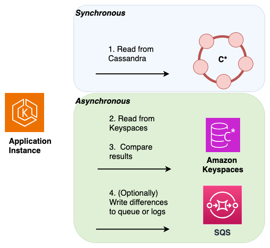
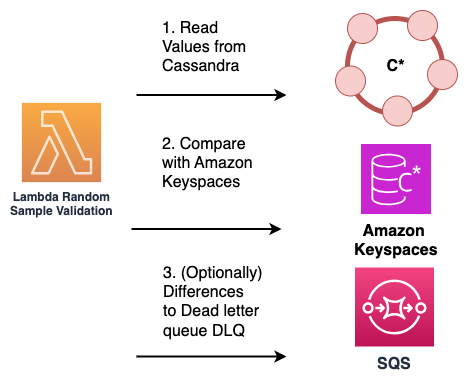

# Validating data consistency during an online migration

The next step in the online migration process is data validation. Dual writes are adding new data to your Amazon Keyspaces database and you have
completed the migration of historical data either using bulk upload or data expiration with TTL.

Now you can use the validation phase
to confirm that both data stores contain in fact the same data and return the same read results. You can choose from one of the
following two options to validate that both your databases contain identical data.

- **Dual reads** – To validate that both,
  the source and the destination database contain the same set of newly written and historical data,
  you can implement dual reads.
  To do so you read from both your primary Cassandra and your secondary Amazon Keyspaces database similarly to the dual writes
  method and compare the results asynchronously.

The results from the primary database are returned to the client, and the results
from the secondary database are used to validate against the primary resultset. Differences found can be logged or sent to a
[dead letter queue (DLQ)](../../../AWSSimpleQueueService/latest/SQSDeveloperGuide/sqs-dead-letter-queues.md "../../../AWSSimpleQueueService/latest/SQSDeveloperGuide/sqs-dead-letter-queues.md") for later reconciliation.

In the following
diagram, the application is performing a synchronous read
from Cassandra, which is the primary data store) and an asynchronous read from Amazon Keyspaces, which is the secondary data store.

- **Sample reads** – An alternative solution that doesn’t require application
  code changes is to use AWS Lambda functions to periodically and randomly sample data from both the source Cassandra
  cluster and the destination Amazon Keyspaces database.

These Lambda functions can be configured to run at regular intervals.
The Lambda function retrieves a random subset of data from both the source and destination systems, and then performs
a comparison of the sampled data. Any discrepancies or mismatches between the two datasets can be recorded and sent to a
dedicated [dead letter queue (DLQ)](../../../AWSSimpleQueueService/latest/SQSDeveloperGuide/sqs-dead-letter-queues.md "../../../AWSSimpleQueueService/latest/SQSDeveloperGuide/sqs-dead-letter-queues.md") for later reconciliation.

This process is illustrated in the following diagram.

