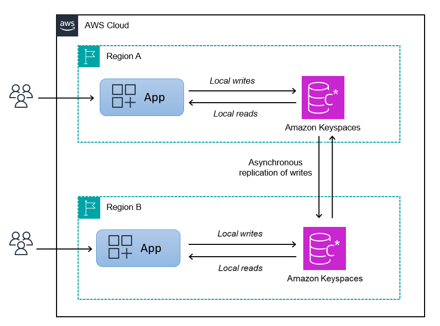

# How multi-Region replication works in Amazon Keyspaces

This section provides an overview of how Amazon Keyspaces multi-Region replication works. For more information about
pricing, see [Amazon Keyspaces (for Apache Cassandra)
pricing](https://aws.amazon.com/keyspaces/pricing "https://aws.amazon.com/keyspaces/pricing").

###### Topics

- [How multi-Region replication works in
  Amazon Keyspaces](#multiRegion-replication_how-it-works-overview "#multiRegion-replication_how-it-works-overview")
- [Multi-Region replication conflict resolution](#multiRegion-replication_how-it-works-conflict-resolution "#multiRegion-replication_how-it-works-conflict-resolution")
- [Multi-Region replication disaster recovery](#howitworks_disaster_recovery "#howitworks_disaster_recovery")
- [Multi-Region replication in AWS Regions disabled by default](#howitworks_mrr_opt_in "#howitworks_mrr_opt_in")
- [Multi-Region replication and integration with point-in-time recovery
  (PITR)](#howitworks_mrr_pitr "#howitworks_mrr_pitr")
- [Multi-Region replication and integration with AWS
  services](#howitworks_integration "#howitworks_integration")

## How multi-Region replication works in

Amazon Keyspaces

Amazon Keyspaces multi-Region replication implements a data resiliency architecture that distributes your data
across independent and geographically distributed AWS Regions. It uses _active-active replication_, which provides local low latency
with each Region being able to perform reads and writes in isolation.

When you create an Amazon Keyspaces multi-Region keyspace, you can select additional
Regions where the data is going to be replicated to. Each table you create in a
multi-Region keyspace consists of multiple replica tables (one per Region) that Amazon Keyspaces
considers as a single unit.

Every replica has the same table name and the same primary key schema. When an
application writes data to a local table in one Region, the data is durably written using the
`LOCAL_QUORUM` consistency level. Amazon Keyspaces automatically replicates the data asynchronously
to the other replication Regions. The replication lag across Regions is typically less
than one second and doesn't impact your application’s performance or throughput.

After the data is written, you can read it from the multi-Region table in another
replication Region with the `LOCAL_ONE/LOCAL_QUORUM` consistency levels. For more information about supported
configurations and features, see [Amazon Keyspaces multi-Region replication usage notes](multiRegion-replication_usage-notes.md "multiRegion-replication_usage-notes.md").

## Multi-Region replication conflict resolution

Amazon Keyspaces multi-Region replication is fully managed, which means that you don't have to perform replication
tasks such as regularly running repair operations to clean-up data synchronization
issues. Amazon Keyspaces monitors data consistency between tables in different AWS Regions by detecting
and repairing conflicts, and synchronizes replicas automatically.

Amazon Keyspaces uses the _last
writer wins_ method of data reconciliation. With this conflict resolution
mechanism, all of the Regions in a multi-Region keyspace agree on the latest update and
converge toward a state in which they all have identical data. The reconciliation
process has no impact on application performance. To support conflict resolution,
client-side timestamps are automatically turned on for multi-Region tables and can't be
turned off. For more information, see [Client-side timestamps in Amazon Keyspaces](client-side-timestamps.md "client-side-timestamps.md").

## Multi-Region replication disaster recovery

With Amazon Keyspaces multi-Region replication, writes are replicated asynchronously across each
Region. In the rare event of a single Region degradation or failure, multi-Region replication helps you to
recover from disaster with little to no impact to your application. Recovery from
disaster is typically measured using values for Recovery time objective (RTO) and
Recovery point objective (RPO).

**Recovery time objective**
– The time it takes a system to return to a working state after a
disaster. RTO measures the amount of downtime your workload can tolerate, measured in
time. For disaster recovery plans that use multi-Region replication to fail over to an unaffected Region,
the RTO can be nearly zero. The RTO is limited by how quickly your application can
detect the failure condition and redirect traffic to another Region.

**Recovery point objective**
– The amount of data that can be lost (measured in time). For disaster
recovery plans that use multi-Region replication to fail over to an unaffected Region, the RPO is typically
single-digit seconds. The RPO is limited by replication latency to the failover target
replica.

In the event of a Regional failure or degradation, you don't need to promote a
secondary Region or perform database failover procedures because replication in Amazon Keyspaces is
active-active. Instead, you can use Amazon Route 53 to route your application to the nearest
healthy Region. To learn more about Route 53, see [What is Amazon Route 53?](../../../Route53/latest/DeveloperGuide/Welcome.md "../../../Route53/latest/DeveloperGuide/Welcome.md").

If a single AWS Region becomes isolated or degraded, your application can redirect
traffic to a different Region using Route 53 to perform reads and writes against a
different replica table. You can also apply custom business logic to determine when to
redirect requests to other Regions. An example of this is making your application aware
of the multiple endpoints that are available.

When the Region comes back online, Amazon Keyspaces resumes propagating any pending writes from
that Region to the replica tables in other Regions. It also resumes propagating writes
from other replica tables to the Region that is now back online.

## Multi-Region replication in AWS Regions disabled by default

Amazon Keyspaces multi-Region replication is supported in the following AWS Regions that are disabled by default:

- Africa (Cape Town) Region
- Middle East (UAE) Region
- Asia Pacific (Hong Kong) Region
- Middle East (Bahrain) Region

Before you can use a Region that's disabled by default with Amazon Keyspaces multi-Region replication,
you first have to enable the Region.
For more information, see [Enable or disable AWS Regions in your account](../../../general/latest/gr/rande-manage.md#rande-manage-enable "../../../general/latest/gr/rande-manage.md#rande-manage-enable") in the [_AWS Organizations User Guide_](../../../organizations/latest/userguide.md "../../../organizations/latest/userguide.md").

After you've enabled a Region, you can create new Amazon Keyspaces resources in the Region and add the
Region to a multi-Region keyspace.

When you disable a Region that is used by Amazon Keyspaces multi-Region replication, Amazon Keyspaces initiates a 24-hour grace period.
During this time window, you can expect the following behavior:

- Amazon Keyspaces continues to perform data manipulation language (DML) operations in enabled Regions.
- Amazon Keyspaces pauses replicating data updates from enabled Regions to the disabled Region.
- Amazon Keyspaces blocks all data definition language (DDL) requests in the disabled Region.

If you disabled the Region in error, you can re-enable the Region within 24 hours. If you
re-enable the Region during the 24-hour grace period, Amazon Keyspaces
is going to take the following actions:

- Automatically resume all replications to the re-enabled Region.
- Replicate any data updates that took place in enabled Regions while the Region was disabled to ensure data consistency.
- Continue all additional multi-Region replication operations automatically.

In the case that the Region remains disabled after the 24-hour window closes, Amazon Keyspaces takes the
following actions to permanently remove the Region from multi-Region replication:

- Remove the disabled Region from all multi-Region replication keyspaces.
- Convert multi-Region replication table replicas in the disabled Region into single-Region keyspaces and tables.
- Amazon Keyspaces doesn't delete any resources from the disabled Region.

After Amazon Keyspaces has permanently removed the disabled Region from the multi-Region keyspace, you can't add the
disabled Region back.

## Multi-Region replication and integration with point-in-time recovery

(PITR)

Point-in-time recovery is supported for multi-Region tables. To successfully restore a
multi-Region table with PITR, the following conditions have to be met.

- The source and the target table must be configured as multi-Region
  tables.
- The replication Regions for the keyspace of the source table and for the keyspace
  of the target table must be the same.
- PITR has to be enabled on all replicas of the source table.

You can run the restore statement from any of the Regions that the source table is
available in. Amazon Keyspaces automatically restores the target table in each Region. For more
information about PITR, see [How point-in-time recovery works in
Amazon Keyspaces](PointInTimeRecovery_HowItWorks.md "PointInTimeRecovery_HowItWorks.md").

When you create a multi-Region table, the PITR settings that you define during the creation process
are automatically applied to all tables in all Regions. When you change PITR settings using `ALTER TABLE`,
Amazon Keyspaces applies the update only to the local table and not to the replicas in other Regions. To enable PITR for an existing
multi-Region table, you have to repeat the `ALTER TABLE` statement for all replicas.

## Multi-Region replication and integration with AWS

services

You can monitor replication performance between tables in different AWS Regions by
using Amazon CloudWatch metrics. The following metric provides continuous monitoring of
multi-Region keyspaces.

- `ReplicationLatency` – This metric measures the time
  it took to replicate `updates`, `inserts`, or `deletes`
  from one replica table to another replica table in a multi-Region keyspace.

For more information about how to monitor CloudWatch metrics, see [Monitoring Amazon Keyspaces with Amazon CloudWatch](monitoring-cloudwatch.md "monitoring-cloudwatch.md").
