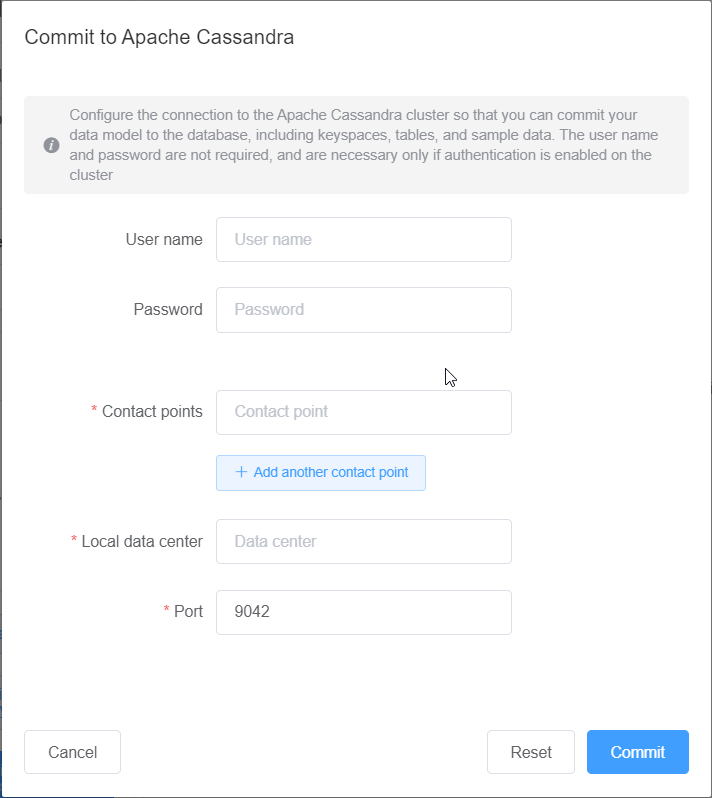

# Commit to Apache Cassandra

This section walks you through making the connections to an Apache Cassandra cluster
to commit the data model created or edited with NoSQL Workbench.

###### Note

Only data models that have been created with `SimpleStrategy` or
`NetworkTopologyStrategy` can be committed to Apache Cassandra
clusters. To change the replication strategy, edit the keyspace in the data
modeler.

1. - **User name** – Enter the user name if
     authentication is enabled on the cluster.
   - **Password** – Enter the password if
     authentication is enabled on the cluster.
   - **Contact points** – Enter the contact
     points.
   - **Local data center** – Enter the name of the
     local data center.
   - **Port** – The connection uses port
   9042.
2. Choose **Commit** to update the Apache Cassandra cluster with
   the data model.

