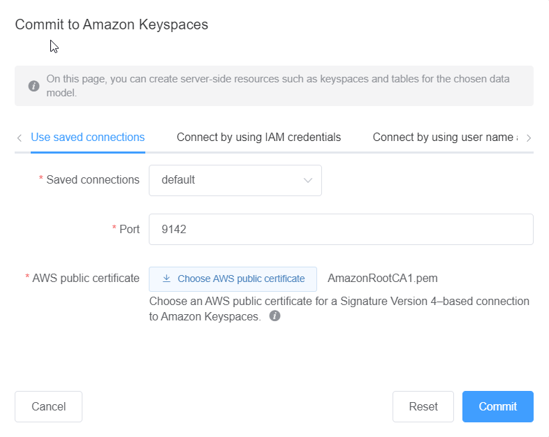

# Use a saved connection

If you have previously set up a connection to Amazon Keyspaces, you can use that as the default
connection to commit data model changes. Choose the **Use saved
connections** tab and continue to commit the updates.

