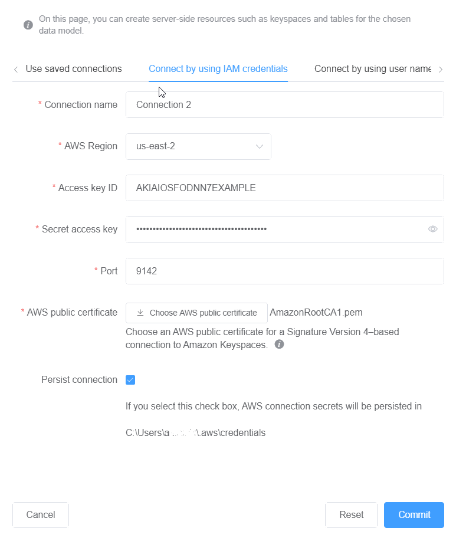

# Connect to Amazon Keyspaces with AWS Identity and Access Management (IAM) credentials

This section shows how to use IAM credentials to commit the data model created or
edited with NoSQL Workbench.

1.  To create a new connection using IAM credentials, choose the **Connect
    by using IAM credentials** tab.
    1.  Before you begin, you must create IAM credentials using one of the
        following methods.

            * For console access, use your IAM user name and password to sign in to the
             [AWS Management Console](https://console.aws.amazon.com/console/home "https://console.aws.amazon.com/console/home")
             from the IAM sign-in page. For information about AWS security credentials,
             including programmatic access and alternatives to long-term credentials,
             see [AWS security credentials](../../../IAM/latest/UserGuide/security-creds.md "../../../IAM/latest/UserGuide/security-creds.md") in the *IAM User Guide*.
             For details about signing in to your AWS account, see [How to
             sign in to AWS](../../../signin/latest/userguide/how-to-sign-in.md "../../../signin/latest/userguide/how-to-sign-in.md") in the *AWS Sign-In User Guide*.
            * For CLI access, you need an access key ID and a secret access key.
             Use temporary credentials instead of long-term access keys when possible.
             Temporary credentials include an access key ID, a secret access key, and a
             security token that indicates when the credentials expire. For more information,
             see [Using temporary credentials with AWS resources](../../../IAM/latest/UserGuide/id_credentials_temp_use-resources.md "../../../IAM/latest/UserGuide/id_credentials_temp_use-resources.md") in the *IAM User Guide*.
            * For API access, you need an access key ID and secret access key.
             Use IAM user access keys instead of
             AWS account root user access keys. For more information about creating access keys, see
             [Manage access keys for IAM users](../../../IAM/latest/UserGuide/id_credentials_access-keys.md "../../../IAM/latest/UserGuide/id_credentials_access-keys.md")
             in the *IAM User Guide*.

        For more information, see [Managing access keys for IAM users](../../../IAM/latest/UserGuide/id_credentials_access-keys.md "../../../IAM/latest/UserGuide/id_credentials_access-keys.md").After you have obtained the IAM credentials, you can continue to set up the
        connection.
    - **Connection name** – The name of the
      connection.
    - **AWS Region** – For available Regions, see
      [Service endpoints for Amazon Keyspaces](programmatic.md "programmatic.md").
    - **Access key ID** – Enter the access key
      ID.
    - **Secret access key** – Enter the secret
      access key.
    - **Port** – Amazon Keyspaces uses port 9142.
    - **AWS public certificate** – Point to the AWS
      certificate that was downloaded in the first step.
    - **Persist connection** – Select this check box
      if you want to save the AWS connection secrets locally.

2.  Choose **Commit** to update Amazon Keyspaces with the data model.

