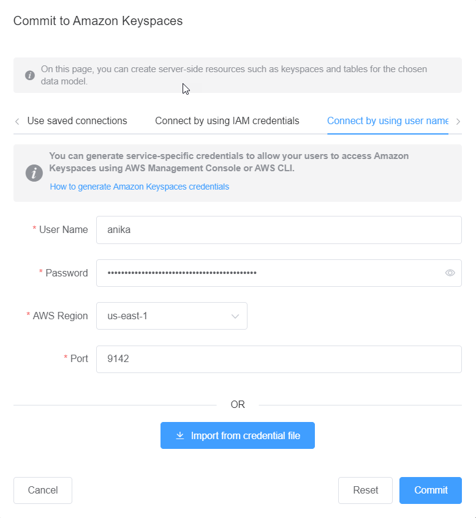

# Connect to Amazon Keyspaces with service-specific

credentials

This section shows how to use service-specific credentials to commit the data model
you created or edited with NoSQL Workbench.

1.  To create a new connection using service-specific credentials, choose the
    **Connect by using user name and password** tab.

        1. Before you begin, you must create service-specific credentials using
         the process documented at [Create service-specific
         credentials for programmatic access to Amazon Keyspaces](programmatic.credentials.md "programmatic.credentials.md").After you have obtained the service-specific credentials, you can continue to

    set up the connection. Continue with one of the following:

        * **User name** – Enter the user name.
        * **Password** – Enter the password.
        * **AWS Region** – For available Regions, see
         [Service endpoints for Amazon Keyspaces](programmatic.md "programmatic.md").
        * **Port** – Amazon Keyspaces uses port 9142.

    Alternatively, you can import saved credentials from a file.

2.  Choose **Commit** to update Amazon Keyspaces with the data model.

