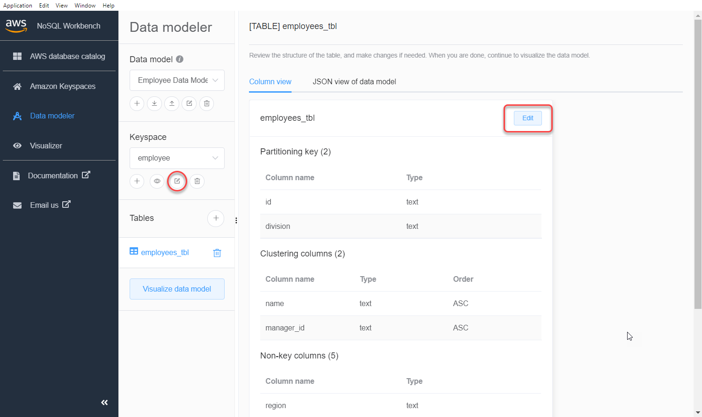

# Edit existing data models with NoSQL

Workbench

You can use the data modeler to import and modify existing data models created using NoSQL Workbench. The data modeler
also includes a few sample data models to help you get started with data modeling.
The data models you can edit with NoSQL Workbench can be data models that are imported from a file, the provided sample data models,
or data models that you created previously.

1. To edit a keyspace, choose the edit symbol under
   **Keyspace**.

In this step, you can edit the following properties and settings.

    * **Keyspace name** – Enter the name of the new
     keyspace.
    * **Replication strategy** – Choose the
     replication strategy for the keyspace. Amazon Keyspaces uses the **SingleRegionStrategy** to replicate
     data three times automatically in multiple AWS Availability Zones. If you're planning
     to commit the data model to an Apache Cassandra cluster, you can choose
     **SimpleStrategy** or
     **NetworkTopologyStrategy**.
    * **Keyspaces tags** – Resource tags are
     optional and let you categorize your resources in different
     ways—for example, by purpose, owner, environment, or other
     criteria. To learn more about tags for Amazon Keyspaces resources, see [Working with tags and labels for Amazon Keyspaces resources](tagging-keyspaces.md "tagging-keyspaces.md").

2. Choose **Save edits** to update the keyspace.

 3. To edit a table, choose **Edit** next to the table name. In
this step, you can update the following properties and settings.

    * **Table name** – The name of the new
     table.
    * **Columns** – Add a column name and choose the
     data type. Repeat these steps for every column in your schema.
    * **Partition key** – Choose columns for the
     partition key.
    * **Clustering columns** – Choose clustering
     columns (optional).
    * **Capacity mode** – Choose the read/write
     capacity mode for the table. You can choose provisioned or on-demand
     capacity. To learn more about capacity modes, see [Configure read/write capacity modes in Amazon Keyspaces](ReadWriteCapacityMode.md "ReadWriteCapacityMode.md").
    * **Table tags** – Resource tags are optional
     and let you categorize your resources in different ways—for
     example, by purpose, owner, environment, or other criteria. To learn
     more about tags for Amazon Keyspaces resources, see [Working with tags and labels for Amazon Keyspaces resources](tagging-keyspaces.md "tagging-keyspaces.md").

4. Choose **Save edits** to update the table.
5. Continue to [Visualizing data models with NoSQL
   Workbench](workbench.md#workbench.datamodel.visualize "workbench.md#workbench.datamodel.visualize") to visualize the
   data model that you updated.
