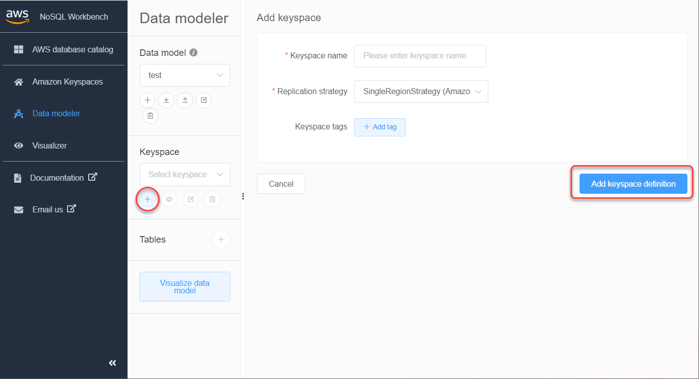
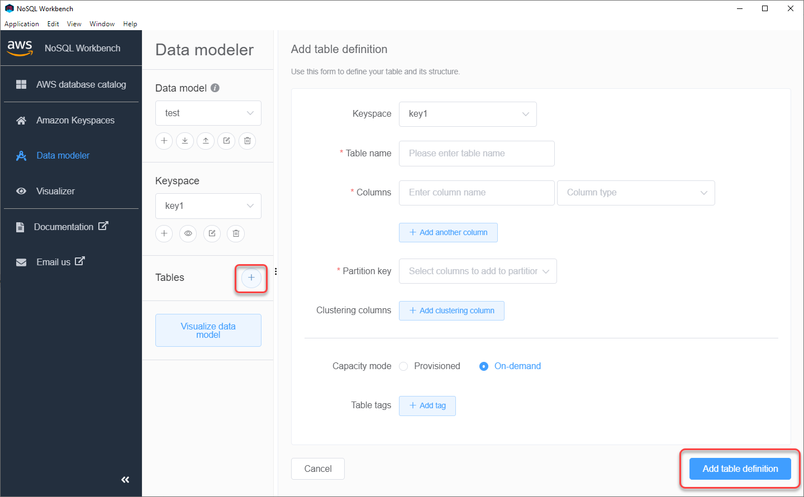

# Create a new data model with NoSQL

Workbench

You can use the NoSQL Workbench data modeler to design new data models based on your
application's data access patterns. To create a new data model for Amazon Keyspaces, you can use the NoSQL Workbench data modeler to
create keyspaces, tables, and columns. Follow these steps to create a new data
model.

1. To create a new keyspace, choose the plus sign under
   **Keyspace**.

In this step, choose the following properties and settings.

    * **Keyspace name** – Enter the name of the new
     keyspace.
    * **Replication strategy** – Choose the
     replication strategy for the keyspace. Amazon Keyspaces uses the **SingleRegionStrategy** to replicate
     data three times automatically in multiple AWS Availability Zones. If you're planning
     to commit the data model to an Apache Cassandra cluster, you can choose
     **SimpleStrategy** or
     **NetworkTopologyStrategy**.
    * **Keyspaces tags** – Resource tags are
     optional and let you categorize your resources in different
     ways—for example, by purpose, owner, environment, or other
     criteria. To learn more about tags for Amazon Keyspaces resources, see [Working with tags and labels for Amazon Keyspaces resources](tagging-keyspaces.md "tagging-keyspaces.md").

2. Choose **Add keyspace definition** to create the
   keyspace.

 3. To create a new table, choose the plus sign next to
**Tables**. In this step, you define the following
properties and settings.

    * **Table name** – The name of the new
     table.
    * **Columns** – Add a column name and choose the
     data type. Repeat these steps for every column in your schema.
    * **Partition key** – Choose columns for the
     partition key.
    * **Clustering columns** – Choose clustering
     columns (optional).
    * **Capacity mode** – Choose the read/write
     capacity mode for the table. You can choose provisioned or on-demand
     capacity. To learn more about capacity modes, see [Configure read/write capacity modes in Amazon Keyspaces](ReadWriteCapacityMode.md "ReadWriteCapacityMode.md").
    * **Table tags** – Resource tags are optional
     and let you categorize your resources in different ways—for
     example, by purpose, owner, environment, or other criteria. To learn
     more about tags for Amazon Keyspaces resources, see [Working with tags and labels for Amazon Keyspaces resources](tagging-keyspaces.md "tagging-keyspaces.md").

4. Choose **Add table definition** to create the new
   table.
5. Repeat these steps to create additional tables.
6. Continue to [Visualizing data models with NoSQL
   Workbench](workbench.md#workbench.datamodel.visualize "workbench.md#workbench.datamodel.visualize") to visualize the
   data model that you created.

