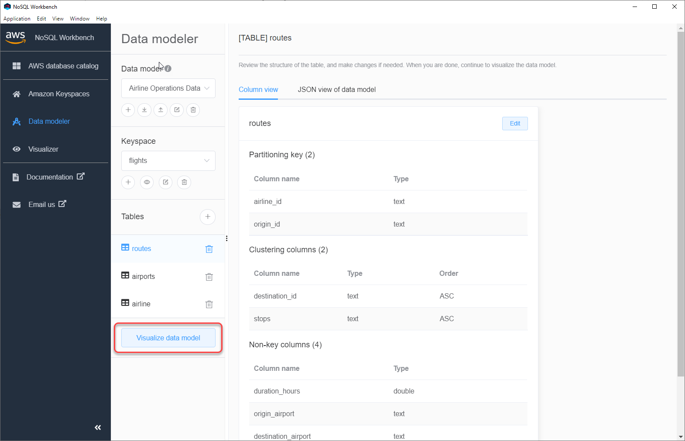
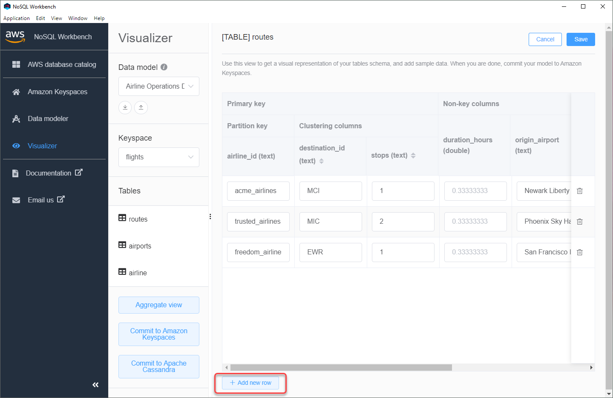
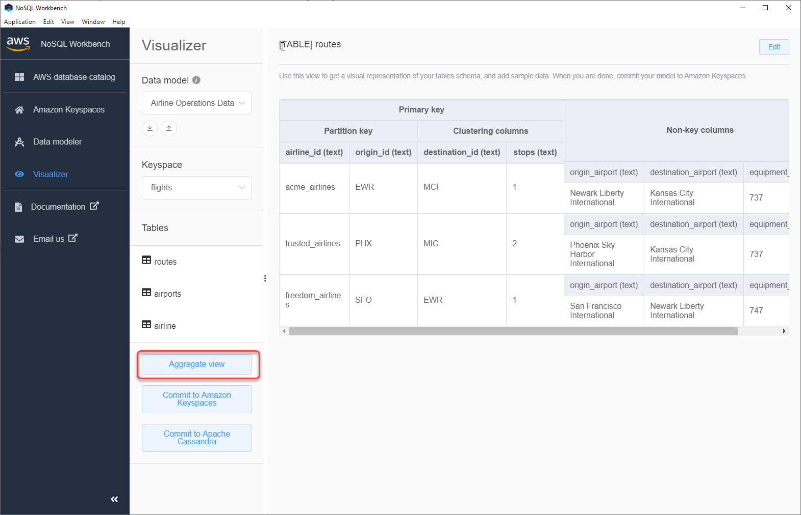
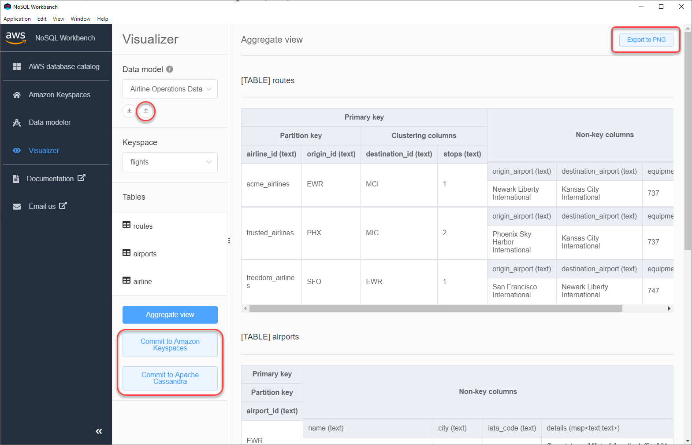

# Visualize data models with NoSQL Workbench

Using NoSQL Workbench, you can visualize your data models to help ensure that the data
models can support your application’s queries and access patterns. You also can save and export
your data models in a variety of formats for collaboration, documentation, and
presentations.

After you have created a new data model or edited an existing data model, you can visualize
the model.

## Visualizing data models with NoSQL

Workbench

When you have completed the data model in the data modeler, choose **Visualize
data model**.

This takes you to the data visualizer in NoSQL Workbench. The data visualizer provides a
visual representation of the table's schema and lets you add sample data. To add sample data
to a table, choose a table from the model, and then choose **Edit**. To add a
new row of data, choose **Add new row** at the bottom of the screen. Choose
**Save** when you're done.

## Aggregate view

After you have confirmed the table's schema, you can aggregate data model
visualizations.

After you have aggregated the view of the data model, you can export the view to a PNG
file. To export the data model to a JSON file, choose the upload sign under the data model
name.

###### Note

You can export the data model in JSON format at any time in the design process.

You have the following options to commit the changes:

- Commit to Amazon Keyspaces
- Commit to an Apache Cassandra cluster

To learn more about how to commit changes, see [How to commit data models to Amazon Keyspaces and Apache
Cassandra](workbench.md "workbench.md").
