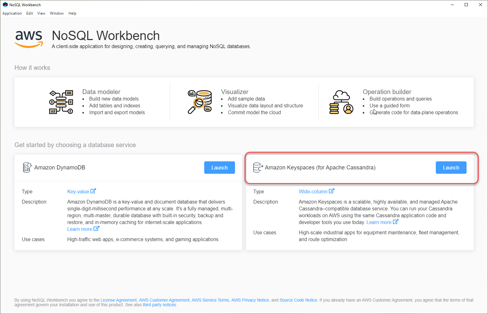
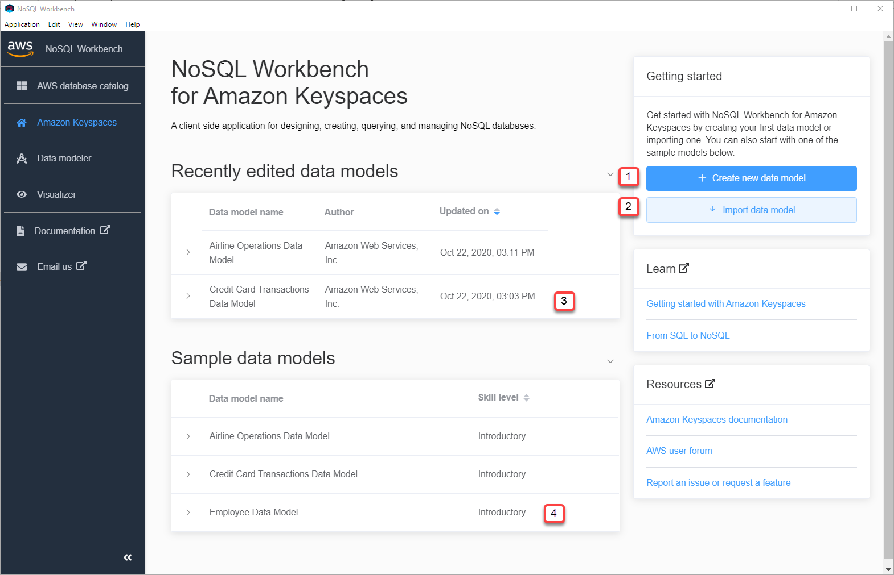

# Getting

started
with NoSQL Workbench

To get started with NoSQL Workbench, on the Database Catalog page in NoSQL Workbench,
choose Amazon Keyspaces, and then choose **Launch**.

This opens the NoSQL Workbench home page for Amazon Keyspaces where you have the following
options to get started:

1. Create a new data model.
2. Import an existing data model in JSON format.
3. Open a recently edited data model.
4. Open one of the available sample models.

Each of the options opens the NoSQL Workbench data modeler. To continue creating a new
data model, see [Create a new data model with NoSQL
Workbench](workbench.datamodel.md "workbench.datamodel.md"). To edit an existing data
model, see [Edit existing data models with NoSQL
Workbench](workbench.datamodel.md "workbench.datamodel.md").
