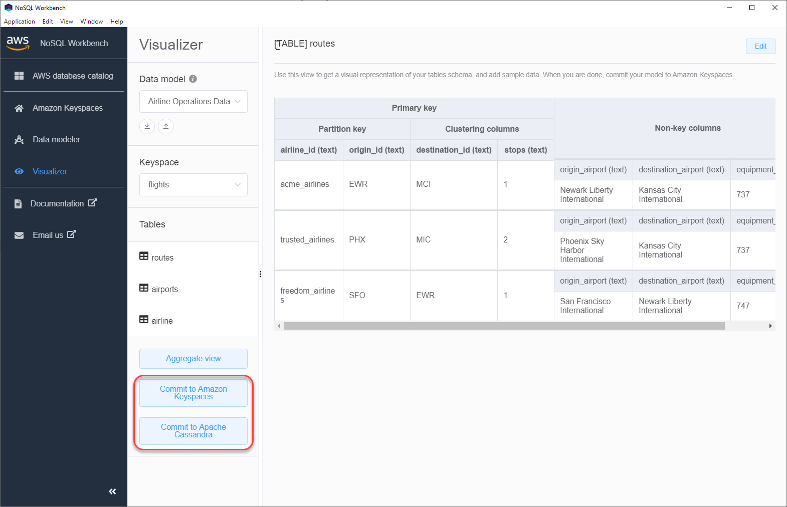

# How to commit data models to Amazon Keyspaces and Apache

Cassandra

This section shows you how to commit completed data models to Amazon Keyspaces and Apache Cassandra
clusters. This process automatically creates the server-side resources for keyspaces and
tables based on the settings that you defined in the data model.



###### Topics

- [Before you begin](#workbench.commit.preqequ "#workbench.commit.preqequ")
- [Connect to Amazon Keyspaces with service-specific
  credentials](workbench.commit.md "workbench.commit.md")
- [Connect to Amazon Keyspaces with AWS Identity and Access Management (IAM) credentials](workbench.commit.md "workbench.commit.md")
- [Use a saved connection](workbench.commit.md "workbench.commit.md")
- [Commit to Apache Cassandra](workbench.commit.md "workbench.commit.md")

## Before you begin

Amazon Keyspaces requires the use of Transport Layer Security (TLS) to help secure connections
with clients. To connect to Amazon Keyspaces using TLS, you need to complete the following task
before you can start.

- Download the following digital certificates and save
  the files locally or in your home directory.

      1. AmazonRootCA1
      2. AmazonRootCA2
      3. AmazonRootCA3
      4. AmazonRootCA4
      5. Starfield Class 2 Root (optional – for backward compatibility)

  To download the certificates, you can use the following commands.

```
curl -O https://www.amazontrust.com/repository/AmazonRootCA1.pem
curl -O https://www.amazontrust.com/repository/AmazonRootCA2.pem
curl -O https://www.amazontrust.com/repository/AmazonRootCA3.pem
curl -O https://www.amazontrust.com/repository/AmazonRootCA4.pem
curl -O https://certs.secureserver.net/repository/sf-class2-root.crt
```

###### Note

Amazon Keyspaces previously used TLS certificates anchored to the Starfield Class 2 CA.
AWS is migrating all AWS Regions to certificates issued under Amazon Trust Services (Amazon Root CAs 1–4).
During this transition, configure clients to trust both Amazon Root CAs 1–4 and the Starfield root to ensure compatibility across all Regions.

Combine all downloaded certificates into a single `pem` file with the name
`keyspaces-bundle.pem` in our examples. You can do this by running the following command. Take note of the path to the
file, you need this later.

```
cat AmazonRootCA1.pem \
 AmazonRootCA2.pem \
 AmazonRootCA3.pem \
 AmazonRootCA4.pem \
 sf-class2-root.crt \
 > `keyspaces-bundle.pem`
```

After you have saved the certificate file, you can connect to Amazon Keyspaces. One option is to connect by using service-specific credentials.
Service-specific credentials are a user name and password that are associated with a specific IAM user and can only be used with the specified service.
The second option is to connect with IAM
credentials that are using the [AWS Signature Version 4 process
(SigV4)](../../../general/latest/gr/signature-version-4.md "../../../general/latest/gr/signature-version-4.md"). To learn more about these two options, see [Create credentials for programmatic access to Amazon Keyspaces](programmatic.md "programmatic.md") .

To connect with service-specific credentials, see [Connect to Amazon Keyspaces with service-specific
credentials](workbench.commit.md "workbench.commit.md").

To connect with IAM credentials, see [Connect to Amazon Keyspaces with AWS Identity and Access Management (IAM) credentials](workbench.commit.md "workbench.commit.md").
