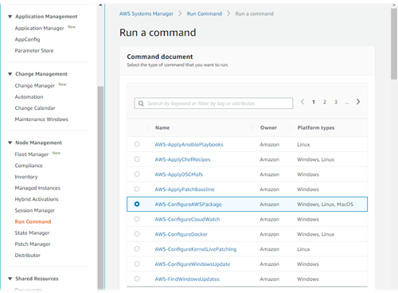
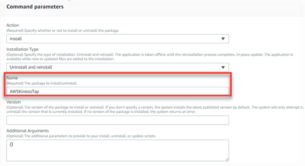

# Getting Started with Amazon Kinesis Agent for Microsoft Windows

You can use Amazon Kinesis Agent for Microsoft Windows (Kinesis Agent for Windows) to collect, parse, transform, and stream logs, events, and
metrics from your Windows fleet to various AWS services. The following information contains
prerequisites and step-by-step instructions for installing and configuring Kinesis Agent for Windows.

###### Topics

- [Prerequisites](#getting-started-prerequisites "#getting-started-prerequisites")
- [Setting Up an AWS account](#getting-started-setting-up "#getting-started-setting-up")
- [Installing Kinesis Agent for Windows](#getting-started-installation "#getting-started-installation")
- [Configuring and Starting Kinesis Agent for Windows](#getting-started-start-service "#getting-started-start-service")

## Prerequisites

Before installing Kinesis Agent for Windows, ensure that you have the following
prerequisites:

- Familiarity with Kinesis Agent for Windows concepts. For more information, see [Amazon Kinesis Agent for Microsoft Windows Concepts](kinesis-agent-windows-concepts.md "kinesis-agent-windows-concepts.md").
- An AWS account for using the various AWS services related to your data pipeline. For
  information about creating and configuring an AWS account, see [Setting Up an AWS account](#getting-started-setting-up "#getting-started-setting-up").
- Microsoft .NET Framework 4.6 or later on each desktop or server that will run Kinesis Agent for Windows. For
  more information, see [Install
  the .NET Framework for developers](https://docs.microsoft.com/en-us/dotnet/framework/install/guide-for-developers "https://docs.microsoft.com/en-us/dotnet/framework/install/guide-for-developers") in the Microsoft .NET documentation.

To determine the latest version of the .NET Framework that is installed on a desktop or
server, use the following PowerShell script:

```

     [System.Version](
     (Get-ChildItem 'HKLM:\SOFTWARE\Microsoft\NET Framework Setup\NDP' -recurse `
     | Get-ItemProperty -Name Version -ErrorAction SilentlyContinue `
     | Where-Object { ($_.PSChildName -match 'Full') } `
     | Select-Object Version | Sort-Object -Property Version -Descending)[0]).Version

```

- The streams where you want to send data from Kinesis Agent for Windows (if using Amazon Kinesis Data Streams). Create the
  streams using the [Kinesis Data Streams console](https://console.aws.amazon.com/kinesis/ "https://console.aws.amazon.com/kinesis/"), the [AWS CLI](../../../cli/latest/reference/kinesis/create-stream.md "../../../cli/latest/reference/kinesis/create-stream.md"), or
  [AWS Tools for Windows PowerShell](../../../powershell/latest/reference/items/New-KINStream.md "../../../powershell/latest/reference/items/New-KINStream.md"). For more information, see [Creating and Updating Data Streams](../../../streams/latest/dev/amazon-kinesis-streams.md "../../../streams/latest/dev/amazon-kinesis-streams.md") in
  the _Amazon Kinesis Data Streams Developer Guide_.
- The Firehose delivery streams where you want to send data from Kinesis Agent for Windows (if using Amazon Data Firehose).
  Create delivery streams using the [Firehose
  console](https://console.aws.amazon.com/firehose/ "https://console.aws.amazon.com/firehose/"), the [AWS CLI](../../../cli/latest/reference/firehose/create-delivery-stream.md "../../../cli/latest/reference/firehose/create-delivery-stream.md"), or [AWS Tools for Windows PowerShell](../../../powershell/latest/reference/items/New-KINFDeliveryStream.md "../../../powershell/latest/reference/items/New-KINFDeliveryStream.md"). For more information, see [Creating an Amazon Data Firehose Delivery Stream](../../../firehose/latest/dev/basic-create.md "../../../firehose/latest/dev/basic-create.md") in the
  _Amazon Data Firehose Developer Guide_.

## Setting Up an AWS account

If you do not have an AWS account, complete the following steps to create one.

###### To sign up for an AWS account

1. Open [https://portal.aws.amazon.com/billing/signup](https://portal.aws.amazon.com/billing/signup "https://portal.aws.amazon.com/billing/signup").
2. Follow the online instructions.

Part of the sign-up procedure involves receiving a phone call or text message and entering
a verification code on the phone keypad.

When you sign up for an AWS account, an _AWS account root user_ is created. The root user has access to all AWS services
and resources in the account. As a security best practice, assign administrative access to a user, and use only the root user to perform [tasks that require root user access](../../../IAM/latest/UserGuide/id_root-user.md#root-user-tasks "../../../IAM/latest/UserGuide/id_root-user.md#root-user-tasks").

To create an administrator user, choose one of the following options.

| Choose one way to manage your administrator | To                                                                                                                                                                                                                                                                                                                                                  | By                                                                                                                                                                                                                                          | You can also                                                                                                                                                                                                                                          |
| ------------------------------------------- | --------------------------------------------------------------------------------------------------------------------------------------------------------------------------------------------------------------------------------------------------------------------------------------------------------------------------------------------------- | ------------------------------------------------------------------------------------------------------------------------------------------------------------------------------------------------------------------------------------------- | ----------------------------------------------------------------------------------------------------------------------------------------------------------------------------------------------------------------------------------------------------- |
| In IAM Identity Center (Recommended)        | Use short-term credentials to access AWS.This aligns with the security best<br>practices. For information about best practices, see [Security best<br>practices in IAM](../../../IAM/latest/UserGuide/best-practices.md#bp-users-federation-idp "../../../IAM/latest/UserGuide/best-practices.md#bp-users-federation-idp") in the _IAM User Guide_. | Following the instructions in [Getting started](../../../singlesignon/latest/userguide/getting-started.md "../../../singlesignon/latest/userguide/getting-started.md") in the<br>_AWS IAM Identity Center User Guide_.                      | Configure programmatic access by [Configuring the AWS CLI to use<br>AWS IAM Identity Center](../../../cli/latest/userguide/cli-configure-sso.md "../../../cli/latest/userguide/cli-configure-sso.md") in the _AWS Command Line Interface User Guide_. |
| In IAM (Not recommended)                    | Use long-term credentials to access AWS.                                                                                                                                                                                                                                                                                                            | Following the instructions in [Create an IAM user for emergency access](../../../IAM/latest/UserGuide/getting-started-emergency-iam-user.md "../../../IAM/latest/UserGuide/getting-started-emergency-iam-user.md") in the _IAM User Guide_. | Configure programmatic access by [Manage access keys for IAM<br>users](../../../IAM/latest/UserGuide/id_credentials_access-keys.md "../../../IAM/latest/UserGuide/id_credentials_access-keys.md") in the _IAM User Guide_.                            |

###### To sign up for AWS and create an administrator account

1. If you don't have an AWS account, open [https://aws.amazon.com/](https://aws.amazon.com/ "https://aws.amazon.com/"). Choose **Create an AWS account**, and then follow
   the online instructions.

Part of the sign-up procedure involves receiving a phone call and entering a PIN using the phone
keypad. 2. Sign in to the AWS Management Console and open the IAM console at [https://console.aws.amazon.com/iam/](https://console.aws.amazon.com/iam/ "https://console.aws.amazon.com/iam/"). 3. In the navigation pane, choose **Groups**, and then choose **Create New
Group**. 4. For **Group Name**, enter a name for your group, such as
`Administrators`, and then choose **Next Step**. 5. In the list of policies, select the check box next to the **AdministratorAccess** policy. You
can use the **Filter** menu and the **Search** box to filter the list of
policies. 6. Choose **Next Step**. Choose **Create Group**, and your
new group appears under **Group Name**. 7. In the navigation pane, choose **Users**, and then choose **Create New
Users**. 8. In box **1**, enter a user name, clear the check box next to
**Generate an access key for each user**, and then choose
**Create**. 9. In the list of users, choose the name (not the check box) of the user that you just
created. You can use the **Search** box to search for the user name. 10. Choose the **Groups** tab, and then choose **Add User to
Groups**. 11. Select the check box next to the administrators group, and then choose **Add to
Groups**. 12. Choose the **Security Credentials** tab. Under **Sign-In
Credentials**, choose **Manage Password**. 13. Select **Assign a custom password**, enter a password in the
**Password** and **Confirm Password** boxes, and then choose
**Apply**.

## Installing Kinesis Agent for Windows

There are three ways that you can install Kinesis Agent for Windows on Windows:

- Install using MSI (a Windows installer package).
- Install from [AWS Systems Manager](../../../systems-manager/latest/userguide.md "../../../systems-manager/latest/userguide.md"), a set of services for
  administering servers and desktops.
- Run a PowerShell script.

###### Note

The following instructions occasionally use the terms _KinesisTap_ and `*AWSKinesisTap*`. These words mean
the same thing as Kinesis Agent for Windows, but you must specify them as-is when executing these
instructions.

### Install Kinesis Agent for Windows using MSI

You can download the latest Kinesis Agent for Windows MSI package from the [kinesis-agent-windows repository on GitHub](https://github.com/awslabs/kinesis-agent-windows/releases "https://github.com/awslabs/kinesis-agent-windows/releases"). After you download the MSI, use Windows to launch it and follow the installer prompts. After installation, you can uninstall as you would any Windows application.

Alternatively, you can use the [msiexec](https://docs.microsoft.com/en-us/windows-server/administration/windows-commands/msiexec "https://docs.microsoft.com/en-us/windows-server/administration/windows-commands/msiexec") command from the Windows command prompt to install silently, turn on logging, and uninstall as shown in the following examples. Replace ``AWSKinesisTap.1.1.216.4.msi` with the appropriate version of Kinesis Agent for Windows for your application.`

**To install Kinesis Agent for Windows silently:**

```
msiexec /i `AWSKinesisTap.1.1.216.4.msi` /q
```

**To log installation messages for troubleshooting in a file named `logfile.log`:**

```
msiexec /i `AWSKinesisTap.1.1.216.4.msi` /q /L*V `logfile.log`
```

**To uninstall Kinesis Agent for Windows using the command prompt:**

```
msiexec.exe /x {ADAB3982-68AA-4B45-AE09-7B9C03F3EBD3} /q
```

### Install Kinesis Agent for Windows using AWS Systems Manager

Follow these steps to install Kinesis Agent for Windows using Systems Manager Run Command. For more information about Run
Command, see [`AWS Systems Manager Run
 Command`](../../../systems-manager/latest/userguide/execute-remote-commands.md "../../../systems-manager/latest/userguide/execute-remote-commands.md") in the _AWS Systems Manager User Guide_. In addition to using Systems Manager Run Command, you can also use Systems Manager [Maintenance Windows](../../../systems-manager/latest/userguide/systems-manager-maintenance.md "../../../systems-manager/latest/userguide/systems-manager-maintenance.md") and [State Manager](../../../systems-manager/latest/userguide/systems-manager-state.md "../../../systems-manager/latest/userguide/systems-manager-state.md") to automate the deployment
of Kinesis Agent for Windows over time.

###### Note

Systems Manager installation for Kinesis Agent for Windows is available in the AWS Regions listed in [AWS Systems Manager](../../../general/latest/gr/rande.md#ssm_region "../../../general/latest/gr/rande.md#ssm_region") except the following:

- cn-north-1
- cn-northwest-1
- All AWS GovCloud Regions.

###### To install Kinesis Agent for Windows using Systems Manager

1. Ensure that version 2.2.58.0 or later of the SSM Agent is installed on instances where you want to install Kinesis Agent for Windows. For more information, see [Installing and configuring SSM Agent on Windows instances](../../../systems-manager/latest/userguide/sysman-install-ssm-win.md "../../../systems-manager/latest/userguide/sysman-install-ssm-win.md") in the _AWS Systems Manager User Guide_.
2. Open the AWS Systems Manager console at [https://console.aws.amazon.com/systems-manager/](https://console.aws.amazon.com/systems-manager/ "https://console.aws.amazon.com/systems-manager/").
3. From the navigation pane, under **Node Management**, choose **Run Command**, and then choose **Run Command**.
4. From the **Command document** list, select the **`AWS-ConfigureAWSPackage`** document.

 5. Under **Command Parameters**, for **Name**, enter `**AWSKinesisTap**`. Leave other settings to their defaults.

###### Note

Leave **Version** blank to specify the latest version of the `AWSKinesisTap`
package. Optionally, you can enter a specific version to install.

 6. Under **Targets**, specify the instances on which to run the command. You can choose to specify instances based on tags associated with instances, you can choose instances manually, or you can specify a resource group that includes instances. 7. Leave all other settings to their defaults and choose **Run**.

### Install Kinesis Agent for Windows Using PowerShell

Use a text editor to copy the following commands into a file and save it as a PowerShell script. We use `InstallKinesisAgent.ps1` in the following example.

```
Param(
    [ValidateSet("prod", "beta", "test")]
    [string] $environment = 'prod',
    [string] $version,
    [string] $baseurl
)

# Self-elevate the script if required.
if (-Not ([Security.Principal.WindowsPrincipal] [Security.Principal.WindowsIdentity]::GetCurrent()).IsInRole([Security.Principal.WindowsBuiltInRole] 'Administrator')) {
    if ([int](Get-CimInstance -Class Win32_OperatingSystem | Select-Object -ExpandProperty BuildNumber) -ge 6000) {
        $CommandLine = '-File "' + $MyInvocation.MyCommand.Path + '" ' + $MyInvocation.UnboundArguments
        Start-Process -FilePath PowerShell.exe -Verb Runas -ArgumentList $CommandLine
        Exit
    }
}

# Allows input to change base url. Useful for testing.
if ($baseurl) {
    if (!$baseUrl.EndsWith("/")) {
        throw "Invalid baseurl param value. Must end with a trailing forward slash ('/')"
    }

    $kinesistapBaseUrl = $baseurl
} else {
    $kinesistapBaseUrl = "https://s3-us-west-2.amazonaws.com/kinesis-agent-windows/downloads/"
}

Write-Host "Using $kinesistapBaseUrl as base url"

$webClient = New-Object System.Net.WebClient

try {
    $packageJson = $webClient.DownloadString($kinesistapBaseUrl + 'packages.json' + '?_t=' + [System.DateTime]::Now.Ticks) | ConvertFrom-Json
} catch {
    throw "Downloading package list failed."
}


if ($version) {
    $kinesistapPackage = $packageJson.packages | Where-Object { $_.packageName -eq "AWSKinesisTap.$version.nupkg" }

    if ($null -eq $kinesistapPackage) {
        throw "No package found matching input version $version"
    }
} else {
    $packageJson = $packageJson.packages | Where-Object { $_.packageName -match ".nupkg" }
    $kinesistapPackage = $packageJson[0]
}

$packageName = $kinesistapPackage.packageName
$checksum = $kinesistapPackage.checksum

#Create %TEMP%/kinesistap if not exists
$kinesistapTempDir = Join-Path $env:TEMP 'kinesistap'
if (![System.IO.Directory]::Exists($kinesistapTempDir)) {[void][System.IO.Directory]::CreateDirectory($kinesistapTempDir)}

#Download KinesisTap.x.x.x.x.nupkg package
$kinesistapNupkgPath = Join-Path $kinesistapTempDir $packageName
$webClient.DownloadFile($kinesistapBaseUrl + $packageName, $kinesistapNupkgPath)
$kinesistapUnzipPath = $kinesistapNupkgPath.Replace('.nupkg', '')

# Calculates hash of downloaded file. Downlevel compatible using .Net hashing on PS < 4
if ($PSVersionTable.PSVersion.Major -ge 4) {
    $calculatedHash = Get-FileHash $kinesistapNupkgPath -Algorithm SHA256
    $hashAsString = $calculatedHash.Hash.ToLower()
} else {
    $sha256 = New-Object System.Security.Cryptography.SHA256CryptoServiceProvider
    $calculatedHash = [System.BitConverter]::ToString($sha256.ComputeHash([System.IO.File]::ReadAllBytes($kinesistapNupkgPath)))
    $hashAsString = $calculatedHash.Replace("-", "").ToLower()
}

if ($checksum -eq $hashAsString) {
	Write-Host 'Local file hash matches checksum.' -ForegroundColor Green
} else {
	throw ("Get-FileHash does not match! Package may be corrupted.")
}

#Delete Unzip path if not empty
if ([System.IO.Directory]::Exists($kinesistapUnzipPath)) {Remove-Item –Path $kinesistapUnzipPath -Recurse -Force}

#Unzip KinesisTap.x.x.x.x.nupkg package
$null = [System.Reflection.Assembly]::LoadWithPartialName('System.IO.Compression.FileSystem')
[System.IO.Compression.ZipFile]::ExtractToDirectory($kinesistapNupkgPath, $kinesistapUnzipPath)

#Execute chocolaeyInstall.ps1 in the package and wait for completion.
$installScript = Join-Path $kinesistapUnzipPath '\tools\chocolateyInstall.ps1'
& $installScript

# Verify service installed.
$serviceName = 'AWSKinesisTap'
$service = Get-Service -Name $serviceName -ErrorAction Ignore
if ($null -eq $service) {
    throw ("Service not installed correctly.")
} else {
    Write-Host "Kinesis Tap Installed." -ForegroundColor Green
    Write-Host "After configuring run the following to start the service: Start-Service -Name $serviceName." -ForegroundColor Green
}

```

Open an elevated command prompt window. In the directory where the file was downloaded,
use the following command to run the script:

```
PowerShell.exe -File ".\InstallKinesisAgent.ps1"
```

To install a specific version of Kinesis Agent for Windows, add the `-version` option:

```
PowerShell.exe -File ".\InstallKinesisAgent.ps1" -version "`version`"
```

Replace `version` with a valid Kinesis Agent for Windows version number. For version information, see the [kinesis-agent-windows repository on GitHub](https://github.com/awslabs/kinesis-agent-windows/blob/master/README.md "https://github.com/awslabs/kinesis-agent-windows/blob/master/README.md").

There are many deployment tools which can remotely execute PowerShell scripts. They can be used to automate the installation of Kinesis Agent for Windows on fleets of servers or desktops.

## Configuring and Starting Kinesis Agent for Windows

After installing Kinesis Agent for Windows, you must configure and start the agent. After that, no further
operation intervention should be required.

###### To configure and start Kinesis Agent for Windows

1. Create and deploy a Kinesis Agent for Windows configuration file. This file configures sources, sinks, and
   pipes, along with other global configuration items.

For more information about Kinesis Agent for Windows configuration, see [Configuring Amazon Kinesis Agent for Microsoft Windows](configuring-kinesis-agent-windows.md "configuring-kinesis-agent-windows.md").

For complete configuration file examples that you can customize and install, see [Kinesis Agent for Windows Configuration Examples](configuring-kaw-examples.md "configuring-kaw-examples.md"). 2. Open an elevated PowerShell command prompt window, and start Kinesis Agent for Windows using the following
PowerShell command:

```
Start-Service -Name AWSKinesisTap
```
