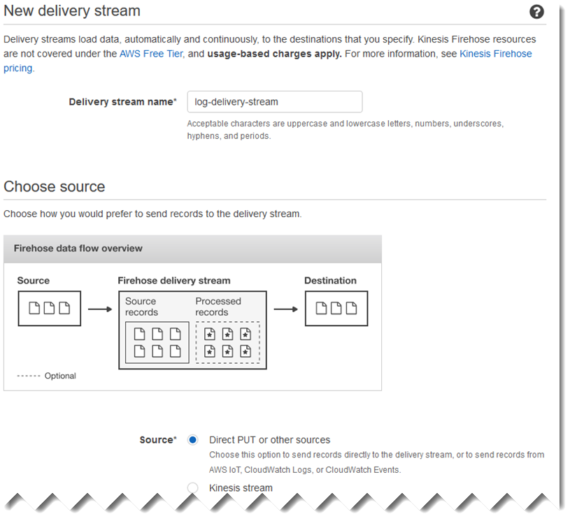
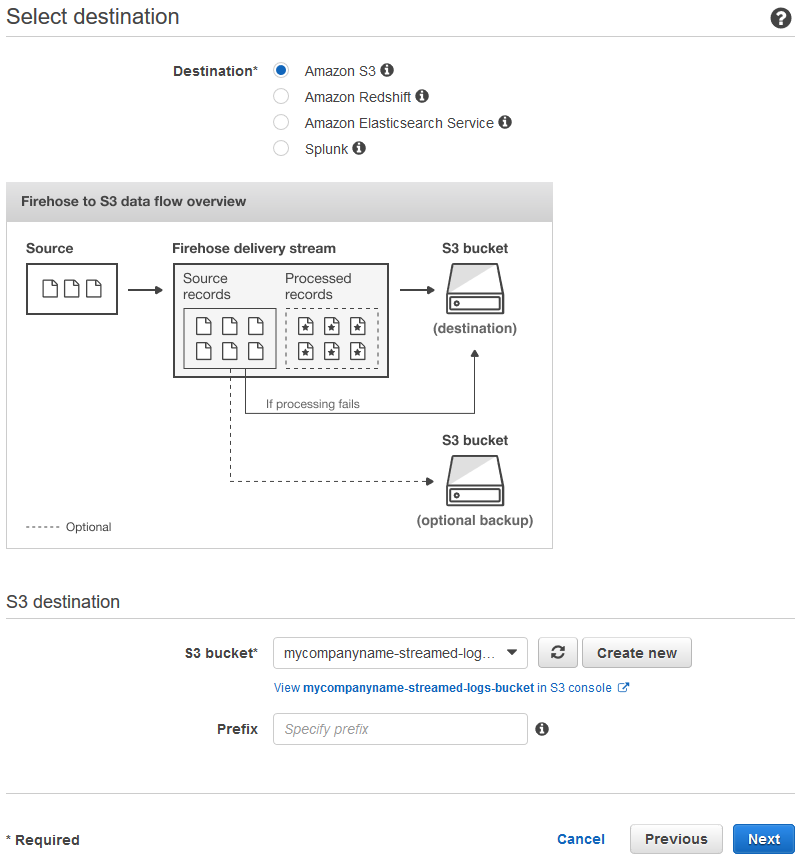
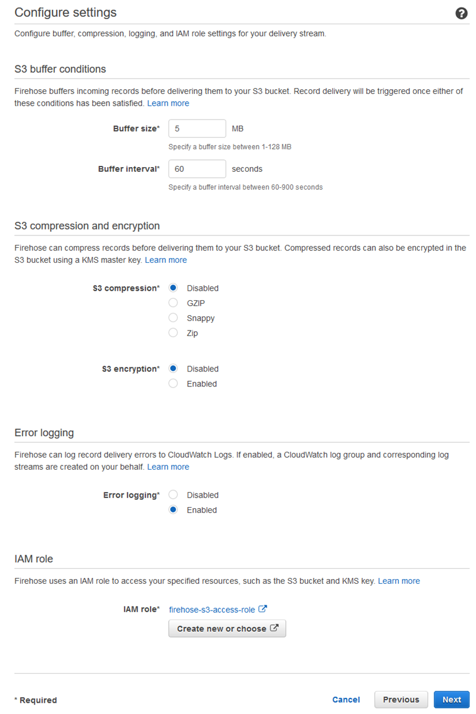

# Step 1: Configure AWS services

Follow these steps to prepare your environment for streaming log data to Amazon Simple Storage Service (Amazon S3)
using Amazon Kinesis Agent for Microsoft Windows. For more information and prerequisites, see [Tutorial: Stream JSON Log Files to Amazon S3 Using
Kinesis Agent for Windows](directory-source-to-s3-tutorial.md "directory-source-to-s3-tutorial.md").

Use the AWS Management Console to configure AWS Identity and Access Management (IAM), Amazon S3, Firehose, and Amazon Elastic Compute Cloud (Amazon EC2) to
prepare for streaming log data from an EC2 instance to Amazon S3.

###### Topics

- [Configure IAM Policies and Roles](#kaw-ds2s3-tutorial-step1.1 "#kaw-ds2s3-tutorial-step1.1")
- [Create the Amazon S3 Bucket](#kaw-ds2s3-tutorial-step1.2 "#kaw-ds2s3-tutorial-step1.2")
- [Create the Firehose Delivery Stream](#kaw-ds2s3-tutorial-step1.3 "#kaw-ds2s3-tutorial-step1.3")
- [Create the Amazon EC2 Instance to Run Kinesis Agent for Windows](#kaw-ds2s3-tutorial-step1.4 "#kaw-ds2s3-tutorial-step1.4")
- [Next Steps](#kaw-ds2s3-tutorial-next "#kaw-ds2s3-tutorial-next")

## Configure IAM Policies and Roles

Create the following policy, which authorizes Kinesis Agent for Windows to stream records to a specific Firehose
delivery stream:

Replace the example Region, `us-east-1` with the name of the AWS Region where the Firehose delivery stream will be created. Also, replace the example account, `123456789012` with the 12-digit account ID for the AWS account where the delivery stream will be created.

JSON

```
`{
 "Version":"2012-10-17",
 "Statement": [
 {
 "Sid": "VisualEditor1",
 "Effect": "Allow",
 "Action": [
 "firehose:PutRecord",
 "firehose:PutRecordBatch"
 ],
 "Resource": "arn:aws:firehose:`us-east-1`:`123456789012`:deliverystream/`log-delivery-stream`"
 }
 ]
}`

```

In the navigation bar, choose **Support**, and then **Support Center**. Your currently signed-in 12-digit account number (ID) appears
in the **Support Center** navigation pane.

Create the policy using the following procedure. Name the policy
`log-delivery-stream-access-policy`.

###### To create a policy using the JSON policy editor

1. Sign in to the AWS Management Console and open the IAM console at [https://console.aws.amazon.com/iam/](https://console.aws.amazon.com/iam/ "https://console.aws.amazon.com/iam/").
2. In the navigation pane on the left side, choose **Policies**.

If this is your first time choosing **Policies**, the **Welcome
to Managed Policies** page appears. Choose **Get Started**. 3. At the top of the page, choose **Create policy**. 4. Choose the **JSON** tab. 5. Enter a JSON policy document. For details about the IAM policy language, see [IAM
JSON Policy Reference](../../../IAM/latest/UserGuide/reference_policies.md "../../../IAM/latest/UserGuide/reference_policies.md") in the _IAM User Guide_. 6. When you are finished, choose **Review policy**. The [Policy Validator](../../../IAM/latest/UserGuide/access_policies_policy-validator.md "../../../IAM/latest/UserGuide/access_policies_policy-validator.md") reports any syntax errors.

###### Note

You can switch between the **Visual editor** and
**JSON** tabs any time. However, if you make changes or choose
**Review policy** in the **Visual editor** tab, IAM
might restructure your policy to optimize it for the visual editor. For more information, see
[Policy Restructuring](../../../IAM/latest/UserGuide/troubleshoot_policies.md#troubleshoot_viseditor-restructure "../../../IAM/latest/UserGuide/troubleshoot_policies.md#troubleshoot_viseditor-restructure") in the _IAM User Guide_. 7. On the **Review policy** page, enter a **Name** and a
**Description** (optional) for the policy that you are creating. Review the
policy **Summary** to see the permissions that are granted by your policy.
Then choose **Create policy** to save your work.

###### To create the role that gives Firehose access to an S3 bucket

1. Using the previous procedure, create a policy named
   `firehose-s3-access-policy` that is defined using the following JSON.

Replace the following in your IAM policy example:

    * The example Amazon S3 bucket name, `amzn-s3-demo-bucket` with a unique bucket name where the logs will be stored.
    * The example Region, `us-east-1` with the AWS Region where the CloudWatch Logs log group and log stream will be created. These are for logging any errors that occur during streaming the data to Amazon S3 via Firehose.
    * The example AWS account ID, `123456789012` with the 12-digit account ID for the account where the log group and log stream will be created.

JSON

```
`{
 "Version":"2012-10-17",
 "Statement":
 [
 {
 "Effect": "Allow",
 "Action": [
 "s3:AbortMultipartUpload",
 "s3:GetBucketLocation",
 "s3:GetObject",
 "s3:ListBucket",
 "s3:ListBucketMultipartUploads",
 "s3:PutObject"
 ],
 "Resource": [
 "arn:aws:s3:::`amzn-s3-demo-bucket`",
 "arn:aws:s3:::`amzn-s3-demo-bucket`/*"
 ]
 },
 {
 "Effect": "Allow",
 "Action": [
 "logs:PutLogEvents"
 ],
 "Resource": [
 "arn:aws:logs:`us-east-1`:`123456789012`:log-group:firehose-error-log-group:log-stream:firehose-error-log-stream"
 ]
 }
 ]
}`

```

2. In the navigation pane of the IAM console, choose **Roles**, and then
   choose **Create role**.
3. Choose the **AWS service** role type, and then choose the
   **Kinesis** service.
4. Choose **Firehose** for the use case, and then choose **Next:
   Permissions**.
5. In the search box, enter `firehose-s3-access-policy`, choose that
   policy, and then choose **Next: Review**.
6. In the **Role name** box, enter
   `firehose-s3-access-role`.
7. Choose **Create role**.

###### To create the role to associate with the instance profile for the EC2 instance that will

run Kinesis Agent for Windows

1. In the navigation pane of the IAM console, choose **Roles**, and then
   choose **Create role**.
2. Choose the **AWS service** role type, and then choose
   **EC2**.
3. Choose **Next: Permissions**.
4. In the search box, enter `log-delivery-stream-access-policy`.
5. Choose the policy, and then choose **Next: Review**.
6. In the **Role name** box, enter
   `kinesis-agent-instance-role`.
7. Choose **Create role**.

## Create the Amazon S3 Bucket

Create the S3 bucket where Firehose streams the logs.

###### To create the S3 bucket for log storage

1. Open the Amazon S3 console at
   [https://console.aws.amazon.com/s3/](https://console.aws.amazon.com/s3/ "https://console.aws.amazon.com/s3/").
2. Choose **Create bucket**.
3. In the **Bucket name** box, enter the unique S3 bucket name that you
   chose in [Configure IAM Policies and Roles](#kaw-ds2s3-tutorial-step1.1 "#kaw-ds2s3-tutorial-step1.1").
4. Choose the Region where the bucket should be created. This is typically the same Region
   where you intend to create the Firehose delivery stream and the Amazon EC2 instance.
5. Choose **Create**.

## Create the Firehose Delivery Stream

Create the Firehose delivery stream that will store streamed records in Amazon S3.

###### To create the Firehose delivery stream

1. Open the Firehose console at
   [https://console.aws.amazon.com/firehose/](https://console.aws.amazon.com/firehose/ "https://console.aws.amazon.com/firehose/").
2. Choose **Create Delivery Stream**.
3. In the **Delivery stream name** box, enter
   `log-delivery-stream`.
4. For the **Source**, choose **Direct PUT or other
   sources**.

 5. Choose **Next**. 6. Choose **Next** again. 7. For the destination, choose **Amazon S3**. 8. For the **S3 bucket**, choose the name of the bucket that you created in
[Create the Amazon S3 Bucket](#kaw-ds2s3-tutorial-step1.2 "#kaw-ds2s3-tutorial-step1.2").

 9. Choose **Next**. 10. In the **Buffer interval** box, enter `60`. 11. Under **IAM role**, choose **Create new or
choose**. 12. For **IAM role**, choose `firehose-s3-access-role`. 13. Choose **Allow**.

 14. Choose **Next**. 15. Choose **Create delivery stream**.

## Create the Amazon EC2 Instance to Run Kinesis Agent for Windows

Create the EC2 instance that uses Kinesis Agent for Windows to stream log records via Firehose.

###### To create the EC2 instance

1. Open the Amazon EC2 console at
   [https://console.aws.amazon.com/ec2/](https://console.aws.amazon.com/ec2/ "https://console.aws.amazon.com/ec2/").
2. Follow the instructions in [Getting Started with
   Amazon EC2 Windows Instances](../../../AWSEC2/latest/WindowsGuide/EC2_GetStarted.md "../../../AWSEC2/latest/WindowsGuide/EC2_GetStarted.md"), using the following additional steps:
   - For the **IAM role** for the instance, choose
     `kinesis-agent-instance-role`.
   - If you don't already have a public internet-connected virtual private cloud (VPC),
     follow the instructions in [Setting Up with Amazon EC2](../../../AWSEC2/latest/WindowsGuide/get-set-up-for-amazon-ec2.md "../../../AWSEC2/latest/WindowsGuide/get-set-up-for-amazon-ec2.md") in the
     _Amazon EC2 User Guide_.
   - Create or use a security group that limits access to the instance from only your
     computer, or only your organization's computers. For more information, see [Setting Up
     with Amazon EC2](../../../AWSEC2/latest/WindowsGuide/get-set-up-for-amazon-ec2.md "../../../AWSEC2/latest/WindowsGuide/get-set-up-for-amazon-ec2.md") in the _Amazon EC2 User Guide_.
   - If you specify an existing key pair, be sure to have access to the private key for the
     key pair. Or, create a new key pair and save the private key in a safe place.
   - Before continuing, wait until the instance is running and has completed two out of two
     health checks.
   - Your instance requires a public IP address. If one hasn't been allocated, follow the
     instructions at [Elastic IP
     Addresses](../../../AWSEC2/latest/WindowsGuide/elastic-ip-addresses-eip.md "../../../AWSEC2/latest/WindowsGuide/elastic-ip-addresses-eip.md") in the _Amazon EC2 User Guide_.

## Next Steps

[Step 2: Install, Configure, and Run Kinesis Agent for Windows](kaw-ds2s3-tutorial-step2.md "kaw-ds2s3-tutorial-step2.md")
