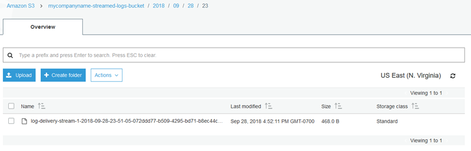

# Step 2: Install, Configure, and Run Kinesis Agent for Windows

In this step, you use the AWS Management Console to remotely connect to the instance that you launched in
[Create the Amazon EC2 Instance to Run Kinesis Agent for Windows](kaw-ds2s3-tutorial-step1.md#kaw-ds2s3-tutorial-step1.4 "kaw-ds2s3-tutorial-step1.md#kaw-ds2s3-tutorial-step1.4"). You
then install Amazon Kinesis Agent for Microsoft Windows on the instance, create and deploy the configuration file for Kinesis Agent for Windows,
and start the `**AWSKinesisTap**` service.

1. Remotely connect to the instance via Remore Desktop Protocol (RDP) by following the
   instructions in [Step 2: Connect to Your Instance](../../../AWSEC2/latest/WindowsGuide/EC2_GetStarted.md#ec2-connect-to-instance-windows "../../../AWSEC2/latest/WindowsGuide/EC2_GetStarted.md#ec2-connect-to-instance-windows") in the
   _Amazon EC2 User Guide_.
2. On the instance, use Windows Server Manager to disable Microsoft Internet Explorer
   Enhanced Security Configuration for users and administrators. For more information, see [How To Turn Off Internet Explorer Enhanced Security Configuration](https://blogs.technet.microsoft.com/chenley/2011/03/10/how-to-turn-off-internet-explorer-enhanced-security-configuration/ "https://blogs.technet.microsoft.com/chenley/2011/03/10/how-to-turn-off-internet-explorer-enhanced-security-configuration/") on the Microsoft
   TechNet website.
3. On the instance, install and configure Kinesis Agent for Windows. For more information, see [Installing Kinesis Agent for Windows](getting-started.md#getting-started-installation "getting-started.md#getting-started-installation").
4. On the instance, use Notepad to create a Kinesis Agent for Windows configuration file. Save the file to
   `%PROGRAMFILES%\Amazon\AWSKinesisTap\appsettings.json`. Add the
   following content to the configuration file:

```
{
  "Sources": [
    {
      "Id": "JsonLogSource",
      "SourceType": "DirectorySource",
      "RecordParser": "SingleLineJson",
      "Directory": "C:\\LogSource\\",
      "FileNameFilter": "*.log",
      "InitialPosition": 0
    }
  ],
  "Sinks": [
    {
      "Id": "FirehoseLogStream",
      "SinkType": "KinesisFirehose",
      "StreamName": "log-delivery-stream",
      "Region": "us-east-1",
      "Format": "json",
      "ObjectDecoration": "ComputerName={ComputerName};DT={timestamp:yyyy-MM-dd HH:mm:ss}"
    }
  ],
  "Pipes": [
    {
      "Id": "JsonLogSourceToFirehoseLogStream",
      "SourceRef": "JsonLogSource",
      "SinkRef": "FirehoseLogStream"
    }
  ]
}
```

This file configures Kinesis Agent for Windows to send JSON-formatted log records from files in the
`c:\logsource\` directory (the _source_) to a Firehose
delivery stream named `log-delivery-stream` (the _sink_).
Before each log record is streamed to Firehose, it is enhanced with two extra key-value pairs
that contain the name of the computer and a timestamp. 5. Create the `c:\LogSource\` directory, and use Notepad to create a
`test.log` file in that directory with the following content:

```
{ "Message": "Copasetic message 1", "Severity": "Information" }
{ "Message": "Copasetic message 2", "Severity": "Information" }
{ "Message": "Problem message 2", "Severity": "Error" }
{ "Message": "Copasetic message 3", "Severity": "Information" }
```

6. In an elevated PowerShell session, use the following command to start the `**AWSKinesisTap**` service:

```
Start-Service -ServiceName AWSKinesisTap
```

7. Using File Explorer, browse to the
   `%PROGRAMDATA%\Amazon\AWSKinesisTap\logs` directory. Open the most
   recent log file. The log file should look similar to the following:

```
2018-09-28 23:51:02.2472 Amazon.KinesisTap.Hosting.LogManager INFO Registered factory Amazon.KinesisTap.AWS.AWSEventSinkFactory.
2018-09-28 23:51:02.2784 Amazon.KinesisTap.Hosting.LogManager INFO Registered factory Amazon.KinesisTap.Windows.PerformanceCounterSinkFactory.
2018-09-28 23:51:02.5753 Amazon.KinesisTap.Hosting.LogManager INFO Registered factory Amazon.KinesisTap.Core.DirectorySourceFactory.
2018-09-28 23:51:02.5909 Amazon.KinesisTap.Hosting.LogManager INFO Registered factory Amazon.KinesisTap.ExchangeSource.ExchangeSourceFactory.
2018-09-28 23:51:02.5909 Amazon.KinesisTap.Hosting.LogManager INFO Registered factory Amazon.KinesisTap.Uls.UlsSourceFactory.
2018-09-28 23:51:02.5909 Amazon.KinesisTap.Hosting.LogManager INFO Registered factory Amazon.KinesisTap.Windows.WindowsSourceFactory.
2018-09-28 23:51:02.9347 Amazon.KinesisTap.Hosting.LogManager INFO Registered factory Amazon.KinesisTap.Core.Pipes.PipeFactory.
2018-09-28 23:51:03.5128 Amazon.KinesisTap.Hosting.LogManager INFO Registered factory Amazon.KinesisTap.AutoUpdate.AutoUpdateFactory.
2018-09-28 23:51:03.5440 Amazon.KinesisTap.Hosting.LogManager INFO Performance counter sink  started.
2018-09-28 23:51:03.7628 Amazon.KinesisTap.Hosting.LogManager INFO KinesisFirehoseSink id FirehoseLogStream for StreamName log-delivery-stream started.
2018-09-28 23:51:03.7784 Amazon.KinesisTap.Hosting.LogManager INFO Connected source JsonLogSource to sink FirehoseLogStream
2018-09-28 23:51:03.7940 Amazon.KinesisTap.Hosting.LogManager INFO DirectorySource id JsonLogSource watching directory C:\LogSource\ with filter *.log started.
```

This log file indicates that the service has started and log records are now being
collected from the `c:\LogSource\` directory. Each line is parsed as a
single JSON object. Key-value pairs for the computer name and timestamp are added to each
object. Then it is streamed to Firehose. 8. In a minute or two, navigate to the Amazon S3 bucket that you created in [Create the Amazon S3 Bucket](kaw-ds2s3-tutorial-step1.md#kaw-ds2s3-tutorial-step1.2 "kaw-ds2s3-tutorial-step1.md#kaw-ds2s3-tutorial-step1.2") using the
AWS Management Console. Be sure that you have chosen the correct Region on the console.

In that bucket, there is a folder for the current year. Open that folder to reveal a
folder for the current month. Open that folder to reveal a folder for the current day. Open
that folder to reveal a folder for the current hour (in UTC). Open that folder to reveal one or
more items that start with the name `log-delivery-stream`.

 9. Open the contents of the latest item to confirm that the log records have been
successfully stored in Amazon S3 with the desired enhancements. If everything is configured
correctly, the contents look similar to the following:

```
{"Message":"Copasetic message 1","Severity":"Information","ComputerName":"EC2AMAZ-ABCDEFGH","DT":"2018-09-28 23:51:04"}
{"Message":"Copasetic message 2","Severity":"Information","ComputerName":"EC2AMAZ-ABCDEFGH","DT":"2018-09-28 23:51:04"}
{"Message":"Problem message 2","Severity":"Error","ComputerName":"EC2AMAZ-ABCDEFGH","DT":"2018-09-28 23:51:04"}
{"Message":"Copasetic message 3","Severity":"Information","ComputerName":"EC2AMAZ-ABCDEFGH","DT":"2018-09-28 23:51:04"}
```

10. For information about resolving any of the following issues, see [Troubleshooting Amazon Kinesis Agent for Microsoft Windows](troubleshooting-kinesis-agent-windows.md "troubleshooting-kinesis-agent-windows.md"):
    - The Kinesis Agent for Windows log file contains errors.
    - Expected folders or items in Amazon S3 do not exist.
    - The contents of an Amazon S3 item are incorrect.

## Next Steps

[Step 3: Query the Log Data in Amazon S3](kaw-ds2s3-tutorial-step3.md "kaw-ds2s3-tutorial-step3.md")
